글을 하나 쓰고 나면, 사실 그때부터가 일이다. **써서 올리는 것보다, 여기저기 퍼 나르는 게 더 귀찮다.** 같은 요약을 링크드인에 붙이고, 또 복사해서 마스토돈에 붙이고, 카페에 또 붙이고… 이 짓을 글마다 반복하다 보면 어느 순간 안 하게 된다.

그래서 작정하고 **"글 하나 올리면 알아서 여러 곳에 뿌리는"** 도구를 붙였다. 핵심 원칙은 하나다 — 원본은 내 사이트 하나(canonical)고, 나머지엔 **전문 복제가 아니라 "요약 + 원문 보기 링크"** 만 올린다. 이러면 중복 콘텐츠로 내 사이트가 손해 보지 않으면서, 발견·유입·백링크만 챙긴다.

붙이고 보니 채널은 자연스럽게 둘로 갈렸다. **공식 글쓰기 API가 열려 있어 깔끔하게 붙은 곳**과, **공식 API가 없어 비공식 경로로 붙인 곳.** 둘 다 적되, 뒤쪽은 한계와 주의까지 솔직히 적는다.

## 전체 그림 — 한 번 쓰고, 사방으로

먼저 큰 그림. 원본은 하나, 출력은 여러 갈래다.

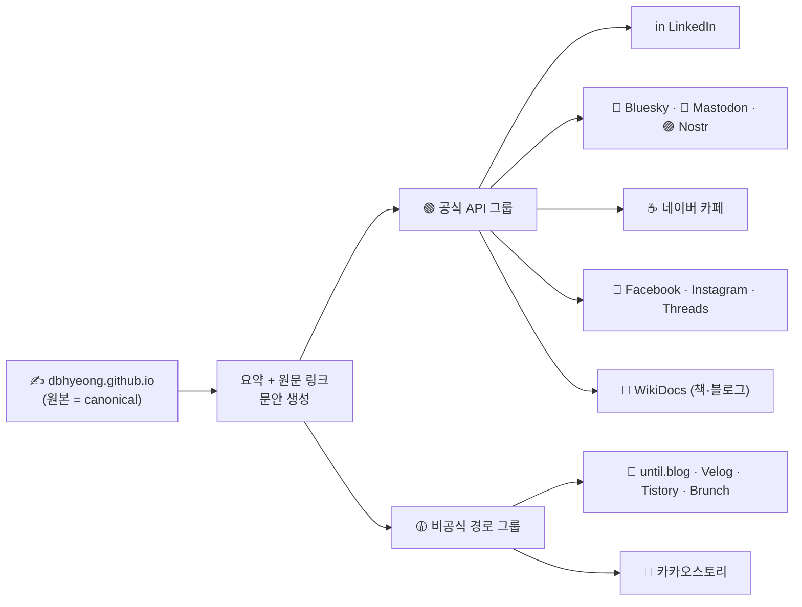

> **신디케이션(syndication)** 이란? 한 곳에 쓴 콘텐츠를 여러 채널에 다시 배포하는 걸 말한다. 신문 칼럼이 여러 신문에 동시에 실리는 것과 같다. 단, 검색엔진이 "어디가 원본이냐"로 헷갈리지 않게 **canonical(정본) 링크**로 원본을 가리켜 준다.

## 왜 직접 붙였나? 결국 '인증'의 카탈로그

이번 작업의 본질은 마케팅이 아니라 **인증의 카탈로그**였다. 같은 "글쓰기" 한 동작을, 채널마다 "이게 정말 너냐"를 증명하는 방식이 전부 달랐다. 그 차이를 한 장으로 정리하면 이렇다.

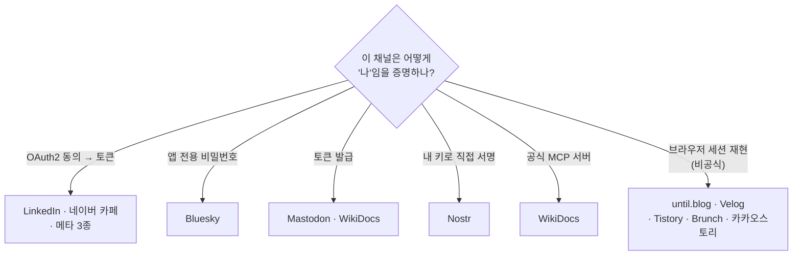

"요즘 다 MCP·자동화"라지만, 한 꺼풀 벗기면 결국 **하부에 공식 API가 있느냐**가 전부다. API가 없으면 MCP도 없다(MCP는 API를 감싸는 래퍼일 뿐이다). 그래서 채널마다 공식 API가 열려 있는지부터 확인하고, 열려 있으면 Node 스크립트로 직접 붙였다. 없으면 — 뒤에서 다룬다.

---

# Part A. 공식 API로 붙인 채널

먼저 한눈 비교.

| 채널 | 붙인 방식 | 인증 | 한 줄 메모 |
|---|---|---|---|
| **LinkedIn** | UGC Posts API | OAuth2 (`w_member_social`) | 회원 본인 프로필 글쓰기 권한이 따로 |
| **Bluesky** | AT Protocol | 앱 비밀번호 | 로그인 비번 말고 **앱 전용 비번** |
| **Mastodon** | REST `statuses` | 액세스 토큰 | 인스턴스마다 토큰이 따로 |
| **Nostr** | kind:1 이벤트 | 내 개인키 서명 | 서버가 없다, 키가 곧 계정 |
| **네이버 카페** | 카페 글쓰기 API | OAuth2 로그인 토큰 | 한글 인코딩·토큰 수명이 함정 |
| **메타 3종** | Graph API | 페이지/장기/전용 토큰 | 앱은 하나, 토큰은 셋 |
| **WikiDocs** | 공식 MCP / REST | API 토큰 | 책·블로그를 도구로 직접 |

### LinkedIn — 게시 권한이 따로 있다

링크드인은 OAuth2 동의 화면을 거쳐 토큰을 받는다. 다만 "로그인"용 권한과 "내 프로필에 글쓰기"용 권한(`w_member_social`)이 **별도**라, 이 권한을 명시적으로 받아야 글이 올라간다. 받고 나면 글쓰기 API 한 번 호출로 "요약 + 원문 링크 카드"가 게시된다.

### Bluesky — 링크를 어떻게 '클릭 가능'하게 만드나?

Bluesky는 로그인 비번이 아니라 **앱 전용 비밀번호**로 붙는다(권한 격리·언제든 폐기 가능). 한 가지 디테일이 있었는데, 본문에 URL을 적어도 자동으로 링크가 되지 않는다. **"몇 번째 글자부터 몇 번째까지가 링크"** 라고 위치를 따로 알려 줘야 한다(facet).

> 함정은 그 위치를 **글자 수가 아니라 바이트 수**로 세야 한다는 점이다. 한글은 한 글자가 여러 바이트라, 글자 기준으로 세면 어긋난다. 그래서 링크 앞부분을 바이트로 환산해 시작·끝 위치를 계산해 줬다. 여기에 원문 미리보기 카드까지 붙였다.

### Mastodon — 가장 교과서적인 REST

마스토돈은 셋 중 제일 깔끔했다. 인스턴스(서버)에서 토큰을 발급받아, 글쓰기 주소로 본문을 한 번 보내면 끝. 본문 URL은 인스턴스가 알아서 링크·미리보기 카드로 만들어 준다. 단, 마스토돈은 **인스턴스마다 계정·토큰이 따로**라 "어느 서버에 올릴지"를 먼저 정해야 한다.

### Nostr — 가입이 없는 SNS는 어떻게 글을 쓰나?

Nostr는 근본이 다르다. **가입도, 서버 계정도, 토큰도 없다.** 계정이 곧 **키 한 쌍**이다.

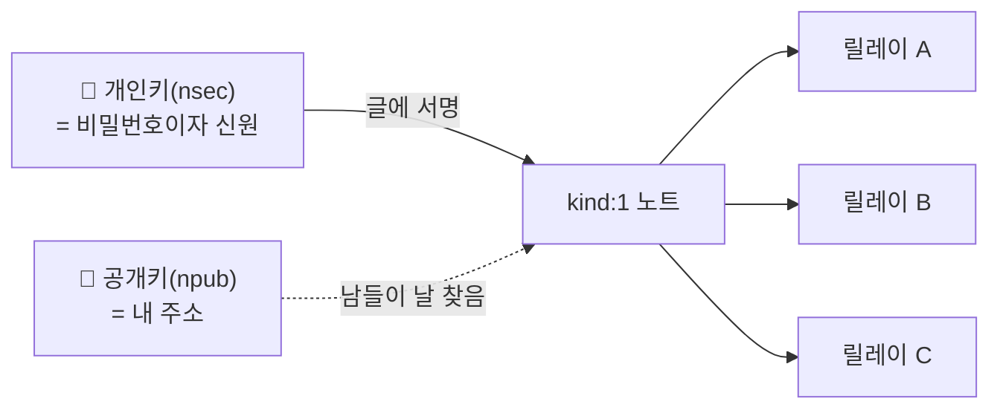

> 글을 중앙 서버에 "저장"하는 게 아니라, **내 개인키로 글에 전자 서명**한 뒤 여러 **릴레이(relay)** 에 동시에 뿌린다. 한 곳이라도 받아 주면 네트워크에 퍼진다. 그래서 "로그인"이 아니라 "서명"이다.

기술적 걸림돌이 하나 있었다. 이 서명은 흔한 방식이 아니라 **schnorr 서명**이라는 특수한 방식이라, 기본 도구만으로는 안 된다. 검증된 라이브러리로 키 생성·서명을 처리하고, 릴레이로 보내는 부분만 기본 기능으로 해결했다. 전용 키를 새로 만들어(메인 신원과 분리) 테스트하니 4개 릴레이 중 3곳이 즉시 받아 줬다.

### 네이버 카페 — 왜 한글이 깨지고, 왜 1시간마다 멈췄나?

네이버 카페가 제일 까다로웠다. 두 가지 함정.

**① 한글을 그냥 보내면 깨진다.** 카페 API는 제목·본문을 그냥 보내면 안 되고, **"UTF-8로 인코딩한 다음, 그 결과를 한 번 더 인코딩(MS949)"** 한 값을 요구한다. 즉 인코딩을 두 번 한다.

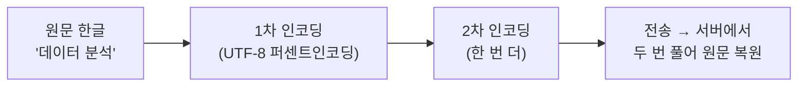

> 한 번만 하면 글자가 깨지고, 두 번 하면 서버가 거꾸로 두 번 풀어 정확히 복원한다. 문서엔 한 줄 적혀 있을 뿐이라, 직접 부딪혀 보기 전엔 모른다.

**② 토큰이 1시간이면 죽는다.** 네이버 로그인 토큰은 수명이 1시간이다. 자동 발행이 한 시간 뒤 멈추면 자동화가 아니다. 그래서 게시 직전에 **만료를 보고, 만료면 갱신용 토큰으로 새 토큰을 자동으로 받아오게** 만들었다.

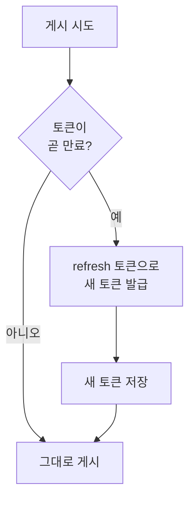

실제로 토큰을 일부러 만료시켜 놓고 게시를 시키니, 스스로 갱신하고 글을 올렸다. 그제야 "한 시간 뒤에도 도는" 진짜 자동화가 됐다.

### 메타 3종 — 앱은 하나인데, 왜 토큰이 셋인가?

페이스북·인스타그램·쓰레드는 다 메타(Meta) 소속이라 개발자 앱 하나로 묶인다. 그런데 막상 붙이면 **셋 다 인증·게시 방식이 다르다.** "한 번에 되겠지" 했다가 제일 헷갈린 묶음이었다.

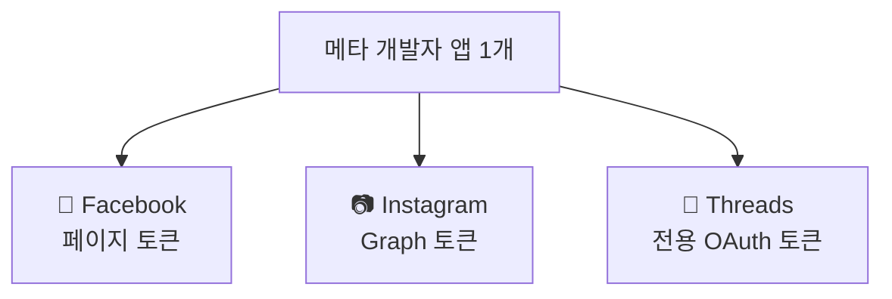

**페이스북 — 개인 프로필엔 못 올린다.** 가장 먼저 부딪힌 벽. 메타는 자동 게시를 **공개 페이지(Page)** 에만 허용한다(개인 프로필 API 게시는 막혀 있다). 그래서 자동화용 페이지를 따로 만들고, 거기에 올린다. 게다가 페이지에 올리려면 **페이지 토큰**이 필요한데, 이게 바로 안 나온다. 토큰을 **사다리처럼 교환해 올라가야** 한다.

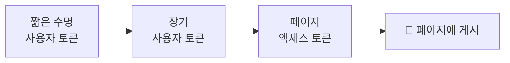

**인스타그램 — 글 하나 올리는 데 왜 두 번 부르나?** 인스타는 "한 번에 게시"가 안 된다. ① 올릴 내용을 담은 **컨테이너를 만들고**, ② 그 컨테이너를 **발행**하는 2단계다.

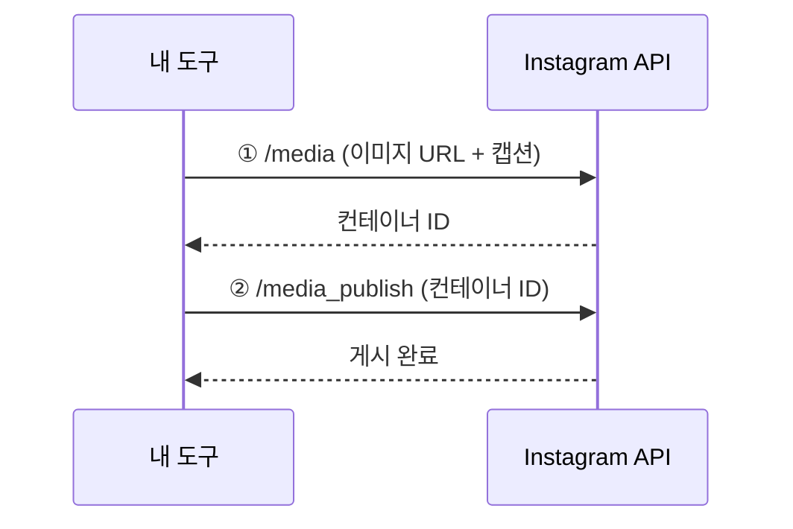

게다가 두 가지 제약이 있다.
- **이미지가 반드시 있어야 한다.** 텍스트만으론 못 올린다. 그래서 요약을 담은 카드 이미지를 만든다. 그런데 인스타 API는 **"공개 URL"의 이미지**만 받기 때문에, 로컬 카드 이미지를 임시 공개 URL로 잠깐 올린 뒤 그 주소로 게시한다.
- **캡션의 링크는 클릭이 안 된다.** 인스타 특성상 본문(캡션) URL은 그냥 텍스트다. 그래서 인스타에선 "프로필 링크로 와 달라"는 안내가 현실적이다.

**쓰레드 — 인스타랑 같은 집인데 토큰은 따로.** 쓰레드는 인스타와 형제 같지만, **토큰을 또 따로 발급**받아야 한다(쓰레드 전용 권한). 게시는 인스타처럼 **컨테이너 생성 → 발행** 2단계지만, 텍스트만으로도 올라간다.

> 정리하면, 메타 3종은 "회사는 하나"라는 인상과 달리 **토큰 3개·게시 흐름 2~3가지**를 각각 맞춰야 한다. 같은 회사라도 제품마다 API 역사가 달라서 그렇다.

### WikiDocs — 공식 MCP가 있으면 더 쉽다 (책 + 블로그)

WikiDocs는 반가운 경우였다. **공식 MCP 서버**를 제공한다. API 토큰만 발급받아 한 줄 명령으로 붙이면, "책에 페이지 추가", "블로그 글 발행" 같은 **도구**가 그대로 생긴다.

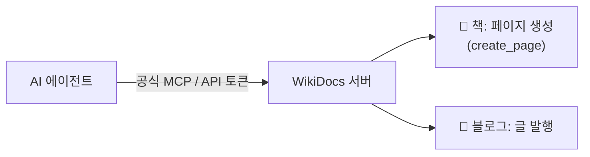

WikiDocs엔 성격이 다른 두 공간이 있어서 둘 다 붙였다.

**① 책(Book) — 페이지 트리에 한 장 추가.** 책은 페이지들이 트리(목차) 구조다. "이 책에 이런 제목·내용으로 페이지 추가"라고 호출하면, 지정한 위치(최상위 또는 특정 부모 아래)에 새 페이지가 꽂힌다.

**② 블로그(Blog) — 2단계로 발행.** 블로그는 인스타처럼 2단계였다. ① 빈 글을 먼저 만들어 **글 번호(ID)를 받고**, ② 그 글에 제목·본문·태그를 채워 **발행**한다.

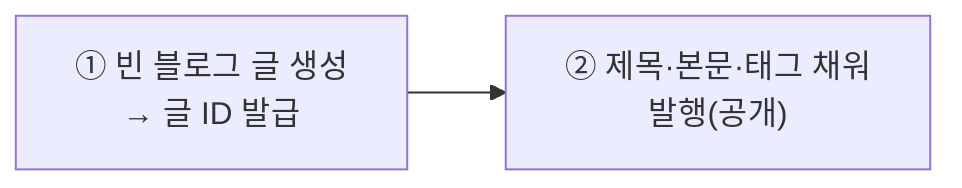

> MCP가 있다는 건, 요청을 일일이 손으로 만들 필요 없이 **"이 책에 이런 페이지 추가해 줘"** 라고만 하면 되는 수준까지 추상화돼 있다는 뜻이다. API가 잘 닦인 채널일수록 붙이는 비용이 확 준다. (참고로 새로 등록한 MCP 도구는 **다음 세션부터** 인라인으로 잡히므로, 즉시 쓰려면 같은 서버를 직접 호출하면 된다.)

---

# Part B. 공식 글쓰기 API가 없는 채널

여기서부터는 결이 다르다. 어떤 블로그·SNS는 **외부 글쓰기 API를 공개하지 않는다.** 그래도 내 채널(내 계정)이니, **내 브라우저가 글을 올릴 때 실제로 주고받는 요청을 그대로 재현**하는 방식으로 붙였다.

> ⚠️ **솔직한 주의.** 이건 **공식 지원 경로가 아니다.** 내부 요청을 흉내 내는 거라 — (1) 플랫폼이 구조를 바꾸면 언제든 깨지고, (2) 각 서비스 약관(ToS)의 회색지대이며, (3) 로그인 세션이 수시로 만료돼 **완전 무인 자동화는 어렵다**(내 계정·내 글에 한해 반자동으로만 썼다). 이 글엔 **실제 토큰·쿠키·내부 보안값을 일절 싣지 않는다** — 원리만 적는다.

각 채널이 "이게 정말 너냐 / 이 요청이 진짜 우리 화면에서 나왔냐"를 확인하는 방식이 다 달랐는데, 그 차이가 흥미로웠다.

| 채널 | 붙인 방식 | "나"를 확인하는 법 | 가장 까다로웠던 점 |
|---|---|---|---|
| **until.blog** | REST 호출 | 로그인 토큰(JWT) | 토큰 수명이 짧아 자주 갱신 |
| **Velog** | GraphQL | 로그인 토큰(쿠키) | "현재 사용자" 필드명을 잘못 알아 한참 막힘 |
| **Tistory** | 글쓰기 엔드포인트 | 세션 + 1회용 위조방지값 | 위조방지값이 글쓰기 화면마다 새로 발급 |
| **Brunch** | 글쓰기 엔드포인트 | 세션 + CSRF 토큰 | 본문이 에디터 고유 구조(중첩 JSON) |
| **카카오스토리** | 활동 등록 | 계정 세션 + 회전 검증값 | 검증값이 요청마다 바뀜 |

이 채널들에 글을 올리는 공통 흐름은 이렇다.

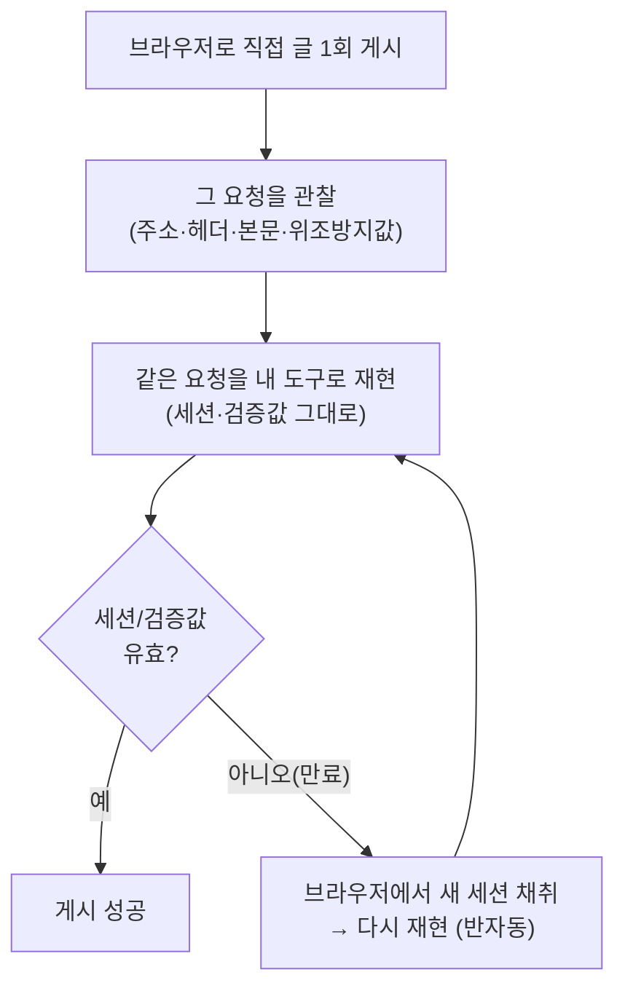

특히 기억에 남는 세 가지.

**Velog — 멀쩡한 요청이 자꾸 거절당한 이유.** 처음엔 인증 확인용으로 "현재 로그인한 사용자"를 물었는데 계속 거절(400)당했다. 한참 헤맨 끝에 원인은 허무했다 — 그 플랫폼은 현재 사용자를 흔한 이름(`currentUser`)이 아니라 **다른 이름(`auth`)** 으로 노출하고 있었다. 즉 차단당한 게 아니라, **내가 존재하지 않는 걸 물어봐서** 거절당한 거였다. 이름 하나 바꾸자 바로 통과했다. (글쓰기 자체는 `WritePost`라는 동작 하나면 됐다.)

**Brunch — 본문이 그냥 글자가 아니었다.** 브런치는 제목·본문을 평범한 텍스트로 보내는 게 아니라, **에디터가 쓰는 고유한 구조(블록마다 메타데이터가 붙은 중첩 JSON)** 로 보낸다. 그래서 "표지 블록 + 문단 블록"의 형태를 그대로 본떠, 그 안에 내 텍스트만 갈아 끼워 넣어야 했다. 여기에 요청 위조를 막는 CSRF 토큰까지 같이 실어야 통과했다.

**카카오스토리 — 검증값이 요청마다 바뀐다.** 카카오는 요청마다 **회전하는 검증값**을 헤더에 요구한다. 한 번 쓴 값이 다음 요청엔 안 맞을 수 있어, 세션이 살아 있는 짧은 창 안에서 처리해야 했다. 본문은 "텍스트 블록 + 해시태그 블록 + 원문 스크랩 카드(미리보기)"를 묶어 보냈더니, 내 사이트 OG 카드가 그대로 붙은 글이 올라갔다.

> 결국 이 채널들에서 배운 건 **"각 서비스가 위조 요청을 어떻게 막는가"** 였다. 1회용 토큰, 요청마다 바뀌는 검증값, 세션 쿠키, 특수한 본문 포맷 — 다 "이 요청이 진짜 우리 화면에서 나온 게 맞냐"를 확인하려는 장치였다. 그래서 이쪽은 자동화의 영역이라기보다 **"내 세션을 빌려 주는 반자동"** 에 가깝다.

---

## 모든 채널에 공통으로 지킨 원칙

채널은 달라도 규칙은 똑같이 가져갔다.

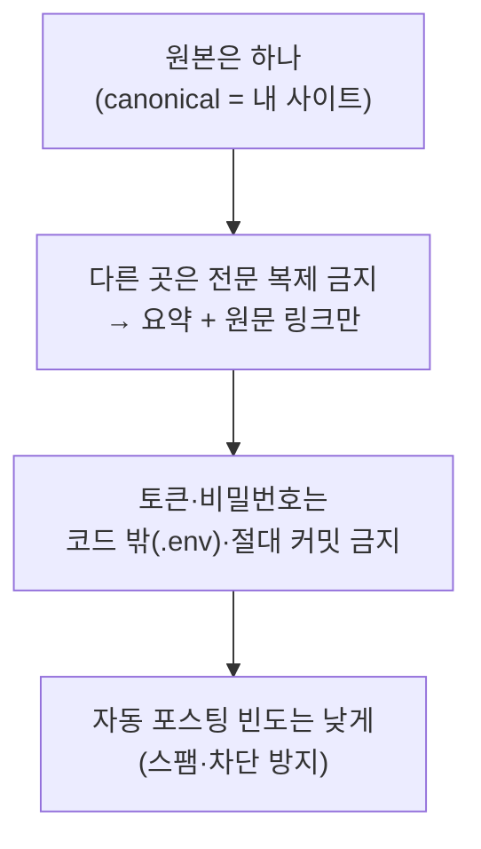

특히 **토큰 관리**는 양보할 수 없는 부분이다. 모든 키·토큰은 코드가 아니라 별도 비밀 파일(`.env`)에 두고, 저장소엔 절대 올라가지 않게 막았다. 어떤 글에서도 실제 키는 플레이스홀더로만 적는다 — 키를 본문에 박아 공유하면 그 순간 유출이다. (이 글에 실제 토큰·쿠키·검증값이 하나도 없는 것도 같은 이유다.)

## 전체를 하나로 — 다음은 '엔진'

지금은 채널마다 **개별 도구**가 생긴 상태다. 각각은 잘 돈다. 다음 단계는 이걸 하나로 묶는 **공통 엔진**이다.

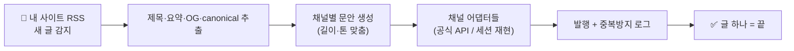

RSS에서 새 글을 감지하면 → 요약·메타·원문 링크를 뽑아 → 채널별 문안을 만들고 → 채널 어댑터로 한 번에 발행하고 → 중복 발행을 막는 로그를 남기는 것. 그러면 진짜로 "글 하나 올리면 끝"이 된다.

써 놓고 보니, 이번 작업의 본질은 마케팅 자동화이기 이전에 **인증의 카탈로그**였다. 같은 "글쓰기" 한 동작을 — 채널은 OAuth로, 어떤 채널은 앱 비번으로, 어떤 채널은 내 키 서명으로, 또 어떤 채널은 내 세션을 그대로 빌려 — 증명하게 만드는 일. 채널을 하나씩 늘릴 때마다 그 채널이 "나"를 어떻게 확인하는지를 새로 배우는 과정이었다.
