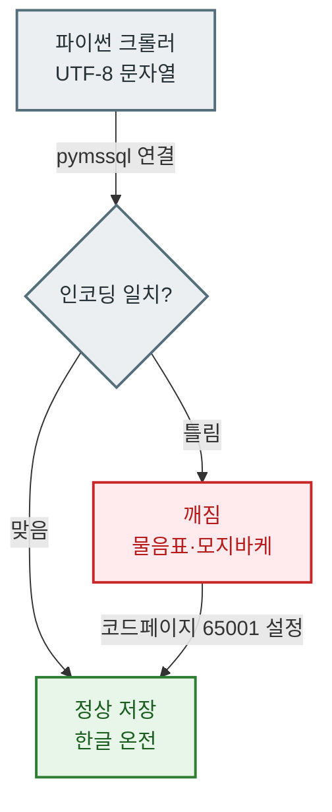

> 대시보드는 결과가 아니라 파이프라인의 마지막 한 칸이다. 그 앞에 수집·적재·집계라는 세 칸이 조용히 굴러가고 있어야, 아침에 열어본 숫자를 믿을 수 있다.

혼자 일하는 데이터 분석가에게 가장 무서운 순간은 언제일까? 나는 "아침에 대시보드를 열었는데 어제 숫자가 안 들어와 있을 때"라고 답한다. 팀이 크면 데이터 엔지니어가 수집을, 분석가가 해석을 나눠 맡는다. 그런데 1인 체제에서는 크롤러가 멈춘 것도, 적재가 꼬인 것도, 집계 쿼리가 틀린 것도 전부 내 책임이다. 그래서 나는 대시보드보다 그 뒤에 숨은 흐름 전체를 먼저 설계한다. 오늘은 내가 혼자 굴리는 데이터 파이프라인을 수집부터 시각화까지 한 바퀴 풀어보려 한다. (아래 예시 수치·구조는 전부 설명을 위한 더미다.)

## 왜 파이프라인부터 그려야 할까?

처음 일을 시작했을 때 나는 "쿼리 잘 짜면 되지"라고 생각했다. 착각이었다. 아무리 예쁜 쿼리도 원본 데이터가 안 들어오면 빈 화면을 그린다. 그래서 지금은 어떤 분석이든 시작 전에 데이터가 흘러가는 길부터 그린다. 길이 네 칸으로 나뉜다는 걸 알고 나서부터 문제가 생겨도 "어느 칸에서 막혔는지"를 3분 안에 짚을 수 있게 됐다.

이 네 칸이 파이프라인의 뼈대다. 각 칸은 독립적으로 실패할 수 있고, 독립적으로 고칠 수 있어야 한다. 이걸 지키는 게 1인 운영의 핵심이다.

## 1단계 — 데이터는 어떻게 모을까? (수집)

가장 먼저 원본 데이터를 어딘가에서 끌어와야 한다. 방법은 크게 두 갈래다. 공식 API가 있으면 그걸 쓰고, 없으면 웹 페이지를 직접 긁는 크롤링을 한다. 나는 파이썬에서 Selenium(브라우저를 자동 조종하는 도구)과 BeautifulSoup(HTML에서 원하는 조각을 뽑아내는 도구)을 조합해 쓴다. Selenium이 페이지를 열고 버튼을 눌러 로딩을 끝내면, BeautifulSoup이 그 화면에서 숫자만 골라 담는 식이다.

여기서 얻은 교훈 하나. 수집은 반드시 실패한다는 전제로 짜야 한다. 사이트 구조가 바뀌거나, 네트워크가 끊기거나, 봇 차단에 걸리거나. 그래서 크롤러에는 세 가지를 꼭 넣는다.

| 방어 장치 | 하는 일 | 없으면 생기는 일 |
| --- | --- | --- |
| 재시도(retry) | 실패 시 몇 초 뒤 다시 시도 | 순간적인 네트워크 끊김에 하루치 데이터 증발 |
| 로그 기록 | 언제 무엇을 몇 건 가져왔는지 남김 | 어디서 멈췄는지 추적 불가 |
| 지연(delay) | 요청 사이에 텀을 둠 | 과도한 요청으로 차단당함 |

공식 API와 크롤링 사이에는 트레이드오프가 있다. API는 안정적이지만 원하는 항목이 없을 때가 많고, 크롤링은 유연하지만 언제 깨질지 모른다. 나는 "핵심 지표는 가능하면 안정적인 경로로, 보조 지표는 크롤링으로"라는 원칙으로 나눈다.

## 2단계 — 모은 데이터를 어디에 쌓을까? (적재)

수집한 데이터는 곧바로 데이터베이스에 넣는다. 나는 MS-SQL을 주력으로 쓰고, 파이썬에서 `pymssql`이라는 라이브러리로 연결한다. 이 단계에서 초심자가 꼭 한 번은 데는 함정이 한글 깨짐이다.

크롤링으로 가져온 한글 텍스트를 그대로 넣으면 물음표(???)나 깨진 글자로 저장되는 일이 흔하다. 원인은 인코딩 불일치다. 파이썬은 UTF-8로 문자를 다루는데 DB 연결이 다른 코드페이지를 쓰면 서로 못 알아듣는다. 해결은 의외로 단순하다. 연결 문자열이나 드라이버 옵션에서 인코딩을 UTF-8(코드페이지 65001)로 맞춰주면 깨짐이 사라진다. 나는 이걸 모르고 반나절을 날린 적이 있어서, 지금은 새 DB에 붙일 때 인코딩부터 확인한다.

적재 단계의 원칙은 원본을 최대한 날것으로 보관하는 것이다. 여기서 미리 가공해버리면 나중에 다른 관점으로 다시 보고 싶을 때 데이터가 없다. 가공은 다음 칸에서 한다.

## 3단계 — 쌓인 데이터를 어떻게 지표로 바꿀까? (집계)

이제 원본을 사람이 읽을 수 있는 지표로 요약할 차례다. 나는 이 무거운 계산을 Stored Procedure(줄여서 SP)에 맡긴다. SP는 DB 안에 미리 저장해둔 쿼리 묶음이다. 매번 복잡한 SQL을 손으로 다시 쓰는 대신, "어제 날짜로 일일 집계 SP 실행"이라고 한 줄만 던지면 DB가 알아서 계산한다. 이걸 스케줄러로 새벽에 자동 실행해두면, 아침에 지표가 이미 만들어져 있다.

집계 단계에서 자주 만드는 지표를 더미 예시로 정리하면 이렇다.

| 지표 | 쉽게 풀면 | 더미 예시 |
| --- | --- | --- |
| 리텐션(D1/D7) | 처음 온 사람이 하루·일주일 뒤 다시 오는 비율 | D1 약 42%, D7 약 18% |
| 코호트 | 같은 시기에 유입된 집단을 묶어 시간 흐름 추적 | 6월 유입군의 4주차 잔존 약 12% |
| ARPPU | 결제한 사람 1명당 평균 결제액 | 약 3만 4천 원 |
| 재구매율 | 한 번 산 사람이 또 사는 비율 | 약 27% |

여기서 중요한 건 지표의 정의를 문서로 고정하는 일이다. "리텐션"이라는 같은 단어도 기준일을 어떻게 잡느냐에 따라 숫자가 달라진다. 정의가 흔들리면 어제 숫자와 오늘 숫자를 비교할 수 없다. 그래서 나는 SP 안에 계산 로직을 박아두고, 그 정의를 별도 노트에 적어둔다. SP가 곧 "우리 조직의 지표 정의서" 역할을 겸하는 셈이다.

무거운 도수분포나 분위수 계산처럼 반복적이고 부하가 큰 작업일수록 SP로 밀어 넣는 게 유리하다. 파이썬에서 데이터를 다 끌어와 계산하면 느리고 메모리도 잡아먹지만, DB 안에서 집계하면 훨씬 빠르고 결과 테이블만 가볍게 받아올 수 있다.

## 4단계 — 지표를 어떻게 보여줄까? (시각화)

마지막 칸이 대시보드다. 나는 Metabase를 쓴다. 오픈소스라 무료로 띄울 수 있고, SQL을 몰라도 클릭으로 차트를 만들 수 있어 1인 운영에 잘 맞는다. 앞 단계에서 SP가 만들어둔 집계 테이블을 Metabase가 그대로 읽어 그리기 때문에, 대시보드 쪽에서는 무거운 계산을 다시 할 필요가 없다. 화면이 빠르게 뜨는 비결이 여기 있다.

가끔은 Metabase만으로 부족할 때가 있다. 보고서에 넣을 정적 이미지나, 특정 형태의 커스텀 그래프가 필요하면 파이썬 matplotlib으로 따로 그려서 이미지 파일로 뽑고, 그걸 클라우드 스토리지에 자동 업로드하는 흐름을 하나 더 붙여둔다. "실시간 모니터링은 Metabase, 정형 리포트는 matplotlib"으로 역할을 나누면 서로의 약점을 메운다.

## 혼자서도 안 무너지는 파이프라인의 원칙은?

네 칸을 다 만들고 나서 정리한 나만의 운영 원칙이 있다.

첫째, 각 칸은 독립적으로 재실행할 수 있어야 한다. 집계가 틀렸을 때 수집부터 다시 돌릴 필요 없이, 집계 SP만 다시 실행하면 되도록. 둘째, 모든 칸은 로그를 남긴다. 어디서 몇 건이 오갔는지 기록이 있어야 아침에 숫자가 비어도 원인을 3분 안에 찾는다. 셋째, 지표 정의는 코드가 아니라 문서로도 존재한다. 한 사람이 운영하면 그 정의가 머릿속에만 있기 쉬운데, 그러면 나중에 과거의 내가 무슨 기준을 썼는지 나조차 잊는다.

결국 1인 파이프라인의 목표는 "내가 없어도 하루는 굴러가는 구조"다. 자동화의 진짜 가치는 손을 덜어주는 게 아니라, 실패했을 때 어디를 고치면 되는지가 분명해지는 데 있다고 나는 믿는다.

## 마무리

크롤링에서 대시보드까지, 네 칸을 다 지나고 나면 아침에 열어본 숫자 하나에 얼마나 많은 조용한 톱니가 물려 있는지 실감한다. 수집이 흔들리면 적재가 비고, 적재가 비면 집계가 틀리고, 집계가 틀리면 대시보드가 거짓말을 한다. 그래서 나는 대시보드를 "만든다"기보다 "그 앞의 흐름을 지킨다"고 표현한다. 혼자 일한다는 건 이 네 칸을 전부 안고 간다는 뜻이지만, 반대로 전체를 손바닥 위에 놓고 볼 수 있다는 강점이기도 하다. 다음 글에서는 이 중 집계 단계, 특히 리텐션과 코호트를 SQL로 어떻게 정의하는지를 더 파고들어 볼 생각이다.

## 참고자료

- [[game-metrics-7-definitions]] — 리텐션·ARPPU·재구매율 등 핵심 지표 정의 정리
- [[cohort-m1-retention-sql]] — 코호트/리텐션을 SQL로 계산하는 레시피
- [[game-data-sql-recipes-retention-ltv]] — 리텐션·LTV 집계 SQL 모음
- [github.com/DBhyeong/game-data-recipes](https://github.com/DBhyeong/game-data-recipes) — 관련 코드 레시피 저장소

<!-- 안전: 합성/더미 데이터, 회사·실데이터·PII 없음. -->
