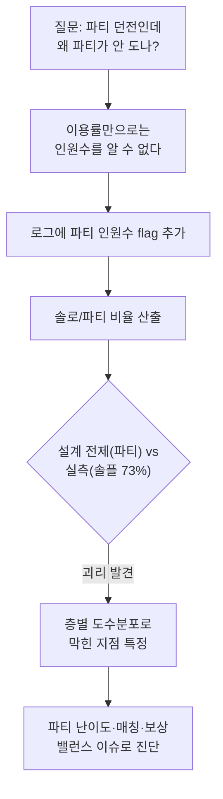
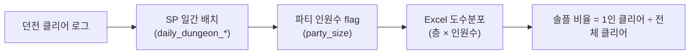
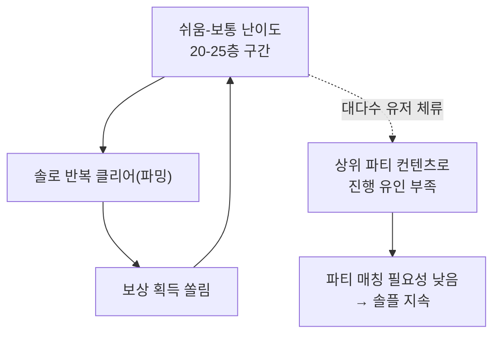

신규 던전 패치가 나간 뒤, 기획팀에서 물었다. "파티 매칭이 잘 안 도는 것 같은데, 왜 그런가요?" 순간 당황했다. 컨텐츠 이용률은 이미 확인한 뒤였고 나쁘지 않았기 때문이다(결론부터 말하면 이 던전의 이용률은 최종적으로 약 20% 상승했다). 이용률이 오르는데 "파티가 안 돈다"는 체감은 대체 어디서 오는 걸까.

여기서 처음엔 이용률 하나로 "그럭저럭 괜찮다"고 넘어갈 뻔했다. 그런데 이용률은 "던전에 들어갔는지 아닌지"만 센다. 몇 명이서 들어갔는지는 안 본다. 입장 자체는 늘어도 그게 1인(솔로)으로 늘었는지 다인 파티로 늘었는지는 완전히 다른 이야기다. 그래서 질문을 다시 세웠다. **이 던전, 실제로 몇 명이서 도는가?**



## 이용률만 봐서는 왜 '파티가 안 돈다'는 감이 안 잡혔나?

이용률(던전 진입/플레이 비율)은 콘텐츠가 유저에게 노출되고 소비되는지를 보는 지표다. 하지만 이 지표 하나로는 "어떤 방식으로" 소비되는지가 보이지 않는다. 던전이 다인 파티 매칭을 전제로 설계됐다면, 정작 봐야 할 건 입장 여부가 아니라 **누구와 함께 들어갔는가**다. 이용률이 오른다고 파티 매칭이 활성화됐다고 넘겨짚으면, 정작 파티 콘텐츠의 진짜 문제는 계속 안 보이는 사각지대에 남는다.

## 솔로/파티 비율은 실제로 어떻게 뽑았나?

방법 자체는 복잡하지 않다. 클리어 로그에 **인원수 flag**만 있으면 된다. 나는 매일 도는 던전 클리어 집계를 Stored Procedure(SP, 반복되는 쿼리를 DB에 저장해두고 배치로 자동 실행하는 방식)로 자동화해뒀다. 이 배치가 일간 클리어 로그에서 파티 인원수를 뽑아 쌓으면, 그걸 Excel로 가져와 **도수분포**(값이 어느 구간에 얼마나 몰려 있는지 세는 표)를 층별·인원수별로 돌렸다.



```sql
-- 개념 예시(합성). 실제 스키마·SP명 아님.
SELECT
    CASE WHEN party_size = 1 THEN 'solo' ELSE 'party' END AS play_type,
    COUNT(*) AS clear_count,
    CAST(COUNT(*) AS FLOAT)
        / SUM(COUNT(*)) OVER ()                          AS play_type_ratio
FROM   daily_dungeon_clear
WHERE  clear_date = @target_date
GROUP  BY CASE WHEN party_size = 1 THEN 'solo' ELSE 'party' END;
```

인원수 하나 붙였을 뿐인데, 이 결과는 이용률 지표가 절대 답할 수 없던 질문에 답을 줬다. **솔로 클리어 비중이 약 73%**였다.

## 솔플 73%, 왜 이 숫자가 설계 전제와 충돌했나?

이 던전은 애초에 다인 파티 매칭을 기준으로 난이도가 잡혀 있었다. 그런데 실측은 대다수가 혼자 도는 그림이었다. 설계가 가정한 그림과 실제 플레이 패턴을 나란히 놓으면 격차가 바로 드러난다.

| 구분 | 설계 전제 | 실측 |
|---|---|---|
| 파티 구성 | 다인 파티 매칭 기반 난이도 | 약 73% 솔로 클리어 |
| 난이도 진행 | 상위 층까지 단계적 진행 | 쉬움\~보통·특정 구간 반복 |
| 보상 구조 | 상위 컨텐츠까지 보상 분산 | 특정 구간에 보상 쏠림 |

숫자 하나(솔플 73%)만으로 원인을 단정할 수는 없다. 하지만 이 격차는 "파티 매칭 유인이 부족하거나, 난이도·보상 구조가 굳이 파티를 짤 필요를 안 만든다"는 가설을 세우기엔 충분한 신호였다. 결정타는 여기에 층별 데이터를 더 겹쳤을 때 나왔다.

## 층별 도수분포는 어디가 막혔는지 정확히 짚어줬나?

도수분포를 층 단위로 쪼개보니, 유저들은 **쉬움\~보통 난이도 구간(약 20\~25층)에 반복 체류**하고 있었다. 그 구간을 솔로로 반복 파밍하는 편이 파티를 짜서 위층으로 밀고 올라가는 것보다 부담이 적었다는 뜻이다. 보상도 이 구간에 쏠려 있었으니, 유저 입장에선 굳이 매칭 시간을 들여 파티를 짤 이유가 없었다.



이게 "파티 컨텐츠는 어디서 막혔나"에 대한 구체적 좌표였다. 막힌 지점은 상위 던전 자체가 아니라, **하위 구간의 솔로 루프가 너무 편안해서 위로 밀어낼 유인이 없었다**는 데 있었다.

## 이 진단을 유관부서에 어떻게 넘겼고, 결과는 어땠나?

이 분석은 한국 데이터만으로 끝나지 않았다. 같은 던전이 북미·동남아에도 서비스되고 있었기 때문에, 솔플 비율과 층별 도수분포를 정리해 글로벌 유관부서와 공유했다. 기획팀은 이 좌표를 받아 난이도 커브와 보상 구조 쪽을 손봤다. 이후 이 던전의 컨텐츠 이용률은 약 20% 상승했다 — 처음에 나를 헷갈리게 했던 바로 그 지표가, 이번엔 진단과 조정 이후의 결과로 다시 등장한 셈이다.

## 정리 — 상위 지표는 '무엇이 문제인지'까지만, 세부 flag가 '어디서 막혔는지'를 알려준다

- 이용률 같은 상위 지표는 콘텐츠가 소비되는지는 보여주지만, **어떤 방식으로** 소비되는지는 안 보여준다.
- 인원수(솔로/파티) 같은 세부 flag를 하나 더 붙이면, "파티 던전인데 다들 혼자 돈다"는 숨은 격차가 드러난다.
- 솔플 73% 단독으로는 원인을 단정할 수 없다. **층별 도수분포**와 겹쳐 봐야 "어디서 막혔는지" 좌표가 나온다.
- 진단의 최종 목적은 판정이 아니라, 기획팀과 글로벌 유관부서가 바로 손댈 수 있는 **밸런싱 좌표**를 넘기는 것이다.

지표 하나를 보고 끝내지 않고, 그 지표가 답하지 못하는 질문(누구와 함께?)까지 flag 하나로 쪼개보는 것 — 이게 도메인 안에서 데이터를 읽는 감각이다. 다음 글에서는 이렇게 나온 진단을 북미·동남아 유관부서와 어떻게 공유하고 합의를 끌어냈는지, 글로벌 데이터 커뮤니케이션 과정을 정리한다.

- 방법론·합성 스키마 레시피: [github.com/DBhyeong/game-data-recipes](https://github.com/DBhyeong/game-data-recipes)
