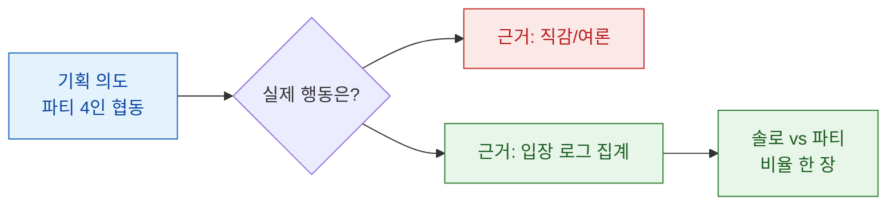
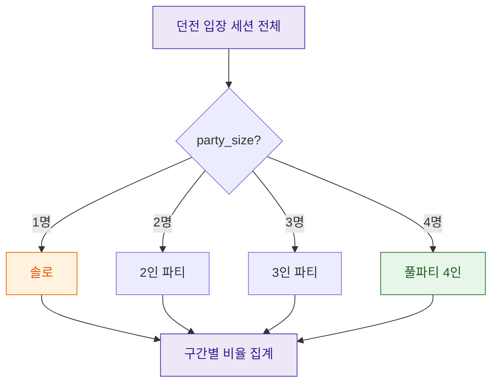

> "이 던전은 4인 파티용으로 만들었어요." — 기획서에는 그렇게 적혀 있었다. 그런데 로그를 열어보니, 유저 열 명 중 일곱은 혼자 들어가고 있었다.

기획 회의에서 이런 말을 자주 듣는다. "이 콘텐츠는 파티 플레이를 유도하려고 만든 거예요." 협동, 소통, 리텐션(재접속 유지). 그럴듯한 의도다. 그런데 나는 이 문장을 들을 때마다 속으로 되묻는다. *정말 그렇게 쓰이고 있나?* 오늘은 '솔플(솔로 플레이) 선호'라는, 어쩌면 뻔해 보이는 유저 취향을 어떻게 데이터로 증명했는지 적어두려 한다. 물론 아래 숫자·이름은 전부 합성한 더미 예시다.

## 왜 '느낌'이 아니라 '비율'로 봐야 했나?

기획팀의 직감도, 커뮤니티 여론도 데이터는 아니다. 커뮤니티에서 목소리 큰 소수가 "요즘 다들 솔플만 해"라고 외친다고 그게 사실이 되진 않는다. 반대로 기획 의도가 "파티 유도"라고 해서 유저가 실제로 파티를 맺는 것도 아니다.

그래서 나는 논쟁을 멈추게 하는 가장 단순한 무기를 꺼냈다. **비율**이다. 던전에 입장한 전체 세션을 놓고, 그중 몇 퍼센트가 혼자였고 몇 퍼센트가 여럿이었는지. 이 한 장의 표 앞에서는 직감이든 여론이든 할 말이 없어진다.



## 그래서 무엇을 '한 번 들어간 것'으로 셀 것인가?

집계에 들어가기 전에 정의부터 못 박아야 한다. 여기서 대충 넘어가면 뒤의 숫자가 전부 흔들린다.

내가 다룬 단위는 **던전 입장 세션**이다. 유저가 특정 던전에 입장하면 한 건의 로그가 쌓인다고 보면 된다. 그 한 건에는 '몇 명이 함께 들어갔는가'를 뜻하는 파티 인원수가 붙어 있다. 인원수가 1이면 솔로, 2 이상이면 파티다. 개념 자체는 초등학교 산수 수준이다. 진짜 어려운 건 계산이 아니라 **경계 정의**다.

- 파티를 맺자마자 나가버린 세션은 파티로 셀 것인가?
- 자동 매칭으로 억지로 묶인 것과 친구끼리 자발적으로 묶인 것을 같게 볼 것인가?
- 재입장(리트라이)은 새 세션인가, 같은 세션인가?

이런 걸 미리 정해두지 않으면, 나중에 "그 숫자 어떻게 나온 거예요?"라는 질문 한 방에 분석 전체가 무너진다. 나는 정의를 문서 맨 위에 적어두고 시작한다. 분석은 계산보다 **약속**이 먼저다.

## 어떻게 한 줄의 비율로 압축했나?

핵심 아이디어는 단순하다. 세션마다 붙어 있는 파티 인원수를 보고, "솔로냐 파티냐"라는 딱지(라벨)를 하나 붙인다. 그런 다음 딱지별로 세어서 전체로 나눈다. SQL로 옮기면 개념은 이렇다. (테이블·컬럼명은 전부 일반화한 가짜다.)

```sql
-- 개념 예시: 실제 스키마 아님, 더미
SELECT
  CASE WHEN party_size = 1 THEN '솔로' ELSE '파티' END AS play_form,
  COUNT(*)                                             AS sessions,
  ROUND(100.0 * COUNT(*) / SUM(COUNT(*)) OVER (), 1)   AS ratio_pct
FROM dungeon_entry_log_sample
GROUP BY CASE WHEN party_size = 1 THEN '솔로' ELSE '파티' END;
```

여기서 초보 때 자주 놓치는 포인트 하나. `SUM(COUNT(*)) OVER ()`는 "그룹별로 센 값들을 전체 합으로 다시 나눠라"라는 뜻이다. 이걸 서브쿼리로 전체 건수를 따로 구해 나누는 방식과 결과는 같지만, 한 번의 스캔으로 끝나서 훨씬 깔끔하다. 나눗셈 앞에 `100.0`을 곱하는 이유는, 정수끼리 나누면 소수점이 날아가 0이 되어버리는 함정을 피하기 위해서다.

이렇게 뽑으면 아래 같은 더미 결과가 나온다.

| 플레이 형태 | 세션 수(더미) | 비율 |
|---|---:|---:|
| 솔로 | 71,200 | 71.2% |
| 파티 | 28,800 | 28.8% |
| 합계 | 100,000 | 100.0% |

파티용으로 설계한 콘텐츠에서 솔로가 71%. 이 한 줄이 회의실의 공기를 바꾼다.

## 파티는 '몇 명짜리'가 진짜일까?

여기서 멈추면 절반만 본 것이다. "파티 28.8%"라는 숫자 안에는 함정이 숨어 있다. 4인 콘텐츠라고 4인이 꽉 찬 파티만 있는 게 아니다. 2인, 3인, 반쯤 빈 파티가 뒤섞여 있다. 그래서 나는 파티 인원수를 그대로 두지 말고 **도수분포**로 쪼갰다. 도수분포란 어렵게 들리지만, 그냥 "인원수 구간별로 몇 건인지 세어서 나열한 표"다.



더미로 분포를 그려보면 이런 그림이 나온다.

| 파티 인원 | 비율(더미) | 해석 메모 |
|---|---:|---|
| 1인(솔로) | 71.2% | 대세. 사실상 기본값 |
| 2인 | 18.5% | 친구·듀오 위주 추정 |
| 3인 | 6.9% | 애매하게 빈 파티 |
| 4인(풀파티) | 3.4% | 기획이 '표준'으로 가정한 형태 |

기획이 표준이라 믿었던 4인 풀파티는 전체의 3.4%. 콘텐츠 난이도, 보상, 시간 제한이 전부 이 3.4%를 기준으로 조율되고 있었다면? 나머지 96.6%는 남의 옷을 억지로 입고 있던 셈이다. 이게 바로 '설계 의도'와 '실제 행동'의 괴리다.

## 그 괴리는 어디서 새고 있었나?

비율만으로는 "그래서 뭐?"라는 반문에 답할 수 없다. 나는 한 걸음 더 들어가, 솔로와 파티의 **완주율**과 **재도전율**을 나란히 놓고 봤다. 완주율은 던전을 끝까지 깬 비율, 재도전율은 실패 후 다시 들어온 비율이다.

| 지표(더미) | 솔로 | 파티 |
|---|---:|---:|
| 완주율 | 82% | 61% |
| 평균 소요(분) | 9.2 | 14.8 |
| 재도전율 | 34% | 12% |

숫자가 이야기를 들려준다. 솔로는 빠르게 들어가 깔끔하게 끝내고, 안 되면 다시 시도한다. 파티는 사람을 모으는 비용, 진행 속도의 마찰, 한 명이라도 빠지면 무너지는 구조 때문에 완주가 더 어렵고 재도전은 잘 안 한다. 즉 유저는 게으른 게 아니라 **합리적**이었다. 혼자가 더 빠르고 덜 스트레스였던 것이다. 파티를 '안 하는' 게 아니라, 파티를 할 이유를 콘텐츠가 주지 못했다.

## 이 분석은 무엇을 바꾸는가?

내가 낸 결론은 "파티 콘텐츠를 없애자"가 아니었다. 데이터는 처방이 아니라 진단이다. 다만 다음 질문을 기획과 함께 던질 수 있게 됐다.

- 솔로 71%를 인정하고, 솔로 경험을 1급 시민으로 대접할 것인가?
- 파티를 살리려면 '모이는 비용'을 어떻게 낮출까(자동 매칭 품질, 파티 전용 보상)?
- 4인 기준으로 맞춰둔 난이도 곡선을, 실제 다수인 솔로·2인에 맞게 다시 그릴까?

논쟁이 취향 싸움에서 설계 선택으로 옮겨간다. 그게 비율 한 장이 하는 일이다.

## 마무리

솔플 선호는 누구나 '느낌'으로는 알고 있었다. 하지만 느낌은 회의를 끝내지 못한다. 71.2%라는 숫자, 3.4%짜리 풀파티, 그리고 솔로가 오히려 더 잘 완주한다는 표 세 장이 대화의 층위를 바꿨다.

나는 화려한 모델을 돌리지 않았다. `CASE`로 딱지를 붙이고 `GROUP BY`로 세고 전체로 나눴을 뿐이다. 데이터 분석의 힘은 대개 복잡함이 아니라, **정의를 못 박고 비율로 압축하는 단순함**에서 나온다. 다음에 누군가 "이건 파티용이에요"라고 말하면, 나는 또 조용히 로그를 열 것이다. 의도는 기획서에 있고, 진실은 로그에 있으니까.

## 참고자료

- [[game-metrics-7-definitions]] — 세션·완주율 같은 지표 정의를 못 박는 법
- [[revenue-simulation-dau-pu-arppu]] — 행동 비율을 매출 관점으로 잇기
- [[game-data-sql-recipes-retention-ltv]] — GROUP BY·윈도우 함수로 비율 뽑는 SQL 레시피
- SQL 레시피 저장소: https://github.com/DBhyeong/game-data-recipes

<!-- 안전: 합성/더미 데이터, 회사·실데이터·PII 없음. -->
