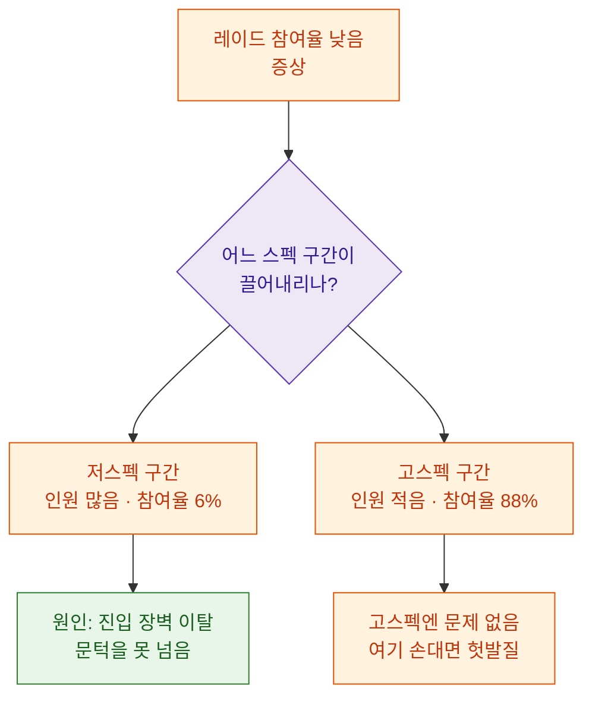
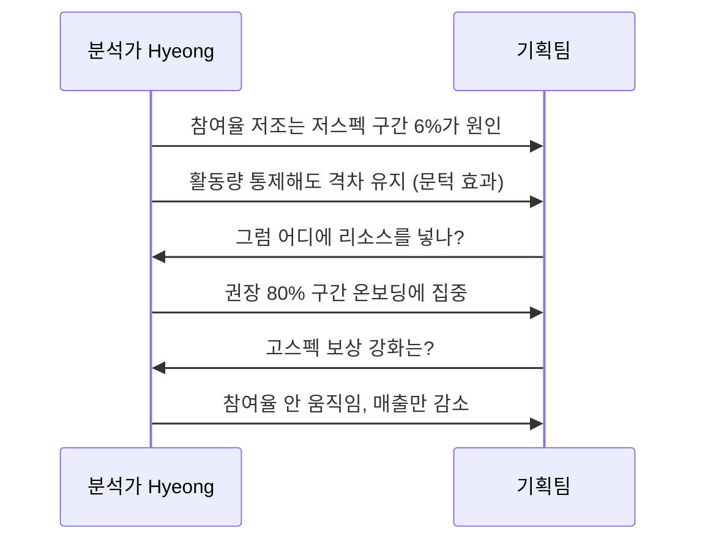

> "레이드 참여율이 낮아요"는 증상이지 원인이 아니다. 원인은 분포 안에 숨어 있다.

라이브 게임의 신규 레이드를 열었는데 참여율이 기대보다 한참 낮게 나왔다고 하자. 회의실에서 나오는 말은 대개 정해져 있다. "요즘 유저들이 게임을 잘 안 해서", "난이도가 너무 높아서", "보상이 매력이 없어서". 다 그럴듯하지만 어느 것도 숫자로 뒷받침되지 않은 '느낌'이다. 나는 이런 자리에 앉을 때마다 속으로 같은 다짐을 한다. 감으로 원인을 정하지 말고, 분포를 열어서 누가 안 오는지부터 세자.

이 글은 '장비 스펙 분포'와 '콘텐츠 참여'를 교차해서, 레이드 미참여의 진짜 원인이 저스펙 유저의 진입 장벽 이탈이라는 걸 어떻게 입증했는지에 대한 기록이다. 물론 여기 나오는 수치·구간·이름은 전부 합성한 더미다. 방법과 사고 흐름만 가져가면 된다.

## 왜 '평균 스펙'만 보면 원인을 놓치나?

가장 먼저 손이 가는 건 평균이다. "전체 유저 평균 전투력은 얼마인가?" 그런데 평균은 분포를 뭉갠다. 저스펙 유저가 잔뜩 있고 고스펙 유저 몇 명이 위로 잡아당기면, 평균은 그럴싸하게 중간에 찍히지만 실제로는 아무도 그 근처에 없는 '유령 값'이 된다.

내가 신뢰하는 건 평균이 아니라 도수분포(frequency distribution)다. 도수분포란 어렵게 들리지만, 그냥 "이 구간에 몇 명이 있냐"를 구간마다 세어 놓은 표다. 키를 5cm 단위로 끊어 인원을 세는 것과 똑같다. 스펙을 구간으로 끊어 세면, 평균이 감춰버린 '봉우리가 어디에 있는가'가 그대로 드러난다.


핵심은 '평균 한 개의 숫자'를 '구간별 인원의 모양'으로 바꾸는 것이다. 모양을 보면 질문이 달라진다. "왜 평균이 낮지?"가 아니라 "왜 저 아래 구간에 이렇게 사람이 많지?"로.

## 스펙을 어떻게 구간으로 자를까?

구간(버킷)을 나누는 방법은 크게 두 가지다. 둘 다 쓸모가 다르니 함께 보는 게 좋다.

첫째, 절대 기준 버킷. 기획이 정한 의미 있는 경계로 자른다. 예를 들어 레이드 입장 권장 전투력이 있다면 그 값을 기준선으로 삼아 '권장 미만 / 권장 근처 / 권장 이상'으로 나눈다. 이건 "얼마나 많은 유저가 물리적으로 문턱을 못 넘나"를 직관적으로 보여준다.

둘째, 상대 순위 버킷. 유저를 스펙 순으로 줄 세워 10등분(NTILE 같은 분위수)한다. 이건 "상위 10퍼센트와 하위 10퍼센트의 간격이 얼마나 벌어졌나"를 보는 데 좋다. 전체 파이가 커지거나 작아져도 비율로 비교되니 시점 간 비교에 강하다.

SQL로는 이런 뼈대다. 실제 테이블·컬럼명은 게임마다 다르니 일반화한 예시로만 적는다.

```sql
-- 절대 기준 버킷: 권장 전투력 대비 위치로 도수분포
SELECT
    CASE
        WHEN power < 0.8 * rec_power                     THEN '1_권장80%미만'
        WHEN power < 1.0 * rec_power                     THEN '2_권장근처'
        WHEN power < 1.3 * rec_power                     THEN '3_권장이상'
        ELSE                                                  '4_충분초과'
    END                                   AS spec_bucket,
    COUNT(*)                              AS user_cnt
FROM user_spec_snapshot          -- 합성/더미 예시 테이블명
GROUP BY 1
ORDER BY 1;
```

여기서 조심할 게 하나 있다. 스냅샷 시점이다. 레이드가 열린 순간의 스펙으로 잘라야지, 지금(며칠 뒤) 스펙으로 자르면 이미 레이드를 돌면서 성장한 유저가 위 구간으로 올라가 버려 인과가 뒤집힌다. 항상 "원인 시점의 스펙"으로 버킷을 만든다.

## 분포 위에 '참여 여부'를 어떻게 겹칠까?

버킷만으로는 아직 절반이다. 진짜 통찰은 각 스펙 구간 안에서 레이드에 참여한 비율을 얹을 때 나온다. 나는 이걸 '분포 위에 참여율을 페인트칠한다'고 표현한다.

구조는 간단하다. 유저마다 (1) 원인 시점 스펙 버킷과 (2) 이후 기간 레이드 1회 이상 참여 플래그를 붙인 뒤, 버킷별로 참여율을 평균 낸다.

```sql
-- 스펙 버킷 × 레이드 참여율 교차
SELECT
    s.spec_bucket,
    COUNT(*)                                        AS users,
    SUM(r.joined)                                   AS joiners,
    ROUND(100.0 * SUM(r.joined) / COUNT(*), 1)      AS join_rate_pct
FROM spec_bucketed        AS s          -- 위 CASE 결과를 CTE로 재사용
LEFT JOIN raid_participation_flag AS r  -- 유저별 joined = 0/1 (더미)
       ON r.user_id = s.user_id
GROUP BY s.spec_bucket
ORDER BY s.spec_bucket;
```

이렇게 나온 더미 결과를 표로 옮기면 그림이 선명해진다.

| 스펙 구간 | 유저 수(더미) | 레이드 참여율(더미) |
|---|---:|---:|
| 권장 80% 미만 | 4,200명 | 6% |
| 권장 근처 | 2,600명 | 34% |
| 권장 이상 | 1,500명 | 71% |
| 충분 초과 | 700명 | 88% |

숫자를 읽는 순간 원인이 눈에 박힌다. 참여율이 낮은 게 게임 전체의 문제가 아니라, 사람이 가장 많이 몰려 있는 '권장 80퍼센트 미만' 구간의 참여율이 6퍼센트로 바닥이라는 것. 즉 전체 저조한 참여율은 저스펙 대군의 참여율이 끌어내린 결과다. 콘텐츠가 재미없어서가 아니라 문턱을 못 넘어서다.



## '저스펙이라 못 온다'와 '안 올 사람이 저스펙이다'를 어떻게 구분하나?

여기서 분석가가 반드시 자기를 의심해야 하는 지점이 있다. 저스펙 유저는 원래 접속도 뜸하고 뭘 해도 안 하는 라이트 유저라서, 스펙이 낮은 것도 레이드를 안 오는 것도 둘 다 '활동량이 적다'는 공통 원인의 결과일 수 있다. 그러면 스펙은 원인이 아니라 애먼 동반 지표일 뿐이다.

이걸 가르는 방법은 활동량을 통제(고정)하고 다시 보는 것이다. 최근 접속일수가 비슷한 유저끼리만 묶은 뒤, 그 안에서 다시 스펙 버킷별 참여율을 본다. 활동량이 같은데도 저스펙 구간의 참여율만 뚝 떨어진다면, 스펙 문턱이 독립적으로 참여를 막고 있다는 증거가 된다.

| 활동량 층 | 저스펙 참여율(더미) | 고스펙 참여율(더미) |
|---|---:|---:|
| 헤비(주 5일 이상 접속) | 12% | 90% |
| 미들(주 2\~4일) | 5% | 78% |
| 라이트(주 1일 이하) | 2% | 55% |

활동량을 같은 층으로 묶었는데도 층마다 저스펙과 고스펙의 참여율 격차가 크게 벌어진다. 특히 열심히 접속하는 헤비 유저조차 저스펙이면 참여율이 12퍼센트에 그친다. 오고 싶어서 매일 붙어 있는데도 못 들어가는 것이다. 이 한 장으로 "안 올 사람이라 그렇다"는 반론을 접을 수 있다.

## 그래서 무엇을 고치라고 말할 수 있나?

분석의 끝은 표가 아니라 결정이다. 위 결과가 가리키는 처방은 명확하다. 콘텐츠 재미나 보상을 손보기 전에, 저스펙 대군을 문턱 앞까지 끌어올리는 온보딩 경로를 만들라는 것.

- 권장 스펙의 80퍼센트 근처 유저를 겨냥한 성장 지원(성장 재화, 임대 장비, 연습 난이도)을 붙이면 가장 큰 인원 풀이 문턱을 넘는다.
- 반대로 고스펙 구간은 이미 88퍼센트가 참여하니 여기에 보상을 더 얹는 건 매출 손실만 나고 참여율은 안 움직인다.
- 다음 시즌엔 레이드 오픈 시점의 스펙 분포를 미리 찍어두고, '권장 미만 인원 비중'을 선행 지표로 삼아 참여율을 오픈 전에 예측한다.



기획팀에 전달할 때 나는 SQL이나 분위수 이야기를 꺼내지 않는다. "가장 사람 많은 구간이 문 앞에서 막혀 있다, 문턱을 낮추면 여기가 열린다" 한 문장과 표 한 장이면 충분하다. 숫자는 회의를 끝내라고 있는 것이지 시작하라고 있는 게 아니다.

## 마무리

레이드 미참여라는 흐릿한 증상을, 스펙 도수분포와 참여율 교차라는 두 단계로 또렷한 원인으로 바꿨다. 정리하면 이렇다. 평균 대신 구간별 인원의 '모양'을 본다. 그 모양 위에 참여 여부를 페인트칠한다. 활동량 같은 교란 변수를 통제해 스펙이 진짜 원인인지 확인한다. 마지막으로 인원이 가장 많이 몰린 구간을 겨냥한 처방을 제시한다.

분포는 평균이 감춘 진실을 계단처럼 펼쳐 보여준다. 다음에 "왜 참여율이 낮지?"라는 질문을 받으면, 답하기 전에 먼저 분포부터 열어보자. 원인은 늘 그 안 어딘가 봉우리에 앉아 있다.

## 참고자료

- [[game-metrics-7-definitions]] — 참여율·전환 같은 지표의 정의부터 맞추기
- [[cohort-m1-retention-sql]] — 코호트로 시점을 고정해 인과를 지키는 SQL 패턴
- [[retention-curve-beyond-m1]] — 리텐션 곡선을 구간으로 읽는 법
- [[paying-tier-distribution-bm-balancing]] — 분위수(데실) 버킷으로 분포를 계단화하는 자매 글
- [[pick-rate-content-homogenization]] — 참여·선택 분포로 콘텐츠 쏠림 읽기
- [[game-data-sql-recipes-retention-ltv]] — 리텐션·LTV용 SQL 레시피 모음
- 코드 레시피: https://github.com/DBhyeong/game-data-recipes

<!-- 안전: 합성/더미 데이터, 회사·실데이터·PII 없음. -->
