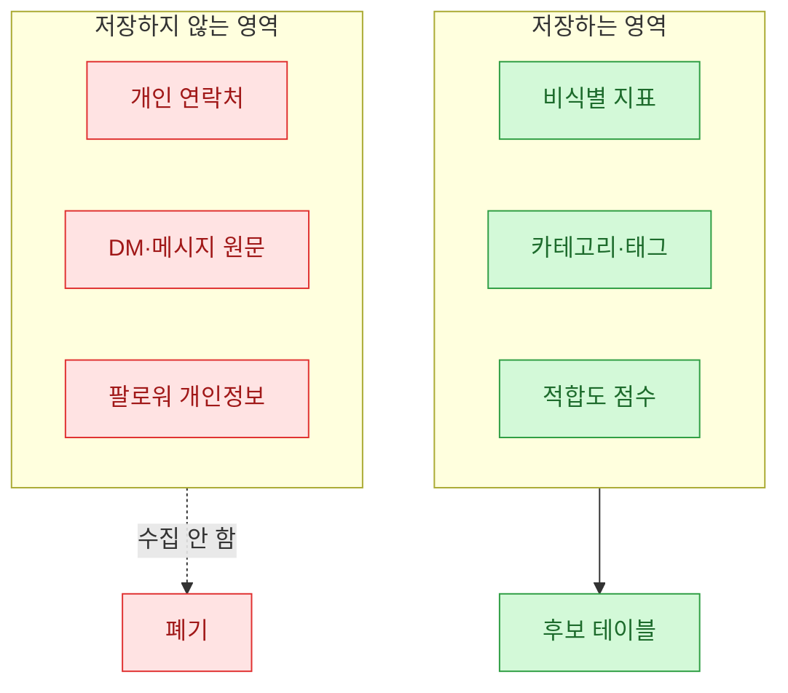
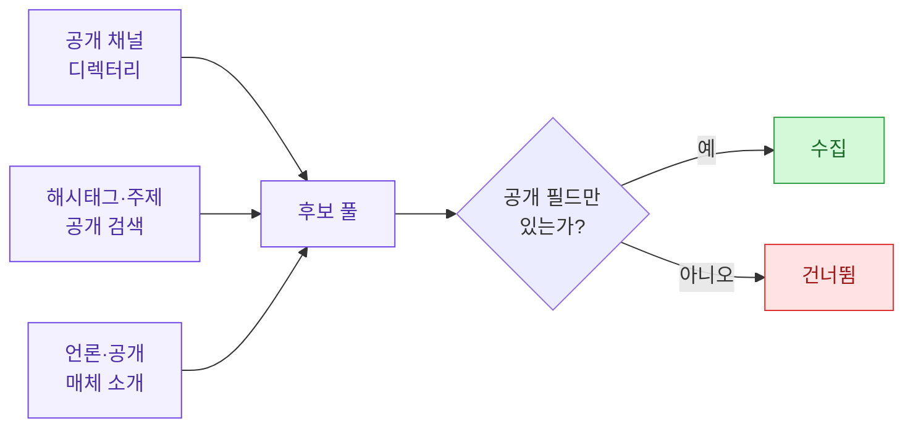
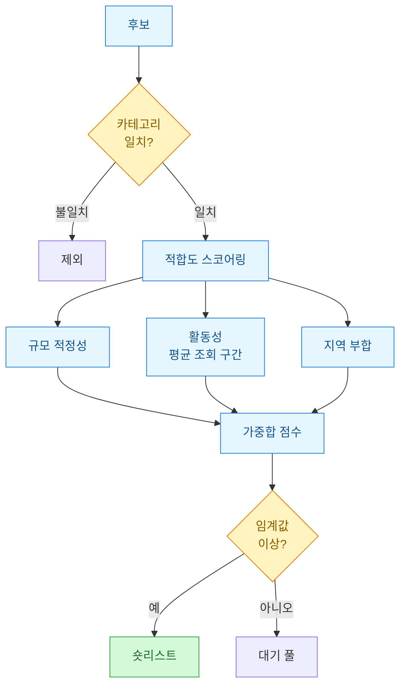
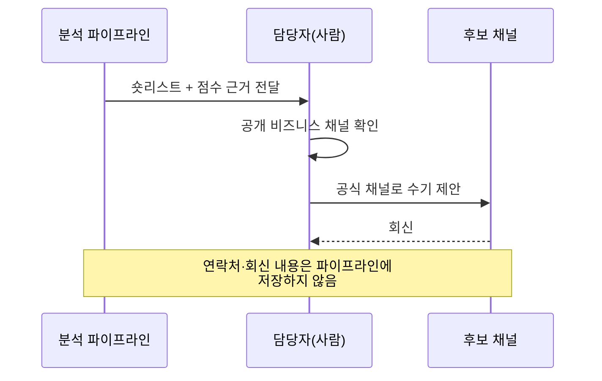

협찬 후보를 "리스트업해달라"는 요청은 마케팅 실무에서 흔하다. 그런데 이 일을 대충 하면 순식간에 남의 연락처·DM 내용·팔로워 명단 같은 **개인정보(PII, personally identifiable information)**를 엑셀에 쌓아두게 된다. 나는 이걸 몇 번 겪고 나서, "후보 리스트업 = 공개 데이터만, PII는 애초에 컬럼조차 만들지 않는다"는 원칙을 세웠다.

이 글은 그 원칙을 지키면서도 실제로 쓸 수 있는 후보 분류 워크플로를 정리한 것이다. 아래 표·코드에 나오는 모든 이름·수치·계정은 **합성(더미) 데이터**이며, 실제 인물·브랜드·거래처와는 무관하다.


## 왜 리스트업보다 PII 경계가 먼저인가?

리스트업은 기술적으로 어렵지 않다. 진짜 어려운 건 "어디까지 저장해도 되는가"의 선을 긋는 일이다. 공개된 채널명·구독자 수 같은 건 마케팅 판단 자료지만, 여기에 이메일·전화번호·DM 원문을 붙이는 순간 그 파일은 개인정보 파일이 된다. 유출되면 사과로 끝날 문제가 아니다.

그래서 나는 데이터를 세 등급으로 나눈다.

| 등급 | 예시 필드 | 저장 여부 | 이유 |
|---|---|---|---|
| 공개·비식별 | 채널명, 카테고리, 공개 구독자 수 구간 | 저장 O | 공개 정보, 마케팅 판단용 |
| 공개·준식별 | 채널 URL, 공개 대표 이메일(비즈니스용) | 최소·분리 저장 | 접촉엔 필요하나 남용 위험 |
| 비공개·식별 | 개인 연락처, DM 내용, 팔로워 개인 명단 | 저장 X | 애초에 수집·저장하지 않음 |

핵심은 세 번째 등급을 "관리를 잘하겠다"가 아니라 **"컬럼 자체를 만들지 않는다"**로 처리하는 것이다. 없는 데이터는 유출될 수 없다.



## 후보를 어떤 소스에서 모으나?

"공개 데이터만"이라는 제약을 지키려면 소스 선택부터 중요하다. 로그인 담벼락 안쪽(비공개 팔로워 목록, DM함)은 손대지 않고, 공개 프로필·공개 지표만 본다.



수집 단계에서 바로 스키마를 강제하면 실수로 PII가 섞이는 걸 막을 수 있다. 아래는 합성 데이터로 만든 후보 풀이다.

```python
import pandas as pd

# 합성(더미) 데이터입니다. 실제 인물·채널과 무관합니다.
candidates = pd.DataFrame([
    {"handle": "채널_알파", "category": "홈리빙",  "sub_band": "1만~5만", "avg_view_band": "5천~1만", "region": "국내"},
    {"handle": "채널_베타", "category": "뷰티",    "sub_band": "5만~10만", "avg_view_band": "1만~3만", "region": "국내"},
    {"handle": "채널_감마", "category": "홈리빙",  "sub_band": "10만+",   "avg_view_band": "3만~5만", "region": "국내"},
    {"handle": "채널_델타", "category": "푸드",    "sub_band": "1만 미만", "avg_view_band": "5천 미만", "region": "국내"},
    {"handle": "채널_엡실론","category": "홈리빙",  "sub_band": "5만~10만", "avg_view_band": "1만~3만", "region": "해외"},
])

# PII로 오해될 수 있는 컬럼은 아예 허용 목록으로 통제
ALLOWED = {"handle", "category", "sub_band", "avg_view_band", "region",
           "fit_score", "priority"}
assert set(candidates.columns) <= ALLOWED, "허용되지 않은 컬럼(PII 위험) 감지"
print(candidates)
```

주목할 점은 구독자 수를 **정확한 숫자가 아니라 구간(band)**으로 저장했다는 것이다. 구간화는 두 가지 효과가 있다. 첫째, 특정 시점의 정확한 수치로 개인을 재식별할 여지를 줄인다. 둘째, 어차피 협찬 판단은 "몇만 명대냐" 수준이면 충분해서 정보 손실이 거의 없다.

## 후보를 어떤 기준으로 분류하나?

카테고리와 적합도(fit)를 나눠서 본다. 카테고리는 "우리 캠페인 주제와 결이 맞는가", 적합도는 "규모·활동성·지역이 맞는가"의 정량 점수다.



적합도 점수는 규칙 기반으로 단순하게 짠다. 복잡한 모델보다, 이유를 설명할 수 있는 규칙이 실무 협의에서 훨씬 유용하다.

```python
# 구간 문자열을 점수로 매핑 (합성 데이터 기준 규칙)
SUB_SCORE = {"1만 미만": 1, "1만~5만": 2, "5만~10만": 3, "10만+": 4}
VIEW_SCORE = {"5천 미만": 1, "5천~1만": 2, "1만~3만": 3, "3만~5만": 4}

TARGET_CATEGORY = "홈리빙"
TARGET_REGION = "국내"

def fit_score(row):
    if row["category"] != TARGET_CATEGORY:
        return 0  # 카테고리 불일치는 즉시 탈락
    size = SUB_SCORE.get(row["sub_band"], 0)
    activity = VIEW_SCORE.get(row["avg_view_band"], 0)
    region = 2 if row["region"] == TARGET_REGION else 0
    # 규모 0.4 · 활동성 0.4 · 지역 0.2 가중
    return round(size * 0.4 + activity * 0.4 + region * 0.2, 2)

candidates["fit_score"] = candidates.apply(fit_score, axis=1)
candidates["priority"] = candidates["fit_score"].rank(ascending=False, method="min")
short = candidates[candidates["fit_score"] >= 2.0].sort_values("fit_score", ascending=False)
print(short[["handle", "category", "fit_score", "priority"]])
```

합성 데이터 기준 결과는 대략 이렇게 나온다.

| handle | category | fit_score | priority |
|---|---|---|---|
| 채널_감마 | 홈리빙 | 3.2 | 1 |
| 채널_엡실론 | 홈리빙 | 2.4 | 2 |
| 채널_알파 | 홈리빙 | 2.0 | 3 |

뷰티·푸드 채널은 카테고리 불일치로 0점 처리되어 숏리스트에서 자연스럽게 빠진다. 가중치(0.4/0.4/0.2)는 캠페인 목적에 따라 조정하면 된다. 신규 브랜드 인지도가 목표면 규모 가중을, 전환이 목표면 활동성 가중을 높이는 식이다.

## 접촉 단계는 왜 자동화하지 않나?

여기가 이 워크플로에서 내가 가장 조심하는 부분이다. 후보를 모으고 점수 매기는 것까지는 데이터 작업이지만, **실제 접촉(DM·메일 발송)은 자동화하지 않는다.**



이유는 세 가지다. 첫째, 대량 자동 발송은 플랫폼 약관 위반이나 스팸으로 취급되기 쉽다. 둘째, 접촉 과정에서 오가는 연락처·회신은 명백한 PII라 파이프라인에 남기고 싶지 않다. 셋째, 협찬 제안은 결국 사람 대 사람의 관계라 자동화 이득이 크지 않다. 분석은 자동화하되, **판단과 접촉은 사람에게 남긴다.**

## 파일을 남길 때 뭘 조심하나?

산출물(csv·시트)을 저장할 때도 최소 원칙을 다시 적용한다.

| 점검 항목 | 확인 |
|---|---|
| 허용 컬럼만 있는가 | 화이트리스트 assert로 강제 |
| 정확 수치 대신 구간인가 | 재식별 위험 감소 |
| 접근 권한이 최소인가 | 공유 링크·전체 공개 금지 |
| 보관 기한이 정해졌는가 | 캠페인 종료 후 폐기 |
| 개인 식별 필드가 없는가 | 연락처·개인명 미포함 |

특히 마지막 assert는 코드로 못 박아두는 걸 추천한다. 사람은 급하면 "일단 이메일 컬럼 하나만" 하고 규칙을 무너뜨리기 때문이다. 코드가 막아주면 그 유혹 자체가 사라진다.

```python
def save_safe(df, path):
    if not set(df.columns) <= ALLOWED:
        raise ValueError(f"허용되지 않은 컬럼 발견: {set(df.columns) - ALLOWED}")
    df.to_csv(path, index=False, encoding="utf-8-sig")
    print(f"저장 완료(비식별 필드만): {path}")

save_safe(short, "shortlist_synthetic.csv")  # 합성 데이터입니다.
```

## 정리하면

- 협찬 후보 리스트업의 본질은 수집 기술이 아니라 **PII를 컬럼 단계에서 배제하는 데이터 경계 설계**다.
- 구독자 수는 정확 수치 대신 **구간**으로 저장해 재식별 위험을 낮추고, 카테고리·적합도로 규칙 기반 스코어링한다.
- **분석은 자동화, 접촉과 판단은 사람** — 이 분리가 약관·개인정보 리스크를 동시에 줄인다.

없는 데이터는 유출되지 않는다. 리스트업을 시작하기 전에 "이 컬럼을 정말 남겨야 하나"부터 묻는 습관이, 결국 가장 확실한 보안이었다.
