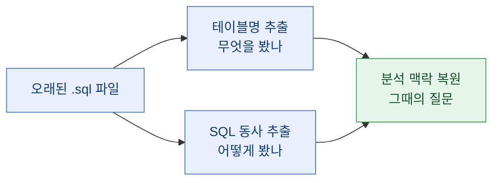
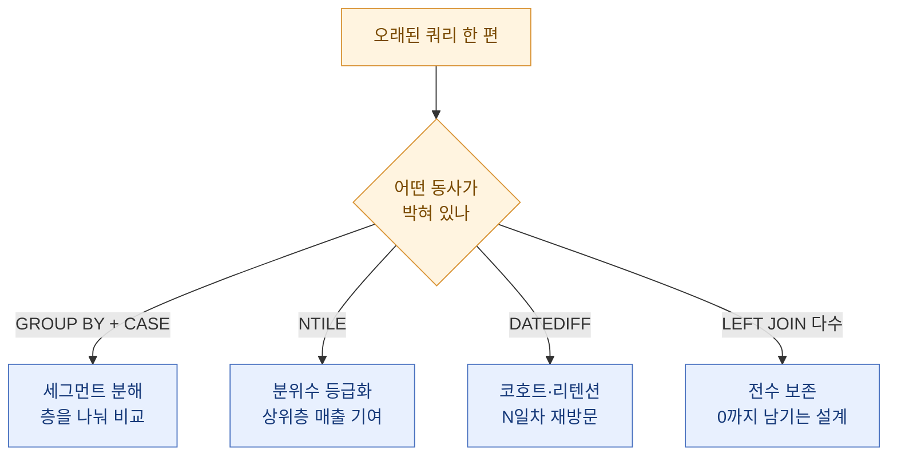
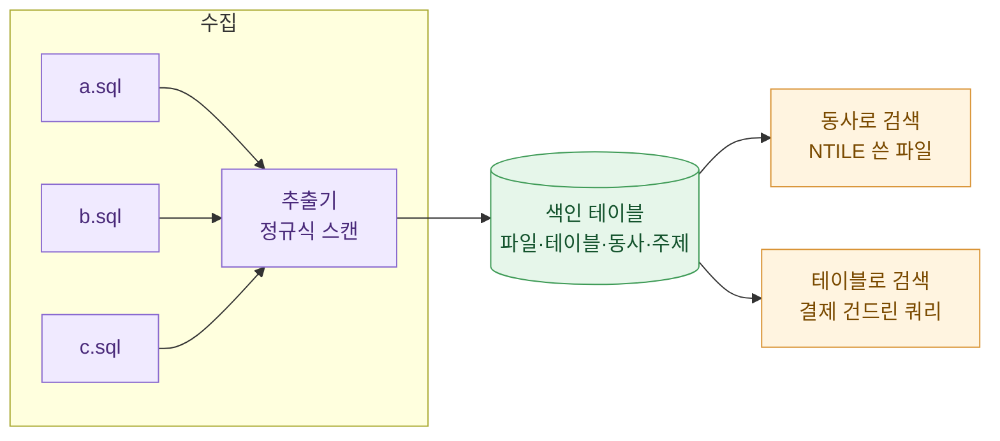

> 코드는 남는데 맥락은 증발한다. 그래서 나는 SQL 파일 자체를 '메모'로 읽는 법을 익혔다.

넉 달 전에 짠 쿼리 파일을 다시 열었다. 파일명은 `seg_retention_v3.sql`. 열자마자 든 생각은 딱 하나였다. "이걸 내가 왜 짰더라?" 주석은 없고, 커밋 메시지는 "fix"였다. 그런데 신기하게도, 쿼리 본문을 5분쯤 노려보니 당시의 나로 서서히 돌아갔다. 무슨 테이블을 건드렸고, 어떤 동사(SELECT·JOIN·GROUP BY 같은 SQL 키워드)를 썼는지가 곧 그때의 질문을 되살려준 것이다.

이 글은 그 경험을 습관으로 굳힌 이야기다. 오래된 SQL 파일에서 테이블명과 SQL 동사를 뽑아 색인으로 쌓아두면, 과거의 분석 맥락이 놀랄 만큼 잘 복원된다. (아래 예시의 테이블명·수치는 전부 설명용 더미다.)

## 왜 SQL 파일이 그렇게 좋은 메모인가?

문서로 남긴 분석 기록은 대부분 거짓말을 한다. 정확히는, 시간이 지나면 코드와 어긋난다. 리포트에는 "D7 리텐션을 세그먼트별로 봤다"라고 적혀 있지만, 실제 쿼리는 그새 세 번 바뀌어 지금은 D14를 보고 있는 식이다. 반면 SQL 파일은 거짓말을 못 한다. 거기 적힌 테이블을 읽고, 거기 적힌 대로 집계한다. 그 자체가 실행 가능한 진실이다.

그래서 나는 관점을 뒤집었다. 분석 맥락을 별도 문서에 저장하려 애쓰지 말고, SQL 파일에서 맥락을 추출하자. 파일은 어차피 남으니까.

핵심은 두 가지 신호다. 하나는 **테이블명**(무엇을 봤나), 다른 하나는 **SQL 동사**(어떻게 봤나). 이 둘만 뽑아도 "누구를, 어떤 방식으로, 왜 쪼갰는가"의 윤곽이 잡힌다.

## 테이블명은 '누구를 봤는가'를 말해준다

테이블명은 분석의 대상을 알려준다. 결제 관련 테이블을 조인했으면 돈 얘기였고, 접속 로그 테이블을 봤으면 리텐션이나 활동성 얘기였다. FROM과 JOIN 뒤에 붙는 이름들만 모아도 그 쿼리의 '등장인물'이 드러난다.

내가 쓰는 규칙은 단순하다. 파일 하나를 열면 FROM·JOIN 절의 식별자를 전부 뽑아 목록으로 만든다. 그리고 그 목록을 보며 자문한다. "이 테이블들을 한 화면에 모아 놓고 답할 수 있는 질문이 뭐지?"

예를 들어 (더미 예시) 한 쿼리에서 이런 조합이 나왔다고 하자.

| 추출한 테이블(더미) | 성격 | 여기서 유추되는 질문 |
|---|---|---|
| user_login_daily | 접속 로그 | 얼마나 자주 돌아오나 (리텐션) |
| purchase_log | 결제 로그 | 돈을 쓰는가 (과금 여부) |
| user_master | 유저 속성 | 언제 가입했나 (코호트) |

세 테이블이 한자리에 모였다면, 십중팔구 "가입 시점별로 묶은 유저(코호트)를, 과금/무과금으로 나눠, 재방문율을 본" 분석이다. 주석 한 줄 없어도 테이블 조합이 이야기를 해준다.

## SQL 동사는 '어떻게 봤는가'를 말해준다

테이블이 대상이라면, SQL 동사는 방법이다. 나는 SQL 키워드를 '동사'라고 부른다. 문장에서 동사가 행동을 결정하듯, SQL에서도 키워드가 분석의 행동을 결정하기 때문이다.

같은 테이블을 봐도 어떤 동사를 썼느냐에 따라 의도가 완전히 갈린다. 몇 개만 정리하면 이렇다.

| SQL 동사 | 이게 있으면 대체로 | 쉬운 풀이 |
|---|---|---|
| GROUP BY | 무언가를 그룹으로 묶어 집계 | "세그먼트별로 나눠 봤다" |
| CASE WHEN | 구간·범주를 직접 정의 | "버킷을 손으로 잘랐다" |
| NTILE | N등분 분위수 | "금액순 10등분 같은 상대 순위" |
| DATEDIFF | 두 날짜의 간격 | "가입 후 N일차 (리텐션·코호트)" |
| LEFT JOIN | 없는 쪽까지 살림 | "안 산 사람도 0으로 남기려는 의도" |

특히 NTILE이나 DATEDIFF 같은 동사는 강력한 지문이다. NTILE이 보이면 "아, 그때 결제 유저를 금액순으로 등급 나눠 상위 몇 퍼센트가 매출을 얼마나 떠받치는지 봤겠구나"가 거의 자동으로 떠오른다. DATEDIFF가 가입일과 접속일 사이에 걸려 있으면 리텐션 곡선을 그리려던 흔적이다.

## 이걸 어떻게 색인으로 쌓나?

한 파일을 손으로 읽는 건 쉽다. 문제는 파일이 수백 개일 때다. 그래서 나는 이 추출을 자동화해 작은 색인 테이블로 쌓아둔다. 거창할 것 없다. 파일별로 (파일명, 등장 테이블, 등장 동사, 추정 주제) 네 칸이면 충분하다.

추출 자체는 정규식 수준으로도 대부분 잡힌다. FROM·JOIN 뒤의 식별자를 긁고, 관심 키워드(GROUP BY·NTILE·CASE·DATEDIFF 등)를 존재 여부로 체크한다. 완벽한 SQL 파서가 아니어도 된다. 목적은 "정확한 실행"이 아니라 "빠른 회상"이니까.

색인이 쌓이면 검색 축이 생긴다. "NTILE 쓴 파일 다 보여줘"라고 하면 과거의 분위수 분석이 한 줄로 뜬다. "purchase_log 건드린 쿼리"를 찾으면 돈과 관련된 작업 이력이 모인다. 파일을 일일이 열지 않고도 '그때 그 작업'으로 점프하는 지도가 생기는 셈이다.

한 가지 더. 자동화된 배치 쿼리(예를 들어 매일 도는 집계 프로시저를 `daily_summary_*` 식으로 이름 붙여 두는 것)는 이름만 잘 지어도 색인의 절반이 끝난다. 파일명 규칙이 곧 메타데이터다. 그래서 요즘 나는 새 쿼리를 저장할 때부터 "미래의 내가 검색할 단어"를 파일명에 심어둔다.

## 복원이 실패하는 경우도 있다

솔직히 만능은 아니다. 뷰(view) 뒤에 로직이 숨어 있거나, `SELECT *`로 뭉뚱그렸거나, 테이블명이 `t1`·`tmp` 같은 무의미한 별칭이면 신호가 약하다. 이럴 때 복원은 반쯤 추측이 된다.

그래서 나는 반대 방향의 습관도 같이 들였다. 미래의 복원을 쉽게 하려고, 지금 쓰는 쿼리에 최소한의 '단서'를 남긴다. 파일 맨 위에 한 줄 주석으로 "질문: 신규·무과금 층의 D7 재방문율" 같은 목적문을 박아두는 것이다. 딱 한 줄이면 된다. 그 한 줄이 넉 달 뒤의 나에게 5분을 아껴준다.

정리하면, 이 색인법은 두 방향으로 작동한다. 과거를 향해서는 테이블·동사를 뽑아 맥락을 복원하고, 미래를 향해서는 파일명·주석으로 복원을 미리 쉽게 만든다.

## 마무리

오늘 배운 걸 한 줄로 남긴다. **분석 맥락은 문서가 아니라 SQL 파일 안에 이미 저장돼 있다.** 다만 우리가 그걸 읽는 법을 안 배웠을 뿐이다.

테이블명은 '누구를 봤는가', SQL 동사는 '어떻게 봤는가'를 말해준다. 이 둘을 뽑아 작은 색인으로 쌓으면, 오래된 쿼리 하나가 그때의 질문 전체를 되살려낸다. 코드는 원래 남는 자산이니, 그 자산에서 맥락까지 회수하는 건 공짜에 가깝다.

다음엔 이 색인을 전문검색(FTS) 위에 얹어서, 동사와 테이블을 함께 질의하는 실험을 해볼 생각이다. 오늘은 여기까지.

## 참고자료

- [[paying-flag-segmentation]] — 과금/무과금 플래그 한 컬럼으로 세그먼트를 살리는 패턴
- [[game-data-sql-recipes-retention-ltv]] — 리텐션·코호트 LTV를 뽑는 SQL 레시피 모음
- [[cohort-m1-retention-sql]] — 코호트 기반 재방문율 쿼리
- [[revenue-simulation-dau-pu-arppu]] — DAU·PU·ARPPU로 매출을 분해·시뮬레이션하기
- game-data-recipes 레포지토리: https://github.com/DBhyeong/game-data-recipes

<!-- 안전: 합성/더미 데이터, 회사·실데이터·PII 없음. -->
