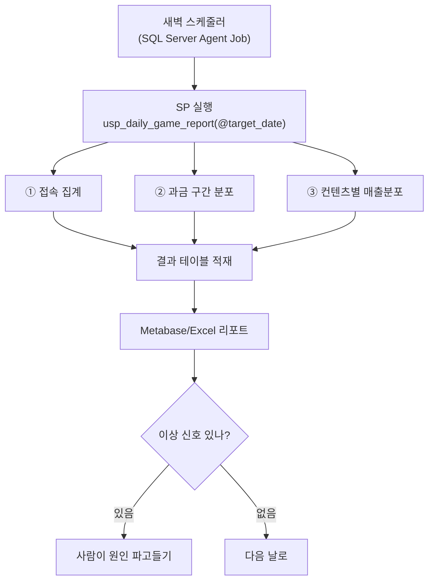
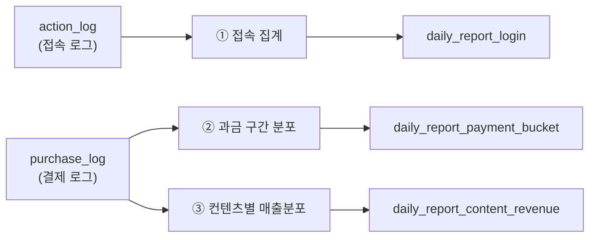
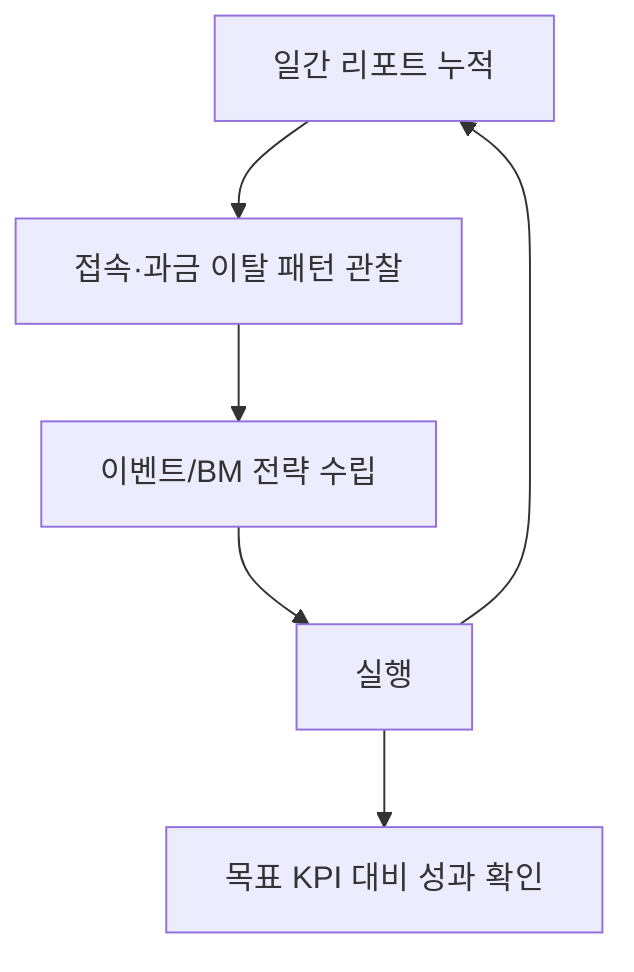

라이브 게임을 붙잡고 있으면 아침마다 반복되는 쿼리가 있었다. 어제 접속자가 몇 명이었는지, 결제한 유저는 어느 구간에 몰려 있는지, 어떤 컨텐츠(패키지·가챠 등 상품)에서 매출이 났는지. 처음 몇 주는 이걸 매번 손으로 짰다. 그러다 사고 아닌 사고가 났다. 전날 쿼리를 복사해 WHERE절 날짜만 바꾸면 되는 단순 작업이었는데, 딱 한 군데를 빼먹고 그대로 돌려버렸다. 어제 숫자가 오늘 리포트에 실려 유관부서로 나갔다. 다행히 큰 사고는 아니었지만 "이걸 왜 매일 사람 손으로 하고 있지"라는 질문이 그날 남았다.

답은 단순했다. 반복되는 집계는 사람이 아니라 DB가 하게 만들자. 나는 주력이 MS-SQL이었고, Stored Procedure(SP — 쿼리 묶음을 미리 저장해두고 파라미터만 바꿔 실행하는 것)로 이 반복을 넘겼다. 이 글은 접속·과금분포·매출분포라는, 매일 똑같이 뽑아야 하는 세 지표를 SP 하나로 묶어 자동 산출하게 만든 설계를 — 실제 스키마·SP명은 합성으로 바꿔 — 정리한 것이다.



## 왜 아침마다 같은 쿼리를 다시 짜면 안 되는가?

같은 로직을 매일 손으로 다시 짜면 실수가 낀다. 위에서 말한 날짜 복붙 실수가 대표적이고, 더 무서운 건 **미묘하게 다른 계산식**이 섞여 들어가는 경우다. 오늘은 결제 유저를 "당일 결제자"로 세고 어제는 "결제 이력 있는 유저"로 셌다면, 두 리포트는 겉보기엔 비슷해 보여도 서로 다른 숫자다. 사람이 매번 짜는 한 이 미세한 흔들림을 완전히 막을 수 없다.

SP로 묶으면 로직이 한 곳에 고정된다. 바뀌는 건 오직 파라미터, 즉 **날짜 하나**뿐이다. 어제도 오늘도 내일도 똑같은 정의로 집계되니, 리포트 사이의 숫자를 그대로 비교해도 된다. 이게 자동화의 첫 번째 값어치다. 속도가 아니라 **일관성**이다.

## SP 하나로 묶는다는 게 정확히 무슨 뜻인가?

접속·과금분포·매출분포는 따로 보면 세 개의 쿼리지만, 매일 같은 순서로 함께 뽑아야 하는 한 세트다. 그래서 이 세 블록을 파라미터 하나(`@target_date`, 분석 대상일)를 받는 SP 하나에 담았다. 실행은 한 번, 결과 테이블은 세 개.

```sql
-- 합성 스키마 기준(users / action_log / purchase_log). 실제 SP명·컬럼 아님.
CREATE PROCEDURE dbo.usp_daily_game_report
    @target_date DATE
AS
BEGIN
    SET NOCOUNT ON;

    -- ① 일간 접속(DAU) — 플랫폼별
    INSERT INTO daily_report_login (report_date, platform, dau)
    SELECT @target_date, u.platform, COUNT(DISTINCT a.user_id)
    FROM   action_log a
    JOIN   users u ON u.user_id = a.user_id
    WHERE  a.action_type = 'login' AND a.action_date = @target_date
    GROUP  BY u.platform;

    -- ② 과금 구간(버킷) 분포 — 결제액 구간별 유저 수·매출
    INSERT INTO daily_report_payment_bucket (report_date, pay_bucket, user_cnt, bucket_revenue)
    SELECT @target_date,
           CASE WHEN amount < 10000  THEN 'low'
                WHEN amount < 100000 THEN 'mid'
                ELSE 'high' END          AS pay_bucket,
           COUNT(DISTINCT user_id),
           SUM(amount)
    FROM   purchase_log
    WHERE  pay_date = @target_date
    GROUP  BY CASE WHEN amount < 10000  THEN 'low'
                   WHEN amount < 100000 THEN 'mid'
                   ELSE 'high' END;

    -- ③ 컨텐츠(상품)별 매출분포
    INSERT INTO daily_report_content_revenue (report_date, product_id, revenue, pu)
    SELECT @target_date, product_id, SUM(amount), COUNT(DISTINCT user_id)
    FROM   purchase_log
    WHERE  pay_date = @target_date
    GROUP  BY product_id;
END
```

세 블록 다 짧다. 포인트는 코드 난이도가 아니라 **"매일 새벽 이 SP 하나만 돌면 세 리포트가 다 채워진다"**는 구조 자체다.



## 과금 구간을 나눠서 보는 이유는 뭔가?

과금액을 총합 하나로만 보면 "오늘 매출 얼마"까지만 보인다. 유저 수가 아니라 금액 구간(버킷)으로 쪼개면 "어느 구간에 사람이 몰려 있는가"가 보인다. 소액 결제자가 압도적으로 많은데 고액 구간이 얇으면 결제 진입 장벽 문제일 수 있고, 반대로 고액 구간에서 갑자기 이탈이 생기면 특정 콘텐츠·강화 단계에서 지갑이 닫혔다는 신호일 수 있다.

매일 같은 구간 기준으로 쌓아두면 "오늘 갑자기 mid 구간이 줄었다" 같은 변화를 하루 단위로 잡아낼 수 있다. 이건 한 번 뽑아본 스냅샷으로는 안 보이고, **매일 같은 정의로 누적**돼야 보이는 신호다. SP 자동화가 진짜 필요한 이유가 여기 있다. 한 번 뽑는 리포트가 아니라 매일 쌓이는 시계열이어야 의미가 생기기 때문이다.

## 이 결과 테이블은 누가, 언제 보나?

SQL Server Agent Job(스케줄러)이 새벽에 SP를 돌리고 나면, 출근했을 때 세 테이블은 이미 채워져 있다. 이걸 그대로 Metabase 대시보드나 Excel로 끌어와 봤다. 숫자를 만드는 시간이 없으니, 남는 시간은 전부 "이 숫자가 왜 이렇게 나왔나"를 보는 데 쓸 수 있었다.

실제로 이 구조를 쓴 건 만렙(최고 레벨) 개방 직후였다. 접속·과금 이탈이 감지됐고, 매일 쌓인 과금 구간·매출분포 리포트를 보니 과금 우선순위가 가챠 > 소모품 > 편의재 순으로 쏠려 있었고, 스펙이 낮은 유저는 레이드 콘텐츠에 아예 참여하지 못하고 있었다. 이 진단 위에 이벤트 전략을 세워 실행했고, 동남아 지역 목표 KPI를 약 113% 초과 달성했다(상반기 KPI도 최종 달성). 리포트 자체가 성과를 만든 건 아니다. 하지만 매일 같은 기준으로 쌓인 리포트가 없었다면 저 쏠림을 이렇게 빨리 잡아내지 못했을 것이다.



## 자동화 이후 실제로 뭐가 달라졌나?

가장 크게 바뀐 건 시간 배분이다. 예전엔 하루의 상당 시간을 "오늘 쿼리 짜기"에 썼다. SP로 넘긴 뒤로는 그 시간이 "숫자 해석"으로 옮겨갔다. 두 번째는 신뢰도다. 어제·오늘·내일 리포트가 같은 정의로 나온다는 걸 알기 때문에, 유관부서에 숫자를 넘길 때 "혹시 계산식이 미묘하게 바뀌었나"를 걱정하지 않아도 됐다.

## 정리 — 반복 집계는 SP로, 판단은 사람에게

- 매일 반복되는 접속·과금분포·매출분포 집계는 **Stored Procedure 하나에 묶고 파라미터(대상일)만 바꿔 실행**한다.
- 로직을 한 곳에 고정하면 리포트 간 **일관성**이 생기고, 사람은 "숫자 만들기"가 아니라 "숫자 해석"에 시간을 쓴다.
- 과금은 총액이 아니라 **구간(버킷)**으로 쪼개야 쏠림이 보이고, 이 쏠림은 매일 같은 기준으로 쌓여야 신호가 된다.
- 자동화된 일간 리포트는 그 자체로 성과가 아니라, **빠른 진단 → 전략 수립**으로 이어지는 재료다.

다음 글에서는 이렇게 쌓인 일간 로그 위에서 **비정상 계정(어뷰징) 후보를 통계적으로 걸러내는 법**을 정리해보려 한다.

- 방법론·합성 스키마 레시피: [github.com/DBhyeong/game-data-recipes](https://github.com/DBhyeong/game-data-recipes)
