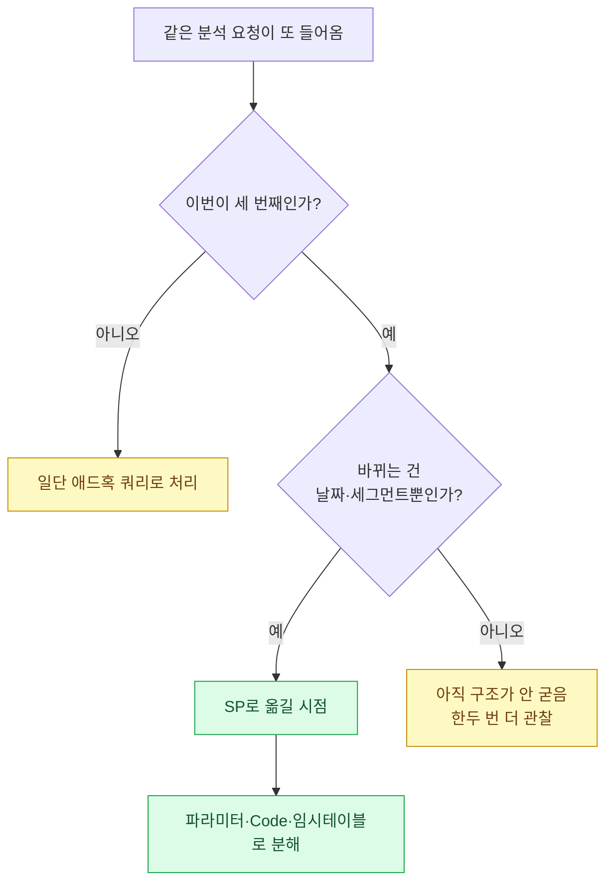
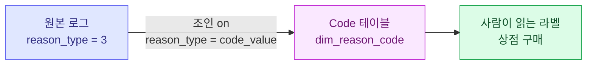
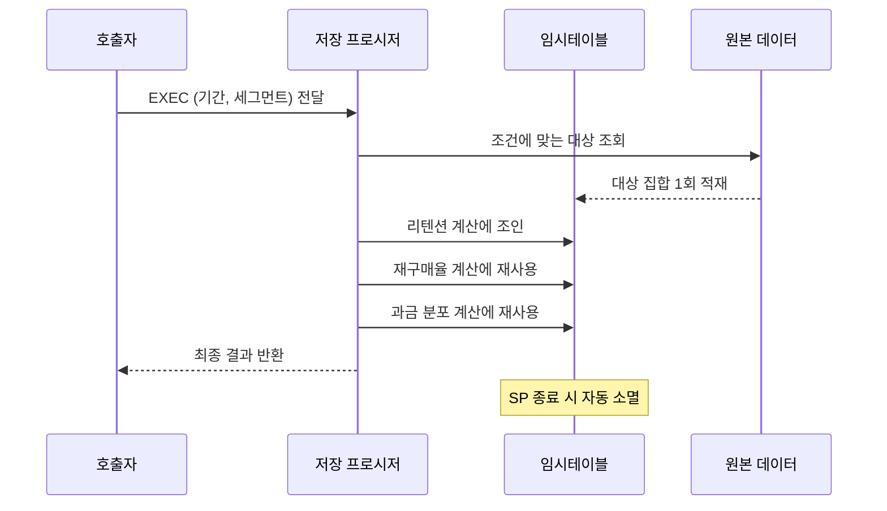

> 같은 쿼리를 세 번째 복사-붙여넣기 하는 순간, 나는 그걸 SP로 옮길 때가 됐다는 신호로 읽는다.

분석가로 일하다 보면 "이번 주 신규 코호트 리텐션 좀 뽑아줘", "이번엔 지난달로", "이번엔 고액 과금층만" 같은 요청이 끝없이 반복된다. 매번 쿼리를 복사해서 날짜만 바꾸고, WHERE 절에 조건 하나 더 붙이고, 결과를 엑셀에 붙여넣는다. 이 반복은 편한 것 같지만 실은 아주 위험하다. 복사할 때마다 어딘가 한 줄이 어긋나고, 그 어긋남을 아무도 눈치채지 못한 채 리포트가 나가기 때문이다.

그래서 나는 어느 순간부터 "세 번 반복하면 SP로 옮긴다"는 규칙을 세웠다. 여기서 SP는 저장 프로시저(Stored Procedure), 쉽게 말하면 데이터베이스 안에 저장해 두고 이름만 부르면 실행되는 '쿼리 함수'다. 그런데 막상 옮기려고 하면 고민이 시작된다. 어디까지를 파라미터(호출할 때 넘기는 값)로 빼야 하나? 반복되는 코드값 매핑은 어디에 둬야 하나? 중간 계산 결과는 어떻게 재사용하나? 오늘은 이 세 가지 — 파라미터, Code 테이블, 임시테이블 — 를 어떤 기준으로 나눠 쓰는지 내 나름의 레시피를 정리해 본다.

## 그래서 SP로 옮길 타이밍은 언제인가?

먼저 판단 기준이다. 나는 아래 세 신호 중 두 개 이상이 켜지면 SP로 옮긴다.

| 신호 | 의미 | 예시 |
| --- | --- | --- |
| 반복 | 같은 골격의 쿼리를 주기적으로 돌린다 | 매주 리텐션, 매월 재구매율 |
| 변주 | 골격은 같은데 날짜·세그먼트만 바뀐다 | 지난주 → 이번주, 전체 → 과금층 |
| 위험 | 손으로 고치다 실수하면 리포트가 틀어진다 | 코호트 기준일 하나만 어긋나도 숫자가 전부 바뀜 |



핵심은 '변주'다. 매번 바뀌는 부분이 날짜와 세그먼트 정도로 정리된다면, 그건 이미 함수의 모양을 하고 있다는 뜻이다. 바뀌는 부분이 곧 파라미터가 된다.

## 무엇을 파라미터로 빼야 하나?

파라미터는 SP를 부를 때 넘기는 값이다. 여기서 초보 시절 내가 자주 했던 실수가 있다. "혹시 모르니까" 하고 온갖 것을 다 파라미터로 열어 두는 것이다. 그러면 호출할 때마다 인자가 열 개씩 필요해지고, 결국 아무도 못 쓰는 SP가 된다.

내 기준은 단순하다. **호출자가 매번 의식적으로 바꾸는 값만 파라미터로 연다.** 나머지는 SP 안에 상수로 박거나, 뒤에 나올 Code 테이블로 뺀다.

| 구분 | 파라미터로? | 이유 |
| --- | --- | --- |
| 분석 기간 시작·종료일 | 예 | 매번 바뀌는 핵심 변수 |
| 코호트 기준일 | 예 | 요청마다 달라짐 |
| 세그먼트 필터(과금/무과금 등) | 예(선택형) | 없으면 전체, 있으면 부분 |
| 코드값-라벨 매핑 | 아니오 | Code 테이블로 |
| 버킷 경계(10등분 등) | 대개 아니오 | 계산 로직에 내장 |

세그먼트 필터는 조금 특별하게 다룬다. NULL을 넘기면 전체를 보고, 값을 넘기면 그 세그먼트만 보도록 짜 두면 SP 하나로 두 가지 질문에 답할 수 있다. 예를 들면 이런 식이다(테이블·컬럼명은 전부 더미다).

```sql
CREATE PROCEDURE dbo.usp_cohort_retention
    @start_date  DATE,
    @end_date    DATE,
    @segment     VARCHAR(20) = NULL   -- NULL이면 전체
AS
BEGIN
    SET NOCOUNT ON;

    SELECT
        cohort_day,
        SUM(CASE WHEN days_since = 1 THEN 1 ELSE 0 END) AS d1,
        SUM(CASE WHEN days_since = 7 THEN 1 ELSE 0 END) AS d7
    FROM dummy_user_activity
    WHERE cohort_day BETWEEN @start_date AND @end_date
      AND (@segment IS NULL OR user_segment = @segment)
    GROUP BY cohort_day;
END
```

`(@segment IS NULL OR user_segment = @segment)` 이 한 줄이 "전체 보기"와 "세그먼트별 보기"를 하나로 합쳐 준다. 파라미터 하나로 질문 두 개를 커버하는 셈이다.

## Code 테이블은 왜 SP 밖에 두는가?

여기서 Code 테이블 이야기를 해야 한다. Code 테이블은 코드값과 사람이 읽을 라벨을 짝지어 둔 작은 참조표다. 데이터에는 대개 이유나 유형이 숫자·약어 코드로 저장돼 있다. 예를 들어 재화 소모 사유가 `reason_type = 3` 같은 식으로 들어온다. 이 3이 "상점 구매"인지 "이벤트 참여"인지는 사람이 외울 게 아니라 표에서 조인해 와야 한다.



이걸 SP 안에 CASE WHEN으로 하드코딩하고 싶은 유혹이 크다. `CASE WHEN reason_type = 3 THEN '상점 구매' ...` 이렇게. 하지만 나는 그러지 않는다. 이유는 세 가지다.

- 코드가 늘어날 때마다 모든 SP를 열어 고쳐야 한다. 한 곳만 빠뜨려도 리포트마다 라벨이 달라진다.
- 같은 매핑을 열 개의 쿼리가 각자 베껴 쓰면, '진실의 원본'이 어디인지 아무도 모른다.
- Code 테이블은 한 번 조인으로 끝나고, 유지보수는 그 표 한 줄만 고치면 된다.

즉 Code 테이블은 **"거의 안 변하지만, 변하면 모든 곳에 동시에 반영돼야 하는 것"** 을 담는 자리다. 라벨·분류·구간명 같은 것들이다. 반대로 파라미터는 "매번 바뀌는 것", 곧 뒤에 설명할 임시테이블은 "이번 실행에만 잠깐 필요한 것"을 담는다. 이 세 축을 헷갈리지 않는 게 설계의 절반이다.

## 임시테이블은 언제 꺼내야 하나?

임시테이블은 이번 SP 실행 동안만 살아 있다가 사라지는 작업용 테이블이다(MS-SQL이라면 `#` 접두어를 붙인다). 나는 두 상황에서 임시테이블을 꺼낸다.

첫째, **한 번 만든 '대상 집합'을 여러 번 다시 써야 할 때.** 예를 들어 "최근 2주간 접속한 유저"라는 집합을 리텐션에서도 쓰고, 재구매율에서도 쓰고, 과금 분포에서도 써야 한다면, 그 집합을 매번 서브쿼리로 다시 계산하는 건 낭비다. 한 번 임시테이블에 담아 두고 계속 조인해 쓰는 게 훨씬 빠르고 읽기도 좋다.

둘째, **단계가 여러 개라 중간 결과를 붙잡아 둬야 할 때.** 유저를 과금액 기준으로 10등분(NTILE decile)하고, 그 등급별로 다시 재구매율을 계산하는 식의 다단계 분석이 그렇다. 중간 등급 부여 결과를 임시테이블에 고정해 두면 그다음 집계가 단순해진다.



주의할 점도 있다. 임시테이블은 "재사용"이 목적일 때만 값을 한다. 딱 한 번만 참조하는 중간 결과라면 CTE(WITH 절)나 서브쿼리로 충분하다. 임시테이블을 남발하면 오히려 옵티마이저가 판단할 여지를 뺏고, I/O만 늘어난다. 나는 "두 번 이상 조인하나?"를 스스로 물어보고, 그렇지 않으면 CTE로 둔다.

## 세 축을 한 장으로 정리하면?

지금까지의 이야기를 한 표로 압축하면 이렇다. 새 SP를 짤 때 나는 머릿속에서 이 표를 그려 놓고 각 조각을 어디에 넣을지 분류한다.

| 축 | 담는 것 | 변화 빈도 | 수명 |
| --- | --- | --- | --- |
| 파라미터 | 기간, 코호트 기준일, 세그먼트 | 매 호출마다 | 호출 순간 |
| Code 테이블 | 코드-라벨 매핑, 분류, 구간명 | 거의 안 변함 | 영구(공유) |
| 임시테이블 | 대상 집합, 다단계 중간 결과 | 매 실행마다 재생성 | 실행 동안만 |

이렇게 나눠 두면 좋은 점이 분명하다. 요청이 "이번엔 지난달로"면 파라미터만 바꾸면 되고, "재화 사유에 새 코드가 생겼어"면 Code 테이블 한 줄만 추가하면 되고, "단계 하나 더 얹어 줘"면 임시테이블 뒤에 로직만 붙이면 된다. 각 변화가 서로 다른 자리에서 독립적으로 일어나기 때문에, 하나를 고치다 다른 게 깨지는 사고가 확 줄어든다.

## 마무리

SP 설계는 결국 "무엇이 얼마나 자주 변하는가"를 기준으로 조각을 제자리에 놓는 일이다. 매번 변하는 건 파라미터, 좀처럼 안 변하지만 변하면 전부 바뀌어야 하는 건 Code 테이블, 이번 실행에만 잠깐 필요한 건 임시테이블. 이 세 축만 헷갈리지 않으면, 손으로 복사하던 반복 분석은 이름만 부르면 도는 안정적인 함수가 된다.

나는 요즘 새 분석 요청이 세 번째 들어오면 반사적으로 이 표를 떠올린다. 그리고 조각을 나눠 SP로 옮기고 나면, 다음 주에 "이번엔 다른 기간으로"라는 요청이 와도 30초면 끝난다. 반복을 줄이는 게 아니라, 반복이 더 이상 나를 지치게 하지 않도록 구조를 바꾸는 것 — 그게 자동화의 진짜 이득이라고 생각한다.

## 참고자료

- [[game-data-sql-recipes-retention-ltv]] — 리텐션·LTV를 SQL로 뽑는 기본 레시피
- [[cohort-m1-retention-sql]] — 코호트 기준일과 M1 리텐션 정의
- [[arpu-vs-arppu]] — 세그먼트별 과금 지표를 나눠 볼 때의 관점
- [[game-metrics-7-definitions]] — 지표 정의를 팀이 공유하는 방법
- 코드 예시 저장소: https://github.com/DBhyeong/game-data-recipes

<!-- 안전: 합성/더미 데이터, 회사·실데이터·PII 없음. -->
