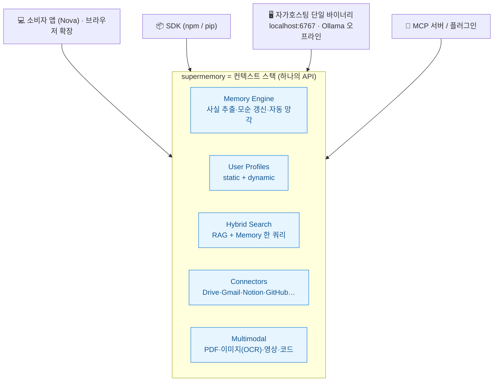
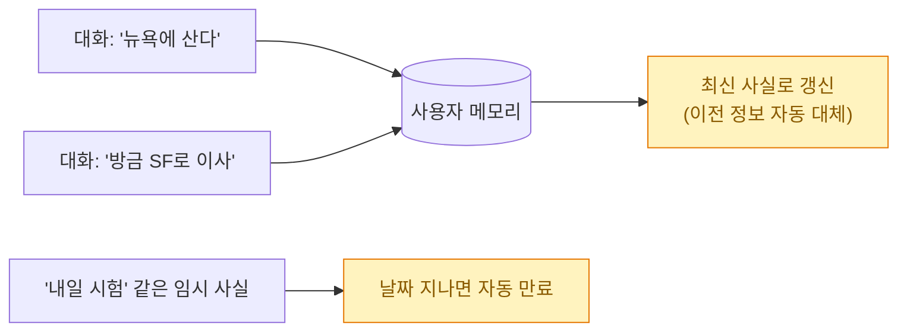
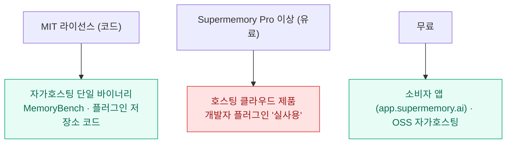
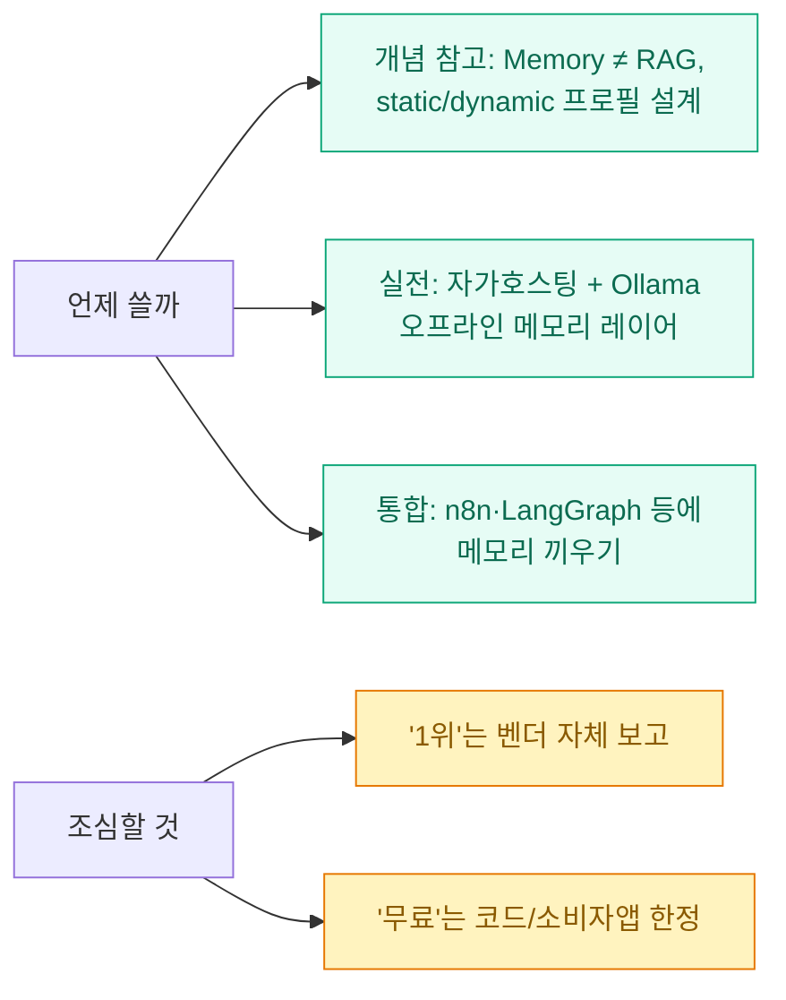

파이토치 한국(PyTorch Korea) 커뮤니티에서 **supermemory**를 소개하는 글을 봤다. "AI에 장기 기억을 준다"는 도구는 요즘 흔하다. 그런데 한 문장에서 멈칫했다.

> **Memory is not RAG.**

이 문구가 걸려서 공식 저장소와 문서까지 파봤다. 그리고 README의 **'벤치마크 3개 모두 1위'** 주장에서 한 번 더 멈칫했다. 그래서 이 글은 supermemory가 뭔지 정리하되, **공식 1차 출처로 교차검증**하고 과장되기 쉬운 부분은 ⚠️로 짚는 방식으로 쓴다. (커뮤니티 소개글은 대체로 정확했지만, **출처·라이선스·벤치마크**에서 짚어둘 게 몇 개 있었다.)

확인 기준은 **2026년 6월 30일**, supermemory의 GitHub README·docs·플러그인 저장소다. 미리 밝히면, 나는 개념과 구조를 **뜯어본** 것이지 벤치마크를 직접 재현하거나 프로덕션에 붙여본 건 아니다.

## 한눈에 — supermemory는 뭘 묶어주나?



핵심은 **"벡터 DB·임베딩·청킹을 직접 안 짜도, 사실 추출부터 검색까지 하나의 API로 처리"** 한다는 것이다. 그리고 그 입구가 소비자 앱·SDK·자가호스팅·MCP로 네 갈래다.

## 'Memory is not RAG'가 대체 무슨 뜻인가?

가장 마음에 걸렸던 문구이자, 사실 이 글에서 제일 건질 만한 개념이다. supermemory README의 표현을 그대로 옮기면 이렇다.

> "Memory is not RAG. RAG retrieves document chunks — stateless, same results for everyone."

여기서 **RAG(검색 증강 생성)** 는 *질문과 관련된 문서 조각을 찾아 붙여주는* 방식이다. 무상태(stateless)라, 같은 질문이면 **누구에게나 같은 결과**를 준다. 반면 **메모리(memory)** 는 *사용자에 관한 사실을 시간축 위에서 추출·추적*한다.

| 구분 | RAG | Memory (supermemory) |
|---|---|---|
| 상태 | 무상태(stateless) | 사용자별 사실을 시간축으로 추적 |
| 결과 | 누구에게나 동일 | 사용자마다 개인화 |
| 하는 일 | 문서 청크 검색 | 사실 추출 · 모순 갱신 · 만료 |
| 예시 | "관련 문단을 찾아줌" | "샌프란시스코로 이사" → "뉴욕 거주"를 **대체** |



그리고 supermemory의 포인트는 **둘 중 하나를 고르는 게 아니라, 한 쿼리에서 RAG와 메모리를 같이 돌린다**(하이브리드)는 데 있다. 지식 베이스 문서 검색과 개인화된 맥락을 동시에 돌려준다.

> ⚠️ 출처를 정확히 적자. 이 'Memory is not RAG' 프레이밍과 이 글의 세부 대부분은 공식 docs(`supermemory.ai/docs/intro`)가 아니라 **GitHub README**에 있다. docs/intro는 같은 `containerTag`(유저 ID)를 쓰면 Memory API·User Profiles·RAG가 **컨텍스트 풀을 공유**한다는 식으로 다소 다르게 설명한다. 인용할 땐 README를 출처로 명시하는 게 안전하다.

## supermemory가 묶는 다섯 가지 — 무엇이 들어 있나?

README 기준 컨텍스트 스택은 다섯 조각이다.

| 구성요소 | 하는 일 | 메모 |
|---|---|---|
| **Memory Engine** | 대화에서 사실 추출, 시간 변화·모순 처리, 만료 정보 자동 망각 | 핵심 엔진 |
| **User Profiles** | 안정적 장기 사실 + 최근 맥락을 합쳐 자동 유지 | `profile.static` + `profile.dynamic`, **한 번 호출 ~50ms** |
| **Hybrid Search** | RAG와 메모리를 한 쿼리로 | `searchMode: 'hybrid'`(기본) / `'memories'` |
| **Connectors** | 외부 데이터 실시간 웹훅 동기화 | Google Drive·Gmail·Notion·OneDrive·GitHub·Web Crawler |
| **Multimodal Extractors** | 업로드를 검색 가능한 청크로 | PDF·이미지(OCR)·영상(전사)·코드(AST 청킹) |

User Profiles가 특히 영리하다. `profile.static`에는 "Acme의 시니어 엔지니어", "Vim 사용" 같은 **장기 사실**이, `profile.dynamic`에는 "인증 마이그레이션 작업 중" 같은 **최근 맥락**이 담긴다. 한 번 호출로 둘 다 받아 시스템 프롬프트에 주입하면, 에이전트가 "상대가 누구인지"를 아는 상태로 대화를 시작한다.

> ⚠️ 수치를 섞지 말자. **'~50ms'는 `profile()` 호출** 기준이고, 랜딩 페이지가 광고하는 검색 지연은 별도로 'sub-300ms'다. 또 **커넥터 목록은 출처마다 다르다** — README는 'Web Crawler'를 넣지만 랜딩 페이지는 대신 'S3'를 넣는 식이다. '실시간 웹훅 동기화'는 일관되게 확인되지만, 세부 목록은 페이지마다 갈린다.

## 코드 없이도, 코드로도 — 어떻게 쓰나?

입구가 세 갈래다(MCP는 다음 절에서 따로).

**① 코드 없이**: `app.supermemory.ai`에서 바로 쓴다. **Nova**라는 에이전트가 내장돼 메모리를 검색·정리하고, 브라우저 확장으로 평소 웹에서 기억을 남길 수 있다. 이 소비자 앱은 **무료**로 시작한다.

**② SDK**: npm·PyPI로 제공된다.

```javascript
import Supermemory from "supermemory";
const client = new Supermemory();

// 사실 저장 (project 단위 컨테이너 태그로 분리)
await client.add({ content: "User loves TypeScript", containerTag: "user_123" });

// 프로필 + 관련 메모리를 한 번에
const { profile, searchResults } = await client.profile({
  containerTag: "user_123",
  q: "What style does the user prefer?",
});
// profile.static  → 안정적 장기 사실
// profile.dynamic → 최근 맥락
```

기억은 **project(컨테이너 태그)** 로 묶여, 업무용과 개인용을, 또는 클라이언트·저장소 단위로 맥락을 분리할 수 있다. "내일 시험" 같은 임시 사실은 날짜가 지나면 만료되고, 모순되는 정보는 자동으로 정리된다.

**③ 자가호스팅(개인적으로 제일 끌린 부분)**: 단일 바이너리로 내 머신에서 통째로 돌린다.

```bash
curl -fsSL https://supermemory.ai/install | bash   # 또는: npx supermemory local
supermemory-server                                  # Memory API → http://localhost:6767
# 첫 부팅 시 API 키(sm_...) 생성, 데이터는 ./.supermemory 한 곳에 보관
# 모델은 자유: OpenAI·Anthropic·Gemini·Groq 또는 Ollama(gpt-oss:20b)로 '완전 오프라인'
```

데이터·자동화로 먹고사는 입장에서 이 경로가 가장 실용적이다. **Ollama(gpt-oss:20b)** 를 가리키면 데이터가 머신 밖으로 안 나가는 완전 오프라인 모드가 된다. 회사 데이터·PII를 다루는 워크플로에서 "메모리 레이어는 갖되 외부 전송은 막는다"는 선택지가 생긴다.

## Claude Code에 붙이는 길은 둘, 헷갈리기 쉽다

여기가 소개글들이 자주 뭉뚱그리는 지점이다. supermemory를 Claude Code에 붙이는 길은 **두 가지이고, 작동 방식이 다르다.**

| | (A) 범용 MCP 서버 | (B) claude-supermemory 플러그인 |
|---|---|---|
| 설치 | `npx -y install-mcp@latest https://mcp.supermemory.ai/mcp --client claude --oauth=yes` | `/plugin marketplace add supermemoryai/claude-supermemory` → `/plugin install` |
| 작동 | 도구 3종: **memory**(저장/망각)·**recall**(검색)·**context**(프로필 주입) | **훅**(auto-capture·reasoned-recall) + **슬래시 명령**(`/supermemory:index`, `:status` 등) |
| 비용 | 호스팅 메모리 사용 | 실사용엔 **Supermemory Pro 이상 필요** |

MCP 서버 쪽은 `claude` 자리에 `cursor`·`windsurf`·`vscode`를 넣으면 그 클라이언트에 붙는다.

> ⚠️ 두 경로를 한 문단에서 합치면 독자가 오해한다. `install-mcp`로 붙이는 **memory/recall/context 도구는 '범용 MCP 서버' 방식**이고, `claude-supermemory` 플러그인은 마켓플레이스 설치 + 훅/슬래시로 동작하는 **다른 길**이다. 참고로 README상 memory 도구 설명은 'store/delete'가 아니라 **'Save or forget information'** 이다(기능은 같아도 워딩이 다름). 그리고 이 플러그인은 'supermemory-plugins' 마켓플레이스의 'supermemory'로 개명돼, 기존 'claude-supermemory' 이름은 자동 업데이트되지 않는다.

프레임워크 래퍼도 넓다 — Vercel AI SDK·LangChain·LangGraph·OpenAI Agents SDK·Mastra·Agno·Claude Memory Tool·n8n. 기존 모델 호출을 `withSupermemory`로 감싸 메모리를 붙이는 식이다. n8n·LangGraph로 자동화를 짜는 사람이라면 여기에 메모리 레이어를 끼우는 그림이 그려진다.

## 그런데 '벤치마크 1위'는 믿어도 되나?

이 블로그를 쓰는 이유의 절반은 여기다. README는 이렇게 단언한다.

> "Supermemory is state of the art across all major AI memory benchmarks: LongMemEval (81.6% — #1), LoCoMo (#1), ConvoMem (#1)"

| 벤치마크 | 측정 | README 주장 |
|---|---|---|
| LongMemEval | 세션 간 장기 기억(지식 갱신 포함) | **81.6% — 1위** |
| LoCoMo | 긴 대화의 사실 회상 | 1위(수치 미공개) |
| ConvoMem | 개인화·선호 학습 | 1위(수치 미공개) |

문구 자체는 정확히 README에 있다. 하지만 그대로 "1위"라고 옮기기 전에 세 가지를 같이 적어야 공정하다.

> ⚠️ (1) 이 수치는 **supermemory가 자사 README에 적은 self-reported(벤더 자체 보고)** 값이고, 어떤 출처에서도 **독립·제3자 재현 결과는 확인되지 않았다.** (2) **구체 점수는 LongMemEval(81.6%)만** 있고 LoCoMo·ConvoMem은 숫자 없이 '#1'로만 적혀 있다. (3) 비교 프레임워크 **MemoryBench 자체를 supermemory가 만들었다**(저장소 `supermemoryai/memorybench`, 복합지표 MemScore). 자기가 만든 잣대에서 자기가 1등이라는 구조라 **이해상충 소지**가 있다. → '1위'는 README 원문대로 인용하되, 반드시 **"벤더 자체 보고, 독립 검증 미확인"** 으로 캐비엇하자. (커뮤니티 소개글이 '(self-reported in README)'라고 표기한 건 올바른 처리였다.)

MemoryBench가 supermemory·Mem0·Zep을 같은 조건에서 비교하도록 **오픈소스로 공개**된 것 자체는 좋은 일이다. 다만 "벤더가 만든 벤치마크의 1위"는 마케팅과 측정을 분리해서 봐야 한다.

## 'MIT 오픈소스'라는데, 어디까지 무료인가?

사용자가 단 `mit-license` 태그는 맞다. 그런데 '무료'의 경계는 생각보다 좁다.



> ⚠️ 메인 저장소 `supermemoryai/supermemory`의 LICENSE는 **MIT로 확정**(파일이 'MIT License / Copyright (c) 2025 supermemory'). 하지만 (1) **MIT는 '코드'에 적용**되고 — 자가호스팅 바이너리·MemoryBench·플러그인 저장소 코드 — **호스팅 클라우드 제품과 개발자 플러그인의 실사용엔 'Supermemory Pro 이상' 유료 구독**이 필요하다(`claude-supermemory`·`openclaw-supermemory` README에 'Requires Supermemory Pro or above' 명시). (2) 그 `claude-supermemory` 저장소엔 루트 LICENSE 파일이 없어(직접 요청 시 404), MIT가 README 문구로만 주장된다. 즉 **"MIT니까 제품 전체가 공짜"는 과장**이다. 무료의 경계는 OSS 자가호스팅 바이너리와 소비자 앱까지다. (Pro 구체 요금은 어떤 출처에서도 숫자를 확인하지 못했다.)

> ⚠️ 하나 더. 일부 소개가 **Hermes(NousResearch/hermes-agent)** 를 'supermemory 플러그인'으로 묶는데, Hermes는 **Nous Research의 독립형 자기개선 에이전트**이고 supermemory는 그 안의 *선택적 메모리 공급자*일 뿐이다(해당 README는 자체 메모리 Honcho·FTS5를 쓰며 supermemory를 언급하지도 않는다). supermemory 1군 플러그인은 Claude Code·OpenCode·**Openclaw**(표기 주의) 셋으로 보는 게 정확하다.

## 그래서, 나는 이걸 어떻게 볼까



정리하면 이렇다.

- **개념은 건질 게 많다.** 'Memory ≠ RAG', `profile.static`/`profile.dynamic`로 정적·동적 맥락을 나눠 시스템 프롬프트에 주입한다는 설계는, 내가 직접 메모리를 붙이든 안 붙이든 **참고할 가치**가 있다.
- **가장 끌리는 건 자가호스팅 + 오프라인.** `localhost:6767`에 Ollama를 물려 데이터가 밖으로 안 나가는 메모리 API는, 민감 데이터를 다루는 자동화에 현실적인 선택지다.
- **마케팅은 반만 믿는다.** '벤치마크 1위'는 벤더 자체 보고고, 'MIT 무료'는 코드와 소비자 앱까지다. 핵심 기능은 결국 Pro 게이팅이라는 비즈니스 모델을 감안하고 도입을 판단하면 된다.

AI에 기억을 붙이는 흐름은 올해 들어 확실히 빨라졌다. supermemory는 그 흐름을 **하나의 API로 깔끔하게 추상화**했다는 점에서 볼 만하다 — 다만 숫자와 '무료'라는 단어는 출처를 보고 받아들이자.

## 참고자료

- [GitHub — supermemoryai/supermemory](https://github.com/supermemoryai/supermemory)
- [GitHub — supermemory LICENSE (MIT)](https://github.com/supermemoryai/supermemory/blob/main/LICENSE)
- [supermemory — 공식 문서(intro)](https://supermemory.ai/docs/intro)
- [supermemory — 랜딩](https://supermemory.ai/)
- [GitHub — supermemoryai/memorybench](https://github.com/supermemoryai/memorybench)
- [GitHub — supermemoryai/claude-supermemory](https://github.com/supermemoryai/claude-supermemory)
- [GitHub — supermemoryai/opencode-supermemory](https://github.com/supermemoryai/opencode-supermemory)
- [GitHub — supermemoryai/openclaw-supermemory](https://github.com/supermemoryai/openclaw-supermemory)
- [GitHub — NousResearch/hermes-agent (Hermes, supermemory는 선택적 메모리 공급자)](https://github.com/NousResearch/hermes-agent)
- [supermemory 앱(Nova)](https://app.supermemory.ai)
- 출처 발견: 파이토치 한국(PyTorch Korea) 커뮤니티 공유글

<!-- 안전: 회사 실데이터·제3자 PII·API키/토큰 없음. 공개 저장소·문서 기반 + 1차 출처 팩트체크(self-reported 벤치마크·라이선스 경계 ⚠️ 명시). -->
