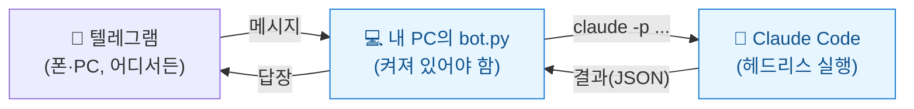
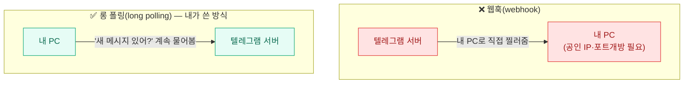
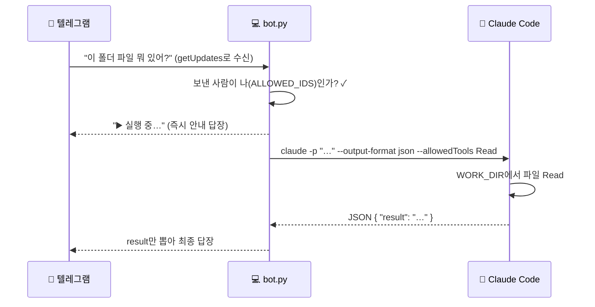
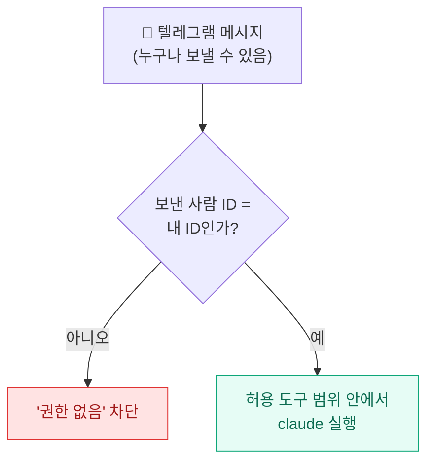
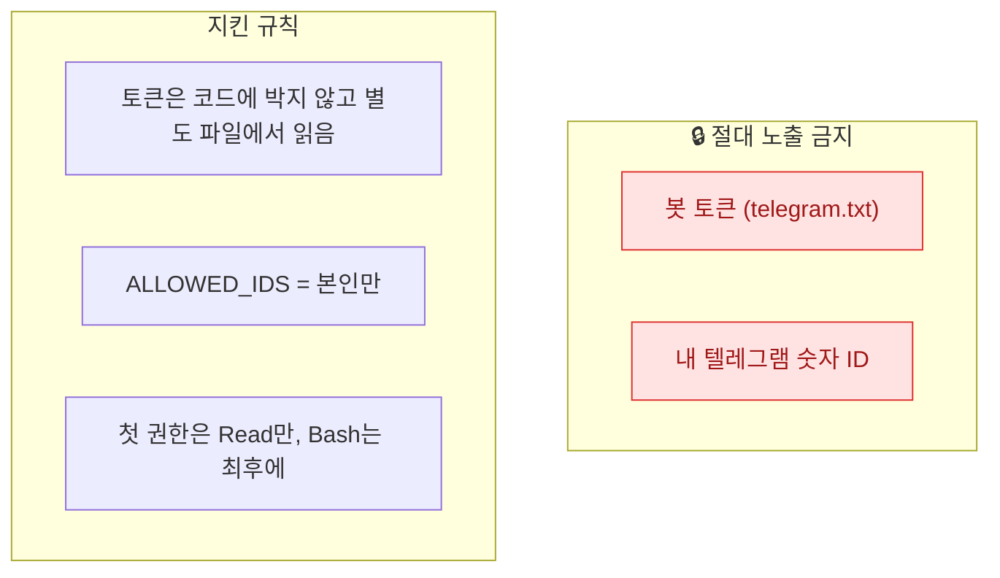
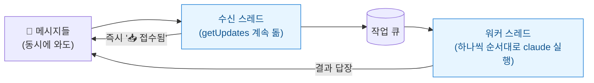
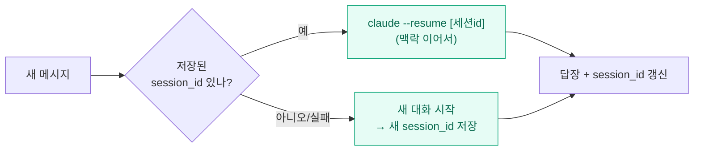

문득 궁금했다. **카톡 보내듯 메신저로 한 줄 던지면, 집에 켜둔 내 PC의 Claude Code가 알아서 일하고 답을 보내주게 할 수 있을까?**

밖에 있을 때 "그 폴더에 무슨 파일 있더라?" 같은 걸 폰으로 물어보고 답을 받으면 편하겠다 싶었다. 그래서 오늘 **텔레그램 봇 ↔ Claude Code**를 이어 붙여 봤다. 결론부터 말하면 됐고, 생각보다 부품이 단순했다. 그 과정을 적는다.

> ⚠️ 이 글의 토큰·ID·경로는 전부 **예시 플레이스홀더**다. 봇 토큰·내 텔레그램 숫자 ID 같은 실제 값은 한 글자도 싣지 않는다(이유는 마지막 '보안'에서).

## 한눈에 — 메신저 한 줄이 내 PC에서 Claude Code가 되기까지



핵심은 가운데 **bot.py**라는 중계기다. *"텔레그램을 계속 지켜보다가, 메시지가 오면 그걸 Claude Code 명령으로 실행하고 답을 돌려주는 다리"*. 그래서 이 bot.py가 **켜져 있는 동안에만** 작동한다 — 창을 닫거나 PC를 끄면 봇도 같이 잠든다.

### 명령은 어디서 보내든 똑같이 작동한다 — 웹·데스크탑·모바일

기분 좋은 점 하나. **명령을 어느 텔레그램에서 보내든 결과는 같다.** 같은 텔레그램 계정이기만 하면 되니까, 입력 창구는 셋 다 열려 있다.

| 창구 | 설명 |
|---|---|
| 📱 **모바일 앱** | 폰에서 평소 메신저 쓰듯 |
| 🖥️ **PC 데스크톱 앱** | 책상에서 바로 |
| 🌐 **텔레그램 웹** | 설치 없이 브라우저에서 — `https://web.telegram.org/a/` |

어디서 말을 걸든 **실제로 일하는 건 집에 켜둔 그 PC 하나**다. 그래서 밖에서 폰으로 던진 명령도, 카페에서 브라우저로 연 텔레그램 웹에서 던진 명령도, 결국 내 PC의 Claude Code가 받아 처리하고 답을 돌려준다. (조건은 단 하나 — 그 PC가 켜져 있을 것.)

## 그래서 '봇'이라는 게 대체 뭔가?

처음엔 "봇 = 어렵게 서버 띄우는 것"인 줄 알았는데 아니었다.

- 텔레그램 **봇(bot)** 은 사람이 아니라 **프로그램이 조종하는 텔레그램 계정**이다.
- 텔레그램은 봇 조종용 **HTTP API**를 공개해 둔다. 즉 봇을 다루는 건 전부 `https://api.telegram.org/bot<토큰>/<메서드>` 같은 **평범한 웹 요청**이다.
- 그 API를 쓰려면 **토큰**이 필요하고, 토큰은 `@BotFather`(텔레그램 공식 봇)가 발급한다.

여기서 **토큰(token)** 은 *"이 봇을 조종할 권한이 있는 열쇠"* 라고 보면 된다. 비밀번호와 같아서, 이게 새면 남이 내 봇을 조종한다.

```
나:        /newbot
BotFather: 봇 이름은?
나:        MyClaudeCodeBot
BotFather: 사용자명은? (반드시 bot 으로 끝나야 함)
나:        <내봇이름>_bot
BotFather: Done! 토큰: 1234567890:AAF...   ← 이게 열쇠
```

이 시점엔 "봇이 존재한다"만 등록될 뿐, **봇은 아직 아무것도 못 한다.** 토큰만 있고, 그 토큰으로 일할 "두뇌"(내 PC의 bot.py)가 없기 때문이다.

## 봇은 메시지를 어떻게 받나? — 웹훅 말고 '롱 폴링'

봇이 메시지를 받는 길은 둘이다. 이 선택이 "집 PC에서 그냥 돌릴 수 있느냐"를 갈랐다.



- **웹훅**: 텔레그램이 내 서버 주소로 직접 찾아와 메시지를 꽂아준다. 그러려면 **공인 IP나 도메인, 포트 개방**이 필요하다 → 집 PC엔 부적합.
- **롱 폴링**: 내 PC가 텔레그램에게 *"새 메시지 있어?"* 를 계속 물어본다. 내가 능동적으로 접속하니 **공인 IP도 포트 개방도 필요 없다.** 그래서 그냥 집 PC에서 돌아간다.

bot.py는 이 롱 폴링을 무한 반복한다. 한 바퀴는 이렇다.

```
bot.py 무한 루프:
  1. 텔레그램에 "새 메시지 있어?"        → getUpdates
  2. 새 메시지가 오면 꺼냄
  3. 보낸 사람이 나(ALLOWED_IDS)인지 확인
  4. 메시지를 claude 명령으로 실행          → subprocess
  5. 결과를 텔레그램으로 답장               → sendMessage
  6. 다시 1번으로
```

메시지를 받는 쪽 코드의 핵심은 `getUpdates`와 `offset`이다.

```python
resp = requests.get(f"{API}/getUpdates",
                    params={"offset": offset, "timeout": 30})  # 30초까지 기다림(롱폴링)
updates = resp.json().get("result", [])
```

여기서 **offset** 이 영리하다. *"이 번호까지는 이미 처리했어"* 를 텔레그램에 알려, **같은 메시지를 두 번 실행하지 않게** 막는 장치다. 메시지마다 `update_id`가 붙어 있고, 처리할 때마다 `offset = update_id + 1`로 올린다.

## 텔레그램 메시지가 어떻게 'Claude Code 실행'이 되나?

여기가 이 봇의 심장이다. 답은 의외로 평범하다 — **파이썬이 마치 사람이 터미널에 친 것처럼 `claude` 명령을 새 프로세스로 실행**한다(`subprocess`).

```python
def run_claude_code(prompt: str) -> str:
    cmd = [
        CLAUDE_BIN, "-p", prompt,            # -p = 헤드리스(대화창 없이 1회 실행)
        "--output-format", "json",           # 결과를 JSON으로
        "--permission-mode", "acceptEdits",  # 옆에서 y/n 눌러줄 사람이 없으니 자동 승인
        "--allowedTools", ALLOWED_TOOLS,     # 쓸 수 있는 도구 화이트리스트 (예: Read)
    ]
    r = subprocess.run(cmd, cwd=WORK_DIR, capture_output=True, text=True,
                       encoding="utf-8", errors="replace", timeout=600,
                       stdin=subprocess.DEVNULL)
    return json.loads(r.stdout).get("result")
```

한 줄씩 풀면 이렇다.

- **`claude -p "..."`**: `-p`(=print)는 *대화형 UI 없이 딱 한 번 실행하고 결과만 내놓는* **헤드리스 모드**. 봇처럼 자동으로 부르기에 딱이다.
- **`--output-format json`**: 답을 JSON으로 받는다. 그래야 코드가 답을 안정적으로 꺼낸다. 실제 답변 텍스트는 그 JSON의 **`result`** 키에 들어 있다.
- **`--permission-mode acceptEdits`**: 평소 Claude는 파일을 고치기 전에 "해도 돼?"라고 묻는다. 봇 환경엔 눌러줄 사람이 없으니 **편집을 자동 승인**한다. (이게 없으면 영원히 멈춰 답이 안 온다.)
- **`--allowedTools`**: Claude가 쓸 수 있는 도구를 **화이트리스트로 제한**한다. 보안의 핵심.
- **`cwd=WORK_DIR`**: Claude가 **어느 폴더에서** 일할지. 텔레그램에서 "이 폴더"라고 하면 이 폴더를 가리킨다.
- **`stdin=subprocess.DEVNULL`**: 입력을 막아, claude가 stdin을 몇 초 기다리는 지연을 없앤다.
- **`timeout=600`**: 10분 넘으면 강제 종료 → 봇이 영영 멈추는 걸 방지.

그리고 답을 보내는 건 `sendMessage` 한 줄이다.

```python
def send(chat_id, text):
    requests.post(f"{API}/sendMessage",
                  json={"chat_id": chat_id, "text": text[:4000]})  # 4096자 제한
```

`chat_id`는 받은 메시지에서 꺼낸 값이라, 결국 **"보낸 사람에게 그대로 답장"** 이 된다.

## 전체를 한 흐름으로 다시 보면



이 1~6번이 **메시지 하나당 한 번** 일어나고, bot.py는 이걸 무한히 반복한다. 그래서 "봇이 켜져 있는 동안"은 계속 받아 처리할 수 있다. 결국 이 구조가 가능한 건 세 가지가 맞물려서다.

- 텔레그램이 **봇용 HTTP API**를 공개해 둠 → 프로그램으로 메시지를 주고받는다.
- Claude Code가 **헤드리스 모드(`-p` + JSON)** 를 지원함 → 사람 개입 없이 호출하고 결과를 받는다.
- 파이썬 **`subprocess`** 가 둘 사이의 다리가 됨 → "메시지 → 실행 → 회신"이 자동화된다.

## 아무나 못 쓰게 — 출입은 ID 하나로 막는다

이게 제일 중요했다. 텔레그램 봇은 **사용자명만 알면 누구나** 메시지를 보낼 수 있다. 그런데 이 봇은 내 PC에서 파일을 읽고 명령을 실행하니, 아무나 쓰게 두면 그대로 사고다.

```python
if user_id not in ALLOWED_IDS:   # ALLOWED_IDS = {<내_텔레그램_숫자ID>}
    send(chat_id, "권한 없음")
    continue
```

보낸 사람의 숫자 ID가 **내 ID일 때만** 통과시킨다. 이게 **유일한 출입 통제**다(절대 비우거나 넓히면 안 된다). 내 텔레그램 숫자 ID는 `@userinfobot`에게 `/start`를 보내면 알려준다.



## 권한은 어디까지 줄까? — Read → Edit → Bash 단계적으로

`ALLOWED_TOOLS` 한 줄을 바꾸고 봇을 재시작하면 권한이 넓어진다. 나는 **읽기만(Read)** 으로 시작했다.

| 단계 | `ALLOWED_TOOLS` | 할 수 있는 일 | 위험도 |
|---|---|---|---|
| 1 (시작) | `"Read"` | 파일 읽기만 | 낮음 |
| 2 | `"Read,Edit"` | 파일 수정까지 | 중간 |
| 3 | `"Read,Edit,Bash"` | 셸 명령 실행까지 | **높음** |

> ⚠️ **`Bash`는 가장 마지막에, 꼭 필요할 때만.** 텔레그램으로 들어온 글이 그대로 내 PC의 셸 명령이 되므로 위험도가 급상승한다. `--permission-mode acceptEdits` 때문에 편집은 자동 승인된다는 점도 기억하자 — 편리한 만큼 통제는 `ALLOWED_TOOLS`와 `ALLOWED_IDS`에 달려 있다.

## 삽질: python이 'Python'만 찍고 그냥 죽었다

순탄하진 않았다. `python bot.py`를 돌렸더니 **출력에 `Python`만 한 줄 찍히고 즉시 종료**(exit code 49)됐다. 한참 헤맸는데 원인이 허무했다.

윈도우에서 `python`이 **마이크로소프트 스토어의 가짜 스텁**(`...\WindowsApps\python.exe`)을 먼저 가리키고 있었던 것. 이건 진짜 파이썬이 아니라 "스토어로 안내하다 아무것도 안 하고 끝나는" 껍데기였다.

```bash
# ❌ 'python' → 스토어 스텁이 잡혀 아무 일도 안 일어남
# ✅ 진짜 파이썬(Anaconda) 풀경로로 실행
"C:\Users\<사용자>\anaconda3\python.exe"  "...\codex_capcut\bot.py"
```

그래서 더블클릭용 배치 파일(`봇실행.bat`)에 이 **풀경로**를 박아 뒀다. 이러면 더블클릭만으로 진짜 파이썬이 봇을 띄운다. (이 스토어 스텁 함정은 전에도 다른 작업에서 만난 적이 있다 — 윈도우에서 파이썬 자동화할 때 단골 함정이다.)

## 보안 — 토큰은 비밀번호다

봇이 강력한 만큼, 새면 위험한 것도 분명하다. 비밀과 공개의 경계를 이렇게 그었다.



- **토큰이 채팅·로그·코드에 노출되면** 즉시 `@BotFather → /revoke`로 재발급한다.
- ⚠️ **함정 하나**: 토큰 파일(`telegram.txt`)이 작업 폴더(`WORK_DIR`) 안에 있으면, 나중에 `Read`/`Bash` 권한을 켜고 "폴더 파일 다 읽어줘" 했을 때 **봇이 자기 토큰을 읽어 답으로 뱉을 수 있다.** → 토큰 파일은 작업 폴더 **밖**으로 옮기고 경로를 고치는 게 안전하다.
- `ALLOWED_IDS`가 유일한 출입 통제다. 비우거나 넓히지 말 것. 이 봇은 **외부에 노출하지 말고 개인 PC에서 본인만** 쓴다.

## 비용은? — 공짜가 아니다

Claude Code를 부를 때마다 **API 토큰 비용이 발생**한다. 내 경우엔 *간단한 질문 1회에 약 0.19달러(약 250원)* 정도가 나왔다(고성능 모델이라 단가가 높은 편이다). 텔레그램으로 한 줄 던질 때마다 과금되니, 테스트는 가볍게 하는 게 좋다.

## 그래서 'v2'로 키웠다 — 동시처리·맥락유지·로그·명령어

첫 버전(읽기 전용, 한 번에 하나)이 잘 도니까 욕심이 났다. "다음에 할 것"으로 적어둔 걸 **실제로 bot.py v2에 넣었다.** 핵심은 네 가지.

| 기능 | 무엇이 좋아졌나 |
|---|---|
| **작업 큐 + 워커 스레드** | 명령이 동시에 와도 **순서대로**, 받는 쪽은 안 멈춤(보내면 즉시 `📥 접수됨`) |
| **대화 맥락 유지** | `session_id`를 저장해 `--resume`로 **이어서 대화**. 실패하면 자동으로 새 대화 재시도 |
| **파일 로그** | `bot.log`에 기록 → **창 없이 돌릴 때 디버깅** |
| **특수 명령** | `/new`(맥락 초기화), `/status`(대기열·맥락 확인) |

> 안전 설정은 그대로다 — `ALLOWED_TOOLS = "Read"`, 본인 ID만 허용. 기능은 키우되 **출입과 권한은 좁게**.

### 동시에 와도 안 엉키게 — 받는 일과 하는 일을 나눴다

v1은 메시지 하나를 처리하는 동안 다음 메시지를 못 받았다. 그래서 **받는 스레드**와 **실행하는 워커 스레드**를 나누고, 그 사이를 **작업 큐**로 이었다.



받는 쪽은 멈추지 않고 계속 접수만 하고, 실제 실행은 워커가 큐에서 하나씩 꺼내 처리한다. 그래서 연달아 보내도 **순서가 보장되고**, 보내자마자 "접수됨" 응답이 온다.

### 한 번 답하고 끝이 아니라 — 이어서 대화

`-p` 헤드리스는 기본적으로 매번 '새 대화'다. 그래서 직전 대화의 **`session_id`를 저장**해 두고, 다음 메시지에 `--resume`로 이어 붙였다.



이러면 *"1~10 더하는 코드 짜줘"* → *"그거 한 줄로 줄여줘"* 처럼 **이어지는 대화**가 된다. 새로 시작하고 싶으면 `/new`로 맥락을 비운다.

### 켤 때 두 가지 — 창 보임 vs 조용히

```
codex_capcut\
├─ bot.py                      ← v2 (큐 + 맥락 + 로그)
├─ telegram.txt                ← 토큰(비밀)
├─ 봇실행.bat                  ← 검은 창 O (디버깅용)
├─ 봇실행_조용히.bat           ← 창 없이 백그라운드 (pythonw, 신규)
├─ bot.log                     ← 실행하면 생성
└─ 텔레그램_클로드봇_가이드.md  ← 전체 가이드
```

평소엔 **`봇실행_조용히.bat`**(`pythonw.exe`)으로 창 없이 백그라운드로 돌리고, 이상하면 `bot.log`를 본다. 디버깅이 필요할 땐 검은 창이 보이는 `봇실행.bat`으로 켠다.

## 그다음 단계 — 상시 운영, 그리고 권한 넓히기

여기까지 오면 자연스러운 운영 순서는 이렇다.

1. `봇실행.bat`으로 켜서 **첫 테스트**(`이 폴더 파일 뭐 있어?`)
2. `/status`, `/new` 보내보기
3. **맥락 유지 확인** — "1~10 더하는 코드" → "그거 한 줄로 줄여줘"
4. 잘 되면 권한을 **`Read,Edit`** 로 한 칸 확대
5. `봇실행_조용히.bat` + **PC 부팅 시 자동 시작**(시작프로그램/작업 스케줄러)으로 **상시 운영**

마지막 '자동 시작'까지 걸면, 사실상 *"폰으로 말 걸면 늘 받아주는 내 PC 비서"* 가 된다.

---

만들고 나서 든 생각은, **이게 결국 'Claude Code의 헤드리스 모드 + 메신저 API'를 subprocess로 이어 붙인 것뿐**이라는 거였다. 거창한 서버도, 공인 IP도 없이 — 집 PC와 폰만으로 "메신저로 말 걸면 내 AI 코딩 도구가 일하는" 구조가 성립했다. 권한을 `Read`부터 한 칸씩 올리며, 편한 만큼 위험한 부분(토큰·Bash)을 어디서 통제하는지를 손으로 더듬어 본 하루였다.

> 안전: 이 글에는 실제 봇 토큰·텔레그램 ID·전체 경로 같은 비밀값을 일절 싣지 않았다. 전부 일반화된 예시이며, 봇은 개인 PC에서 본인만 쓰는 용도다.

<!-- 안전: 회사 실데이터·제3자 PII·실제 토큰/ID/경로 없음. 봇 토큰·텔레그램 숫자 ID·봇 사용자명·C:\Users 실경로는 전부 플레이스홀더로 일반화. 비용 $ → '달러'로 표기(KaTeX 회피). -->
