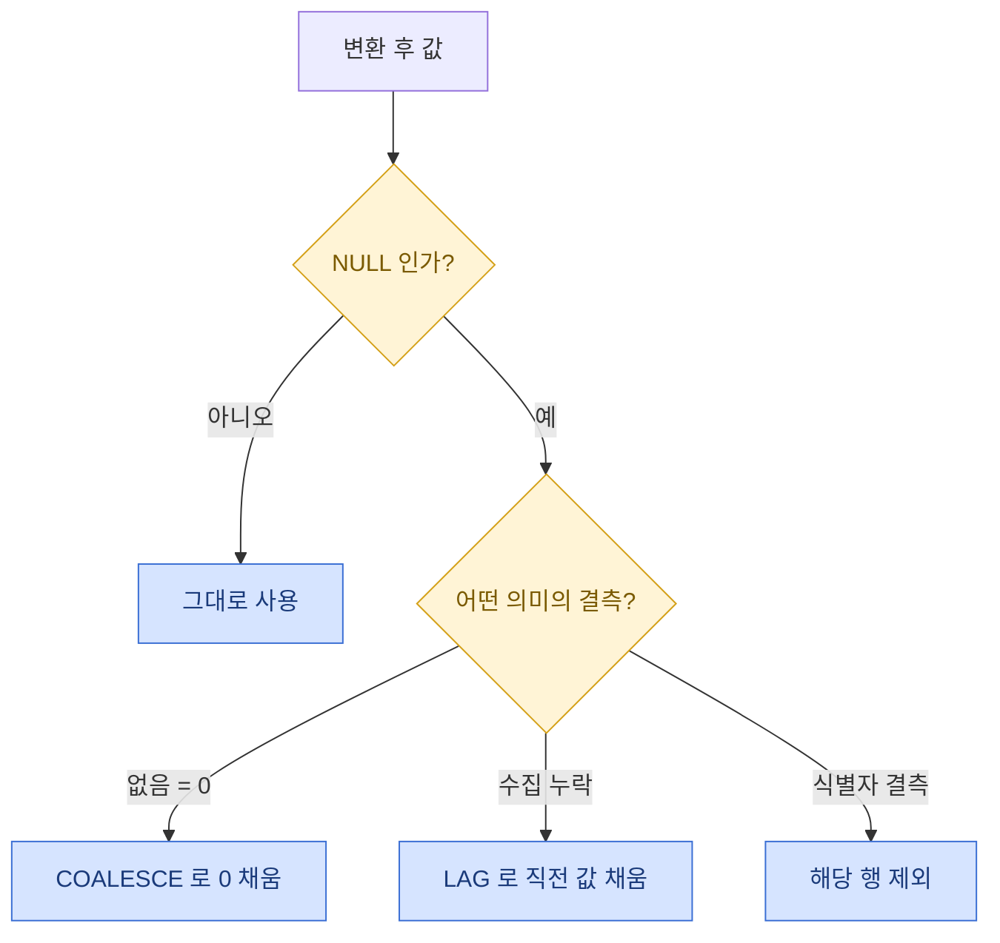

> 크롤링한 데이터는 예쁘게 안 온다. 그래서 나는 원본을 절대 바로 집계하지 않는다 — 일단 임시테이블에 부려놓고 한 번 씻긴다.

크롤러를 돌려서 데이터를 긁어오면 항상 같은 문제를 만난다. 숫자여야 할 컬럼에 `"1,240"`, `"12개"`, `"-"`, 빈 문자열이 뒤섞여 들어온다. 이걸 바로 `SUM`이나 `AVG`에 넣으면 쿼리가 터지거나, 더 무서운 건 조용히 틀린 숫자가 나온다. 오늘은 내가 크롤링 원본을 받으면 습관처럼 거치는 **임시테이블 전처리 레시피**를 정리해둔다. 아래 스키마·수치는 전부 설명용 합성 더미다.

## 왜 원본을 바로 집계하면 안 될까?

크롤링 원본과 분석용 데이터는 성격이 다르다. 원본은 "웹에 보이던 모양 그대로"라서 타입이 제각각이고, 분석용은 "숫자는 숫자, 날짜는 날짜"로 타입이 정돈돼 있어야 한다. 이 둘 사이에 완충 지대를 하나 두는 게 임시테이블(staging table)이다. 원본을 그대로 받되, 정제는 여기서 다 끝내고 깨끗한 것만 다음 단계로 넘긴다.


이렇게 단을 나누면 좋은 점이 하나 더 있다. 정제 로직이 틀렸을 때 원본은 그대로 남아 있으니, staging만 지우고 다시 돌리면 된다. 원본을 덮어쓰지 않는다는 원칙 하나로 밤에 발 뻗고 잔다.

## 문자열을 숫자로 바꿀 때 왜 CAST 대신 TRY_CONVERT를 쓸까?

가장 흔한 작업이 문자열 컬럼을 정수로 바꾸는 것이다. 그냥 `CONVERT(BIGINT, price)`를 쓰면 값이 전부 깨끗할 때는 잘 되지만, 딱 한 줄에 `"-"`나 `"품절"` 같은 게 섞여 있으면 쿼리 전체가 에러로 죽는다. 크롤링 데이터에서 이런 오염은 예외가 아니라 기본값이다.

그래서 나는 `TRY_CONVERT`를 쓴다. 변환에 실패하면 에러 대신 `NULL`을 돌려주기 때문에, 나쁜 값 한두 줄 때문에 전체가 멈추지 않는다. 게다가 변환에 실패한 행이 곧 "오염된 행"이라, 나중에 따로 세어보기도 좋다.

정제 전후를 비교하면 이런 그림이다.

| 원본 문자열 | 문제 | TRY_CONVERT 결과 | 최종 처리 |
| --- | --- | --- | --- |
| `"1240"` | 정상 | 1240 | 1240 |
| `"1,240"` | 천 단위 콤마 | NULL | REPLACE로 콤마 제거 후 1240 |
| `"12개"` | 단위 문자 섞임 | NULL | 숫자만 추출해 12 |
| `"-"` | 결측 표시 | NULL | 0 또는 직전 값으로 대체 |
| `""` | 빈 문자열 | NULL | 0으로 대체 |

핵심은 순서다. **콤마·단위 같은 노이즈를 `REPLACE`로 먼저 벗겨낸 다음** `TRY_CONVERT`를 태운다. 순서를 바꾸면 멀쩡히 살릴 수 있던 `"1,240"`까지 NULL이 돼서 버려진다. 살릴 수 있는 값은 최대한 살리고, 정말 못 쓰는 것만 NULL로 떨군다는 감각이 중요하다.

```sql
-- 합성 더미 예시: 원본 raw_items 를 staging_items 로 정제
SELECT
    item_key,
    -- 콤마/단위를 먼저 제거하고 나서 변환 시도
    TRY_CONVERT(BIGINT, REPLACE(REPLACE(price_raw, ',', ''), '원', '')) AS price_clean,
    price_raw  -- 원본은 감사용으로 남겨둔다
INTO #staging_items
FROM raw_items;
```

## 예외값(NULL·이상치)은 어떻게 대체할까?

변환을 마치면 이제 NULL이 남는다. NULL을 그대로 두면 집계에서 조용히 빠지거나 계산이 어긋나므로, 의미에 맞게 채워준다. 상황마다 규칙이 다르다.

- **0이 자연스러운 경우**: 재고·판매량처럼 "없음 = 0"이면 `COALESCE(값, 0)`으로 0을 채운다.
- **직전 값으로 채우는 경우**: 시계열에서 그날 수집이 비었을 때, 바로 앞 시점 값으로 메운다. `LAG(값) OVER (PARTITION BY 대상 ORDER BY 날짜)`로 직전 값을 끌어와 NULL 자리에 넣는다. 온도·환율처럼 급변하지 않는 값에 잘 맞는다.
- **아예 버리는 경우**: 키 컬럼(식별자)이 비면 그 행은 신뢰할 수 없으니 제외한다.

그리고 나눗셈이 있으면 분모를 반드시 `NULLIF`로 감싼다. `합계 / NULLIF(건수, 0)`처럼 쓰면 건수가 0일 때 에러(0으로 나누기) 대신 NULL이 나와서 리포트가 우아하게 빈칸이 된다. 이 습관 하나로 "왜 대시보드가 빨갛게 죽었지" 하는 새벽 알람을 여러 번 피했다.



## 같은 걸 두 번 긁어왔을 땐?

크롤러를 재시도하거나 페이지가 겹치면 같은 항목이 두 번 이상 들어온다. 이걸 못 잡으면 건수와 금액이 그대로 뻥튀기된다. 나는 임시테이블 안에서 `ROW_NUMBER`로 중복을 접는다.

```sql
-- 같은 item_key 중 수집시각이 가장 최신인 행만 남긴다
WITH ranked AS (
    SELECT *,
           ROW_NUMBER() OVER (
               PARTITION BY item_key
               ORDER BY collected_at DESC
           ) AS rn
    FROM #staging_items
)
SELECT * INTO #clean_items FROM ranked WHERE rn = 1;
```

`PARTITION BY`에 "같으면 안 되는 기준"(여기선 항목 키)을 넣고, `ORDER BY`로 "여럿 중 남길 우선순위"(최신 수집분)를 정한 뒤 `rn = 1`만 남긴다. 어떤 걸 대표로 남길지는 데이터 성격에 따라 최신·최고가·최초 등으로 바꾼다. 이 한 단계를 staging에서 끝내두면, 뒤에서 아무리 `SUM`을 해도 숫자가 부풀지 않는다.

## 전체 레시피를 한 흐름으로

정리하면 임시테이블 전처리는 늘 같은 4박자다.

| 단계 | 하는 일 | 대표 도구 |
| --- | --- | --- |
| 1. 적재 | 원본을 손대지 않고 staging에 복사 | `SELECT ... INTO #staging` |
| 2. 변환 | 노이즈 제거 후 타입 변환 | `REPLACE` + `TRY_CONVERT` |
| 3. 대체 | 결측·이상치를 규칙대로 채움 | `COALESCE`, `LAG`, `NULLIF` |
| 4. 중복 제거 | 대표 행만 남김 | `ROW_NUMBER` + `WHERE rn = 1` |

이 순서를 지키면 마지막 clean 테이블은 "타입이 정돈되고, 결측이 채워지고, 중복이 없는" 상태가 된다. 그 뒤의 집계 쿼리는 놀랄 만큼 짧아진다. 지저분한 로직이 전부 앞 단계로 빠졌기 때문이다.

## 마무리

크롤링 데이터를 다루며 배운 건, 정제를 어디서 하느냐가 유지보수를 절반쯤 결정한다는 것이다. 집계 쿼리 안에 `REPLACE`와 `TRY_CONVERT`를 잔뜩 끼워 넣으면 당장은 돌아가지만, 다음 달의 내가 그 쿼리를 다시 읽을 때 무슨 뜻인지 알 수가 없다. 정제는 staging에 몰아넣고, 집계는 깨끗한 걸 전제로 담백하게 쓰는 것 — 이 경계 하나가 1인 데이터 파이프라인을 오래 굴러가게 만든다. 원본은 절대 덮어쓰지 않기, 살릴 값은 최대한 살리기, 나눗셈 분모는 무조건 `NULLIF`. 이 세 개만 기억하면 새벽 알람이 확 줄어든다.

## 참고자료

- [[game-data-sql-recipes-retention-ltv]] — 윈도우 함수와 NULLIF로 리텐션·LTV를 쿼리 한 방에 뽑는 레시피
- [[game-metrics-7-definitions]] — 정제된 데이터 위에서 계산하는 핵심 지표 정의
- 관련 코드 모음: https://github.com/DBhyeong/game-data-recipes

<!-- 안전: 합성/더미 데이터, 회사·실데이터·PII 없음. -->
