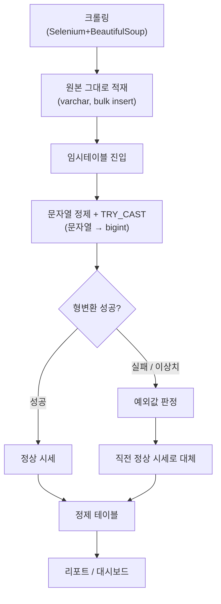
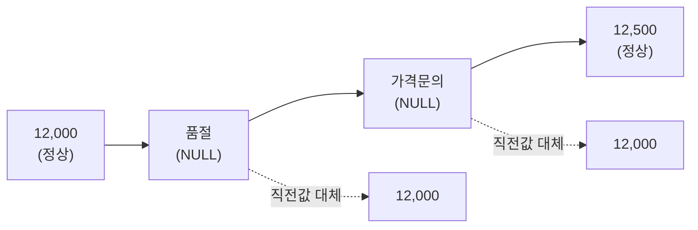

사이드 프로젝트로 게임 현금거래 시세를 매일 크롤링해 모으던 시절, 첫 몇 주는 그래프가 자꾸 이상하게 튀었다. 시세가 하루 만에 0으로 꺼지거나 말도 안 되는 값으로 치솟았다. 로그를 열어보니 문제는 시세 자체가 아니라 **문자열**이었다. "1,250,000원"처럼 쉼표와 단위가 붙은 텍스트, "품절"·"가격문의"처럼 아예 숫자가 아닌 문자가 숫자 컬럼 자리에 그대로 들어와 있었다.

처음엔 크롤러 쪽 파싱을 고치면 끝날 줄 알았다. 그런데 고치고 나면 다음 주에 사이트 구조가 또 바뀌어 새로운 예외 패턴이 튀어나왔다. 크롤러를 예외 케이스에 맞춰 계속 방어 코드로 두껍게 만들수록, 정작 하나가 안 잡히면 그날 수집 전체가 죽는 위험만 커졌다. 그러다 깨달았다. **적재는 관대하게 받고, 정제는 DB의 임시테이블에서 하면 된다.** 크롤러는 실패해도 괜찮은 텍스트 그대로 던지고, 숫자로 만드는 책임은 DB 쪽 한 단계에 몰아주는 것이다.

크롤링은 대상 사이트의 robots.txt와 이용약관을 먼저 확인하고, 요청 사이에 딜레이를 둬 레이트리밋을 지키며 돌렸다. 이 글에서 다루는 건 그렇게 모은 원본이 DB 안에서 어떻게 숫자로 길들여지는지, 그 뒷단이다.



## 왜 크롤러가 아니라 임시테이블에서 숫자로 바꿨나?

크롤러의 책임은 "긁어서 넣는다"까지로 좁혔다. 원본 테이블 컬럼은 처음부터 varchar로 잡았다. 이렇게 하면 사이트에 어떤 이상한 텍스트가 붙어 있어도 적재 자체는 절대 실패하지 않는다.

```python
# 합성 예시. 실제 접속정보는 .env/환경변수로 관리.
import os
import pymssql

conn = pymssql.connect(
    server=os.environ["DB_SERVER"],
    user=os.environ["DB_USER"],
    password=os.environ["DB_PASSWORD"],
    database="market_watch",
    charset="utf8",       # 한글 인코딩 핵심
)
# 연결 옵션에서 codepage=65001(UTF-8) 정렬까지 맞춰야 한글이 안 깨진다
# price_text 컬럼은 varchar — 크롤링 원문을 가공 없이 그대로 bulk insert
```

숫자로 바꾸는 작업은 원본 테이블을 건드리지 않고 **임시테이블(#temp)** 위에서 했다. 원본은 항상 "크롤링한 그대로"로 남겨두고, 실패해도 다시 돌릴 수 있는 정제 로직만 임시테이블에서 굴리는 구조다. 정제 규칙이 바뀌어도 원본을 다시 크롤링할 필요가 없다는 게 이 분리의 실익이다.

## 문자열을 bigint로 바꿀 때 뭐가 걸렸나?

`CAST`를 그냥 쓰면 변환 실패 케이스 하나에 쿼리 전체가 에러로 죽는다. 그래서 실패를 허용하는 `TRY_CAST`로 바꾸고, 쉼표·단위 같은 잡음은 먼저 `REPLACE`로 걷어냈다.

```sql
-- 합성 스키마. 실제 테이블/사이트명 아님.
SELECT
    item_id,
    collected_at,
    TRY_CAST(
        REPLACE(REPLACE(price_text, ',', ''), '원', '')
    AS BIGINT) AS price_bigint
INTO #price_stage
FROM raw_price_log
WHERE collected_at >= @target_date;
```

`TRY_CAST`는 변환에 실패하면 에러 대신 `NULL`을 돌려준다. 이 `NULL`이 곧 "이 값은 예외"라는 신호가 된다. 여기에 하나 더, 형변환은 됐지만 0이거나 음수처럼 시세로 말이 안 되는 값도 같은 예외로 묶었다. 즉 예외값 판정 기준은 "숫자가 아님" 더하기 "숫자이긴 한데 말이 안 됨" 두 가지였다.

## 예외값은 왜 그냥 버리지 않고 직전 값으로 채웠나?

처음엔 예외값을 가진 행을 그냥 지웠다. 그런데 그래프에 구멍이 숭숭 뚫리니까 "그날 거래가 없었던 건지, 데이터가 깨진 건지" 리포트를 보는 사람이 매번 헷갈렸다. 그래서 바꾼 방식이 **직전 정상 시세로 채우기**였다. 시세는 짧은 시간 안에 크게 안 튀는 값이니, "값을 모르면 직전에 확인된 값과 같다고 가정한다"는 게 크게 틀리지 않는 근사였다.



구현은 윈도우 함수로 "그룹을 나눠서 채운다(forward-fill)" 트릭을 썼다. 정상값이 나올 때마다 그룹 번호를 하나씩 올리고, 같은 그룹 안에서는 그 그룹의 첫 정상값을 전체 행에 밀어 채운다.

```sql
-- 1) 정상값이 나올 때마다 그룹 번호 증가
SELECT
    item_id, collected_at, price_bigint,
    SUM(CASE WHEN price_bigint > 0 THEN 1 ELSE 0 END)
        OVER (PARTITION BY item_id ORDER BY collected_at
              ROWS BETWEEN UNBOUNDED PRECEDING AND CURRENT ROW) AS fill_grp
INTO #price_grp
FROM #price_stage;

-- 2) 같은 그룹의 정상값을 예외행까지 채운다 (직전 시세 대체)
SELECT
    item_id, collected_at,
    MAX(price_bigint) OVER (PARTITION BY item_id, fill_grp) AS price_final
FROM #price_grp
ORDER BY item_id, collected_at;
```

이 방식의 한계도 분명하다. 예외가 며칠씩 이어지면 그동안 진짜 시세가 움직였어도 그래프는 평평하게 나온다. 그래서 나는 이 대체값을 쓴 행에 별도 플래그(`is_filled`)를 남겨, 리포트에서 "이 구간은 추정치"라고 표시할 수 있게 해뒀다. 대체는 편의를 위한 근사이지, 사실을 조작하는 게 아니라는 걸 읽는 사람도 알아야 한다.

## 이 정제 과정을 매번 손으로 돌렸나?

아니다. 크롤링 → bulk insert → 임시테이블 정제까지가 하나의 배치였다. MS-SQL이 주력이었던 만큼, 이 반복되는 정제 단계는 결국 Stored Procedure로 묶어 매일 자동으로 돌렸다. 정제된 결과는 SMTP로 자동 리포트 메일을 보내고 Google Drive에 올린 뒤, Metabase 대시보드와 matplotlib 차트로 확인했다. 사람이 개입하는 지점은 "예외가 비정상적으로 많이 뜬 날" 알림을 받았을 때뿐이었다.

## 정리 — 더러운 로그는 버리지 말고 임시테이블에서 길들인다

- 크롤러는 **관대하게 적재**만 한다. varchar로 받아두면 파싱 실패로 수집 전체가 죽는 일이 없다.
- 형변환은 원본이 아니라 **임시테이블**에서, `TRY_CAST` + 문자열 정제(`REPLACE`)로 한다.
- 예외값(형변환 실패 + 말이 안 되는 값)은 지우지 않고 **직전 정상값으로 채운다**(forward-fill). 단, 대체 여부는 플래그로 남긴다.
- 반복되는 정제는 **Stored Procedure로 자동화**해서 사람은 예외 신호에만 반응한다.

크롤링이든 게임 로그든, 원본은 항상 지저분하다. 그걸 탓하기보다 "지저분함을 흡수하는 단계"를 파이프라인 중간에 하나 끼워두는 게 훨씬 실용적이라는 걸 이 사이드 프로젝트로 배웠다. 다음 글에서는 이렇게 정제된 데이터가 대시보드까지 가는 나머지 구간 — 자동 리포트와 시각화 — 을 정리한다.

- 현금시세 모니터링 파이프라인: [github.com/DBhyeong/game-data-analysis](https://github.com/DBhyeong/game-data-analysis)
