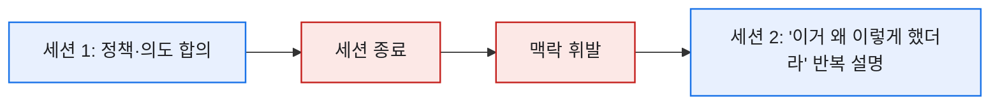
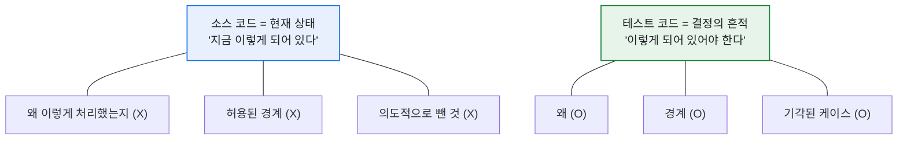
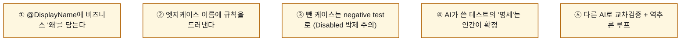

# 테스트 코드는 미래 세션의 AI가 읽는, 실행 가능한 프롬프트다

> 오진주 님의 글 **"AI 시대에 테스트 코드를 잘 쓰는 기준이 달라진다"**(2026-07-01)를 읽다가 한 문장에서 멈췄다. *"테스트 코드는 미래 세션의 AI가 읽는, 실행 가능한 프롬프트다."* Claude Code로 매일 일하는 나에게 이건 은유가 아니라 정확한 진단이었다. 이 글은 그 원문을 내 방식대로 도식으로 다시 세운 정리다. (관점과 예시는 원저자의 것이고, 나는 구조화만 얹었다.)

## 왜 갑자기 테스트의 '역할'이 하나 늘었나?

AI와 협업하면 반복되는 고통이 하나 있다. **세션이 끊기면 맥락이 날아간다.** 다음 세션에서 같은 설명을 또 해야 한다.



- "이 엔드포인트는 어떤 케이스를 커버해?"
- "tenantId 없을 때는 어떻게 처리하기로 했지?"
- "왜 여기서 이 예외를 먼저 잡았더라?"

예전의 테스트가 '이미 만든 기능이 망가지지 않게 지키는 안전장치'였다면, AI와 협업하는 지금은 **세션 사이에 사라지는 맥락을 붙잡아 두는 장치**이기도 하다는 것. 이게 원문의 핵심 통찰이다.

## 왜 하필 '테스트'가 맥락 전달에 제일 적합한가?

맥락을 담을 후보는 셋인데, 결정적 차이는 **코드와의 동기화가 강제되는가**다.

| 후보 | 동기화 | 한계 |
|---|---|---|
| 주석 | ❌ 강제 안 됨 | 코드가 바뀌어도 조용히 남아 거짓말이 됨 |
| README | ❌ 강제 안 됨 | 함수 단위 의도를 담기엔 입자가 너무 큼 |
| **테스트 코드** | ✅ **CI에서 실패로 강제** | (아래 '한계' 참고) |

테스트는 기대와 구현이 어긋나면 **깨진다.** 주석은 어긋나도 침묵하지만 테스트는 신호를 보낸다. 그래서 테스트가 가장 동기화 압력이 강한 명세서다. 다만 원저자도 정직하게 짚듯, 이게 "항상 최신 정책"을 보장하진 않는다. 정책이 바뀌었는데 테스트와 구현이 **둘 다** 옛 정책에 묶여 있으면 테스트는 태평하게 통과한다. 테스트가 강제하는 건 "과거에 합의한 기댓값을 현재 코드가 유지하는가"까지다.

## 소스 코드를 읽으면 되지 않나?

가장 그럴듯한 반론이다. "AI가 소스를 직접 읽는데 왜 테스트가 필요해?" 그런데 소스에는 세 가지가 안 담긴다.



소스는 "무엇"을 보여주지만 "왜"는 안 보여준다. "현재 이렇게 돈다"는 보여줘도 "이 경계까지만 허용된다"는 안 보여준다. 그리고 "예전에 논의했다 뺀 케이스"의 흔적은 소스 어디에도 없다. **소스는 현재 상태, 테스트는 결정의 흔적.** AI에게 소스는 "지금 이렇다"를, 테스트는 "이렇게 되어 있어야 한다"를 알려준다.

## @DisplayName에 '왜'를 담는다는 건?

원문의 멀티테넌트 예시가 특히 좋았다. 다른 테넌트의 문서를 조회하면 권한 에러가 아니라 **`DOCUMENT_NOT_FOUND`** 를 던진다. 문서는 실제로 존재하는데도.

```java
@Test
@DisplayName("다른 테넌트의 문서 조회 시 DOCUMENT_NOT_FOUND 에러가 발생한다")
void findByIdWrongTenant() {
    // 문서는 실제로 존재함 (tenant-a 소유)
    when(documentRepository.findById("doc-1"))
            .thenReturn(Mono.just(testDocument("tenant-a")));

    StepVerifier.create(documentService.findById("tenant-b", "doc-1"))
            .expectErrorMatches(e -> e instanceof BusinessException be
                    && be.getErrorCode() == ErrorCode.DOCUMENT_NOT_FOUND)
            .verify();
}
```

이 한 테스트에 담긴 결정은 세 겹이다. ① 문서는 **실제로 존재**한다(모킹으로 실객체 반환) — DB에 없어서 NOT_FOUND가 아니다. ② 그런데도 **NOT_FOUND**를 던진다 — FORBIDDEN이나 ACCESS_DENIED를 고르지 않았다. ③ 권한 에러를 주면 "문서 ID가 존재한다"는 정보가 새니까, **존재 여부 자체를 숨기는** 정보 노출 최소화 정책이다.

그런데 원저자 스스로 지적하듯, 위 `@DisplayName`은 아직 약하다. '왜 권한 에러가 아니어야 하는지'가 이름에 없다. 한 단계 더 담으면 이렇게 된다.

```java
@Nested
@DisplayName("테넌트 격리 정책")
class TenantIsolationTest {
    @Test
    @DisplayName("다른 테넌트의 문서는 존재하더라도 정보 노출 방지를 위해 NOT_FOUND로 응답한다")
    void findByIdWrongTenant() { ... }
}
```

이러면 새 세션의 AI가 "이거 권한 에러로 바꾸는 게 명확하지 않나요?"라고 제안했을 때, **테스트 파일만으로 그 방향이 이미 기각됐음**을 안다. 이게 '실행 가능한 프롬프트'의 실체다. 그래서 잘 쓰는 기준에 항목이 하나 추가된다 — 기존의 커버리지·독립성·속도·명확한 실패 메시지에 더해, **"읽는 인간(인간 + AI)이 의도를 복원할 수 있는가."**

## 실천 항목 — 무엇을 바꿔야 하나?

원문이 제시한 다섯 가지를 내 언어로 정리하면 이렇다.



- **① 비즈니스 맥락**: 메서드 이름은 간결히, `@DisplayName`에 "왜 그렇게 동작해야 하는지"를 서술한다.
- **② 엣지케이스에 왜**: `createDuplicate`만으론 "중복이면 에러"까지다. "테넌트 내 이름 유일성 보장을 위해 중복 등록을 거부한다"라고 덧붙이면 비즈니스 규칙이 드러난다.
- **③ 뺀 케이스는 negative test**: 현재 정책상 거부할 입력은 `shouldRejectNegativeRetentionDays` 같은 negative test로 박제한다. `@Disabled`로 positive test를 박제하면 CI에서 안 깨져 썩고, AI에게 "언젠가 켤 기능"이라는 잘못된 신호를 준다. "검토했지만 기각"이라는 맥락은 테스트보다 **ADR·Jira·커밋 메시지**가 더 맞는 자리일 수 있다.
- **④ 명세는 인간이 확정**: given/when/then 세부는 AI가 써도, `@DisplayName`과 이름은 인간이 먼저 쓰거나 마지막에 검토해 확정한다. 여기를 AI에 위임하면 맥락이 아니라 현재 구현의 기계적 서술만 남는다. 리뷰 때 **테스트 diff를 소스 diff보다 먼저** 본다.

## 교차검증은 '얼마나 다른 AI인가'가 관건

같은 AI가 쓰고 같은 AI가 읽으면 확증 편향에 빠진다. 교차검증의 효과는 검증 주체가 얼마나 다른지에 달렸다.

| 검증 주체 | 효과 | 이유 |
|---|---|---|
| 다른 제품 모델 (Claude ↔ Gemini) | 큼 | 추론 습관·기본 가정이 다름 |
| 같은 제품 다른 세대 | 중간 | 일부 편향은 공유 |
| 같은 모델 새 세션 | 제한적 | 모델 고유 편향은 남음 |
| 같은 세션 "다시 봐줘" | 낮음 | 기존 맥락에 계속 끌려감 |

교차검증이 어려우면 **역추론 루프**가 대안이다. 테스트를 AI에게 주고 "이 테스트가 담은 비즈니스 규칙을 역으로 추론해봐"라고 시킨다. AI가 내가 의도한 '왜'를 못 맞히면, 그 테스트는 맥락 전달에 실패한 거다. **역추론 성공 여부가 곧 그 테스트의 맥락 전달력 자가 측정 지표**가 된다. 단, AI 교차검증은 리뷰어를 하나 더 추가하는 것이지 인간 리뷰를 대체하지 않는다.

## 그럼 테스트가 만능인가? — 한계

원문이 정직하게 짚은 한계도 그대로 옮겨둔다. ① **'왜 이 기능을 만들었나'**(PO/PM 협의 맥락)는 테스트가 아니라 문서·Jira의 몫이다. ② **박제된 결정에도 유효기간**이 있다 — 정책이 바뀌었는데 둘 다 옛 정책에 묶이면 테스트는 통과하고 AI는 그걸 현재 결정으로 오인한다. 그래서 "현 정책과 충돌하는 테스트 명세가 있는지"를 정기적으로 AI에게 검토받는 리팩토링 세션이 필요하다. ③ "Service는 Controller를 참조하지 않는다" 같은 **함수를 넘는 구조적 결정**은 개별 테스트로 담기 어렵고 ArchUnit 같은 아키텍처 테스트가 별도로 필요하다. ④ 의도를 담으려 지나치게 촘촘히 쓰면 작은 수정에도 테스트가 우수수 깨지는 **과잉 명세**의 경직성이 생긴다 — 맥락 전달력과 유연성 사이 균형은 여전히 각자의 판단이다.

## 오늘의 정리

AI 시대에 테스트를 안 써도 되는 게 아니라, **더 잘 써야 하는 이유가 하나 늘었다.** 이제 테스트 이름 한 줄, `@DisplayName` 한 줄이 인간뿐 아니라 미래 세션의 AI에게도 읽힌다. 그걸 의식하고 쓰면 테스트는 검증 도구를 넘어 **의도를 전달하는 프로토콜**이 된다. Claude Code로 세션을 오가며 같은 설명을 반복하던 나에게, 이 관점은 CLAUDE.md·스킬과 함께 '맥락을 코드에 박아두는' 또 하나의 자리를 알려줬다.

*원문: 오진주, "AI 시대에 테스트 코드를 잘 쓰는 기준이 달라진다"(2026-07-01). 관점·예시는 원저자의 것이며, 이 글은 그 내용을 도식으로 재구성한 정리입니다.*
