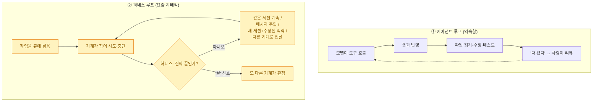
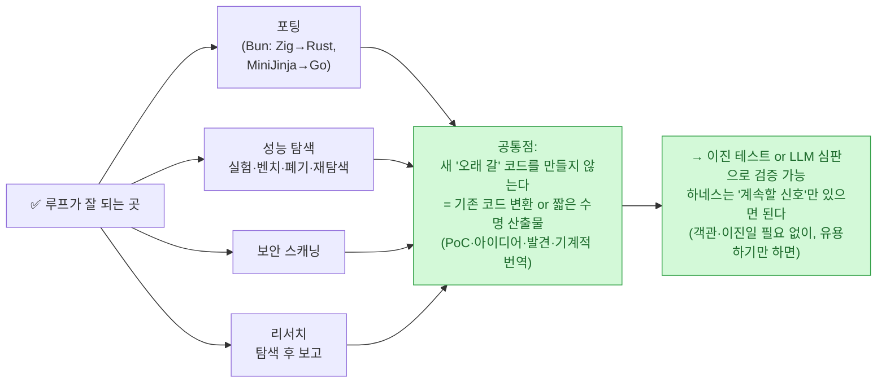

> **하네스 3부작** — ① [[planning-harness-detailed-spec-automation|기획 하네스]] · ② [[design-md-claude-design-portable-design-system|디자인 하네스]] · ③ [[claude-tag-multiplayer-agents|팀 하네스]] · **에필로그: 루프를 어떻게 통제하나(이 글)**

3부작을 여기까지 쓰고 나니, 스스로 좀 낙관적으로 흘렀다는 느낌이 들었다. "하네스를 깔면 자동화되고, 팀으로 확장되고, 검증도 에이전트가 한다"는 이야기만 하다 보면, 정작 **"그래서 우리는 우리가 만든 걸 여전히 이해하고 있나?"**라는 질문을 건너뛰게 된다.

그 질문을 정면으로 던지는 글을 오늘 읽었다. **Armin Ronacher**(Flask·Jinja를 만든, Sentry의 그 사람)가 6월 23일 쓴 **"The Coming Loop"**다. 코딩 에이전트 Pi에 깊이 관여하는 사람이 쓴, **루프에 대한 불편하지만 정직한 성찰**이다. 글은 Boris Cherny의 문장으로 시작한다:

> "나는 이제 Claude에 프롬프트하지 않는다. 루프를 돌려서 그 루프가 Claude에 프롬프트하고 뭘 할지 판단하게 한다. **내 일은 루프를 짜는 것이다.**"
> — Boris Cherny

## 두 개의 루프

먼저 용어를 정리하면, 루프는 두 층이다.

에이전트 루프는 오래 익숙하다 — 모델이 도구를 부르고, 결과를 반영하고, 결국 "다 됐다"고 말하면 사람이 리뷰한다. **하네스 루프는 그 바깥의 루프**다. 모델 혼자라면 "끝"이라 말했을 지점을 넘겨 **작업을 계속 살려 둔다.** Ronacher의 말대로, 이 바깥 루프가 최근 몇 주 트위터 담론을 지배하고 있다.

## 그가 "아직 잘 못 한다"고 말하는 지점

Ronacher는 솔직하다 — **자신이 깊이 아끼는 코드에는 이 방식이 잘 안 먹혔다**고. 이유는 두 가지, **취향(taste)과 통제(control)**. 그는 자기가 출시하는 코드를 **이해하고** 싶어 한다. 압박 속에서, 혹은 동료와 토론할 때, "먼저 기계에게 물어봐야" 설명할 수 있는 상태를 원치 않는다.

그가 짚는 현재 모델의 코드 습관이 뼈아프다:

- 너무 **방어적**이고, 너무 **복잡**하고, 추론이 너무 **국소적(local)**이다.
- **강한 불변식(invariant)을 피한다.** 나쁜 상태를 *불가능하게* 만드는 대신 **폴백을 덧붙인다.**
- 코드를 중복시키고, 나쁜 추상을 발명하고, 불명확한 설계를 더 많은 기계장치로 덮는다.

Karpathy의 표현을 빌리면 모델은 **"예외를 죽도록 무서워한다."** 하지만 중요한 불변식이 있는 시스템(특히 영속 데이터 포맷·핵심 인프라)에서 옳은 수정은 "모든 잘못된 경우를 처리"가 아니라 **"잘못된 경우를 애초에 표현 불가능하게 만드는 것"**이다.

> ⚠️ 그의 가장 도발적인 주장 하나 — **"요즘의 hands-off 하네스(예: ultracode를 켠 Claude Code)가 작년 가을보다 오히려 나쁜 코드를 만든다"**는 것. Fable 같은 설정이 30분 이상 사람 개입 없이 문제를 붙들기 때문이라고 본다. 이건 그의 **주관적 취향 평가**이지 벤치마크가 아니다(솔직히, 이 글도 그런 루프—워크플로·다중 에이전트—로 자료를 모아 쓰고 있어서 나는 이 비판을 남 일로 못 읽었다). 핵심 통찰은 이거다: **각 반복이 작은 방어를 더하면, 시스템은 더 견고해 보이면서 실제로는 점점 이해 불가능해진다.** hands-off일수록 이게 심해지고, 가이드 없이 주니어에게 쥐여주면 나쁜 관행을 가르친다.

## 그런데 루프가 정말 잘 되는 곳이 있다

동시에 그는 "루프가 안 된다"고 말하면 정직하지 못하다고 인정한다. **어떤 도메인에선 이미 놀랍게 잘 된다.**

포팅, 성능 실험, 보안 스캔, 리서치 — 이들의 **공통점**이 핵심이다. **새로 오래 갈 코드를 생성하지 않고, 이미 있는 코드를 변환하거나, 수명이 짧은 산출물(개념증명·아이디어·발견)을 낸다.** 기계적 번역은 이진 테스트로도, LLM 심판으로도 검증된다. **하네스는 다음 반복을 굴릴 '유용한 신호'만 있으면 되지, 그게 객관적이거나 이진일 필요는 없다.** 그도 하루의 지루한 실험·측정을 걷어내는 루프는 이미 사랑한다고 했다.

## 소프트웨어가 '기계'에서 '유기체'로

그가 좋아하는 은유가 인상적이었다 — **결정론적 기계에서 유기체로.** 그는 "기계를 이해하도록" 훈련받은 세대다. 늘 한 겹 벗겨 더 깊이 이해할 층이 있었고, 결정론을 향해 밀고, 새 엔지니어도 복잡한 코드베이스를 항해할 수 있게 설계하는 걸 자랑스러워했다.

그런데 이제는 **코드를 쓰는 것도, 진단·치료도** LLM이 한다. 프로덕션 이슈가 나면 첫 단계가 "기계가 로그를 읽고 근본 원인을 제안하고 패치를 올리는" 것이고, 그 패치를 **또 다른 기계가 리뷰해 때론 사람 감독 없이 main에 올린다.** 강력하지만 대가가 있다 — **우리는 시스템을 치료하고 모니터링하고 안정화하지만, 더는 예전처럼 이해하지는 못한다.** 분산 시스템을 이미 의사처럼 다루던 관행(증상 관찰→가설→검사 추가→처방→재관찰)이, LLM으로 훨씬 빠르고 깊게 밀린다.

## 빠져나갈 수도 없다

가장 불편한 대목. **완전히 기계 주도인 미래에서 '옵트아웃'이 선택지가 아닐 수 있다.**

- **보안**이 가장 분명하다. 내가 루프를 안 써도, **남들이 내 소프트웨어를 향해 루프를 돌린다.** 공격자든 보안 연구자든 기계를 계속 돌려 잡음과 진짜 이슈를 함께 쏟아낸다. curl의 Daniel Stenberg가 **대부분 AI가 생성한 보고서에 압도**되는 게 이미 그 예다. 공격·제보가 루프하면, **방어자도 결국 (최소한 분류·재현이라도) 루프해야** 따라간다.
- **경쟁**도 그렇다. 어떤 팀은 기계를 잘 오케스트레이션해 **5명이 예전 50명 몫**을 한다. 누군가 "저 제품처럼 만들어줘"를 루프로 돌려 비슷한 걸 내놓고, 사용자가 만족하면 — 그게 정말 중요하지 않은가?

## 새로운 의존

그가 가장 무섭다고 한 건 **새로운 방식의 의존**이다. 소프트웨어는 늘 도구에 의존했지만(그는 컴파일러를 돈 주고 사던 시절을 떠올린다), 이건 **일회성 지불이 아니라 상시 의존**이다. 지갑에 대한 의존만이 아니라 **인지적 의존.**

> 코드베이스가 루프로 만들어지고, 루프로 리뷰되고, 루프로 패치되고, 루프로 유지된다면 — **같은 급의 시스템에 더는 접근할 수 없을 때** 무슨 일이 벌어지나? 무역 제재로 최강 모델이 막히면? 비용이 감당 불가가 되면? **팀이 기계 없이 코드를 이해하는 마지막 능력마저 잃으면?**

그는 관찰한다 — 사람들이 **설명하지 못하는 코드를 머지**하고, 기계의 도움 없이는 이슈 리포트조차 못 쓰게 되고, 점점 **LLM이라는 간접층을 통해 대화**한다고. 우리는 인간이 유지할 수 없을 뿐 아니라 **"기계의 참여를 유지보수 모델의 일부로 전제하는"** 코드베이스를 만들고 있을지 모른다.

## 그래서 루프를 어떻게 통제하나

Ronacher의 결론은 체념도 예찬도 아니다. **"루프를 할 것이냐"는 이미 답이 정해졌다 — 할 것이다.** 진짜 질문은 이거다:

- 어떻게 **판단을 포기하지 않을 것인가**
- 어떻게 **좋은 엔지니어링의 규칙을 유지할 것인가**
- 어떻게 **책임 있는 사람이 계속 감독하게 할 것인가**
- 어떻게 **정신줄을 놓지 않도록 코드를 다시 설계할 것인가**

그는 단지 루프를 더 많이 오케스트레이션하는 걸론 부족하다고 본다. **변경을 장기적으로 읽을 수 있게(legible) 만들거나, 사람을 루프 안으로 다시 끌어들이는 영리한 방법**이 필요하다. 그가 Pi를 "신중하게" 끌고 온 것도 그래서다 — 자기 통제를 벗어난 기계 떼가 따라갈 수 없는 변경을 만드는 미래를 원치 않기에.

## 내 관점 — 3부작이 강조한 것과 정확히 만난다

읽고 나니, 이 에세이는 하네스 3부작의 **반대 극이 아니라 나머지 반쪽**이었다. 1~3부가 "하네스로 자동화·확장하라"였다면, 이 글은 **"그 하네스에 판단과 책임을 어떻게 남길 것인가"**다. 그리고 두 이야기는 같은 장치를 가리킨다:

| Ronacher의 우려 | 3부작이 이미 강조한 답 |
|---|---|
| 각 반복이 방어를 더해 이해 불가능해진다 | **검증 기둥**([[planning-harness-detailed-spec-automation|1부]]) · **Doer-Verifier**([[claude-tag-multiplayer-agents|3부]]) — maker≠checker |
| "끝" 신호가 또 다른 기계로 넘어가 사람이 messenger가 됨 | **human in the loop**(어려운 트레이드오프는 항상 사람) · **인간의 주의는 희소 자원**(3부 교훈4) |
| 오래 갈 코드엔 위험, 짧은 수명 산출물엔 안전 | 오늘 다이제스트 [[ai-llm-it-news-2026-07-01|AI 루프]]편의 "구현은 값싸고 **판단이 희소**" |
| 통제 없는 기계 떼 | pi-subagents의 **6단계 수락 게이트·재귀 깊이 제한·child safety**([[planning-harness-detailed-spec-automation|1부]]) |

솔직히 나도 이 글을 **루프로** 썼다. 뉴스는 12개 에이전트가 팩트체크했고, 이 시리즈의 조사도 다중 에이전트 워크플로가 돌렸다. 그래서 Ronacher의 경고를 내 규칙으로 번역해 둔다 — **① 검증하는 쪽과 만드는 쪽을 분리하고(팩트체크 에이전트 따로), ② 모든 수치에 1차 출처를 박고, ③ 공개(push) 직전엔 반드시 사람이 승인한다.** 루프가 커질수록, "끝"을 판정하는 마지막 한 번은 사람이 쥐고 있어야 한다는 것. 그게 이 3부작의 진짜 결론이다.

## 참고자료

- [Armin Ronacher — The Coming Loop (lucumr.pocoo.org, 2026-06-23)](https://lucumr.pocoo.org/2026/6/23/the-coming-loop/) · CC BY-NC 4.0
- [Daniel Stenberg — curl의 여름(AI 생성 보고서 압박)](https://daniel.haxx.se/blog/)
- 관련: [[claude-tag-multiplayer-agents|팀 하네스(Doer-Verifier)]] · [[planning-harness-detailed-spec-automation|기획 하네스(검증 기둥)]]

<!-- 안전: 회사 실데이터·고객/제3자 PII·API키/쿠키/토큰 없음. 원문(CC BY-NC)은 전재 없이 요약·번역·논평 + 출처 링크. -->
