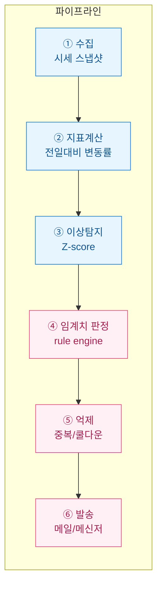
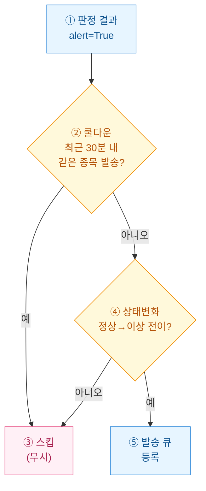

> 공개·더미 데이터 기준의 학습용 예제이며, 투자권유나 회계판단이 아니다. 실제 시세 데이터가 아닌 합성 데이터로만 구성했다.

시세판을 하루 종일 들여다볼 순 없다. 그렇다고 급변을 놓치면 곤란하다. 그래서 나는 "조용히 있다가 임계치를 넘으면 그때만 나를 부르는" 시스템을 만들기로 했다. 이 글은 그 룰 기반 알림기를 처음부터 조립한 기록이다.



## 무엇을 "급변"으로 볼 것인가?

가장 먼저 정한 건 알림을 쏠 **조건(condition)**이다. 시세는 원래 조금씩 흔들리니, 아무 변화에나 알림을 쏘면 하루에 백 통씩 온다. 그래서 두 가지 신호를 함께 본다.

| 신호 | 정의 | 왜 필요한가 |
|---|---|---|
| **변동률(pct change)** | (현재가 − 전일종가) / 전일종가 | 절대적 급등락을 잡는 직관적 기준 |
| **Z-score** | (변동률 − 평균) / 표준편차 | 그 종목의 "평소 변동폭" 대비 얼마나 튀었는지 |

변동률만 쓰면 원래 출렁이는 종목이 계속 걸리고, Z-score만 쓰면 잔잔하던 종목의 미세한 흔들림까지 과민하게 반응한다. **둘 다 넘을 때(AND)**만 진짜 이상으로 판정하는 게 핵심이다.

## 임계치는 어떻게 계산하나?

합성 데이터로 파이프라인을 만들어 본다. 종목별 과거 변동률 분포에서 평균·표준편차를 구해 Z-score를 만들고, 룰 두 개를 AND로 건다.

```python
import numpy as np
import pandas as pd

rng = np.random.default_rng(42)

# 합성: 종목 3개 × 60일 종가
symbols = ["AAA", "BBB", "CCC"]
rows = []
for s in symbols:
    price = 10000.0
    for d in range(60):
        price *= 1 + rng.normal(0, 0.015)  # 평소 변동성 1.5%
        rows.append({"symbol": s, "day": d, "close": round(price, 1)})
df = pd.DataFrame(rows)

# 전일대비 변동률
df["pct"] = df.groupby("symbol")["close"].pct_change()

# 종목별 평소 분포로 Z-score
stat = df.groupby("symbol")["pct"].agg(["mean", "std"]).rename(
    columns={"mean": "mu", "std": "sd"})
df = df.merge(stat, on="symbol")
df["z"] = (df["pct"] - df["mu"]) / df["sd"]

# 임계치 룰: |변동률| ≥ 3% AND |Z| ≥ 2.5
PCT_TH, Z_TH = 0.03, 2.5
df["alert"] = (df["pct"].abs() >= PCT_TH) & (df["z"].abs() >= Z_TH)
print(df[df["alert"]][["symbol", "day", "close", "pct", "z"]])
```

임계치 값(3%, 2.5σ)은 고정 상수가 아니라 **정책(policy)**이다. 알림이 너무 잦으면 올리고, 놓친 게 많으면 내린다. 나중에 설정 파일로 빼서 코드 수정 없이 조절할 수 있게 했다.

## 왜 룰 엔진과 억제 로직을 분리했나?

여기서 실무 트러블이 시작된다. 조건이 참인 매 스냅샷마다 메일을 쏘면, 한 번 급변한 종목이 임계치 근처에서 5분마다 계속 걸리며 **알림 폭주(alert storm)**가 난다. 받는 사람은 금세 알림을 무시하게 된다. 그래서 "판정"과 "발송"을 분리하고, 사이에 억제 계층을 뒀다.



두 가지 억제 장치를 뒀다.

- **쿨다운(cooldown)**: 같은 종목은 한 번 알렸으면 30분간 다시 안 쏜다.
- **상태 전이(edge-trigger)**: "정상 → 이상"으로 바뀌는 순간에만 쏜다. 계속 이상 상태로 머무는 동안엔 침묵한다.

```python
from datetime import datetime, timedelta

COOLDOWN = timedelta(minutes=30)
last_sent = {}      # symbol -> datetime
prev_state = {}     # symbol -> bool(이상 여부)

def should_notify(symbol, is_alert, now):
    was = prev_state.get(symbol, False)
    prev_state[symbol] = is_alert
    if not is_alert:
        return False
    if was:                      # 이미 이상 상태였음(전이 아님)
        return False
    t = last_sent.get(symbol)
    if t and now - t < COOLDOWN:  # 쿨다운 중
        return False
    last_sent[symbol] = now
    return True
```

## 메일과 메신저는 어떻게 쏘나?

발송 큐에 올라온 건만 실제로 내보낸다. 채널은 얇은 어댑터로 감싸서 갈아끼우기 쉽게 했다. 아래는 표준 라이브러리 SMTP 예시이고, 계정 정보는 전부 자리표시자(placeholder)다.

```python
import smtplib
from email.mime.text import MIMEText

def send_email(subject, body):
    msg = MIMEText(body)
    msg["Subject"] = subject
    msg["From"] = "alert-bot@example.com"     # 더미
    msg["To"] = "me@example.com"              # 더미
    with smtplib.SMTP("smtp.example.com", 587) as s:
        s.starttls()
        s.login("USER_PLACEHOLDER", "PASS_PLACEHOLDER")
        s.send_message(msg)

def notify(symbol, pct, z):
    subject = f"[시세알림] {symbol} 급변 감지"
    body = (f"{symbol} 전일대비 {pct*100:.1f}% (Z={z:.1f})\n"
            "임계치 초과로 자동 발송된 알림입니다.")
    send_email(subject, body)   # 메신저 웹훅으로 바꿔도 인터페이스 동일
```

메신저(웹훅)로 바꿀 땐 `send_email`만 웹훅 POST 함수로 교체하면 된다. 판정·억제 로직은 손대지 않는다. 이렇게 **채널 독립성**을 확보해 두면, 나중에 슬랙이든 텔레그램이든 붙이는 게 5분 작업이 된다.

## 정리 — 룰 기반 알림기의 세 가지 뼈대

| 계층 | 역할 | 실무 포인트 |
|---|---|---|
| **판정** | 변동률+Z-score AND 룰 | 임계치는 정책으로 분리, 코드 수정 없이 조절 |
| **억제** | 쿨다운+상태 전이 | 알림 폭주 방지가 시스템 신뢰의 절반 |
| **발송** | 채널 어댑터 | 메일/메신저 교체를 인터페이스로 흡수 |

만들어 보니 어려운 건 "탐지"가 아니라 "덜 부르기"였다. 정확히 감지하는 것만큼, **필요할 때만 조용히 부르는 절제**가 알림 시스템의 완성도를 가른다. 다음엔 임계치를 데이터로 자동 튜닝하는 걸 붙여볼 생각이다.
