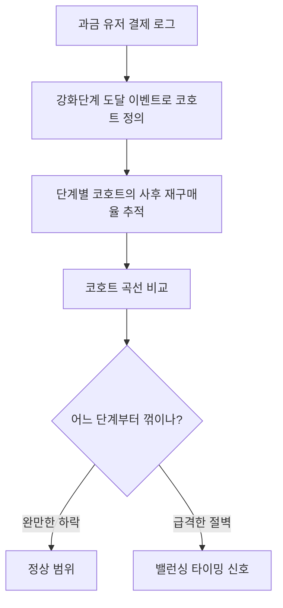
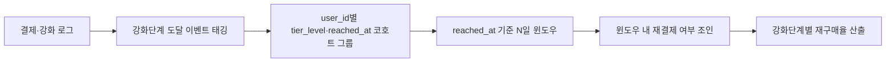
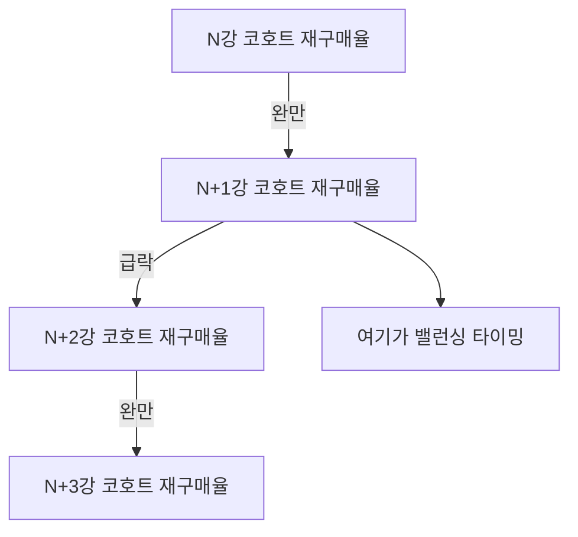

저번 글에서 픽률은 오르는데 재구매율은 꺾이는 역설을 다룬 적이 있다. 그 글을 쓰고 나서 기획팀 반응은 예상과 달랐다. "이탈하는 건 알겠는데, 그래서 몇 강 즈음에서 손봐야 하냐"는 거였다. 나는 그때 말문이 막혔다. "재구매율이 하락했다"는 문장은 방향은 알려줘도 **타이밍**은 알려주지 않는다. 이 글은 그 타이밍을 어떻게 숫자로 찍었는지에 관한 기록이다.

전체 과정을 먼저 그려보면 이렇다.



## 재구매율을 그냥 월별로 보면 왜 안 됐나?

처음엔 나도 재구매율(한 번 결제한 유저가 일정 기간 안에 다시 결제하는 비율)을 그냥 월별 시계열로 그렸다. 전체 선은 완만하게 우하향했다. 문제는 이 그래프로는 "왜"를 말할 수 없다는 점이었다.

유저마다 게임을 시작한 시점도, 강화 단계에 도달하는 시점도 다 다르다. 달력 기준으로 묶으면 "이번 달에 결제 안 한 사람"과 "이번 달에 특정 강화 단계를 막 찍은 사람"이 뒤섞여 버린다. 원인이 될 만한 이벤트(강화 도달)와 결과(재구매 중단) 사이에 달력이라는 잡음이 하나 더 끼는 셈이다. 그래서 축을 달력에서 **이벤트**로 옮겨야 했다.

## 강화단계 코호트는 어떻게 정의했나?

코호트(같은 시점에 같은 사건을 겪은 유저 집단을 묶어 그 이후를 추적하는 방법)의 기준점(D0)을 "이번 달 1일" 같은 달력이 아니라 **"유저가 특정 강화 단계에 처음 도달한 날"**로 잡았다. 이렇게 하면 유저마다 D0는 다 다른 날짜지만, "도달 후 N일"이라는 상대 시간 축에서는 전부 나란히 놓고 비교할 수 있다.



모집단은 애초에 결제 이력이 있던 유저로 한정했다. 재구매율이니까 "처음 사는지"가 아니라 "계속 사는지"를 봐야 하기 때문이다. 여기에 이전 글에서 쓰던 과금/무과금 플래그를 그대로 재사용했다.

```sql
-- 개념 예시(합성). 실제 스키마 아님.
-- 강화단계 도달 코호트별 사후(14일) 재구매율
WITH tier_cohort AS (
    SELECT user_id, tier_level, reached_at
    FROM   user_tier_events          -- 강화단계 도달 이벤트 로그
    WHERE  user_id IN (SELECT DISTINCT user_id FROM payment_log)  -- 결제 이력 보유자만
),
repurchase AS (
    SELECT tc.user_id, tc.tier_level,
           MAX(CASE WHEN p.paid_at BETWEEN tc.reached_at
                     AND DATEADD(DAY, 14, tc.reached_at)
                THEN 1 ELSE 0 END) AS repurchased_14d
    FROM   tier_cohort tc
    LEFT JOIN payment_log p ON p.user_id = tc.user_id
    GROUP  BY tc.user_id, tc.tier_level
)
SELECT tier_level,
       COUNT(*)                                  AS cohort_size,
       AVG(CAST(repurchased_14d AS FLOAT)) * 100  AS repurchase_rate_pct
FROM   repurchase
GROUP  BY tier_level
ORDER  BY tier_level;
```

## 변곡점을 어떻게 눈으로 확인했나?

이 쿼리를 강화 단계별로 쭉 돌리면 코호트 크기와 재구매율이 단계마다 한 줄씩 나온다. 낮은 단계 코호트들 사이에서는 재구매율이 완만하게 내려간다. 그런데 어느 한 단계를 넘어가는 코호트부터 곡선이 계단처럼 뚝 떨어지는 구간이 보였다. 이게 변곡점이다.



포인트는 "재구매율이 낮다"가 아니라 **어느 단계와 어느 단계 사이에서 낙폭이 가장 큰가**다. 완만한 하락은 자연 감쇠(시간이 지나면 다들 조금씩 지갑을 닫는 것)로 볼 수 있지만, 특정 구간에서만 유독 크게 꺾이는 건 그 단계에서 뭔가 유저의 동기를 끊는 사건이 있다는 신호다. 실제로 내가 본 사례에서도 특정 강화 단계 도달 이후 재구매율이 다른 구간과 비교해 뚜렷하게 큰 폭으로 하락했고, 이게 바로 밸런싱이 필요하다는 근거가 됐다.

## 이 변곡점을 밸런싱 타이밍으로 어떻게 연결했나?

변곡점을 찾았다고 분석이 끝난 게 아니다. 그 지점 앞뒤로 무엇이 바뀌는지를 확인해야 제안이 된다. 내가 세운 가설은 단순했다. 그 강화 단계가 유저에게 "여기까지가 목표"였던 지점이고, 도달하고 나면 다음 목표가 안 보이니 지갑을 닫는다는 것이다.

이걸 기획팀에 넘길 때는 "재구매율이 하락 추세"라고 하지 않았다. "N강 코호트와 N+1강 코호트 사이에서 낙폭이 집중된다"는 좌표로 넘겼다. 그러면 대응도 구체적으로 나온다. 그 단계 직전·직후에 다음 목표가 될 만한 콘텐츠나 소모품, 이벤트를 배치해 "달성 후 공백"을 메우는 식이다. 분석가의 산출물은 판정이 아니라 **손봐야 할 좌표**라는 걸 이 케이스에서 다시 확인했다.

## 정리 — 재구매율은 달력이 아니라 이벤트로 잘라야 절벽이 보인다

- 월별 재구매율 같은 달력 기준 시계열은 원인을 뭉갠다. 원인이 될 이벤트(강화 도달)를 D0로 놓는 **코호트**가 필요하다.
- 코호트별 재구매율을 나란히 놓고 보면 완만한 하락과 급격한 절벽을 구분할 수 있다. 절벽이 변곡점이다.
- 분석의 결과물은 "하락했다"가 아니라 **어느 단계 사이에서 낙폭이 집중되는가**라는 좌표여야 실행 부서가 움직인다.

다음 글에서는 이렇게 특정한 밸런싱 신호를 실제 이벤트·BM 전략으로 어떻게 번역했는지를 정리할 생각이다.

- 방법론·합성 스키마 레시피: [github.com/DBhyeong/game-data-recipes](https://github.com/DBhyeong/game-data-recipes)
