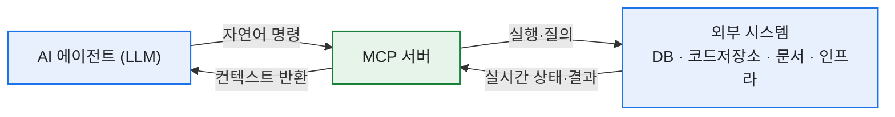
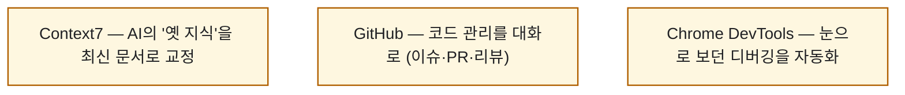

# 개발자가 알아두면 유용한 MCP 서버 7가지

> 요즘 내 작업 흐름에서 가장 크게 바뀐 건 'AI가 답을 말해주는 것'에서 'AI가 실제로 일을 해주는 것'으로 넘어간 지점이다. 그 다리를 놓아주는 게 MCP다. 마침 한컴 개발 블로그(민채은 님)가 개발자용 MCP 서버 7가지를 잘 정리해놨길래, 거기에 **내가 실제로 붙여 쓰는 것들의 경험**을 얹어 다시 정리해봤다.

## MCP가 대체 뭔데?

거대 언어 모델(LLM)은 똑똑하지만 근본적인 한계가 둘 있다. **실제 시스템을 실행할 권한**과 **최신 정보**가 없다는 것. 학습 시점에 멈춰 있고, 내 인프라·DB·저장소에 손을 뻗지 못한다. 이 격차를 메우는 개방형 통신 규약이 **MCP(Model Context Protocol)** 다.

MCP 서버가 해주는 건 두 가지로 압축된다. **실시간 컨텍스트 제공** — AI가 현재 시스템 상태·최신 문서·보안 정책을 실시간으로 질의하고 응답받게 한다. 그리고 **실행 가능성 보장** — AI의 자연어 명령을 특정 도구가 이해하고 실행할 수 있는 형태로 변환한다. 덕분에 AI가 단순 질의응답을 넘어, 여러 시스템을 넘나드는 복합 업무를 처리하게 된다.

## 7가지 서버, 한눈에

| # | 서버 | 무엇을 해주나 | 대표 활용 |
|---|---|---|---|
| 1 | **Context7** | 최신 라이브러리 문서·검증된 코드 예제 | AI가 옛 API로 코드 짤 때 교정 |
| 2 | **Terraform** | 클라우드 인프라 배포·관리, 모듈·정책 조회 | IaC 워크스페이스·실행 관리 |
| 3 | **Notion** | 페이지·DB 생성/검색/수정, 통합 검색 | 프로젝트 세팅·문서 자동 정리 |
| 4 | **GitHub** | 이슈·PR·브랜치 관리, 코드 자동화 | 버그 패치 PR·릴리즈 노트·이슈 분류 |
| 5 | **Chrome DevTools** | 콘솔·DOM·네트워크 제어 | 프론트 디버깅·반응형/UI 테스트 |
| 6 | **Hugging Face** | 모델·데이터셋·논문 검색 | 적합 모델 탐색·연구 동향 |
| 7 | **MongoDB** | 쿼리·CRUD·성능 분석 | 데이터 관리 자동화·인덱스 제안 |

## 코드·문서를 다루는 넷 — Context7·GitHub·Notion·Hugging Face

**Context7**은 AI의 가장 큰 약점을 정면으로 친다. LLM은 학습 시점에 멈춘 지식으로 답하니, 라이브러리 버전이 올라가면 옛 문법을 자신 있게 틀린다. Context7은 그때 **최신 공식 문서를 검색**하고, **검증된 코드 스니펫**을 컨텍스트로 주고, 특정 함수의 파라미터·반환값·오류 코드까지 조회한다. "이 API에서 401이 나는데 문서상 가능한 원인은?", "Kafka 클라이언트 v1에서 v2로 마이그레이션할 때 주의점을 문서에서 찾아줘" 같은 질문이 바로 풀린다.

**GitHub**은 코드 관리를 대화로 바꾼다. 이슈 생성·라벨링·담당자 지정, PR 생성·리뷰 코멘트·머지, 브랜치 생성·비교까지. "에러 로그를 분석해서 문제 코드를 찾고 수정해서 PR 올려줘", "지난 릴리즈 이후 main에 머지된 PR을 요약해 릴리즈 노트를 써줘" 한 문장이 실제 작업이 된다.

**Notion**은 문서·프로젝트 관리를 자동화한다. 페이지·데이터베이스를 설계해 만들고, Notion뿐 아니라 연결된 Slack·Google Drive·Jira까지 **통합 검색**하며, 페이지를 옮겨 워크스페이스 구조를 정리하고 댓글로 협업한다. **Hugging Face**는 AI 개발자용이다 — 모델 허브를 조건별로 검색하고, 데이터셋·최신 논문을 찾고, Spaces에 배포된 앱을 활용한다.

## 인프라·데이터를 다루는 셋 — Terraform·Chrome DevTools·MongoDB

**Terraform**은 클라우드 인프라를 직접 배포·관리하게 해준다. 프로바이더 문서와 커뮤니티·검증된 모듈을 검색하고, 거버넌스용 Sentinel 정책을 조회하며, 워크스페이스를 생성·수정하고 실행(run)을 관리한다. 사설 Registry의 사설 모듈·프로바이더, 변수 세트, 태깅까지 다룬다. "production-app이라는 워크스페이스를 만들어줘", "개발 환경 워크스페이스에 env:dev 태그를 붙여줘" 같은 명령이 그대로 실행된다.

**Chrome DevTools**는 눈으로 하던 디버깅을 자동화한다. 콘솔 로그 확인·JS 실행, DOM 구조 탐색, 네트워크 요청·응답 캡처. "모바일 뷰포트로 바꿨을 때 메뉴가 정상인지 스크린샷 찍어줘", "로딩이 가장 느린 API 요청이 뭔지 네트워크 탭에서 찾아줘"가 된다. **MongoDB**는 데이터를 다룬다 — CRUD와 복잡한 쿼리 실행, 쿼리 성능 분석과 인덱스·스키마 개선 제안, 그리고 필요한 데이터를 설명하면 쿼리·스크립트를 생성해준다.

## 특히 개발 루프를 바꾸는 셋은?

일곱 개가 다 유용하지만, 내가 볼 때 '코딩 루프' 자체를 바꾸는 건 이 셋이다.

"문서를 찾아서(Context7) → 코드를 짜고 → 저장소에 반영(GitHub) → 브라우저로 확인(Chrome DevTools)"까지가 대화 한 흐름 안에서 돌아가면, 컨텍스트 전환 비용이 확 준다.

## 스킬·서브에이전트·훅·MCP, 언제 뭘 쓰나?

MCP만이 답은 아니다. Claude Code를 확장하는 방법은 넷이고, 성격이 다르다.

| 확장 | 성격 | 언제 |
|---|---|---|
| **MCP** | 외부 시스템 연결 | DB·저장소·SaaS 등 바깥과 연동 |
| **스킬(skill)** | 온디맨드 도메인 지식 | 가끔 필요한 워크플로·규칙 |
| **서브에이전트** | 별도 컨텍스트 작업 | 파일 많이 읽는 조사·검증 |
| **훅(hook)** | 결정적 자동 실행 | 매번 예외 없이 일어나야 하는 것 |

MCP를 붙일수록 그 도구 설명이 컨텍스트를 먹으니, 정말 자주 쓰는 것부터 하나씩 붙이는 게 좋다. 이건 앞서 정리한 컨텍스트 최적화 원칙과 같은 맥락이다.

## 내가 실제로 붙여 쓰는 것

솔직히 나도 처음엔 'MCP 굳이?' 싶었다. 그런데 몇 개를 붙여보고 생각이 바뀌었다. 지금 내 세팅에서 가장 손이 자주 가는 건 **Context7**(라이브러리 쓸 때 옛 코드 방지)과 **GitHub**(저장소 이슈·PR·파일 다루기)다. 여기에 웹 데이터용 서버까지 얹으니, "문서 찾아 → 코드 짜고 → 저장소 반영"이 한 흐름으로 돈다.

한 가지 팁. MCP를 붙일 때 **인증 토큰·키는 절대 코드나 공개 설정에 박지 말 것.** 환경변수나 별도 시크릿으로 빼두는 게 기본이다. 편해지자고 붙인 도구가 자격증명 유출 통로가 되면 본전도 못 찾는다.

## 오늘의 정리

MCP는 유행어가 아니라 **'AI가 말만 하던 시대'에서 '일을 하는 시대'로 넘어가는 배선**이다. 특정 기술을 깊이 몰라도, 서버를 붙여두면 '무엇을 할지'에만 집중할 수 있게 된다. 다만 도구가 늘수록 컨텍스트도 먹으니, 정말 자주 쓰는 것부터 하나씩. 나도 그렇게 늘려가는 중이다.

*참고: 한컴디벨로퍼 블로그 '개발자가 알아두면 유용한 MCP 서버 7가지'(민채은 님, 2025-12). 각 서버 공식 문서: Context7(github.com/upstash/context7), Terraform(developer.hashicorp.com), Notion(developers.notion.com), GitHub(github.com/github/github-mcp-server), Chrome DevTools(github.com/ChromeDevTools/chrome-devtools-mcp), Hugging Face(huggingface.co/mcp), MongoDB(mongodb.com).*
