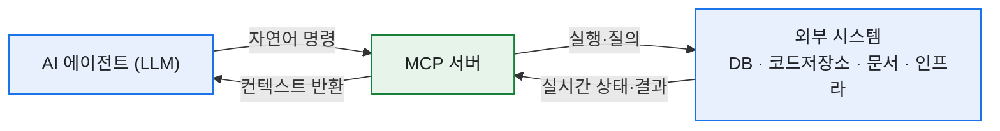
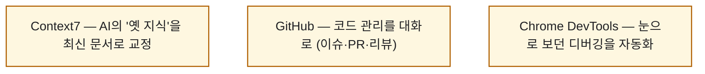

# 개발자가 알아두면 유용한 MCP 서버 7가지

> 요즘 내 작업 흐름에서 가장 크게 바뀐 건 'AI가 답을 말해주는 것'에서 'AI가 실제로 일을 해주는 것'으로 넘어간 지점이다. 그 다리를 놓아주는 게 MCP다. 마침 한컴 개발 블로그(민채은 님)가 개발자용 MCP 서버 7가지를 잘 정리해놨길래, 거기에 **내가 실제로 붙여 쓰는 것들의 경험**을 얹어 다시 정리해봤다.

## MCP가 대체 뭔데?

LLM은 똑똑하지만 두 가지가 없다. **실제 시스템을 실행할 권한**과 **최신 정보**. 이 격차를 메우는 개방형 통신 규약이 **MCP(Model Context Protocol)** 다.

핵심은 두 가지다. **실시간 컨텍스트 제공**(현재 시스템 상태·최신 문서를 질의) + **실행 가능성 보장**(자연어를 도구가 이해할 명령으로 변환). 덕분에 AI가 단순 질의응답을 넘어 여러 시스템을 넘나드는 복합 업무를 하게 된다.

## 7가지 서버, 한눈에

| # | 서버 | 무엇을 해주나 | 언제 쓰나 |
|---|---|---|---|
| 1 | **Context7** | 최신 라이브러리 문서·검증된 코드 예제 | AI가 옛 API로 코드 짤 때, 버전 확인 |
| 2 | **Terraform** | 클라우드 인프라 배포·관리, 모듈·정책 조회 | IaC 워크스페이스·실행 관리 |
| 3 | **Notion** | 페이지·DB 생성/검색/수정, 통합 검색 | 프로젝트 세팅·문서 자동 정리 |
| 4 | **GitHub** | 이슈·PR·브랜치 관리, 코드 자동화 | 버그 패치 PR·릴리즈 노트·이슈 분류 |
| 5 | **Chrome DevTools** | 콘솔·DOM·네트워크 제어 | 프론트 디버깅·반응형/UI 테스트 |
| 6 | **Hugging Face** | 모델·데이터셋·논문 검색 | 적합 모델 탐색·연구 동향 |
| 7 | **MongoDB** | 쿼리·CRUD·성능 분석 | 데이터 관리 자동화·인덱스 제안 |

## 특히 개발 루프를 바꾸는 셋은?

일곱 개가 다 유용하지만, 내가 볼 때 '코딩 루프' 자체를 바꾸는 건 이 셋이다.

- **Context7**: LLM의 가장 큰 약점이 '학습 시점에 멈춘 지식'이다. 라이브러리가 버전 올라가면 AI는 옛 문법을 자신 있게 틀린다. Context7은 그때 최신 공식 문서를 실시간으로 물어와 교정한다.
- **GitHub**: "에러 로그 분석해서 고치고 PR 올려줘" 한 문장이 실제 PR이 된다.
- **Chrome DevTools**: 콘솔 로그·DOM·네트워크를 AI가 직접 들여다본다.

## 내가 실제로 붙여 쓰는 것

솔직히 말하면 나도 처음엔 'MCP 굳이?' 싶었다. 그런데 몇 개를 붙여보고 생각이 바뀌었다. 지금 내 세팅에서 가장 손이 자주 가는 건 **Context7**(라이브러리 쓸 때 옛 코드 방지)과 **GitHub**(저장소 이슈·PR·파일 다루기)다. 여기에 웹 데이터용 서버까지 얹으니, "문서를 찾아서 → 코드를 짜고 → 저장소에 반영"까지가 대화 한 흐름 안에서 돌아간다.

한 가지 팁. MCP를 붙일 때 **인증 토큰·키는 절대 코드나 공개 설정에 박지 말 것.** 환경변수나 별도 시크릿으로 빼두는 게 기본이다. 편해지자고 붙인 도구가 자격증명 유출 통로가 되면 본전도 못 찾는다.

## 오늘의 정리

MCP는 유행어가 아니라 **'AI가 말만 하던 시대'에서 '일을 하는 시대'로 넘어가는 배선**이다. 특정 기술을 깊이 몰라도, 서버를 붙여두면 '무엇을 할지'에만 집중할 수 있게 된다. 다만 도구가 늘수록 컨텍스트도 먹으니, 정말 자주 쓰는 것부터 하나씩 붙이는 걸 권한다. 나도 그렇게 늘려가는 중이다.

*참고: 한컴디벨로퍼 블로그 '개발자가 알아두면 유용한 MCP 서버 7가지'(민채은 님, 2025-12). 각 서버 공식 문서: Context7(github.com/upstash/context7), Terraform(developer.hashicorp.com), Notion(developers.notion.com), GitHub(github.com/github/github-mcp-server), Chrome DevTools(github.com/ChromeDevTools/chrome-devtools-mcp), Hugging Face(huggingface.co/mcp), MongoDB(mongodb.com).*
