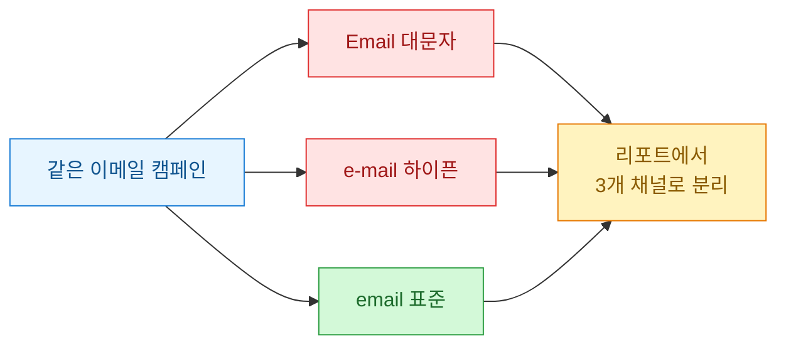
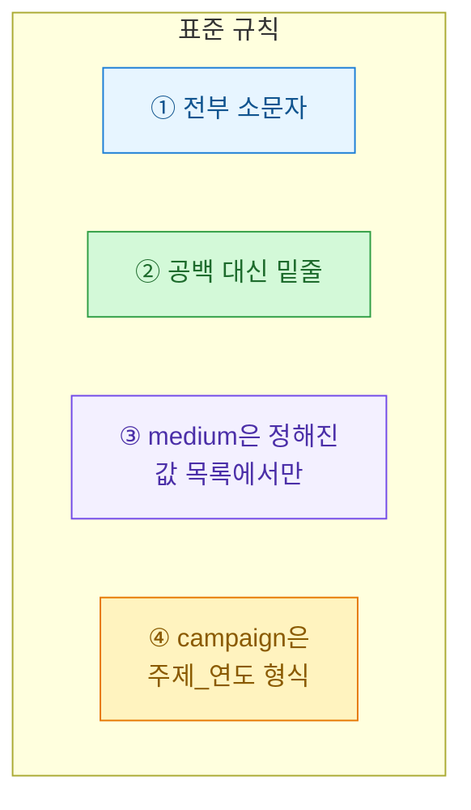
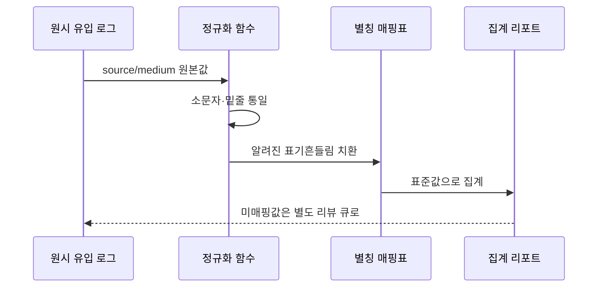

리포트를 열었더니 같은 채널이 세 줄로 쪼개져 있었다. `Naver`, `naver`, `naver_blog`. 사람 눈엔 다 네이버인데, 분석 도구 입장에선 완전히 다른 세 개의 유입원이다. 이날 나는 UTM 파라미터를 "그냥 붙이는 것"과 "표준을 정해서 붙이는 것"이 얼마나 다른지 �저리게 느꼈다.

이 글은 그 뒤로 내가 정리한 UTM 네이밍 규칙과, 링크를 만들 때·데이터를 받을 때 각각 어떻게 검증하는지를 담았다. 등장하는 URL·채널·수치는 전부 **합성 데이터**다.

## UTM이 뭐고, 왜 표준이 필요한가?

UTM은 URL 뒤에 붙이는 꼬리표다. "이 방문자가 어디서 왔는지"를 링크 자체에 적어두는 방식이라고 보면 된다. 다섯 개의 표준 파라미터가 있다.

| 파라미터 | 뜻 | 합성 예시 |
|---|---|---|
| utm_source | 어느 매체에서 왔나 | `naver`, `instagram`, `newsletter` |
| utm_medium | 유입 유형 | `cpc`, `social`, `email`, `referral` |
| utm_campaign | 어떤 캠페인 | `summer_sale_2026` |
| utm_content | 소재/위치 구분 | `banner_top`, `text_link` |
| utm_term | 검색 키워드(주로 광고) | `running_shoes` |

문제는 이 값들이 **자유 입력**이라는 점이다. 누가 `Email`이라 쓰고 누가 `e-mail`이라 쓰면, 도구는 둘을 다른 채널로 집계한다. 표준이 없으면 데이터가 조용히 갈라진다.



한 캠페인이 표기 흔들림 때문에 세 조각으로 쪼개지는 그림이다. 표준화의 목표는 이 흔들림을 없애 왼쪽 초록 경로 하나로 모으는 것이다.

## 어떤 네이밍 규칙을 정했나?

규칙은 화려할 필요가 없다. 오히려 단순하고 지켜지는 게 전부다. 내가 세운 원칙은 네 가지다.



특히 세 번째, **medium은 열린 값이 아니라 정해진 목록에서만 고르게** 한 게 핵심이다. source는 매체가 늘어날 때마다 새 값이 생기지만, medium은 유입 "유형"이라 종류가 몇 개 안 된다. 그래서 이걸 고정하면 리포트의 상위 분류가 항상 깔끔하게 유지된다.

내가 쓰는 medium 표준 목록(합성 예):

| 표준 medium | 언제 |
|---|---|
| cpc | 검색/디스플레이 유료 광고 |
| social | SNS 오가닉/유료 게시물 |
| email | 뉴스레터·발송 메일 |
| referral | 제휴·외부 링크 |
| affiliate | 협찬·제휴 마케팅 |

이 목록에 없는 medium이 들어오면 그건 오타이거나 새 규칙이 필요하다는 신호다. 둘 다 사람이 확인해야 할 일이다.

## 링크를 만들 때 어떻게 강제하나?

가장 좋은 방어는 애초에 틀린 링크가 만들어지지 않게 하는 것이다. 그래서 나는 손으로 URL을 조립하지 않고, 규칙을 코드로 박아 링크를 찍어내는 작은 빌더를 쓴다.

```python
from urllib.parse import urlencode

# 표준으로 허용된 medium 값(합성 데이터)
ALLOWED_MEDIUM = {"cpc", "social", "email", "referral", "affiliate"}

def normalize(value: str) -> str:
    # 소문자 + 공백/하이픈을 밑줄로 통일
    return value.strip().lower().replace(" ", "_").replace("-", "_")

def build_utm_url(base_url, source, medium, campaign,
                  content=None, term=None):
    medium = normalize(medium)
    if medium not in ALLOWED_MEDIUM:
        raise ValueError(f"허용되지 않은 medium: {medium} "
                         f"(가능: {sorted(ALLOWED_MEDIUM)})")

    params = {
        "utm_source": normalize(source),
        "utm_medium": medium,
        "utm_campaign": normalize(campaign),
    }
    if content:
        params["utm_content"] = normalize(content)
    if term:
        params["utm_term"] = normalize(term)

    return f"{base_url}?{urlencode(params)}"

# 합성 예시
print(build_utm_url(
    "https://example.com/landing",
    source="Naver Blog",       # 대문자·공백 섞임
    medium="Email",            # 대문자
    campaign="Summer Sale 2026",
))
# -> https://example.com/landing?utm_source=naver_blog&utm_medium=email&utm_campaign=summer_sale_2026
```

`Naver Blog`, `Email`, `Summer Sale 2026`처럼 사람이 대충 넣어도 결과는 항상 소문자·밑줄로 정규화된다. medium이 목록 밖이면 아예 예외를 던져 링크가 안 나온다. "틀리면 통과 못 하는" 구조가 표준을 문서가 아니라 강제로 만든다.

## 이미 들어온 데이터는 어떻게 정리하나?

빌더를 쓰기 전에 쌓인 데이터, 또는 외부에서 손으로 만든 링크는 여전히 지저분하다. 그래서 리포트로 넘기기 전 한 번 정규화 층을 거친다.



핵심은 두 단계다. 먼저 기계적으로 소문자·밑줄을 맞추고, 그다음 "사람이 아는 별칭"을 매핑표로 치환한다. 예를 들어 `naver_blog`·`n_blog`·`nblog`가 전부 같은 걸 뜻한다면, 이건 규칙만으로는 못 합치고 매핑표가 있어야 한다.

```python
import pandas as pd

# 표기 흔들림 -> 표준값 (합성 데이터)
SOURCE_ALIASES = {
    "n_blog": "naver_blog",
    "nblog": "naver_blog",
    "ig": "instagram",
    "insta": "instagram",
}

def clean_source(value: str) -> str:
    v = str(value).strip().lower().replace(" ", "_").replace("-", "_")
    return SOURCE_ALIASES.get(v, v)

# 합성 유입 로그
df = pd.DataFrame({
    "utm_source": ["Naver_Blog", "n_blog", "IG", "insta", "instagram"],
    "sessions":   [120,          80,       45,   30,      95],
})

df["source_std"] = df["utm_source"].apply(clean_source)
report = df.groupby("source_std")["sessions"].sum().reset_index()
print(report)
# source_std   sessions
# instagram        170
# naver_blog       200
```

정규화 전에는 5개 채널로 흩어져 있던 세션이, 정리 후 `instagram` 170·`naver_blog` 200 두 줄로 모인다. 실제 채널 개수가 드러나는 순간이다.

## 표준을 어긴 링크를 어떻게 미리 잡나?

배포 전 링크들을 한 번 훑는 검증기를 두면 사고를 크게 줄인다. 나는 캠페인 나가기 전에 링크 목록을 이 함수에 통과시킨다.

```python
from urllib.parse import urlparse, parse_qs

ALLOWED_MEDIUM = {"cpc", "social", "email", "referral", "affiliate"}
REQUIRED = ["utm_source", "utm_medium", "utm_campaign"]

def audit_url(url: str) -> list:
    issues = []
    q = parse_qs(urlparse(url).query)

    for key in REQUIRED:
        if key not in q:
            issues.append(f"필수 누락: {key}")

    for key, vals in q.items():
        if not key.startswith("utm_"):
            continue
        v = vals[0]
        if v != v.lower():
            issues.append(f"{key} 대문자 포함: {v}")
        if " " in v:
            issues.append(f"{key} 공백 포함: {v}")

    med = q.get("utm_medium", [""])[0]
    if med and med.lower() not in ALLOWED_MEDIUM:
        issues.append(f"비표준 medium: {med}")

    return issues

# 합성 예시
bad = "https://example.com/e?utm_source=Naver&utm_medium=Mail&utm_campaign=sale 2026"
for msg in audit_url(bad):
    print("-", msg)
# - utm_source 대문자 포함: Naver
# - utm_medium 대문자 포함: Mail
# - utm_medium 공백 포함... / 비표준 medium: Mail
# - utm_campaign 공백 포함: sale 2026
```

이 검증기를 스프레드시트 링크 목록이나 발송 직전 체크에 붙여두면, 잘못된 꼬리표가 세상에 나가기 전에 걸린다. 사후에 데이터를 세척하는 것보다 훨씬 싸게 먹힌다.

## 표준화가 리포트를 어떻게 바꾸나?

마지막으로, 표준화 전후 리포트가 어떻게 달라지는지 비교표로 정리한다.

| 항목 | 표준화 전 | 표준화 후 |
|---|---|---|
| 채널 줄 수 | 실제보다 부풀려짐(표기 분산) | 실제 채널 수와 일치 |
| medium 분류 | 자유 입력이라 뒤섞임 | 고정 목록으로 항상 동일 |
| 신규 매체 추가 | 규칙 없이 아무 값 | 별칭표에 등록 후 반영 |
| 오타/누락 | 리포트에서 뒤늦게 발견 | 링크 생성·검증 단계에서 차단 |

핵심 3줄로 요약하면 이렇다.

- UTM 값은 자유 입력이라, 표준이 없으면 같은 채널이 조용히 갈라진다.
- 방어는 두 겹이다. **링크 만들 때 강제**(빌더+medium 목록)와 **데이터 받을 때 정규화**(소문자·밑줄+별칭표).
- 배포 전 검증기로 비표준 링크를 미리 걸러내면, 사후 세척보다 훨씬 싸게 데이터를 지킨다.

규칙 자체는 하루면 정하지만, 그걸 코드로 강제해두면 반년 뒤의 나를 살린다. 리포트에서 채널 세 줄이 한 줄로 합쳐지는 걸 보는 순간, 이 작업이 왜 필요했는지 바로 납득하게 된다.
