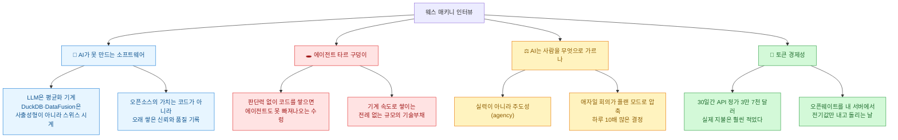
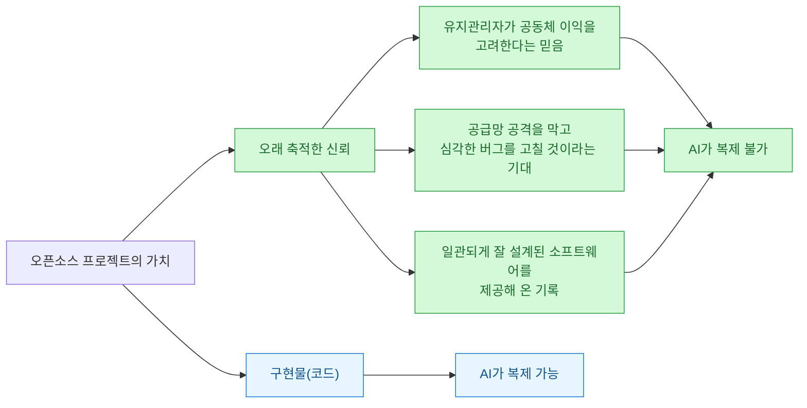
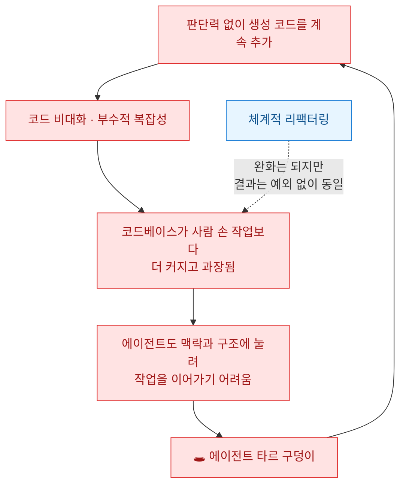
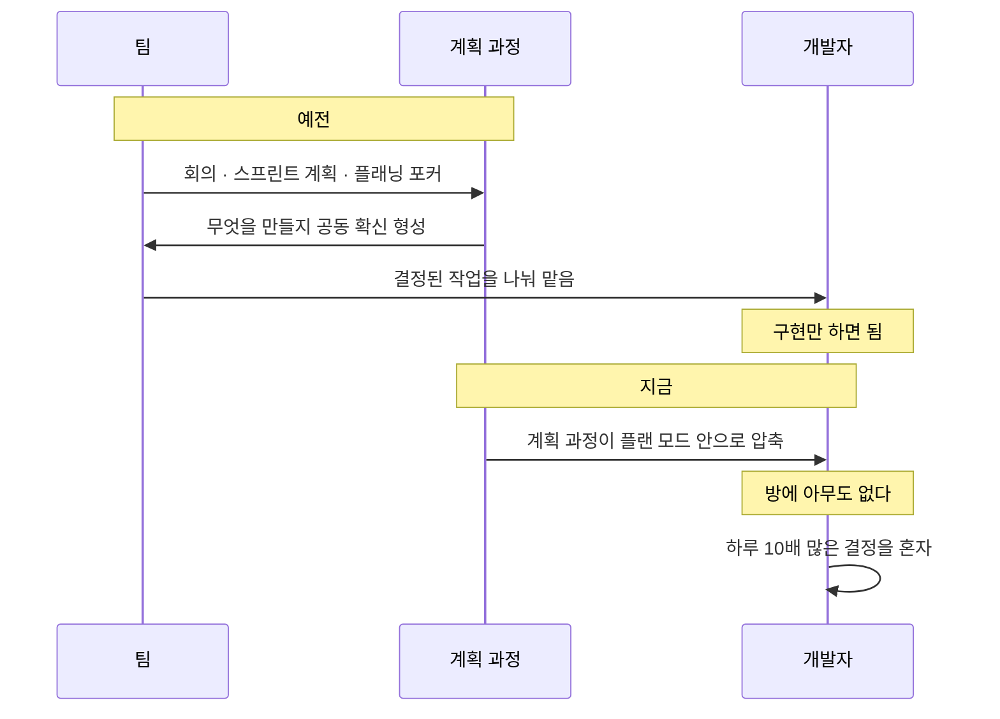

오늘 하루 종일 이상한 일이 있었다. **GLM 5.2를 네 번 마주쳤다.**

[[ai-llm-it-news-2026-07-20|허깅페이스가 침해 포렌식을 돌린 모델]]이 GLM 5.2였고, [[openwiki-agent-docs-cli-okf-review|OpenWiki가 자기 문서를 생성하는 CI]]도 GLM 5.2를 쓰고 있었고, [[mozilla-state-of-open-source-ai-2026-pdf-web-discrepancy|Mozilla 보고서의 중립 하네스 벤치마크]]에서도 최강 오픈 모델로 나왔다. 그리고 네 번째가 이거다 — **웨스 매키니(Wes McKinney)가 자기 물리 인프라에서 GLM 5.2를 돌려 봤고 잘 됐다고 말했다.**

Pandas와 Apache Arrow를 만든 사람이다. 데이터 엔지니어링 팟캐스트에 나와 한 시간 동안 얘기했는데, AI 시대의 실력에 대한 대목이 특히 좋았다. 전문을 읽고 **인용은 전사본 원문으로, 외부 사실은 따로 검증해서** 정리했다.

## 인터뷰에서 건진 것 한눈에

## 왜 DuckDB는 바이브 코딩으로 대체가 안 되나?

첫 번째 문장이다. 매키니가 DuckDB 창시자에게 "AI로 사람들이 대체품 만들까 봐 걱정되냐"고 물었더니 **그냥 웃더라**는 대목에서 나왔다.

> they're **averaging machines** and so they're just not going to be able to build a piece of like cutting edge… It's like compared with like **injection molded plastic toys versus like building like a fine Swiss watch**.
> (LLM은 **평균화 기계**라서 최첨단의 무언가를 만들어 내지 못한다… **사출 성형 플라스틱 장난감과 정교한 스위스 시계**를 비교하는 것과 같다.)

**LLM이 기존 코드와 접근법을 평균 내는 성격이 강하다는 것.** 그래서 전문가가 세밀하게 조립한 쿼리 엔진 같은 건 가까운 시일 안에 나오기 어렵다는 얘기다. 영원히 못 만든다는 뜻은 아니라고 본인이 단서를 달았다.

그런데 나는 그 뒤에 이어진 대목이 더 좋았다. **오픈소스의 경쟁력은 코드에만 있는 게 아니라는 것.**

그리고 본인 얘기로 이어진다. 하루에 만 줄을 생성할 수 있게 된 지금이 오히려 어렵다는 것이다.

> I feel every day that my credibility is on the line… **I can't release vibecoded slop.** I have to build software that is consistent with the standard of quality that I built in the past.
> (매일 내 신뢰가 걸려 있다고 느낀다… **바이브 코딩한 슬롭을 낼 수는 없다.** 과거에 쌓은 품질 기준에 맞는 소프트웨어를 만들어야 한다.)

**생성량이 아니라 검토와 품질 유지가 진짜 과제가 됐다는 얘기다.** 나도 요즘 같은 걸 느낀다. 만들어 내는 건 쉬워졌는데 그걸 내 이름으로 내보내도 되는지 판단하는 시간이 더 늘었다.

## '에이전트 타르 구덩이'란 뭔가?

두 번째 문장이자 이 인터뷰의 핵심 개념이다. 매키니가 자기 에세이에서 쓴 표현이라며 언급했는데, 원문을 찾아 읽었다.

에세이 제목이 **「The Mythical Agent-Month」**(2026년 2월 17일)다. 프레드 브룩스의 고전 『맨먼스 미신(The Mythical Man-Month)』을 비튼 제목이고, 브룩스가 쓴 "타르 구덩이(tar pit)" 은유를 그대로 가져온다.

브룩스의 원래 비유는 이렇다 — **"모두가 그 안에서 발버둥치는 짐승들을 볼 수 있고, 그중 아무나 쉽게 빠져나올 수 있을 것처럼 보이지만, 타르가 그들 모두를 붙들고 있다."**

매키니가 여기에 한 겹을 얹는다.

> Now, we have a new "agentic tar pit" where our **parallel Claude Code sessions and git worktrees are engaged in combat with the code bloat and incidental complexity generated by their virtual colleagues.** You can systematically refactor, but invariably an agentic codebase will end up larger and more overwrought than anything built by human hand. **This is technical debt on an unprecedented scale, accrued at machine speed.**
> (이제 새로운 "에이전트 타르 구덩이"가 생겼다. **병렬로 돌아가는 Claude Code 세션과 git worktree가, 자기 가상 동료들이 만들어 낸 코드 비대화와 부수적 복잡성과 싸우고 있다.** 체계적으로 리팩터링할 수는 있지만, 에이전트가 만든 코드베이스는 예외 없이 사람 손으로 만든 어떤 것보다 크고 과장된 상태로 끝난다. **이것은 기계 속도로 쌓이는, 전례 없는 규모의 기술부채다.**)

⚠️ 표기 하나 짚는다. 인터뷰 전사본에는 "agentic tarpit"처럼 들리는데 **에세이 원문은 `agentic tar pit`으로 띄어 쓴 두 단어**이고 따옴표 안에 있다. 브룩스의 원래 표현을 그대로 가져왔기 때문이다.

**나한테 이게 남 얘기가 아닌 이유**가 있다. 나는 병렬로 에이전트를 여러 개 돌린다. 오늘만 해도 검증 작업 여러 갈래를 동시에 굴렸다. 결과물은 빨리 나오는데, 그 결과물끼리 겹치고 어긋나는 걸 정리하는 시간이 점점 늘어난다. **"가상 동료가 만든 복잡성과 싸운다"는 문장이 정확히 그 감각이다.**

## AI는 사람을 무엇으로 가르나?

세 번째 문장이자 인터뷰에서 가장 널리 인용될 대목이다. 진행자가 "갓 졸업한 사람에게 뭐라고 하겠나, 비관적인가 낙관적인가"라고 물었다. 매키니는 자기도 작년에 작은 실존적 위기를 겪었다고 먼저 인정한 뒤 이렇게 답했다.

> the AI tools they do separate people and filter people based on their **level of agency**.
> (AI 도구는 사람을 **주도성(agency)의 수준**에 따라 가르고 걸러 낸다.)

> they're going to provide you like a very average kind of middling, **a B+ kind of approach** to solving every problem. But if you don't bring like good taste and judgment, you're eventually going to end up with like a big quagmire.
> (LLM은 모든 문제에 대해 아주 평균적이고 무난한, **B+ 정도의 접근법**을 준다. 그런데 좋은 취향과 판단력을 가져오지 않으면 결국 거대한 수렁에 빠진다.)

여기서 그가 짚은 문제가 뼈아프다. **예전에는 직접 구현하면서 기술과 판단력을 같이 길렀는데, 손코딩 시간이 줄어드는 만큼 그 판단력을 따로 길러야 한다는 것이다.**

| 예전 | 지금 |
|---|---|
| 직접 만들며 기술과 취향을 동시에 획득 | 만드는 시간이 줄어 취향이 자동으로 안 생김 |
| 전문가는 기술 + 효율적 경로 판단 둘 다 보유 | 경로 판단은 여전히 필요한데 기를 기회가 줄어듦 |
| 문법·손코딩 학습 | 아키텍처·문제 정의·의사소통·결과 판별 |

그래서 신입에게 준 조언이 문법이 아니라 **소프트웨어 설계와 아키텍처, 데이터 시스템 구조**였다. 람다 아키텍처와 카파 아키텍처가 각각 어떻게 작동하고 어떤 문제에 맞는지 같은 것들.

그리고 결정타.

> if you can't explain what you want, then you're not going to get it… if you give AI to somebody who doesn't have the good taste and judgment and experience to know what is the good thing to build, giving them AI will in general just **turn them into a slop cannon.**
> (원하는 것을 설명할 수 없으면 그것을 얻지 못한다… 무엇을 만드는 게 좋은지 알 만한 취향과 판단력과 경험이 없는 사람에게 AI를 주면, 대체로 그 사람을 **슬롭 대포**로 만들 뿐이다.)

**"슬롭 대포(slop cannon)"** — 많이 뽑아내는데 쓸 만한 게 없고, 결국 남이 치워야 할 부채가 되는 상태다. 진행자가 받아친 말도 좋았다. "AI는 당신이 이미 어떤 개발자인지를 증폭할 뿐"이라고.

이게 [[ai-llm-it-news-2026-07-20|오늘 다이제스트에서 다룬 "AI 프로젝트 성공률 0퍼센트" 주장]]과 정확히 같은 지점을 다른 각도로 찌른다. 그쪽은 조직의 광기를 얘기했고, 이쪽은 개인의 판단력을 얘기한다. 매키니 쪽이 훨씬 실용적이라고 느꼈다.

## 하루에 10배 많은 결정을 내린다는 것

인터뷰에서 제일 새로웠던 관찰이다. 나는 이 얘기를 다른 데서 본 적이 없다.

> essentially like all of that agile methodology is being now crammed into like a planning plan mode in Claude and **there's nobody else in the room. It's just you and you have to make all the decisions.**
> (본질적으로 그 모든 애자일 방법론이 이제 Claude의 플랜 모드 안으로 욱여넣어졌고, **방에 아무도 없다. 당신뿐이고 모든 결정을 당신이 내려야 한다.**)

그러면서 **결정 피로(decision fatigue)**로 얼어붙는 엔지니어들 얘기를 많이 듣는다고 했다. 빠르게 판단해 효율적 경로를 정하는 사람은 생산성을 얻지만, 무엇을 해야 할지 확신 못 하는 사람에게 **AI는 그 문제를 해결해 주지 않는다**는 것이다.

그리고 본인도 예외가 아니라고 솔직하게 덧붙인다 — **"어떤 걸 만들 때는 내가 뭘 하는지 충분히 모르는 상태여서, 에이전트가 A와 B 중 뭘 원하냐고 물으면 솔직히 어느 쪽이 나은지 말할 수 없었다."**

## 토큰 3만 7천 달러어치를 쓰고 얼마를 냈나?

여기서 인터뷰가 갑자기 구체적으로 바뀐다.

> at API rates in the last 30 days I've used **37,000 dollars in tokens**… and I don't pay nearly that much to the Frontier Labs. **clearly we're living through like epic subsidies for the tokens that we're using.**
> (지난 30일간 API 정가로 계산하면 **토큰 3만 7천 달러어치**를 썼다… 그런데 프런티어 연구소에 그 근처도 안 내고 있다. **분명히 우리는 우리가 쓰는 토큰에 대한 어마어마한 보조금 시대를 살고 있다.**)

**한 달에 3만 7천 달러어치를 쓰고 그보다 훨씬 적게 냈다.** 그는 이걸 자랑이 아니라 **지속 가능성에 대한 질문**으로 꺼냈다. 어떤 비용 구조가 장기적으로 유지될지 모르겠다는 것이다.

이게 [[mozilla-state-of-open-source-ai-2026-pdf-web-discrepancy|오늘 정리한 Mozilla 보고서]]와 정확히 맞물린다. 거기서 Uber 사례를 들며 이렇게 적었다 — **"낮은 가격은 결코 제품이 아니었다. 잠금이 제품이었다."** Uber 요금은 이용자들이 보조금 가격에 삶을 재편한 뒤 약 92퍼센트 올랐고, 보고서는 AI 토큰 가격 인상 시점을 2027\~28년쯤으로 본다.

**같은 주에 한쪽에선 보고서가 미터기를 경고하고, 다른 쪽에선 업계 베테랑이 "나도 보조금을 받고 있다"고 인정한다.**

## 그가 GLM 5.2를 자기 서버에서 돌린 이유

그래서 그가 말한 소망이 이거다.

> how long will it be till I can just have like **a server in my closet** that runs one of these one trillion parameter open weights models and I don't have to — I can just pay for the power for that server.
> (이런 1조 파라미터 오픈웨이트 모델을 돌리는 **벽장 속 서버**를 갖고, 그 서버 전기값만 내면 되는 날이 언제쯤 올까.)

그가 실제로 해 봤다. **GLM 5.2를 물리 인프라에서 돌렸고 잘 됐다**고 했다. 그런데 "작은 모델이 아니다, 제대로 돌리려면 B200 여덟 장쯤 필요하다"고 덧붙인다.

✅ 이 수치를 검증해 봤더니 정확했다. vLLM 공식 배포 레시피가 이렇게 적는다.

> GPU: 8xH200 or 8xH20 (141 GB each) for single-node FP8; **8xB200 (180 GB each) for the full 1M context.**

정확히는 **"100만 토큰 전체 컨텍스트를 쓰려면 8×B200"**이고, 컨텍스트를 줄인 FP8 배포는 8×H200으로도 된다. GLM 5.2는 약 743B 총 파라미터에 39B 활성인 MoE 모델이고 MIT 라이선스다.

⚠️ 가격은 단서를 달아야 한다. 그가 말한 "B200 한 장에 3만\~5만 달러"는 **공개된 업계 추정치 범위 안에 정확히 들어가지만, NVIDIA 공식 가격이 아니다.** 엔비디아는 데이터센터 GPU를 낱개로 소매하지 않고 시스템 단위로 판다. 2024년 CEO가 방송에서 "3만\~4만 달러"라고 말한 적이 있으나 곧바로 "칩만 파는 게 아니라 가격은 달라진다"고 스스로 단서를 달았다.

그러니 **하드웨어 25만\~40만 달러**라는 계산도 추정 위의 추정이다. 다만 방향은 분명하다 — **지금은 벽장에 안 들어간다.**

## 오늘 걸러낸 것 (팩트체크 로그)

인터뷰 발언은 전사본이 1차 자료라 인용 자체는 문제가 없다. **인터뷰 바깥의 사실만 따로 확인했다.**

| 항목 | 판정 | 실측 |
|---|---|---|
| 새 회사 "Ken Software" | 🔴 **철자 오류** | **Kenn Software**(n 두 개, kenn.io). "to know" 어근에서 유래. 2026년 설립, 3인 팀 |
| Kenn Software 투자 유치 | **확인 불가** | 어떤 펀딩 발표도 없음 |
| "agentic tarpit" | ⚠️ **표기** | 에세이 원문은 **`agentic tar pit`**(두 단어). 「The Mythical Agent-Month」 2026-02-17 |
| B200 한 장 3만\~5만 달러 | ⚠️ **업계 추정치** | NVIDIA 공식 단가 아님. 낱개 소매 안 함 |
| GLM 5.2 "B200 8장" | ✅ **정확** | vLLM 공식 레시피 "8xB200 for the full 1M context" |
| Voltron Data 폐업 | ⚠️ **정황상 확실, 공식 발표는 없음** | 도메인 DNS 사망, LinkedIn "직원 1명", GitHub 2026-01 이후 무활동, CMU Pavlo 연례 회고 "Deaths" 등재 |
| Posit 관계 | ✅ **현직** | **Principal Architect**(2023년 11월 합류). "지난 8년 관계"는 2018년 Ursa Labs 협력부터로 성립 |
| pandas "2008년 초 시작" | ⚠️ **더 정확히는** | **2008년 4월 6일** |
| "2010년 2월 첫 PyCon 발표" | ✅ **사실** | 단 발표 제목은 pandas가 아니라 "Python for Quantitative Finance" |
| Arrow "2016년 초 Cloudera에서" | ✅ **사실** | 2016-02-17 Apache 최상위 프로젝트로 **인큐베이터 없이 바로** 출범 |
| DataFusion "30\~40개 회사" | ⚠️ **본인 추정** | 공식 집계 없음. 공식 문서는 활성 **프로젝트** 약 44개 (회사 아님) |
| Arroyo → Cloudflare 인수 | ✅ **사실** | 2025-04-10 Arroyo 공식 발표. 엔진은 오픈소스 유지 |
| "Scalability! But at what COST?" | ✅ **사실** | McSherry·Isard·Murray, HotOS XV, 2015년 5월 |

DataFusion 항목은 인터뷰에서 본인이 "30이나 40개쯤 되지 않을까" 하고 추정으로 말한 것이라 오류는 아니다. 다만 옮길 때 "공식 집계"처럼 쓰면 안 된다.

## 그래서 내가 챙긴 것

- **판단력을 기르는 시간을 따로 확보한다.** 매키니의 지적이 정확했다. 예전엔 직접 만들면서 취향이 자동으로 붙었는데, 지금은 만드는 시간이 줄어서 그게 안 생긴다. 나는 요즘 에이전트가 낸 결과를 검증하는 데 시간을 쓰는데, **그게 사실은 판단력 훈련 시간**이라는 걸 이 인터뷰 읽고 알았다. 검증을 귀찮은 뒤처리가 아니라 훈련으로 재분류했다.
- **병렬 세션 수를 늘리기 전에 정리 비용을 먼저 센다.** 타르 구덩이 문장이 아팠다. 오늘도 검증 갈래를 여러 개 동시에 돌렸는데, 결과가 겹치고 어긋나는 걸 합치는 시간이 만만치 않았다. **에이전트를 늘리는 건 공짜가 아니고, 늘어난 산출물은 누군가 붙여야 한다.** 그 누군가가 나다.
- **토큰 보조금이 끝나는 시나리오를 지금 계산해 둔다.** 업계 베테랑이 "3만 7천 달러어치를 쓰고 그보다 훨씬 적게 냈다"고 공개적으로 말했다. 이건 언젠가 정산된다는 뜻이다. Mozilla 보고서는 자체호스팅 손익분기를 하루 약 8천 대화로 봤다. 나는 그 근처도 아니라 지금은 빌려 쓰는 게 맞지만, **가격이 두 배가 됐을 때 내 워크플로 중 뭐가 먼저 죽는지**는 미리 알아 두려 한다.

오늘 하루에 GLM 5.2를 네 번 마주친 게 우연 같지 않다. 침해 대응자가 가드레일을 피해 도망친 곳도, 문서 CI가 조용히 굴리는 것도, 중립 벤치마크에서 5분의 1 가격에 몇 포인트만 뒤진 것도, 그리고 Pandas 창시자가 벽장 속 서버를 상상하며 돌려 본 것도 같은 모델이었다. **네 사람이 서로 모르는 채로 같은 방향을 가리켰다.** 매키니의 표현을 빌리면, 지금 우리가 쓰는 가격은 제품이 아니다.
