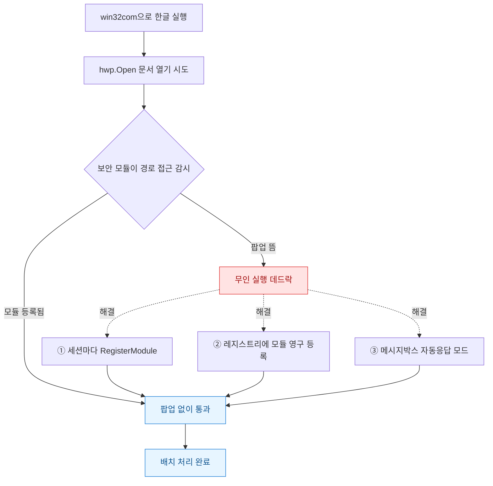
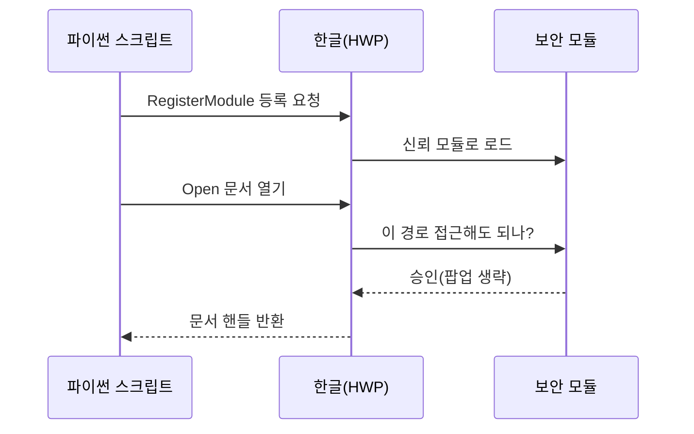

한글(HWP) 문서 수백 개를 열어서 표를 갈아끼우고 다시 저장하는 배치 작업을 짰다. 파이썬 win32com(윈도우 COM 객체를 파이썬에서 부르는 다리 역할 라이브러리)으로 한글을 띄우고 `Open`을 호출했다. 로컬에서 돌릴 땐 잘 됐다. 그런데 스케줄러에 걸어 무인으로 돌리자 첫 파일에서 멈춰버렸다. 화면을 켜보니 한글 창 위에 "다른 프로그램에서 파일에 접근하려고 합니다. 허용하시겠습니까?"라는 보안 팝업이 떠 있었다. 아무도 [허용]을 눌러주지 않으니 스크립트는 그 앞에서 영원히 대기 중이었다.

이건 한글의 **보안 모듈** 때문이다. 한글은 자동화(외부 프로그램이 문서를 여는 행위)를 잠재적 매크로 공격으로 보고, 파일 경로에 접근할 때마다 사용자에게 확인을 받는다. 무인 배치에선 이 팝업이 곧 데드락(교착)이다. 반나절 삽질하고 나서야 우회하는 세 갈래 길을 정리할 수 있었다.



## 왜 팝업이 뜨는지부터 알아야 했나?

처음엔 팝업만 자동으로 눌러버리면 된다고 생각했다. 그래서 pywinauto 같은 걸로 창을 찾아 [허용]을 클릭하는 코드를 짰다. 이게 최악의 선택이었다. 팝업이 뜨는 타이밍이 파일마다 미묘하게 달라서 클릭이 헛나가고, 한글 버전이 바뀌면 창 제목이 달라져 통째로 깨졌다.

핵심은 팝업을 **누르는** 게 아니라 **뜨지 않게** 하는 것이다. 한글은 신뢰할 수 있는 보안 모듈이 등록돼 있으면 팝업을 건너뛴다. 그 모듈이 바로 한컴이 배포하는 `FilePathCheckerModule`이라는 DLL(파일 경로 검사를 대신 수행하는 확장 모듈)이다. 자동화 커뮤니티에서 오래 쓰여온 방식이라 대부분 이 DLL을 받아 쓴다.



## 방법 ① 세션마다 RegisterModule로 등록하면?

가장 정석적인 방법이다. 한글 객체를 만든 직후 `RegisterModule`을 호출해 보안 모듈을 등록한다. DLL 파일(`FilePathCheckerModuleExample.dll`이나 배포판에 따라 이름이 조금 다르다)을 미리 받아 시스템에 등록(regsvr32)해두거나, 실행 경로에 두고 참조하면 된다.

```python
import win32com.client as win32

hwp = win32.gencache.EnsureDispatch("HWPFrame.HwpObject")

# 보안 모듈 등록 — 이 한 줄이 팝업을 막는다
hwp.RegisterModule("FilePathCheckDLL", "FilePathCheckerModule")

hwp.Open(r"C:\docs\report_001.hwp")
# ... 표 편집, 저장 ...
hwp.Quit()
```

`RegisterModule`의 첫 인자는 모듈 종류("FilePathCheckDLL"), 둘째는 등록된 모듈 이름이다. 이 코드가 통하려면 `FilePathCheckerModule`이라는 이름으로 DLL이 시스템에 등록돼 있어야 한다. 내 경우엔 배포판 DLL을 관리자 권한 터미널에서 `regsvr32`로 한 번 등록해두니 그다음부터 위 한 줄이 팝업을 조용히 삼켰다.

단점은 **세션마다 호출**해야 한다는 점, 그리고 DLL을 미리 심어둬야 한다는 점이다. 배포 대상 PC가 여러 대면 이 사전 준비가 번거롭다.

## 방법 ② 레지스트리에 모듈을 영구 등록하면?

매번 `RegisterModule`을 부르는 게 싫다면 레지스트리에 아예 신뢰 모듈로 박아둘 수 있다. 한글은 자동화 모듈 목록을 사용자 레지스트리에서 읽는다. 아래 경로에 값을 심으면 한글이 부팅 때부터 그 모듈을 신뢰한다.

```
HKEY_CURRENT_USER\Software\HNC\HwpAutomation\Modules
  FilePathCheckerModule = (DLL 절대경로)
```

파이썬으로 심는 코드는 이렇다. 표준 라이브러리 `winreg`만 쓴다.

```python
import winreg

path = r"Software\HNC\HwpAutomation\Modules"
dll = r"C:\hwp_modules\FilePathCheckerModule.dll"

with winreg.CreateKey(winreg.HKEY_CURRENT_USER, path) as key:
    winreg.SetValueEx(key, "FilePathCheckerModule", 0,
                      winreg.REG_SZ, dll)
```

한 번 심어두면 그 계정에서 도는 모든 한글 자동화가 팝업 없이 통과한다. 주의할 점은 **레지스트리 하이브가 사용자별**이라는 것. `HKEY_CURRENT_USER`는 지금 로그인한 계정에만 적용된다. 스케줄러를 다른 서비스 계정으로 돌린다면 그 계정으로 로그인해서 심거나, 해당 계정 하이브(HKU\SID)에 직접 써야 한다. 나는 이걸 몰라서 "분명 심었는데 왜 또 팝업이 뜨지" 하고 한참 헤맸다. 범인은 스케줄러가 나와 다른 계정으로 돌고 있던 것이었다.

## 방법 ③ 메시지박스 자체를 자동응답으로 돌리면?

보안 모듈을 못 구하는 환경이거나, 보안 팝업 말고 "덮어쓰기 하시겠습니까?" "글꼴이 없습니다" 같은 **다른 대화상자**까지 막아야 할 때가 있다. 이럴 땐 한글의 메시지박스 모드를 자동응답으로 바꾼다. 버전에 따라 `SetMessageBoxMode`를 지원한다.

```python
# 모든 메시지박스에 기본값(예: 확인/예)으로 자동 응답
hwp.SetMessageBoxMode(0x00020000)
```

인자는 어떤 대화상자에 어떤 버튼으로 답할지를 나타내는 비트 플래그(여러 옵션을 자릿수로 조합한 정수)다. 값 하나로 "모든 팝업에 예" 같은 식으로 뭉뚱그릴 수 있다. 편하지만 위험하다. 저장 확인이나 덮어쓰기 경고까지 무조건 예로 넘겨버리면, 잘못된 파일을 조용히 덮어쓸 수 있다. 나는 이 방법을 **경로 보안 팝업이 아닌 부수적 대화상자**(글꼴 없음 등) 처리에만 좁게 쓰고, 경로 접근은 ①·②로 막는 걸 원칙으로 삼았다.

세 방법을 상황별로 정리하면 이렇다.

| 상황 | 추천 방법 | 이유 |
|---|---|---|
| 내 PC에서 단발 자동화 | ① RegisterModule | 코드 한 줄, DLL만 등록 |
| 여러 PC·반복 배치 | ② 레지스트리 등록 | 계정에 한 번 심으면 끝 |
| 부수 대화상자까지 차단 | ③ MessageBoxMode | 팝업 종류 무관, 단 신중히 |
| 스케줄러 무인 실행 | ② + 서비스 계정 확인 | 하이브 계정 불일치 주의 |

## 마지막으로 빠뜨리기 쉬운 함정은?

세 방법을 다 적용하고도 마지막에 한 번 더 막혔다. `EnsureDispatch`로 만든 캐시(win32com이 COM 타입 정보를 저장해두는 폴더)가 예전 한글 버전 정보로 굳어 있어서, 한글을 업데이트한 뒤 엉뚱한 에러가 났다. `%TEMP%\gen_py` 폴더를 지우고 다시 실행하니 풀렸다. win32com 자동화가 갑자기 이상하면 이 캐시부터 의심하는 게 빠르다.

그리고 자동화가 끝나면 **반드시 `hwp.Quit()`으로 한글 프로세스를 닫아야** 한다. 안 그러면 백그라운드에 `Hwp.exe`가 유령처럼 쌓여서 나중엔 파일 잠금 충돌이 난다. 배치 루프라면 `try...finally`로 감싸 어떤 파일에서 죽어도 프로세스를 정리하게 짜두는 편이 안전했다.

보안 모듈 팝업은 처음엔 "왜 이런 걸로 막나" 싶었지만, 결국 한글이 매크로 공격을 막으려는 정당한 방어였다. 그걸 우회한다기보다 **신뢰 모듈을 정식으로 등록해 자동화를 허가받는 것**이 맞는 그림이었다. 다음엔 이 배치를 HWPX(한글의 개방형 XML 포맷)로도 열어서, COM 없이 순수 파이썬으로 처리하는 쪽을 실험해볼 생각이다.
