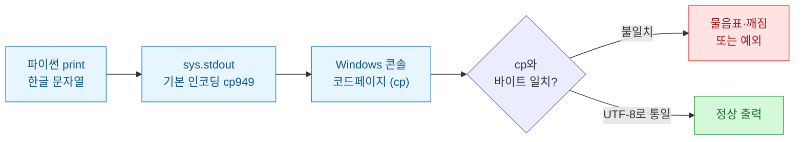
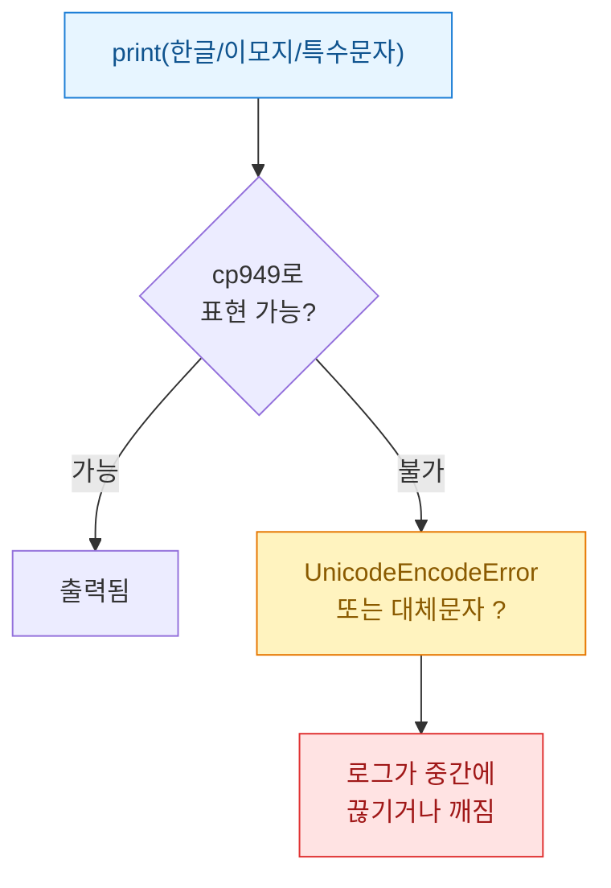
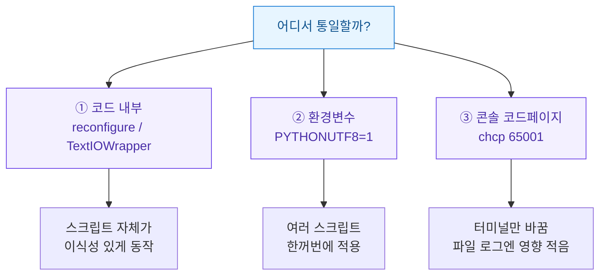
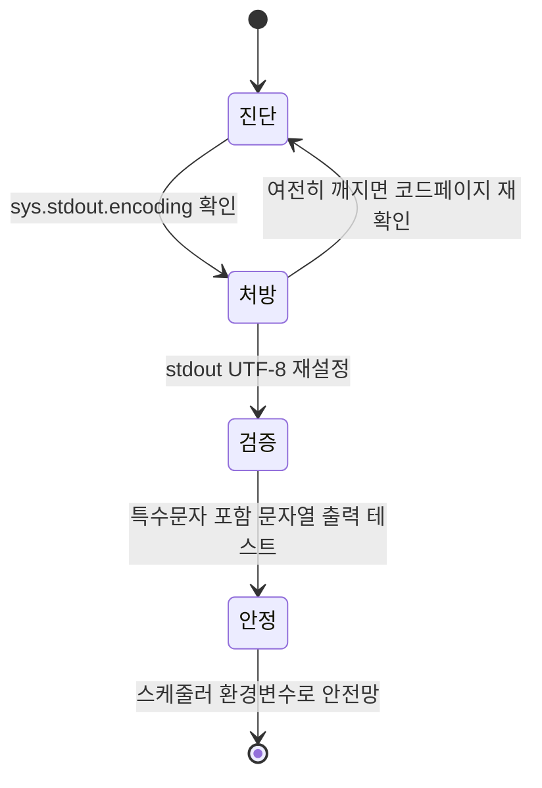

새벽에 돌아가는 검색 콘솔 자동화 스크립트를 만들어 두고 다음 날 로그 파일을 열었더니, 한글이 죄다 물음표와 깨진 사각형으로 찍혀 있었다. 로직은 멀쩡히 돌았는데 로그만 못 읽는 상황. 별것 아닌 것 같아 미뤘다가 결국 한 번 제대로 잡았고, 그 짧은 삽질을 정리해 둔다. 아래 예시에 나오는 키워드·수치는 전부 **합성(더미) 데이터**다.

## 한눈에: 어디서 글자가 깨지나?



핵심은 두 군데에서 인코딩이 어긋난다는 것이다. 하나는 파이썬이 문자열을 바이트로 바꿀 때 쓰는 **stdout 인코딩**, 다른 하나는 콘솔(또는 로그를 받아 적는 쪽)이 그 바이트를 글자로 되돌릴 때 쓰는 **코드페이지(codepage)**. 둘이 다르면 글자가 깨진다.

## 왜 하필 Windows에서만 깨지나?

리눅스·맥은 터미널 기본 인코딩이 대체로 UTF-8이라 문제가 잘 안 보인다. 반면 한국어 Windows의 전통적 콘솔 기본값은 **cp949(euc-kr 계열)**다. 파이썬이 자동으로 골라 쓰는 stdout 인코딩도 이 환경에 맞춰지곤 한다.

문제는 UTF-8로 저장된 소스나 웹에서 긁어온 문자열을 cp949로 내보내려 할 때다. cp949에 없는 문자를 만나면 두 가지 중 하나가 일어난다.



무인 스케줄러로 돌릴 때 특히 성가시다. 사람이 지켜보는 콘솔이 아니라 파일이나 작업 스케줄러 로그로 흘러가기 때문에, 인코딩 예외가 터지면 스크립트 자체가 그 자리에서 죽어버리기도 한다. "출력만 깨지는" 문제가 아니라 "작업이 멈추는" 문제로 번진다.

## 실제로 어떻게 재현되나?

합성 키워드 목록을 찍어 보는 짧은 예시다. 아래처럼 하면 환경에 따라 물음표가 섞이거나 예외가 난다.

```python
# 합성 데이터 — 실제 수집 결과가 아님
keywords = [
    ("가상키워드A", 1240),
    ("더미키워드B★", 980),   # 특수문자 포함
    ("샘플문구C™", 610),      # cp949에 없는 기호
]

for name, volume in keywords:
    print(f"[수집] {name} — 검색량 {volume}")
```

콘솔 코드페이지가 UTF-8이 아니면 `™`, `★` 같은 문자에서 `UnicodeEncodeError: 'cp949' codec can't encode character`가 나거나, 그 자리가 `?`로 바뀐다. 로직은 문제없는데 출력 단계에서 걸리는 전형적인 케이스다.

현재 stdout이 어떤 인코딩을 쓰는지부터 확인하면 원인 추적이 쉽다.

```python
import sys
print(sys.stdout.encoding)   # 예: cp949  ← 이게 utf-8이 아니면 의심
```

## 어떻게 잡았나 — stdout을 UTF-8로 감싸기

가장 간단하고 코드 변경이 적은 처방은, 스크립트 맨 위에서 `sys.stdout`(그리고 `sys.stderr`)의 바이트 버퍼를 UTF-8 텍스트 래퍼로 다시 감싸는 것이다. `io.TextIOWrapper`를 쓴다.

```python
import io
import sys

# 스크립트 최상단에서 한 번만 실행
sys.stdout = io.TextIOWrapper(
    sys.stdout.buffer,
    encoding="utf-8",
    errors="backslashreplace",  # 표현 불가 문자도 죽지 않고 이스케이프
    line_buffering=True,        # 무인 로그에서 줄 단위로 즉시 flush
)
sys.stderr = io.TextIOWrapper(
    sys.stderr.buffer,
    encoding="utf-8",
    errors="backslashreplace",
    line_buffering=True,
)

print("[수집] 더미키워드B★ — 검색량 980")  # 이제 안 깨짐
```

`errors="backslashreplace"`를 준 이유가 있다. 무인 실행에서는 한 글자 표현 실패로 스크립트가 죽는 게 제일 곤란하다. 이 옵션은 못 바꾸는 문자를 예외 대신 `\uXXXX` 형태로 남겨, 로그는 조금 지저분해져도 **작업은 계속 흐르게** 해준다.

파이썬 3.7 이상이라면 더 짧은 방법도 있다. `reconfigure`로 기존 스트림의 인코딩만 바꾸는 것이다.

```python
import sys

# 3.7+ : 래퍼 새로 만들지 않고 재설정
sys.stdout.reconfigure(encoding="utf-8", errors="backslashreplace")
sys.stderr.reconfigure(encoding="utf-8", errors="backslashreplace")
```

두 방식의 성격을 비교하면 이렇다.

| 방식 | 장점 | 주의점 |
| --- | --- | --- |
| `io.TextIOWrapper` 재래핑 | 버전 폭넓게 동작, 옵션 세밀 제어 | `.buffer`가 없는 리다이렉트 환경에선 예외 처리 필요 |
| `stdout.reconfigure(...)` | 코드 짧음, 원 스트림 유지 | 파이썬 3.7 미만 불가 |
| 환경변수 `PYTHONUTF8=1` | 코드 무수정, 인터프리터 전역 | 실행 환경 설정 권한이 있어야 함 |
| `PYTHONIOENCODING=utf-8` | 실행 시점 지정 간편 | 스케줄러 등록마다 챙겨야 함 |

## 코드 말고 환경 쪽으로 푸는 길은?

스크립트를 건드리기 싫다면 인터프리터/환경 수준에서 통일하는 방법도 있다. 파이썬 3.7부터 지원하는 **UTF-8 모드**가 대표적이다.



- **PYTHONUTF8=1**: 파이썬이 스트림·파일 기본 인코딩을 UTF-8로 다룬다. 스케줄러 작업 환경변수에 넣어두면 여러 스크립트에 일괄 적용된다.
- **PYTHONIOENCODING=utf-8**: stdin/stdout/stderr 인코딩만 콕 집어 지정한다.
- **chcp 65001**: 콘솔 코드페이지 자체를 UTF-8(65001)로 바꾼다. 다만 이건 "지금 보고 있는 터미널"을 바꾸는 것이라, 파일로 리다이렉트되는 무인 로그에는 코드 쪽 처방이 더 확실하다.

내 결론은 이렇다. **스크립트에 재설정 한 줄을 넣는 것을 1순위**로 두되, 팀이 여러 자동화를 돌린다면 스케줄러 환경변수에 `PYTHONUTF8=1`을 깔아 안전망을 하나 더 두는 조합이 편했다. 어느 PC, 어느 스케줄러로 옮겨도 스크립트가 스스로 깨지지 않게 만드는 게 핵심이다.

## 로그 파일로 뺄 때도 같은 원리인가?

그렇다. `print`를 파일로 리다이렉트하거나 `logging`으로 파일 핸들러를 쓸 때도 인코딩을 명시하지 않으면 같은 함정에 빠진다. 파일을 열 때 `encoding="utf-8"`을 반드시 적는 습관이 제일 안전하다.

```python
import logging

handler = logging.FileHandler("run.log", encoding="utf-8")  # 이 인자 필수
logging.basicConfig(level=logging.INFO, handlers=[handler])

logging.info("수집 완료: 더미키워드B★ 검색량 980")  # 한글·특수문자 안전
```

콘솔 출력(stdout)과 파일 로그(FileHandler)는 별개의 통로라, 둘 다 각각 UTF-8로 못 박아야 어느 쪽으로 새도 안 깨진다.

## 다시 겪지 않으려면 — 재발 방지 체크리스트



- 스크립트 최상단에서 stdout/stderr를 UTF-8로 재설정(`reconfigure` 또는 `TextIOWrapper`).
- `errors="backslashreplace"`로 표현 불가 문자에도 죽지 않게.
- 파일 로그는 열 때 `encoding="utf-8"` 명시.
- 무인 환경엔 `PYTHONUTF8=1`을 환경변수로 깔아 이식성 확보.
- 배포 전 `★ ™ 한글` 섞인 문자열을 한 번 찍어 검증.

## 한 줄 요약


깨짐의 정체는 결국 "내보내는 인코딩과 읽는 인코딩의 불일치" 하나다. stdout을 UTF-8로 통일하는 한두 줄이면, 새벽에 혼자 돌던 자동화가 로그까지 사람이 읽을 수 있는 상태로 남는다.
