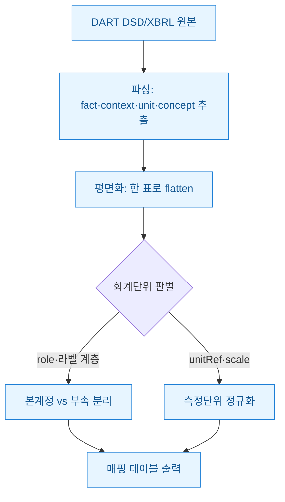
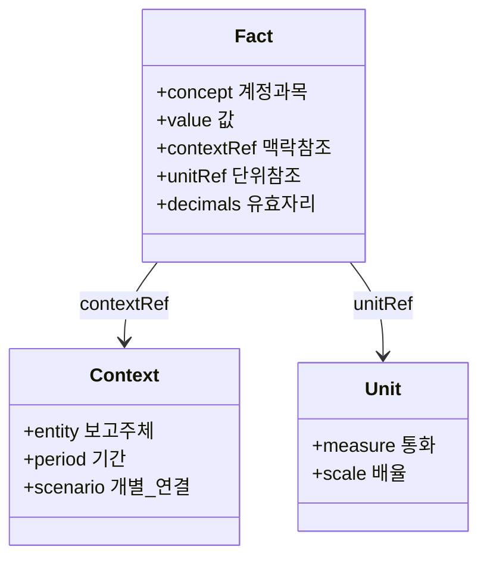
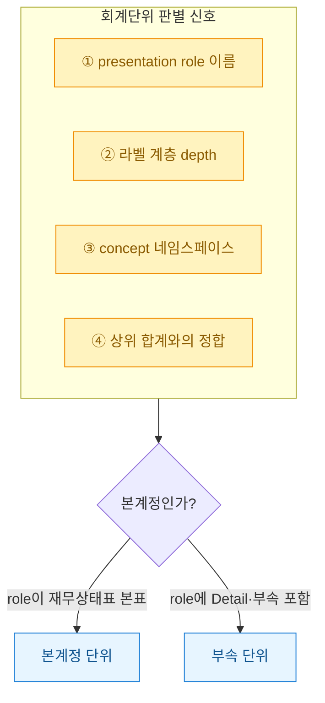

재무제표 하나를 XBRL(공시 데이터를 태그로 구조화한 표준 포맷)로 받아 파이썬으로 평면화(flatten, 계층 표를 한 장의 데이터프레임으로 펴는 것)했더니 숫자가 뒤죽박죽 섞여 나왔다. 처음엔 파싱이 틀린 줄 알았다. 그런데 원본을 뜯어보니 **한 보고서 안에 "회계단위"가 여러 개** 들어 있었다. 본계정(재무상태표 본표에 뜨는 계정)과 부속명세(그 계정을 다시 잘게 쪼갠 표), 개별과 연결, 게다가 표마다 측정단위(원/천원/백만원)까지 달랐다. 이걸 사람이 눈으로 구분하던 걸 자동으로 매핑하려니, "이 숫자가 어느 단위에 속하는가"를 먼저 복원해야 했다.

> 공개 DART/더미 데이터 기준이며, 특정 기업의 회계판단·투자권유가 아니다. 코드는 구조 예시다.

아래가 내가 잡은 전체 흐름이다. 파싱해서 펴는 것까지는 쉬웠고, 진짜 일은 **"회계단위 판별"** 한 칸에 다 몰려 있었다.



## 왜 XBRL을 그냥 펴면 숫자가 섞였나?

XBRL에서 숫자 하나(fact)는 혼자 서 있지 않는다. **어느 기간·어느 주체인지(context)**, **어느 단위로 잰 값인지(unit)**를 각각 참조(ref)로 물고 있다. 그래서 값만 뽑아 한 줄로 세우면 맥락이 다 떨어져 나간다. 데이터 모델을 이렇게 그려두면 "무엇을 복원해야 하는지"가 분명해진다.



핵심은 이거다. **fact 자체엔 "본계정이냐 부속이냐"가 안 적혀 있다.** 그 정보는 별도의 표시 계층(presentation linkbase, 계정을 어떤 순서·깊이로 보여줄지 정의한 뼈대)과 role(표의 성격을 나타내는 URI)에 흩어져 있다. 그래서 fact를 파싱한 뒤 role·라벨 계층을 다시 붙여줘야 회계단위가 살아난다.

```python
from lxml import etree
import pandas as pd

# 더미 XBRL 인스턴스에서 fact 추출 (구조 예시)
tree = etree.parse("dummy_instance.xml")
ns = {"link": "http://www.xbrl.org/2003/linkbase"}

rows = []
for el in tree.iter():
    if el.get("contextRef"):  # fact만 걸러냄
        rows.append({
            "concept": etree.QName(el).localname,
            "value": el.text,
            "contextRef": el.get("contextRef"),
            "unitRef": el.get("unitRef"),
            "decimals": el.get("decimals"),
        })
df = pd.DataFrame(rows)
```

## 본계정과 부속 단위는 무엇으로 구분했나?

한 신호만 믿으면 반드시 오분류가 난다. 나는 신호 네 개를 모아 투표하듯 판정하게 했다. 특히 **"상위 합계와의 정합"**(부속의 숫자를 다 더하면 본계정 값과 맞는지)이 마지막 안전장치였다. 라벨만 보면 헷갈리는 항목도 합이 맞으면 부속으로 확정할 수 있었다.



role URI에 `StatementOfFinancialPosition` 같은 표준 표는 본계정, `...Detail`·부속명세 성격의 role은 부속으로 1차 분류한다. 그다음 라벨 계층의 깊이(depth 0은 대개 본표 합계, depth가 깊어질수록 세부)를 보조로 쓴다.

| 판별 신호 | 본계정 쪽 | 부속 단위 쪽 |
|---|---|---|
| role URI | 표준 재무제표 표 | Detail·명세 성격 role |
| 라벨 depth | 얕음(합계) | 깊음(세부 항목) |
| concept 네임스페이스 | 표준 분류체계 | 회사 확장(ifrs-full 아님) |
| 합계 정합 | 부속 합의 목적지 | 더하면 본계정과 일치 |

## 측정단위(원/천원)는 어떻게 하나로 맞췄나?

회계단위가 갈리면 표시 배율도 갈린다. 본표는 백만원, 부속은 원 단위인 경우가 흔했다. 나는 unit과 `decimals` 속성을 근거로 전부 원 단위로 정규화한 뒤 매핑했다. 눈으로 "0 개수"를 세지 않고 배율을 명시적으로 곱해야 나중에 대사(對査)가 깨지지 않는다.

```python
SCALE = {"KRW_M": 1_000_000, "KRW_K": 1_000, "KRW": 1}

def to_won(value, unit_ref):
    v = float(str(value).replace(",", ""))
    return v * SCALE.get(unit_ref, 1)

df["value_won"] = df.apply(
    lambda r: to_won(r["value"], r["unitRef"]), axis=1
)

# 부속 합이 본계정과 맞는지 대사 (합성 예시)
main = df.query("bucket == '본계정' and concept == '유형자산'")["value_won"].sum()
sub  = df.query("bucket == '부속' and parent == '유형자산'")["value_won"].sum()
print("정합" if abs(main - sub) < 1 else f"차이 {main - sub:,.0f}원")
```

## 무엇을 배웠나?

가장 크게 데인 곳은 **"라벨 텍스트를 믿은 것"**이었다. 같은 "유형자산"이라도 본표의 유형자산과 부속명세 소계의 유형자산은 완전히 다른 회계단위인데, 문자열만 보면 똑같다. 결국 role과 계층, 그리고 합계 정합까지 겹쳐 봐야 했다.

교훈을 정리하면 이렇다.

- **fact 하나로 판단 금지** — role·계층·정합, 신호를 모아 투표하듯 판정한다.
- **단위 정규화를 먼저** — 원 단위로 펴놓고 비교해야 대사가 안 깨진다.
- **합계 정합이 최종 심판** — 애매한 항목은 "더해서 맞는지"로 확정한다.

다음엔 이 매핑 결과를 감사조서 템플릿(Excel)에 자동으로 흘려보내는 부분을 붙일 참이다. 회계단위만 정확히 갈라놓으면, 그 뒤 리드시트(leadsheet, 계정별 요약 조서) 채우기는 단순 조인 작업이 된다.
