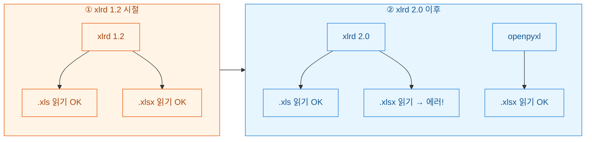
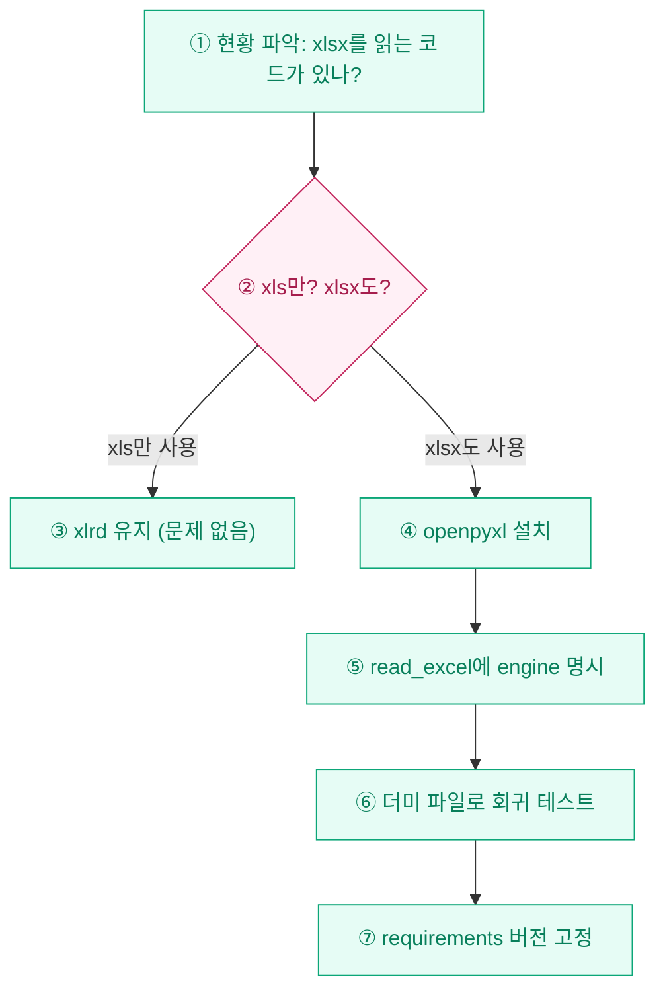

어느 아침, 잘 돌던 배치 스크립트가 갑자기 죽었다. 로그를 열어보니 `xlrd.biffh.XLRDError: Excel xlsx file; not supported`. 어제까지 멀쩡히 `.xlsx`를 읽던 코드가 오늘은 못 읽겠다고 파업을 선언한 것이다. 범인은 코드가 아니라 **xlrd 2.0** 업데이트였다. 이 사건 이후 나는 "엑셀 = 그냥 pandas로 읽으면 되지"라는 안일한 습관을 버리고, 확장자별로 어떤 엔진을 써야 하는지 머릿속에 지도를 그려두게 됐다.

## 왜 잘 되던 코드가 갑자기 깨졌나?

핵심 사실 하나만 기억하면 된다. **xlrd 2.0**부터는 **`.xls`(구형 바이너리)**만 읽고, **`.xlsx`(신형 XML)**는 아예 지원을 끊었다. 보안 이슈와 유지보수 부담 때문이었다.



즉 `pip install xlrd`로 최신판을 깔아둔 환경에서 `pd.read_excel("data.xlsx")`를 돌리면, pandas가 내부적으로 xlrd를 부르려다 실패하는 것이다. 코드는 그대로인데 라이브러리 버전이 발밑에서 바뀌어 있던 셈이다.

## 그래서 뭘 쓰라는 건가? — 확장자별 정답표

확장자와 목적(읽기/쓰기)에 따라 손이 가야 할 라이브러리가 정해져 있다. 표로 못 박아 두면 헷갈릴 일이 없다.

| 확장자 | 읽기(read) | 쓰기(write) | 비고 |
|---|---|---|---|
| `.xls` (구형) | **xlrd** | xlwt | 2007 이전 포맷, 65,536행 제한 |
| `.xlsx` (신형) | **openpyxl** | **openpyxl** | 현재 표준, 대용량 OK |
| `.xlsm` (매크로) | openpyxl | openpyxl | `keep_vba=True` 옵션 |
| `.xlsb` (바이너리) | **pyxlsb** | (미지원) | 별도 엔진 필요 |

정리하면 **읽기(read)**는 "xls면 xlrd, xlsx면 openpyxl"이고, **쓰기(write)**는 사실상 **openpyxl**하나로 통일해도 무방하다. 요즘 새로 만드는 파일을 굳이 구형 `.xls`로 저장할 일은 거의 없기 때문이다.

## pandas에서는 어떻게 명시적으로 지정하나?

가장 안전한 방법은 pandas에게 **엔진(engine)**을 직접 알려주는 것이다. 자동 추론에 맡기지 말고 손으로 못을 박자.

```python
import pandas as pd

# 구형 xls → xlrd 엔진 명시
df_old = pd.read_excel("legacy_report.xls", engine="xlrd")

# 신형 xlsx → openpyxl 엔진 명시
df_new = pd.read_excel("2026_sales.xlsx", engine="openpyxl")

# 확장자가 섞여 들어오는 폴더를 자동 분기 처리
from pathlib import Path

def smart_read(path: str) -> pd.DataFrame:
    ext = Path(path).suffix.lower()
    engine = "xlrd" if ext == ".xls" else "openpyxl"
    return pd.read_excel(path, engine=engine)

# 더미 데이터로 동작 확인
for name in ["dummy_a.xls", "dummy_b.xlsx"]:
    print(name, "→ engine:", "xlrd" if name.endswith(".xls") else "openpyxl")
```

`engine`을 명시하면 나중에 라이브러리 버전이 또 바뀌어도 "누가 이 파일을 읽는가"가 코드에 남아 있어 디버깅이 훨씬 빠르다.

## 기존 코드를 어떻게 안전하게 갈아타나?

이미 xlrd에 의존하던 레거시 프로젝트라면, 무작정 버전을 올리기 전에 순서를 지켜야 한다. 내가 실제로 밟은 마이그레이션 경로는 이렇다.



특히 마지막 **버전 고정(pinning)**이 중요하다. `requirements.txt`에 아래처럼 못을 박아두면, 다음번 `pip install`이 조용히 xlrd를 2.0으로 올려서 새벽 배치를 또 깨뜨리는 참사를 막을 수 있다.

```text
xlrd==1.2.0      # xls 전용, 굳이 올리지 않음
openpyxl>=3.1    # xlsx 읽기·쓰기 표준
pandas>=2.0
```

만약 정말로 xlrd 1.2로 xlsx를 계속 읽어야 하는 사정이 있다면 버전을 1.2에 묶어둘 수도 있지만, 보안·유지보수 측면에서 권하지 않는다. 신형 파일은 openpyxl로 보내는 게 정공법이다.

## 한 줄 요약

- **읽기**: `.xls`는 **xlrd**, `.xlsx`는 **openpyxl**. 헷갈리면 `engine=`으로 명시.
- **쓰기**: 그냥 **openpyxl**로 통일.
- **깨졌다면**: 십중팔구 xlrd 2.0이 xlsx를 버린 탓. 당황 말고 엔진만 바꾸면 된다.

라이브러리는 언제든 발밑에서 바뀔 수 있다. "잘 되니까 됐다"가 아니라, 확장자와 엔진의 짝을 코드에 명시적으로 남겨두는 습관 하나가 새벽에 울리는 알림을 줄여준다.
