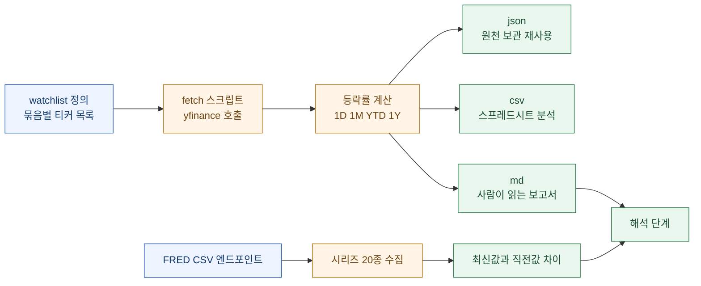
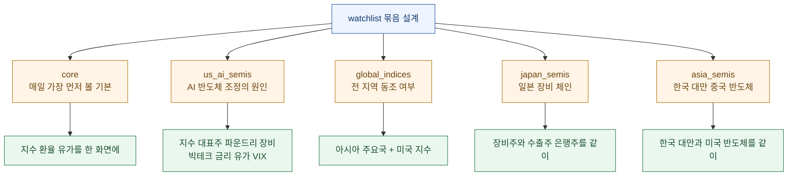
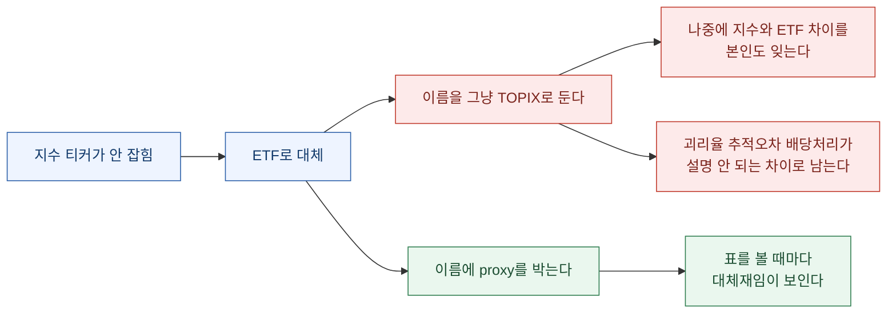
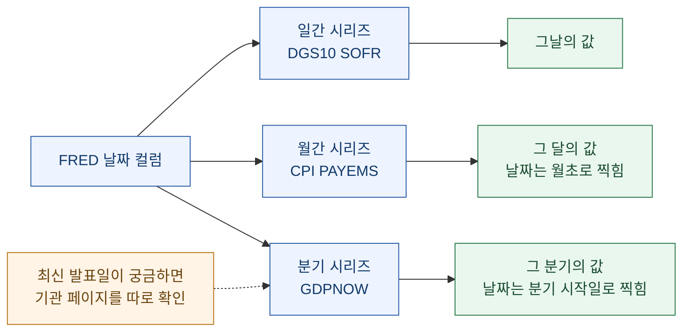
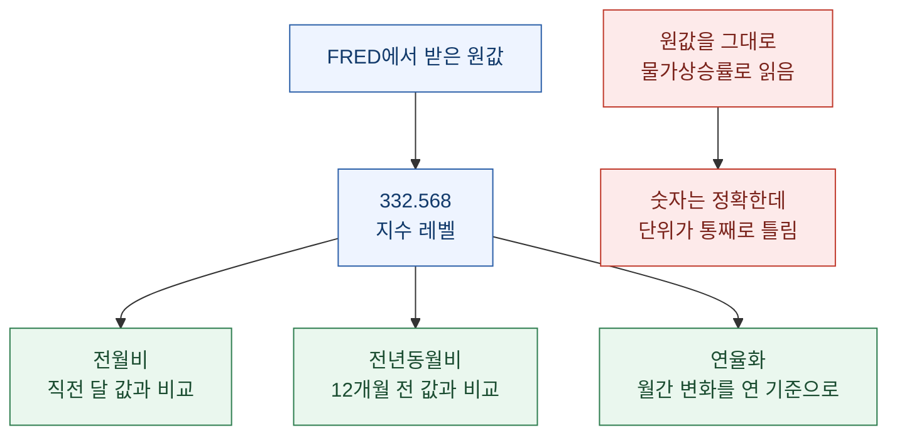
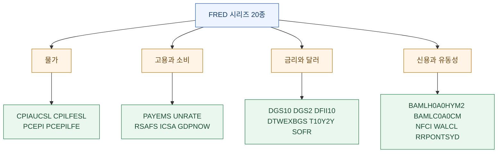

시장 데이터를 매일 손으로 확인하는 게 지겨워서 파이썬으로 긁어오는 스크립트를 짰다. 미국 AI 반도체, 아시아 지수, 일본 반도체 장비주, 미국 거시지표까지 한 번에 갱신하는 게 목표였다.

만들고 나서 남은 감상은 예상과 달랐다. **어려웠던 건 데이터를 가져오는 일이 아니라, 가져온 게 내가 생각한 그것인지 확인하는 일이었다.**

밟은 함정이 네 개인데, 성격이 이렇게 갈렸다.

| 함정 | 증상 | 알아채기 |
|---|---|---|
| TOPIX 지수 티커 | 값이 **안 나옴** | 쉬움 — 빈 결과가 바로 보인다 |
| 금리 티커 단위 | 값이 나오는데 **단위가 다름** | 어려움 |
| GDPNow 날짜 | 값이 나오는데 **날짜 뜻이 다름** | 어려움 |
| CPI 시계열 | 값이 나오는데 **증가율이 아님** | 어려움 |

**넷 중 셋은 에러가 안 난다.** 스크립트는 성공했다고 하고, 표에는 숫자가 채워져 있고, 그 숫자가 틀린 것도 아니다. 다만 내가 그 숫자를 다른 것으로 읽고 있을 뿐이다.

이 글은 그 파이프라인의 설계와, 조용히 틀리는 지점들을 정리한 것이다. 코드보다 **판단**에 무게를 뒀다.

## 파이프라인 전체를 한 장으로 보면 어떻게 되나?



핵심 설계 결정이 두 개 있었다.

**첫째, 출력을 세 형식으로 동시에 낸다.** 같은 실행에서 `json`, `csv`, `md`를 모두 만든다. 하나만 만들면 반드시 나중에 다른 게 필요해지고, 그때 다시 긁어오면 **그 사이에 값이 바뀌어 있다.** 재현이 안 되는 순간 분석이 아니라 관찰기록이 된다.

| 형식 | 용도 |
|---|---|
| `.json` | 원천 데이터 보관, 다른 자동화에서 재사용 |
| `.csv` | 엑셀·스프레드시트 분석용 |
| `.md` | 사람이 읽는 보고서용 |

**둘째, 파일명에 날짜를 박는다.**

```txt
output/yfinance_{watchlist_slug}_{YYYY-MM-DD}.json
output/yfinance_{watchlist_slug}_{YYYY-MM-DD}.csv
output/_yfinance_{watchlist_slug}_{YYYY-MM-DD}.md
```

덮어쓰지 않는다는 뜻이다. 시장 데이터는 **같은 티커라도 어제 값과 오늘 값이 다르고, 어제 시점에 내가 뭘 보고 판단했는지가 나중에 중요해진다.** 마크다운 파일명 앞에만 밑줄을 붙인 건 정렬했을 때 사람이 읽을 파일이 위로 올라오게 하려는 것이다.

## watchlist를 왜 묶음으로 나눴나?

티커를 한 덩어리로 두지 않고 목적별 묶음으로 나눴다. 이게 나중에 해석 단계에서 값을 한다.



묶음마다 **답하려는 질문이 다르다.**

| 묶음 | 답하려는 질문 |
|---|---|
| `core` | 오늘 전반적으로 무슨 일이 있었나 |
| `us_ai_semis` | 반도체가 빠졌다면 원인이 반도체 안인가 밖인가 |
| `global_indices` | 이게 특정 지역 문제인가 전 지역 문제인가 |
| `japan_semis` | 장비 체인까지 번졌나 |
| `asia_semis` | 한국·대만이 미국과 같이 움직였나 |

실행은 쉼표로 조합한다.

```powershell
python scripts/fetch_yfinance_asia.py --watchlist core,japan_semis,asia_semis --period 1y
```

여기서 배운 것 하나. **묶음을 잘게 나눠 두면 조합해서 부를 수 있지만, 크게 뭉쳐 두면 쪼갤 수 없다.** 처음에 "다 한 번에 가져오면 되지"라고 생각했다가 나중에 "일본 장비주만 빠르게 보고 싶다"가 됐을 때 후회했다.

`us_ai_semis` 묶음에는 반도체 종목만 넣지 않고 **금리·유가·VIX·달러지수까지 같이 넣었다.** 이유는 하나다 — 반도체가 빠진 원인이 반도체 밖에 있을 때가 많은데, **화면이 갈라져 있으면 그걸 못 본다.**

| 티커 | 이름 | 이 묶음에 넣은 이유 |
|---|---|---|
| `^SOX` | PHLX Semiconductor | 미국 반도체 전체 심리 |
| `NVDA` | NVIDIA | AI 수요 최종 확인 지표 |
| `AVGO` | Broadcom | AI 네트워크·ASIC |
| `AMD` | AMD | AI GPU 경쟁축 |
| `MU` | Micron | 메모리·HBM 사이클 |
| `TSM` | TSMC ADR | 글로벌 파운드리 |
| `ASML` | ASML ADR | 반도체 장비·EUV |
| `MSFT` `META` `AMZN` `GOOGL` | 빅테크 | AI 데이터센터 capex = 칩의 최종 수요처 |
| `^TNX` | 미국 10년물 | 성장주 할인율 |
| `^VIX` | 변동성지수 | 위험회피 |
| `CL=F` `BZ=F` | WTI·브렌트 | 물가·금리 부담 |
| `DX-Y.NYB` | 달러지수 | 글로벌 유동성 |

## 계산 컬럼은 어디까지 정직한가?

스크립트가 계산하는 등락률은 네 개다. 그리고 **셋은 근사값이다.**

| 컬럼 | 계산 방식 | 정확한가 |
|---|---|---|
| `d1_pct` | 마지막 종가 / 직전 종가 - 1 | ✅ 정확 |
| `m1_pct` | 마지막 종가 / 약 22거래일 전 종가 - 1 | 🟡 **근사** |
| `ytd_pct` | 마지막 종가 / 해당 연도 첫 종가 - 1 | ✅ 정확 |
| `y1_pct` | 마지막 종가 / 약 252거래일 전 종가 - 1 | 🟡 **근사** |

22거래일과 252거래일은 각각 한 달과 한 해의 **평균 거래일 수**다. 달력상 정확히 한 달 전, 1년 전이 아니다.

이걸 근사로 둔 건 의도적이다. 정확한 달력 기준으로 하면 **그날이 휴장일일 때 처리를 또 해야 하고**, 나라마다 휴장일이 다르니 한국·일본·대만·미국이 섞인 표에서는 기준이 어긋난다. 거래일 수로 세면 모든 시장에서 같은 방식이 된다.

다만 **알고 쓰는 것과 모르고 쓰는 것은 다르다.** 이 표의 `1M`은 "한 달 전 대비"가 아니라 "22거래일 전 대비"다. 월초·월말 경계에서 다른 데이터와 비교할 때는 이 차이가 나온다. 그래서 매뉴얼에 계산식을 그대로 적어 뒀다.

**계산식을 적어 두는 것과 결과만 적어 두는 것의 차이가 여기서 갈린다.** 결과만 있으면 나중에 "이 수치가 왜 다른 데랑 다르지?"에서 멈추고, 계산식이 있으면 "아 근사구나"에서 끝난다.

## 티커 표기법은 접미사가 전부다

yfinance는 접미사로 시장을 구분한다. 이걸 표로 정리해 두니 새 종목 추가가 빨라졌다.

| 표기 | 의미 | 예시 |
|---|---|---|
| `^` | 지수 | `^SOX`, `^GSPC`, `^N225` |
| `.T` | 일본 도쿄거래소 | `8035.T`, `6857.T` |
| `.KS` | 한국 코스피 | `005930.KS`, `000660.KS` |
| `.KQ` | 한국 코스닥 | 필요 시 |
| `.TW` | 대만 | `2330.TW`, `2454.TW` |
| `.HK` | 홍콩 | `0700.HK`, `9988.HK` |
| `.SS` | 중국 상하이 | `000001.SS` |
| `.SZ` | 중국 선전 | `399001.SZ`, `300750.SZ` |
| `=X` | 환율 | `JPY=X`, `KRW=X` |
| `=F` | 선물 | `CL=F`, `BZ=F` |

여기서 미리 말해 둘 게 있다. **접미사 규칙을 안다고 티커가 항상 존재하는 건 아니다.** 이게 다음 절의 함정이다.

## 함정 ①: 지수 티커가 없을 때 무엇으로 대체하나

일본 TOPIX를 넣으려고 `^TOPX`를 썼다. 값이 안 나왔다. `^TPX`도 써 봤다. 역시 안 나왔다.

| 티커 | 결과 |
|---|---|
| `^TOPX` | 가격 데이터 없음 |
| `^TPX` | 가격 데이터 없음 |
| `1306.T` | ✅ 정상 수집 |
| `1348.T` | ✅ 정상 수집 |

`1306.T`는 TOPIX를 추종하는 **ETF**다. 지수 자체가 아니다.

그래서 스크립트에서는 `^TOPX` 대신 `1306.T`를 쓰고, **이름을 `TOPIX ETF proxy`로 명시**했다. 이게 이 함정에서 배운 진짜 교훈이다.



ETF는 지수와 **완전히 같지 않다.** 추적오차가 있고, 배당 처리 방식이 다르고, 거래시간과 유동성이 다르다. 대부분의 날에는 차이가 무시할 만하지만 **차이가 나는 날에 그게 왜 다른지 설명할 수 없으면** 그 표는 못 믿는 표가 된다.

이름에 `proxy`를 박아 두면 표를 볼 때마다 그 사실이 눈에 들어온다. **주석은 파일 어딘가에 있고 이름은 매번 보인다.**

같은 원칙을 다른 데도 적용했다. 지수 대신 ETF를 쓴 자리, 현물 대신 선물을 쓴 자리, 본국 상장 대신 ADR을 쓴 자리는 전부 이름에 표시했다. `TSM`은 대만 상장 `2330.TW`가 아니라 **TSMC ADR**이고, `ASML`도 ADR이다. 미국 장 시간에 움직이는 값이라 대만·유럽 본국 종가와 시점이 다르다.

## 함정 ②: 값이 나오는데 단위가 다르다

`^TNX`는 미국 10년물 국채 금리다. 여기서 실수가 났다.

처음에 라벨에 `x10` 같은 표기를 붙여 뒀었다. 스케일 변환을 기억하려고 적어 둔 메모였는데, **표에 그대로 출력되면서 오히려 혼동을 만들었다.** 표에 `4.641`이라는 숫자와 `x10`이라는 라벨이 같이 있으면, 이게 4.641%인지 46.41%인지 0.4641%인지 읽는 사람이 매번 계산해야 한다.

**메모를 라벨에 넣으면 안 된다.** 라벨은 그 값이 무엇인지 말하는 자리지, 그 값을 어떻게 가공해야 하는지 말하는 자리가 아니다. 그래서 `^TNX`, `^IRX` 라벨에서 `x10`, `x100` 표현을 전부 뺐다.

이 함정이 첫 번째 것보다 나쁜 이유는 명확하다.

| 구분 | 함정 ① TOPIX | 함정 ② 단위 |
|---|---|---|
| 증상 | 값이 안 나옴 | 값이 나옴 |
| 발견 | 즉시 | 나중에, 또는 영원히 안 함 |
| 결과 | 진행이 막힘 | **잘못된 판단이 진행됨** |

값이 안 나오면 멈춘다. 값이 나오면 **그대로 간다.** 10년물이 4.6%인지 46%인지 헷갈린 채로 "금리가 성장주 밸류에이션에 부담"이라는 문장을 쓰면, 문장은 그럴듯한데 근거가 없다.

## 함정 ③: 날짜가 발표일이 아니다

FRED로 넘어가면 다른 종류의 함정이 나온다.

FRED는 미국 연준·경제 데이터의 표준 소스 중 하나이고, **별도 API 키 없이도 CSV 엔드포인트로 많은 시계열을 가져올 수 있다.**

```txt
https://fred.stlouisfed.org/graph/fredgraph.csv?id={SERIES_ID}
```

이게 꽤 편하다. 인증 없이 URL 하나로 되니까 파이썬 표준 라이브러리만으로 끝난다.

```python
import csv, io, urllib.request

series = {
    "CPIAUCSL": "CPI all items",
    "DGS10": "10Y Treasury yield",
    "BAMLH0A0HYM2": "HY OAS",
    "GDPNOW": "GDPNow",
    # ...
}

for sid, name in series.items():
    url = f"https://fred.stlouisfed.org/graph/fredgraph.csv?id={sid}"
    text = urllib.request.urlopen(url, timeout=20).read().decode("utf-8-sig")
    rows = [
        (r["observation_date"], r[sid])
        for r in csv.DictReader(io.StringIO(text))
        if r.get(sid) not in (None, "", ".")
    ]
    last, prev = rows[-1], rows[-2]
    diff = float(last[1]) - float(prev[1])
    print(f"{sid}\t{name}\t{last[0]}\t{last[1]}\tdiff {diff:.4f}")
```

두 가지 처리가 들어가 있다. `utf-8-sig`로 디코딩하는 건 **BOM 때문**이고, `"."`을 걸러내는 건 FRED가 **결측치를 점 하나로 표기**하기 때문이다. 둘 다 안 하면 첫 컬럼명이 깨지거나 `float()`에서 터진다.

그리고 여기서 함정이 나왔다. **GDPNow의 날짜가 `2026-04-01`로 찍혔다.**

7월에 돌린 스크립트인데 4월 1일 데이터가 최신이라고 나오면, 반사적으로 "석 달째 업데이트가 안 됐나" 싶어진다. 아니다. **FRED에서 GDPNow는 분기 관측치 날짜로 표시되므로 `2026-04-01`은 2026년 2분기 관측치를 뜻한다.** 발표일이 아니라 그 값이 가리키는 **기간의 시작일**이다.



같은 규칙이 월간 지표에도 적용된다. CPI가 `2026-06-01`로 찍혀 있으면 6월 1일 값이 아니라 **6월 한 달의 값**이고, 실제 발표는 7월 중순쯤 이뤄진다. 그래서 매뉴얼에 이렇게 적어 뒀다 — **최신 발표 일자가 필요하면 애틀랜타 연준 페이지에서 별도로 확인하는 것이 좋다.**

## 함정 ④: 지수값과 증가율은 다르다

마지막 함정이 가장 조용하다.

FRED에서 `CPIAUCSL`을 가져오면 이런 값이 나온다.

| Series ID | 지표 | 최신일 | 최신값 | 직전값 | 변화 |
|---|---|---:|---:|---:|---:|
| `CPIAUCSL` | CPI all items | 2026-06-01 | 332.568 | 333.979 | -1.411 |
| `CPILFESL` | Core CPI | 2026-06-01 | 336.065 | 336.121 | -0.056 |
| `PCEPI` | PCE price index | 2026-05-01 | 131.527 | 130.938 | +0.589 |
| `PCEPILFE` | Core PCE price index | 2026-05-01 | 130.082 | 129.667 | +0.415 |

`332.568`은 물가상승률이 아니다. **지수값이다.** 기준 시점을 100으로 놓고 물가 수준이 얼마나 됐는지를 나타내는 값이지, 전월비도 전년비도 아니다.

뉴스에서 보는 "CPI 전년동월비 3.1%"는 이 지수값을 **12개월 전 값과 비교해 계산한 것**이다. FRED가 그 계산을 대신 해 주지 않는다.



내 스크립트는 최신값과 직전값의 **차이**만 찍는다. 위 표의 `-1.411`이 그것이다. 이건 "전월 대비 지수가 1.411포인트 내렸다"는 뜻이고, 퍼센트로 환산하려면 한 단계가 더 필요하다.

이 정도면 충분하다고 판단해서 그대로 뒀다. 방향(올랐나 내렸나)은 이걸로 알 수 있고, **정확한 상승률이 필요한 순간에는 어차피 원문 발표자료를 봐야 하기 때문**이다. 다만 매뉴얼에는 못 박아 뒀다 — **FRED는 시계열 값이고, 전월비·전년비 해석은 별도 계산이 필요하다.**

여기서 일반화할 수 있는 원칙이 하나 나온다. **자동화가 편해질수록, 그 숫자가 무엇인지 적어 두는 일이 더 중요해진다.** 손으로 가져올 때는 가져오는 과정에서 그게 뭔지 알게 되는데, 자동으로 오면 그 과정이 사라진다.

## 어떤 시리즈를 모았나

FRED에서 가져오는 20개 시리즈를 네 계층으로 나눴다.



계층을 나눈 이유는 **해석 순서 때문**이다. 시장이 흔들릴 때 물가 → 고용 → 금리 → 신용 순으로 좁혀 가면 "이게 물가 문제인지, 경기 문제인지, 시스템 문제인지"가 갈린다. 특히 마지막 신용·유동성 계층은 **평소에는 안 봐도 되지만 봐야 할 때는 가장 중요한** 지표들이다.

시리즈 ID를 몇 개 적어 둔다. FRED는 ID만 알면 URL이 완성되므로, **ID 목록이 곧 자산이다.**

| Series ID | 지표 | 이 계층에 넣은 이유 |
|---|---|---|
| `DGS10` | 10년물 국채금리 | 성장주 할인율 |
| `DGS2` | 2년물 국채금리 | 연준 정책 기대 |
| `DFII10` | 10년물 TIPS 실질금리 | 성장주 밸류에이션의 실질 부담 |
| `T10Y2Y` | 10년물과 2년물 격차 | 경기·금리 사이클 |
| `BAMLH0A0HYM2` | 하이일드 스프레드 | 위험기업 자금조달 상태 |
| `BAMLC0A0CM` | 투자등급 회사채 스프레드 | 우량기업까지 번졌는지 |
| `NFCI` | 시카고 연준 금융여건지수 | 유동성 압박 여부 |
| `ICSA` | 신규 실업수당 청구 | 고용 냉각의 가장 빠른 신호 |

## yfinance는 어디까지 믿을 수 있나

솔직하게 적어 둘 부분이 있다. **yfinance는 야후 파이낸스의 비공식 엔드포인트를 쓴다.**

| 항목 | 내용 |
|---|---|
| 장점 | 빠르게 구현 가능, 티커만 알면 주가·지수·환율·원유 확인 가능 |
| 단점 | 상업·운영용 확정 데이터로는 부족할 수 있음 |
| 대안 | 일본 주식은 장기적으로 JPX/J-Quants 공식 API 전환 권장 |

"비공식"이 뜻하는 건 두 가지다. **언제든 바뀔 수 있고, 바뀌어도 아무도 알려주지 않는다.** 이번에 TOPIX 티커가 안 잡힌 것도 그런 종류의 일이다.

그래서 이 파이프라인의 위치를 명확히 정했다.

| 용도 | 적합한가 |
|---|---|
| 매일 시장 흐름 파악 | ✅ 충분 |
| 개인 학습·기록 | ✅ 충분 |
| 방향과 대략적 크기 확인 | ✅ 충분 |
| 정밀한 수익률 계산 | ❌ 부적합 |
| 상업 서비스 데이터 소스 | ❌ 부적합 |
| 규제·보고 목적 | ❌ 부적합 |

**도구를 쓰는 것보다 도구의 등급을 아는 게 먼저다.** 무료 비공식 API로 만든 표를 근거로 정밀한 결론을 내리면, 도구가 문제가 아니라 내가 문제다.

## 앞으로 고칠 것

만들고 나서 보이는 개선점들을 적어 뒀다. 이런 목록은 적어 두지 않으면 다음에 열었을 때 처음부터 다시 생각하게 된다.

| 개선 | 내용 | 우선순위 |
|---|---|---|
| 공식 API 전환 | 일본 주식은 J-Quants 공식 API로 | 중 |
| 자동 스케줄링 | 매일 장 마감 후 자동 수집 | 상 |
| FRED 스크립트 파일화 | 지금은 인라인 파이썬, 별도 스크립트로 분리 | 상 |
| 차트 생성 | 등락률 시각화 | 하 |
| 대시보드 | 정적 HTML 또는 대시보드 프레임워크 | 하 |
| 경고 기준 자동화 | 특정 임계치 도달 시 알림 | **상** |
| 한국 데이터 연결 | 한국은행 ECOS, DART, 수출입 통계 API | 중 |

우선순위를 이렇게 매긴 이유가 있다. **차트와 대시보드는 보기 좋아지는 일이고, 스케줄링과 경고는 안 보고 있을 때를 대비하는 일이다.**

오늘 오전에 다른 글을 쓰면서 정리한 교훈이 여기에 그대로 걸린다. 로그를 남기는 일과 로그를 읽는 일은 다른 예산 항목이고, **데이터를 모으는 일과 그걸 볼 시점을 정하는 일도 다른 항목이다.** 매일 수집되는데 아무도 안 보면 그건 수집이 아니라 축적이다.

## 정리하면

파이프라인 자체는 하루면 만든다. yfinance는 `pip install` 한 줄이고 FRED는 인증도 필요 없다. **어려운 건 그 다음이었다.**

| 함정 | 일반화하면 |
|---|---|
| TOPIX 지수 티커 부재 | **대체재를 썼으면 이름에 그렇게 적어라.** 주석은 묻히고 이름은 매번 보인다 |
| 금리 티커 단위 라벨 | **라벨은 그 값이 무엇인지 말하는 자리다.** 가공 방법을 적는 자리가 아니다 |
| GDPNow 날짜 | **날짜 컬럼이 발표일인지 관측 기간인지 확인해라.** 둘은 몇 달씩 차이 난다 |
| CPI 지수값 | **자동으로 오는 숫자일수록 그게 뭔지 적어 둬라.** 손으로 가져올 때 알게 되던 걸 잃는다 |

넷을 관통하는 문장은 하나다.

**수집이 성공했다는 것과 내가 원한 걸 가져왔다는 것은 다른 명제다.** 그리고 스크립트는 앞의 것만 검사한다.

이 시리즈는 세 편이다. 이번 편이 **수집**이고, 다음 편은 그렇게 모은 데이터로 **"반도체가 빠졌을 때 원인을 5단계로 좁히는 법"**, 마지막 편은 **"한국 지표와 미국 지표를 한 묶음으로 보는 지도"**를 다룬다.

> 이 글은 개인 학습·기록 목적의 데이터 도구 구축기다. 특정 종목·상품에 대한 투자 권유나 자문이 아니며, 인용된 시장 데이터는 특정 시점의 값이다.

---

### 참고 링크

- [yfinance (PyPI)](https://pypi.org/project/yfinance/)
- [FRED — DGS10 (10Y Treasury)](https://fred.stlouisfed.org/series/DGS10) · [DFII10 (실질금리)](https://fred.stlouisfed.org/series/DFII10) · [CPIAUCSL](https://fred.stlouisfed.org/series/CPIAUCSL) · [ICSA](https://fred.stlouisfed.org/series/ICSA) · [HY OAS](https://fred.stlouisfed.org/series/BAMLH0A0HYM2) · [NFCI](https://fred.stlouisfed.org/series/NFCI)
- [Atlanta Fed GDPNow](https://www.atlantafed.org/research-and-data/data/gdpnow)
- [한국은행 ECOS](https://ecos.bok.or.kr/) · [OpenDART](https://opendart.fss.or.kr/) · [한국무역협회 K-Stat](https://stat.kita.net/) · [한국부동산원 R-ONE](https://www.reb.or.kr/r-one)
