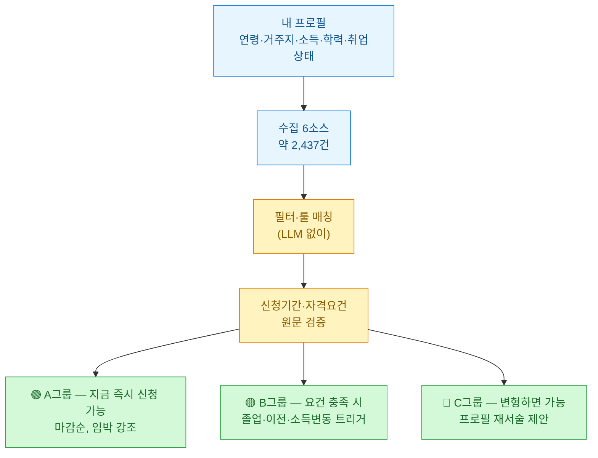
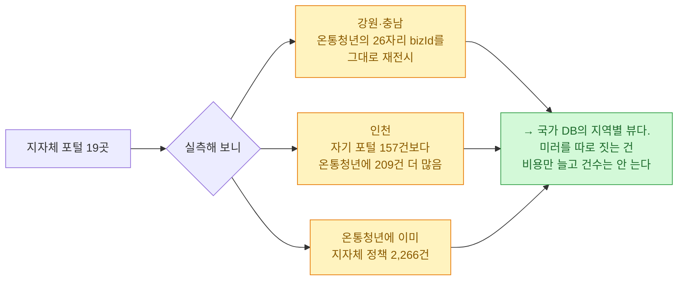
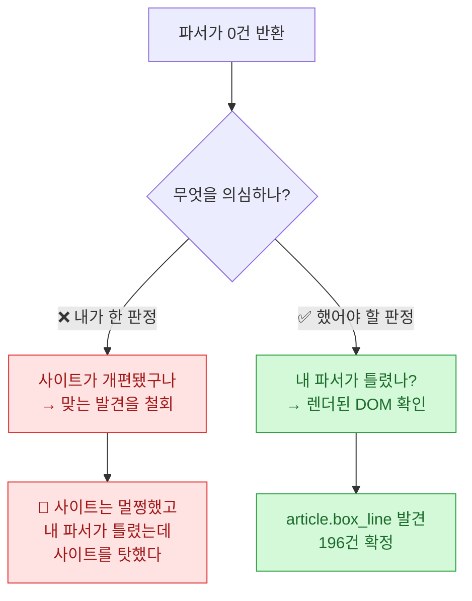

한국 **청년정책 전수조사 스킬**을 만들어 공개했다([DBhyeong/youth-search](https://github.com/DBhyeong/youth-search), MIT). 온통청년·복지로·고용24·청년일경험·마이홈을 긁어서, 내 프로필(연령·거주지·소득·학력·취업상태)에 맞는 정책만 골라 3단계로 분류해 주는 물건이다.

오늘 하루에 **28개 파일, 4,134줄**을 커밋했다. 그중 파이썬이 2,105줄.

그런데 이 글에서 정말 남기고 싶은 건 만든 것보다 **틀린 것**이다. 두 번 틀렸는데 **두 번째가 훨씬 나빴다.**

## 뭘 만들었나



실측한 소스 현황이다. 전부 실제로 호출해서 받은 값이다.

| 소스 | 형태 | 건수 | 한 번에? |
|---|---|---|---|
| **온통청년** | JSON, **79필드** | 2,650 → **유효 710** | ✅ `listCount=3000` |
| 청년일경험 | HTML | **567** | ✅ |
| 고용24 취업프로그램 | HTML | **267** | ✅ |
| 고용24 K-디지털트레이닝 | HTML | **399** | ✅ |
| 복지로 | JSON, 14필드 | 청년 **381** | ❌ 9건 고정 |
| 마이홈 모집공고 | JSON, 47필드 | 18,459 → **모집중 128** | ❌ 5건 고정 |

일괄 실행하면 **약 2,437건**이 들어온다.

## 반드시 알아야 할 함정 두 개

### ① 마감이 73%다

이게 제일 컸다. 온통청년 2,650건 중 **1,940건이 이미 마감**이다.

```
마감    1,940건  ██████████████████████████████████░░░░░░  73%
상시      439건
진행중    271건
                 → 유효한 건 710건뿐
```

**필터 없이 그대로 보여주면 사용자에게 죽은 정책을 4건 중 3건 보여주게 된다.** 청년정책 앱들이 종종 답답한 이유가 여기 있는 것 같다. 목록은 많은데 눌러보면 마감이다.

### ② '전라남도'로 조회하면 0건이 나온다

이건 진짜 함정이었다.

```python
STDG_CTPV_NM="전라남도"       → 0건        # 조용히 사라진다
STDG_CTPV_NM="전남광주통합특별시" → 751건
```

**행정구역이 병합돼 있는데 API는 그걸 알려주지 않는다.** "전라남도"로 물으면 에러가 아니라 **빈 배열**이 온다. 751건이 조용히 증발한다. 광주도 마찬가지다.

에러가 났으면 바로 알았을 텐데 0건은 "그런 정책이 없나 보다"로 읽힌다. **가장 나쁜 실패는 조용한 실패다.** 그래서 지역 정규화 함수를 만들고 반드시 거치게 했다.

## 수집을 잘하려 하지 않았다

이게 이 프로젝트의 설계 판단이었고, 지금도 잘한 결정이라고 생각한다.

크롤러를 만들면 보통 수집에 힘을 준다. 페이지 루프 돌리고, 재시도 붙이고, 병렬로 긁고. 그런데 **온통청년을 열어 보니 수집이 이미 풀려 있었다.**

| 계층 | 온통청년은 | 그래서 |
|---|---|---|
| 수집 | 1콜에 **2,650건 × 79필드** (`listCount` 상한 없음) | **페이지 루프를 안 만들었다** |
| 자격요건 | **필드로 이미 구조화** | 상세 원문을 LLM이 읽을 필요가 없다 |
| 매칭 | 연령·소득·학력·취업상태가 전부 값 | **결정론적 룰 매칭이 성립한다** |

`listCount=3000` 하나면 전부 온다. 페이지네이션을 만들 이유가 없었다.

**그래서 엔지니어링의 무게를 뒤쪽으로 옮겼다** — 필터, 매칭, 지역 정규화. 소스가 이미 해결해 준 걸 다시 만드는 건 그냥 낭비다.

특히 **프로필 축이 100% 채워져 있다**는 게 결정적이었다.

| 필드 | 채움 |
|---|---|
| 최소/최대 연령 | **100%** |
| 전공 조건 | **100%** |
| 신청기간 구분(마감/상시/진행중) | **100%** |

연령·소득·혼인·학력·취업상태·전공이 전부 값으로 존재한다. **그러면 LLM이 필요 없다.** SQL이나 pandas로 거르면 된다.

그래서 LLM은 **룰이 끝난 뒤에만** 쓴다 — 변형 가능성 찾기(C그룹)와 중복 접기. 이건 규칙으로 안 되는 일이니까. **LLM을 쓸 수 있다는 것과 써야 한다는 건 다르다.**

⚠️ 단 **이건 온통청년 한정**이다. 복지로는 9건/페이지 고정이라 정말로 684페이지를 돌아야 하고, 목록에 자격요건이 없어서 상세 원문을 따로 읽어야 한다. 마이홈도 5건 고정이다. **소스마다 무게중심이 다르다.**

## 지자체 포털 19곳은 안 붙였다

경기·서울·부산… 지자체마다 청년포털이 있다. 처음엔 다 붙일 생각이었다. **19개를 서브에이전트 39개로 병렬 프로브**해서 실측하고 나서 생각이 바뀌었다.



**인천이 웃겼다.** 자기 포털에 157건 올려놓고 온통청년엔 209건을 올려놨다. 지자체 포털을 긁으면 **오히려 덜 가져온다.**

강원과 충남은 아예 온통청년의 **26자리 `bizId`를 그대로 재전시**하고 있었다. 같은 DB의 다른 화면이라는 뜻이다.

**커넥터를 19개 안 만든 게 이 프로젝트에서 제일 큰 절약**이었을 거다. 그리고 그 판단이 감이 아니라 실측이라는 게 중요하다. 근거는 저장소에 남겨 뒀다.

그리고 **robots.txt가 금지한 3곳(경기·전남·세종)은 크롤하지 않는다.** 긁을 수 있어도 안 긁는 게 맞다.

## 제가 두 번 틀렸고, 두 번째가 훨씬 나빴습니다

여기가 이 글의 핵심이다.

**1차 — "취업프로그램 196건"이라고 보고했다.** `<li>` 개수를 산술로 역산해서 뽑은 숫자였다.

```
resultCnt=10  → li 305    기저 li = 305 - 10×4 = 265
resultCnt=100 → li 665    265 + 100×4 = 665  ✓
resultCnt=500 → li 1049   (1049-265)/4 = 196
```

**결과적으로 맞았다.** 다만 "항목당 li가 4개"라는 가정 위에 세운 거라 근거가 약했다.

**2차 — 그 196건을 철회했다.** 파서를 제대로 짜서 돌렸더니 **0건**이 나왔다. 그래서 "아, 결과 없는 랜딩 페이지구나" 판정하고 앞선 발견을 취소했다.

**이게 틀렸다.**

**3차 — CDP로 렌더된 DOM에 직접 물어봤다.**

```
DIV class="side_inner type02 col2"   kids: 50   ← resultCnt=50과 정확히 일치
kidTags: ["ARTICLE.box_line"]
```

카드가 **`<article class="box_line">`**이었다. `<li>`도 `<tr>`도 아니었다. **내 정규식이 전부 놓치고 있었던 거다.** 확인해 보니 196건이 맞았다.



**교훈은 이거다.** 나는 *"사이트 개편이냐 파서 회귀냐"*를 **반대 방향으로 판정했다.** 사이트는 멀쩡했고 내 파서가 틀렸는데 사이트를 탓했다.

그리고 두 번째가 왜 더 나쁘냐면 — **1차는 근거가 약한 정답이었고, 2차는 근거 있어 보이는 오답이었다.** 0건이라는 관측이 있었으니 확신을 갖고 틀렸다. 맞는 걸 지웠다.

> **원시 HTML 정규식에는 "내가 찾는 태그가 맞다"는 가정이 깔려 있다.**
> **파싱 0건이면 사이트를 의심하기 전에 렌더된 DOM을 먼저 볼 것.**

그래서 차단 판정 함수를 이렇게 고쳤다. **파싱 건수를 1순위로** 올렸다.

```python
def blocked_hint(status, text, parsed):
    if parsed > 0:
        return None    # 파싱됐으면 성공. 마커는 무시.
    ...
    return "HTTP 200, 파싱 0건 — 사이트 개편(파서 회귀) 또는 빈 목록. 둘을 구분할 것."
```

덤으로 **세 페이지 모두에서 "차단 마커 발견" 오탐**도 있었다. 페이지에 '팝업 차단'이라는 글자가 있어서 크롤러가 "차단당했다"고 판단한 거다. 파싱이 됐으면 성공인데 텍스트 마커를 먼저 보고 있었다. 순서가 틀렸다.

같은 결의 함정을 청년일경험에서도 밟았다.

**① non-greedy가 카드를 잘라먹었다.** `<li><div class="card">…</li>`로 잡았더니 7필드만 나왔다. 카드 안에 `<ul><li>`가 **중첩**돼 있어서 첫 `</li>`에서 끊긴 거다. 다음 카드 시작 지점을 경계로 바꾸니 **14필드**가 나왔다.

**② 값에 zero-width space가 붙어 있었다.** `<span>&#8203;금융·회계</span>` — 눈에 안 보이는 문자다. 태그를 먼저 벗기고 unescape한 다음 ZWSP를 제거해야 했다.

## 어디서든 쓰게 만들었다

에이전트 CLI가 여러 개인 시대라, 한 벌 만들고 **심링크로 전부 커버**했다.

```
youth-search/
├── SKILL.md → skills/youth-search/SKILL.md   # clone 폴더가 곧 스킬 폴더
├── .claude-plugin/     # Claude Code (+ SessionStart 훅으로 의존성 자동설치)
├── .codex-plugin/      # Codex
├── .agents/skills → skills    # Cursor·Grok Build 공용 표준
├── .cursor/skills → skills
├── .gemini/skills → skills
└── skills/youth-search/
```

설치는 한 줄이다. 호스트를 자동 감지해서 설치된 곳에 전부 깐다.

```bash
curl -fsSL https://raw.githubusercontent.com/DBhyeong/youth-search/main/install.sh | bash
```

쓰는 건 그냥 말하면 된다.

```
청년정책 전수조사 해줘
나한테 맞는 청년지원 뭐 있어
```

**반복 사용을 전제로 만들었다.** 프로필은 `youth-profile.md`에 저장돼서 다음부터는 "바뀐 것 있나요?"만 묻고, 재조사하면 직전 결과와 자동 비교해서 **신규 / 마감 변경 / 종료된 기회**만 증분 보고한다. 매번 2,000건을 다시 읽을 이유가 없으니까.

## 정리

오늘 배운 걸 세 줄로 줄이면 이렇다.

**소스가 이미 해결한 걸 다시 만들지 않는다.** 온통청년이 1콜에 2,650건을 주고 자격요건을 필드로 구조화해 놨는데 페이지 루프를 만들 이유가 없었다. 지자체 포털 19곳도 실측해 보니 국가 DB의 지역별 뷰였다. **안 만든 게 절약이다.**

**조용한 실패가 제일 무섭다.** "전라남도"로 물으면 에러가 아니라 0건이 온다. 751건이 소리 없이 사라진다. 그리고 마감 73%를 안 거르면 죽은 정책을 4건 중 3건 보여준다. 둘 다 아무도 안 알려준다.

**0건이 나오면 나를 먼저 의심한다.** 내 파서가 0건을 뱉었을 때 나는 사이트를 탓하고 맞는 발견을 철회했다. 실제로는 `<article class="box_line">`을 못 찾는 내 정규식이 문제였다. **관측이 있다고 판정이 맞는 건 아니다.**

정책 내용은 수시로 바뀐다. 이 스킬의 산출물은 어디까지나 조사 시점 기준이고, **신청 전엔 반드시 담당기관에 확인**해야 한다. 온통청년의 서술형 필드는 23\~54%만 채워져 있어서, 비면 '불명'으로 표기하고 문의처를 병기하게 해 뒀다. 모르는 걸 아는 척하는 것보다 낫다.

---

*저장소 [DBhyeong/youth-search](https://github.com/DBhyeong/youth-search) (MIT). 모든 수치는 2026-07-15에 실제 호출해서 받은 값이며, 소스 판단 근거는 저장소 `references/`에 서브에이전트 39개 실측으로 남겨 뒀다. 공개 페이지만 접근하고 요청 간 지연을 두며, robots.txt가 금지한 3곳은 크롤하지 않는다. 온통청년의 게스트 토큰은 자동 발급되는 것이라 로그인 우회가 아니다.*
