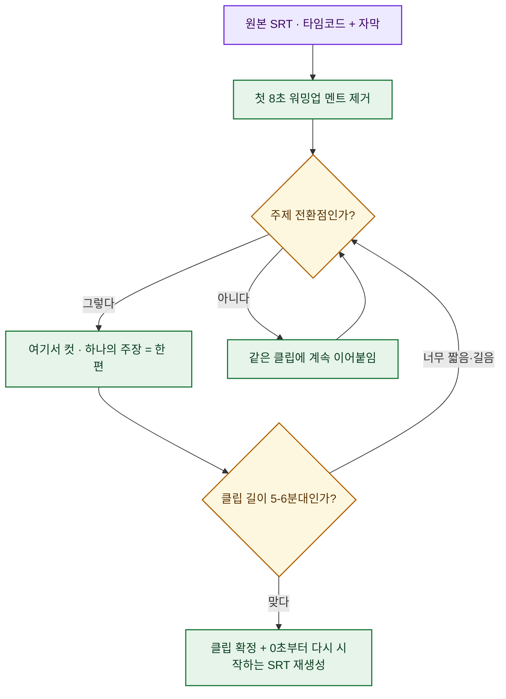

# 유튜브 롱폼, '길이'부터 데이터로 정했다

> 나는 그동안 20\~30분짜리 롱폼을 **감으로** 올렸다. "길게 만들면 시청 시간이 쌓이겠지" 정도의 막연한 믿음. 그런데 데이터를 업으로 하는 사람이 정작 자기 채널은 감으로 굴리는 게 계속 걸렸다. 그래서 이번엔 순서를 뒤집었다 — **내 채널의 실제 YouTube Analytics 데이터로 '길이 전략'을 먼저 세우고**, 그 기준에 맞춰 한 편의 29분 녹화본을 **5편의 독립 롱폼으로 분할**한 뒤, SRT에서 메타데이터를 자동 생성해 **API로 예약 업로드**하고, 마지막에 다시 API로 검증했다. 이 글은 그 하루치 워크플로 기록이다(채널 규모 수치는 뺐고, 방법과 판단 근거만 남겼다).

## 오늘 한 일을 한눈에

## 왜 '길이'부터 데이터로 정했나?

가설은 단순했다. **긴 롱폼을 한 편으로 올리는 것보다, 하나의 주장으로 독립된 짧은 롱폼 여러 편이 평균 시청률에 유리하지 않을까?** 유튜브에서 평균 시청률(영상 길이 대비 실제로 본 비율)은 추천에 큰 영향을 주는 지표인데, 긴 영상일수록 이 비율이 떨어지기 쉽다.

문제는 이게 '일반론'이라는 것이다. **내 채널에서도 그런지**는 내 데이터를 봐야 안다. 그래서 감이 아니라 Analytics를 먼저 열었다.

## API 권한부터 넓혔다 — Analytics를 읽으려면

기존 인증 토큰에는 **YouTube Data API**(채널·영상·업로드) 권한만 있었고, 정작 필요한 **YouTube Analytics** 권한이 없었다. 그래서 분석용 읽기 권한(`yt-analytics.readonly`)을 스코프에 추가해 OAuth를 다시 받았다. 이 한 줄을 더하니 세 가지 역할이 한 토큰에서 돌아갔다.

| API | 이번 작업에서의 역할 |
|---|---|
| Data API v3 | 채널·영상 목록, 공개 통계 조회 |
| Analytics API | 조회수·시청 시간·평균 시청 시간·평균 시청률·순구독 등 **성과 지표** 조회 |
| Upload(Data API) | 영상 **예약 업로드** |

> 참고: 최근 30일 데이터는 쇼츠 유입이 크게 섞여 있어 롱폼 길이 판단에는 노이즈였다. 그래서 길이 전략은 **최근 180일 롱폼만** 따로 떼어 봤다. "어떤 기간, 어떤 표본으로 보느냐"가 결론을 바꾼다.

## 길이별 성과는 실제로 어땠나?

최근 180일 롱폼을 길이 구간으로 나눠 성과를 뽑았다. 이 표가 이번 의사결정의 전부다.

| 길이 | 영상 수 | 조회수 | 시청 시간 | 평균 시청 시간 | 평균 시청률 | 순구독 |
|---|---:|---:|---:|---:|---:|---:|
| 5-8분 | 20 | 1,598 | 3,075분 | 1:55 | **29.9%** | 8 |
| 8-12분 | 33 | 11,794 | 25,908분 | 2:11 | 23.6% | 53 |
| 12-18분 | 28 | 8,283 | 17,168분 | 2:04 | 14.1% | 36 |
| 18-25분 | 27 | 8,902 | 26,154분 | 2:56 | 13.6% | 80 |
| 25분+ | 37 | 13,889 | 51,062분 | 3:40 | **11.4%** | 141 |

읽히는 그림이 분명했다.

- **25분 이상**은 총 시청 시간과 구독 전환(순구독 141)은 크게 만들지만, **평균 시청률이 11.4%로 가장 낮다.** 길이로 밀어붙이는 방식이다.
- **8-12분**은 조회수·평균 시청률·순구독의 **균형**이 가장 좋다.
- **5-8분**은 **평균 시청률이 29.9%로 압도적**이다. 하나의 주장이 분명한 영상에 유리하다.

여기서 내 채널의 길이 전략을 이렇게 확정했다.

- 기본 롱폼: **6-8분**
- 강한 단일 주제: 8-12분
- 실습·강의형만: 12-15분 이상
- 20분 이상: 현재 채널 데이터 기준으로 **부담이 크다**

즉, "총 시청 시간을 노린 장편" 대신 "평균 시청률을 노린 단편 여러 개"로 무게중심을 옮기기로 했다. 물론 이건 **순구독(장편이 강함)과의 트레이드오프**다. 그래서 결론이 아니라 **가설**로 두고, 실제 검증용 테스트 세트를 만들기로 했다.

## 29분 녹화본을 어떻게 5편으로 나눴나?

마침 손에 **약 29분짜리 시사·경제 롱폼 녹화본** 한 편이 있었다. 이걸 위 전략에 맞춰 5-6분대 독립 롱폼 5편으로 잘랐다. 분할은 감이 아니라 **SRT 자막의 타임코드**를 기준으로 했다.

분할 원칙을 정리하면 이렇다.

- **첫 8초 워밍업 멘트 제거** — 도입부 이탈을 줄이려고 인사·군더더기를 잘랐다.
- **하나의 주장 = 한 편** — 각 클립이 독립적으로 완결되도록 주제 전환점에서 컷.
- **5-6분대 유지** — 위 데이터에서 평균 시청률이 가장 높았던 구간.
- **클립별 SRT 재생성** — 각 MP4가 0초부터 시작하도록 타임코드를 다시 매긴 자막을 함께 만들었다(뒤 단계 메타데이터·자막 재사용을 위해).

결과적으로 한 편이 **5편의 5-6분대 독립 롱폼**이 됐고, 분할 기준과 결과는 매니페스트 파일로 남겨 재현 가능하게 했다. (개별 영상 제목·링크는 아직 예약 발행 전이라 이 글에선 생략한다.)

## 메타데이터는 SRT에서 자동 생성

자른 뒤가 진짜 일이다. 5편 각각에 대해 **SRT 본문 + 분할 주제**를 근거로 업로드용 메타데이터를 자동 생성했다. 설명란에는 매번 아래 섹션을 강제로 넣어, 어떤 영상이든 형식이 흔들리지 않게 했다.

- 본문 요약
- **타임라인**(클립별 SRT에서 생성)
- **키워드**
- **해시태그**
- 문의 이메일

생성한 메타데이터는 영상별로 다음 필드를 갖는 구조화 JSON으로 저장했다.

| 필드 | 내용 |
|---|---|
| `title` | 유튜브 제목 |
| `description` | 설명란 전체 텍스트(요약·타임라인·키워드·해시태그·문의) |
| `timeline` / `keywords` / `hashtags` | 설명란 구성 요소 |
| `tags` | 유튜브 API 태그 |
| `publishAt` / `publishLabel` | 예약 발행 UTC 시각 / 사람이 읽는 KST 라벨 |

SRT가 분할 기준이자 타임라인·키워드의 원천이 되니, **자막 하나가 여러 산출물로 재활용**되는 구조다. (같은 결의 SRT 재활용 이야기는 [[srt-to-seo-blog-with-llm|SRT를 SEO 블로그로]]에서도 다뤘다.)

## 예약 업로드 & API 재검증

업로드는 Data API v3의 `videos.insert`로 처리했고, 예약 발행을 위해 아래 설정을 명시했다.

- `privacyStatus`: `private` + `publishAt`(예약 시각) → 지정 시각에 자동 공개
- `madeForKids`: `false`
- 카테고리: `22` People & Blogs · 언어: `ko`

발행 스케줄은 **KST 기준 매일 오후 6시**로, 하루 한 편씩 잡았다. 원본 한 편이 **닷새치 발행 슬롯**으로 바뀐 셈이다.

업로드가 끝난 뒤 그냥 믿지 않고 **API로 다시 조회**해 5편 모두 `uploadStatus: processed`, 예약 시각(`publishAt`)이 의도한 값으로 정확히 들어갔는지 검증했다. 자동화에서 "올렸다"와 "제대로 올라갔다"는 다른 문장이라, 이 재검증 단계를 습관처럼 넣는다.

## 일부러 하지 않은 것 — quota 관리

작업하며 **의도적으로 미룬 것**이 둘 있는데, 이게 오히려 실무 감각에 가깝다.

- **CC 자막 업로드 생략.** 영상 5편 업로드만으로도 하루 API quota를 꽤 쓴다. 자막까지 같이 올리면 한도에 근접·초과할 위험이 있어 이번엔 뺐다. 대신 설명란에 SRT 기반 타임라인이 이미 들어가 있고, 스크립트에는 `--upload-captions` 옵션을 남겨 quota가 리셋된 다음 날 이어서 올릴 수 있게 했다.
- **커스텀 썸네일 생략.** 분할 폴더에 썸네일이 없어 자동 썸네일로 두고, 추후 만들면 `thumbnails.set`으로 따로 설정하기로 했다.

"할 수 있는 걸 다 하기"보다 **한도 안에서 우선순위를 자르는 것**이 자동화 운영의 절반이다.

## 다음 검증 — 가설은 아직 안 끝났다

오늘 올린 5편은 결론이 아니라 **가설 검증용 첫 테스트 세트**다. 다음으로 볼 것.

1. **썸네일 5종 제작** — 각 영상 핵심 문장을 카피로.
2. **CC 자막 추가 업로드** — quota 리셋 후 `--upload-captions`로.
3. **발행 후 24/72시간 성과 추적** — 조회수·평균 시청 시간·평균 시청률·30초 유지율·구독 전환.
4. **5-6분 분할 방식 검증** — 기존 20분+ 롱폼 대비 평균 시청률이 **실제로** 오르는지. 오르면, 앞으로 긴 녹화본은 기본적으로 5-8분 단위 분할을 표준으로.

## 마무리

이번 작업의 핵심은 "영상을 잘라 올렸다"가 아니다. **감으로 정하던 길이를 내 실제 Analytics 데이터로 먼저 정하고**, 그 전략에 맞춰 분할 → SRT 메타데이터 자동 생성 → 예약 업로드 → API 재검증까지 하나의 파이프라인으로 묶었다는 점이다. 콘텐츠 운영도 결국 **지표를 정의하고, 데이터로 가설을 세우고, 테스트 세트로 검증**하는 분석 루프였다.

- 같이 보면 좋은 글: [[youtube-api-mp4-srt-thumbnail-shorts-pipeline|YouTube API로 MP4·SRT·썸네일·쇼츠 파이프라인]] · [[capcut-vrew-srt-shorts-pipeline|캡컷·Vrew·SRT 쇼츠 파이프라인]] · [[srt-to-seo-blog-with-llm|SRT를 SEO 블로그로]] · [[game-metrics-7-definitions|지표 정의부터 — 게임 데이터 7선]]

<!-- 안전: 회사 실데이터·고객/제3자 PII·API키/쿠키/토큰 없음. 개인 채널 운영 기록, 채널 절대수치·미공개 영상 링크·소유자 전용 URL·로컬 경로는 제외/일반화. -->

*개인 유튜브 채널 운영 자동화 기록. 채널 규모 수치와 예약 발행 전 영상 링크는 의도적으로 제외했습니다. 정리: 2026-07-09.*
