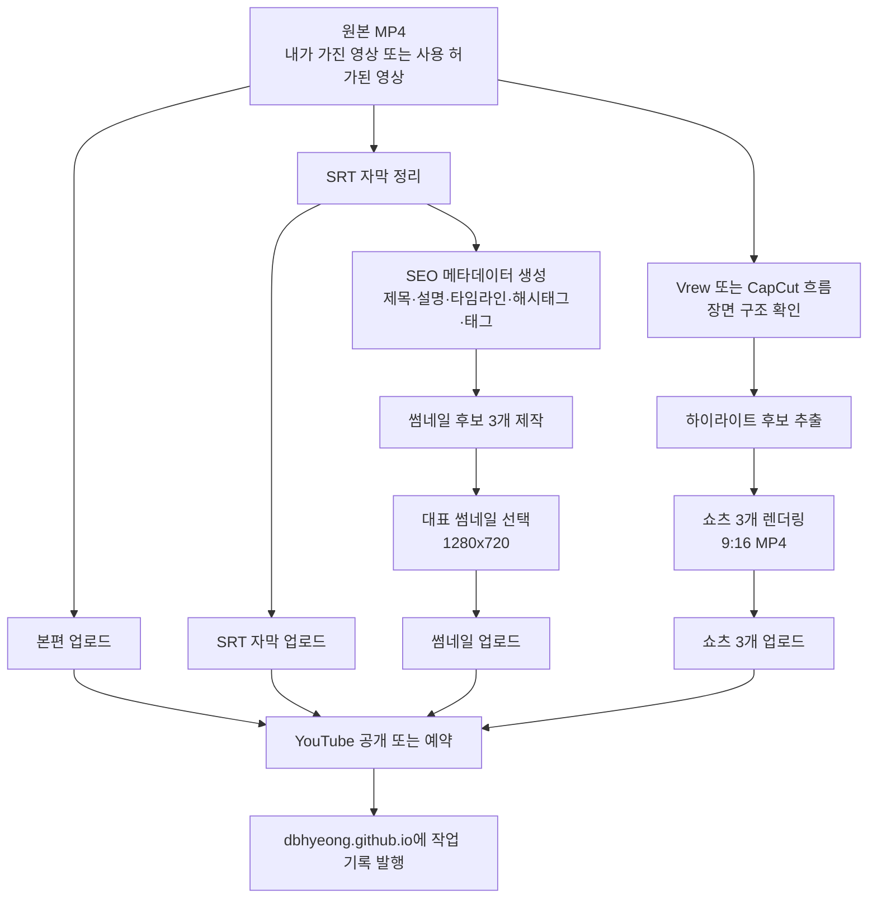
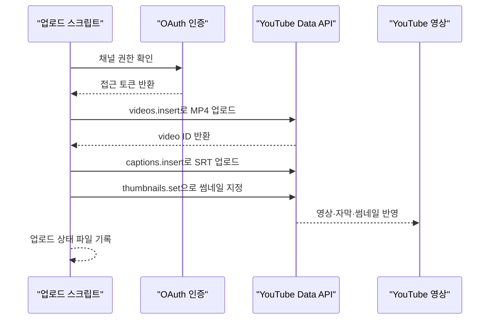
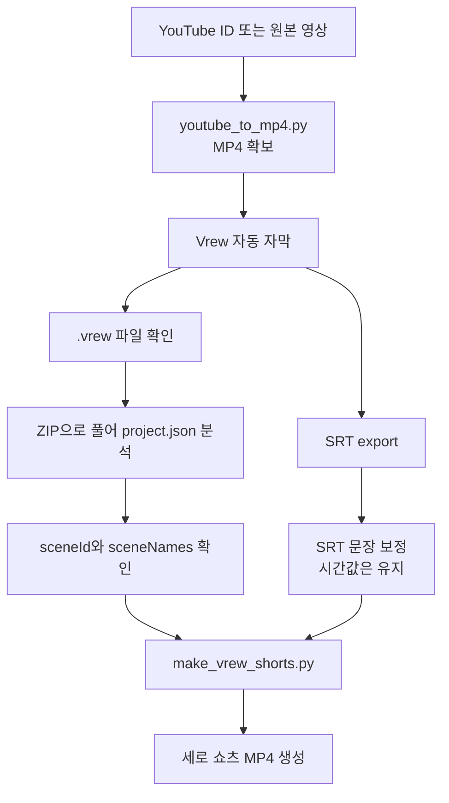
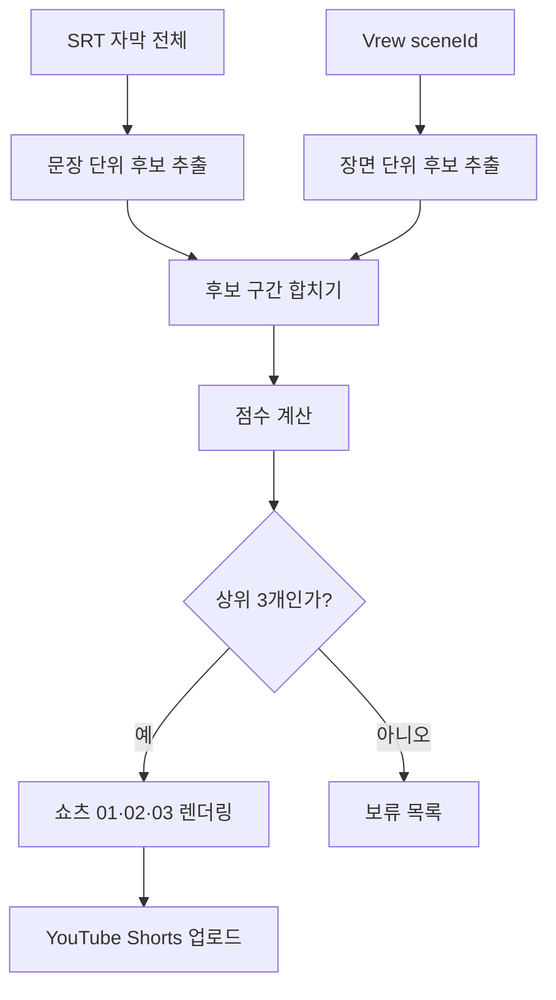
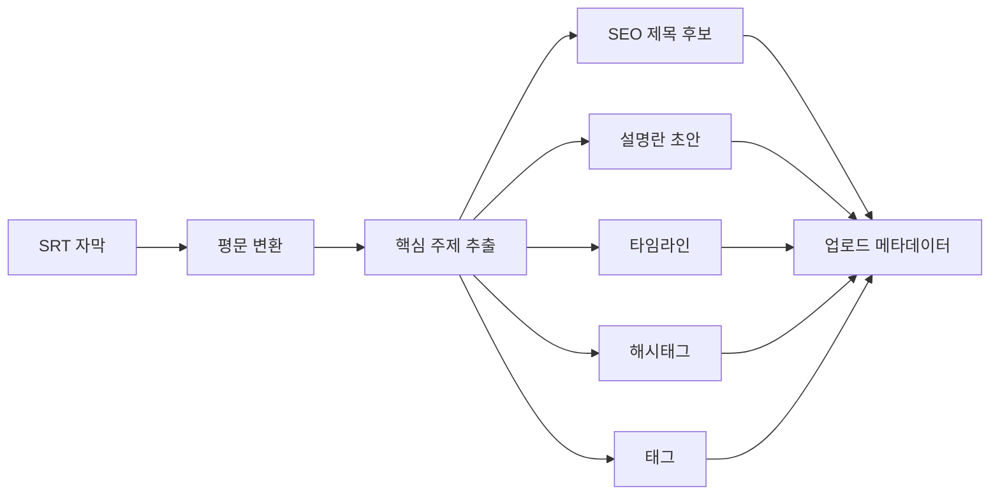
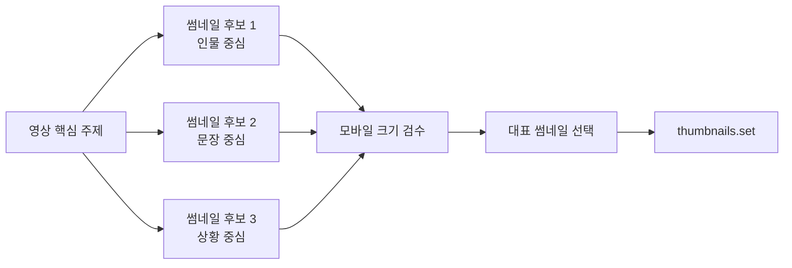
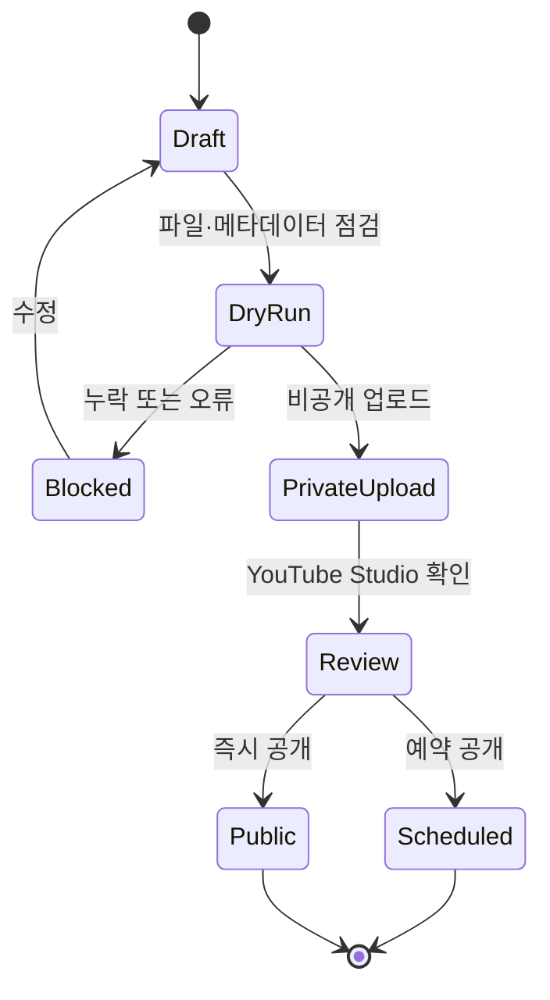
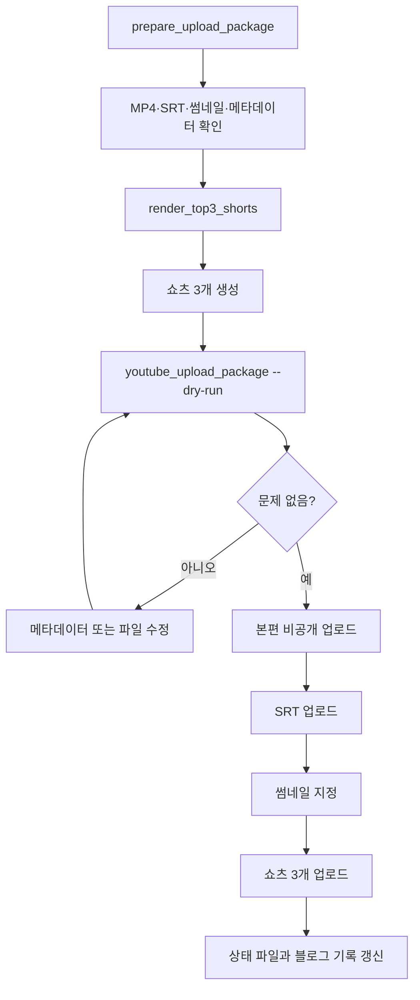

처음에는 이렇게 생각했다. "MP4 파일이 있고, SRT 자막이 있고, 썸네일 이미지가 있으면 YouTube API로 그냥 올리면 되는 거 아닌가?"

그런데 막상 정리해 보니, 업로드 버튼 하나가 문제가 아니었다. 진짜 문제는 **업로드 직전까지 무엇을 하나의 패키지로 묶어야 하는가**였다. 영상 파일만 있으면 반쪽이고, 자막만 있으면 검색과 시청 경험이 약하고, 제목만 있으면 썸네일과 설명란이 비어 있다. 쇼츠까지 붙이려면 본편에서 어떤 3구간을 잘라낼지도 정해야 한다.

그래서 이번에는 `codex_transcript`에 있던 YouTube 업로드 스크립트 흐름과, `codex_capcut`에서 만들었던 Vrew·SRT·쇼츠 렌더링 흐름을 하나로 합쳐 보자는 쪽으로 생각을 정리했다. 앞에서 쓴 [[capcut-vrew-srt-shorts-pipeline|MP4 하나를 Vrew 자막과 SRT로 쪼개 쇼츠 8개로 만든 기록]]이 "영상에서 쇼츠를 만드는 쪽"이었다면, 이 글은 그 다음 단계다. **본편과 쇼츠를 실제 YouTube 채널에 올릴 수 있는 업로드 패키지로 만드는 일**이다.

공개 글이라 로컬의 실제 계정 파일명, OAuth 토큰, 클라이언트 시크릿 값은 적지 않는다. 대신 구조만 남긴다. 자동화 글에서 제일 위험한 실수는 "되는 코드"를 공개하면서 인증 파일까지 같이 흘리는 일이다.

## 전체 과정은 어디서 시작해서 어디서 끝나나?

내가 잡은 전체 그림은 이렇다. 시작점은 하나의 원본 MP4다. 끝점은 YouTube에 올라간 본편 영상, SRT 자막, 썸네일, 쇼츠 3개, 그리고 이 모든 과정을 설명하는 블로그 글이다.



여기서 중요한 건 YouTube API가 모든 일을 대신해 주는 게 아니라는 점이다. API는 **올리는 통로**다. 그 통로에 넣을 재료를 잘 손질하는 일은 여전히 내 파이프라인이 해야 한다.

쉽게 나누면 이렇게 된다.

| 단계 | 쉬운 설명 | 실제 산출물 |
|---|---|---|
| 원본 확보 | 업로드할 본편 영상 준비 | `source.mp4` |
| 자막 정리 | 말소리를 시간표가 붙은 문장으로 정리 | `source.srt` |
| 메타데이터 작성 | YouTube에 보일 제목·설명·태그 구성 | `metadata.json` 또는 `.md` |
| 썸네일 제작 | 클릭 전에 보이는 대표 이미지 준비 | `thumbnail.jpg` |
| 쇼츠 추출 | 본편에서 짧게 볼 만한 3구간 제작 | `shorts_01.mp4` 등 |
| API 업로드 | 본편·자막·썸네일·쇼츠를 채널에 반영 | YouTube video ID |
| 블로그 기록 | 나중에 다시 쓸 수 있게 구조화 | `content/blog/*.md` |

이 흐름은 [[srt-to-seo-blog-with-llm|Vrew 자막을 SEO 블로그 글로 바꾸는 흐름]]과도 이어진다. 영상 자막은 단순한 부속 파일이 아니라, 제목·설명·타임라인·블로그 글까지 뽑아내는 원천 데이터가 된다.

## YouTube API는 정확히 무엇을 해 주나?

YouTube 쪽에서 실제로 쓰는 중심 API는 세 개다.

| API | 맡기는 일 | 내가 준비해야 하는 것 |
|---|---|---|
| [`videos.insert`](https://developers.google.com/youtube/v3/docs/videos/insert) | 영상 파일 업로드, 제목·설명·태그·공개 상태 입력 | MP4, 제목, 설명, 태그, 공개 여부 |
| [`captions.insert`](https://developers.google.com/youtube/v3/docs/captions/insert) | SRT 같은 자막 트랙 업로드 | 업로드된 video ID, SRT 파일, 언어 코드 |
| [`thumbnails.set`](https://developers.google.com/youtube/v3/docs/thumbnails/set) | 커스텀 썸네일 지정 | 업로드된 video ID, 썸네일 이미지 |

쇼츠도 별도의 신비한 API가 따로 있는 게 아니다. 짧은 세로 영상을 일반 영상처럼 `videos.insert`로 올리고, 형식과 길이가 YouTube Shorts 조건에 맞으면 쇼츠로 다뤄진다. [YouTube 도움말](https://support.google.com/youtube/answer/15424877?hl=ko) 기준으로 쇼츠는 현재 최대 3분까지 가능하다고 안내되어 있다. 다만 실전에서는 30초~60초짜리가 여전히 편하다. 편집도 쉽고, 검수도 빠르고, 반복 업로드에도 부담이 적다.



여기서 OAuth는 쉽게 말해 "이 스크립트가 내 채널에 올려도 된다"는 허가 절차다. 비밀번호를 코드에 박는 방식이 아니다. 브라우저에서 한 번 동의하고, 이후에는 토큰을 통해 권한을 이어받는다. 그래서 토큰 파일과 클라이언트 시크릿은 절대 공개 저장소에 올리면 안 된다.

그리고 한 가지는 선을 그어야 한다. YouTube Data API는 **남의 YouTube 영상을 마음대로 MP4로 내려받는 API가 아니다.** 내가 가진 원본, 내가 만든 영상, 사용 허가를 받은 영상, 또는 YouTube Studio에서 정당하게 받은 내 영상처럼 권리가 확인된 파일을 업로드 파이프라인에 넣어야 한다. 다운로드 도구는 별도의 영역이고, 권리 확인은 자동화보다 앞에 있어야 한다.

## codex_transcript에는 이미 무엇이 있었나?

`codex_transcript` 폴더에는 업로드 쪽 재료가 이미 꽤 있었다. 처음부터 완성형 서비스는 아니어도, 실제 운영으로 이어갈 수 있는 조각들이 있었다.

| 조각 | 역할 | 이번 파이프라인에서의 위치 |
|---|---|---|
| `youtube_upload.py` | 기본 YouTube 업로드 스크립트 | 본편 업로드의 출발점 |
| `youtube_upload_20260613_naver_blog.py` | MP4·SRT·썸네일을 함께 올리는 사례 | 본편 패키지 업로드 예시 |
| `youtube_upload_multi.py` | 여러 영상을 메타데이터와 함께 처리 | 시리즈·예약 업로드 확장 |
| `youtube_thumbnail.py` | 썸네일 리사이즈와 업로드 | 1280x720 이미지 검수 |
| `youtube_update.py` | 이미 올라간 영상의 메타데이터 수정 | 제목·설명·썸네일 사후 보정 |
| `YOUTUBE_SRT_MP4_AUTO_UPLOAD_WORKFLOW.md` | MP4·SRT·SEO 메타데이터 흐름 정리 | 사람이 읽는 작업 명세 |
| `YOUTUBE_SHORTS_AND_SCHEDULE.md` | 쇼츠·예약 업로드 개념 정리 | 쇼츠 3개 업로드 기준 |

이걸 보면서 생각이 정리됐다. 핵심은 스크립트 하나를 더 만드는 게 아니라, **하나의 업로드 단위**를 정의하는 것이다.

```text
upload_item
├─ longform
│  ├─ source.mp4
│  ├─ source.srt
│  └─ thumbnail.jpg
├─ metadata
│  ├─ title
│  ├─ description
│  ├─ timeline
│  ├─ hashtags
│  └─ tags
├─ shorts
│  ├─ shorts_01.mp4
│  ├─ shorts_02.mp4
│  └─ shorts_03.mp4
└─ state
   └─ upload_state.json
```

`upload_state.json` 같은 상태 파일도 중요하다. 업로드 자동화에서 제일 무서운 사고 중 하나가 같은 영상을 두 번 올리는 일이다. "이미 올린 video ID가 있는가?"를 파일로 남겨 두면, 스크립트를 다시 실행해도 중복 업로드를 막을 수 있다.

내가 쓰고 싶은 실행 흐름은 대략 이런 모양이다.

```python
item = {
    "video": "source.mp4",
    "caption": "source.srt",
    "thumbnail": "thumbnail.jpg",
    "title": "SEO 제목",
    "description": "설명 + 타임라인 + 링크",
    "tags": ["youtube", "automation", "srt"],
    "privacy": "private",
    "publish_at": "2026-06-28T12:00:00+09:00",
}

video_id = upload_video(youtube, item)
upload_caption(youtube, video_id, item["caption"], language="ko")
upload_thumbnail(youtube, video_id, item["thumbnail"])
save_state(video_id, item)
```

코드 자체는 어렵지 않다. 어려운 부분은 `item` 안에 들어갈 값들이 전부 제대로 준비되어 있는지 확인하는 일이다.

## codex_capcut 흐름은 어디에 붙나?

`codex_capcut`은 업로드보다 앞 단계다. 여기서는 원본 MP4에서 자막과 쇼츠를 만드는 쪽을 맡았다.

당시 흐름은 이랬다.



여기서 `sceneId`는 "Vrew가 이 부분을 하나의 장면으로 봤다"는 표시다. 사람이 영상을 보면서 감으로 자르는 대신, Vrew가 잡아 둔 장면 묶음을 기준점으로 삼았다. SRT는 화면에 띄울 문장과 시간을 제공하고, `sceneId`는 어느 구간을 잘라야 하는지 알려 준다.

쉽게 말하면 이렇다.

| 재료 | 사람이 이해하기 쉽게 말하면 | 쓰임 |
|---|---|---|
| MP4 | 원본 영상 | 본편 업로드와 쇼츠 렌더링의 원본 |
| SRT | 자막 시간표 | 본편 자막 업로드, 쇼츠 자막 태우기 |
| `.vrew/project.json` | Vrew가 기억한 편집 구조 | 장면 단위 시작점과 이름 확인 |
| `sceneId` | 장면 묶음 번호 | 하이라이트 후보를 자르는 기준 |
| ffmpeg | 영상 굽는 도구 | 세로 쇼츠 렌더링 |

앞 글에서 나는 8개 쇼츠를 만들었다. 이번 업로드 파이프라인에서는 그중 3개만 고르면 된다. 전부 올릴 수도 있지만, "본편 하나 + 쇼츠 3개"가 관리하기에는 더 깔끔하다. 쇼츠 8개를 한 번에 올리는 것보다, 먼저 3개를 고르고 반응을 본 뒤 나머지를 이어서 올리는 편이 운영상 더 안전하다.

## 쇼츠 3개는 어떻게 고르면 좋을까?

쇼츠를 고르는 기준은 감으로만 두면 매번 흔들린다. 그래서 최소한의 점수표를 둔다.



점수는 복잡할 필요가 없다. 처음에는 사람이 납득할 수 있는 기준이면 충분하다.

| 기준 | 설명 |
|---|---|
| 독립성 | 이 구간만 봐도 무슨 말인지 이해되는가 |
| 후킹 | 첫 3초 안에 궁금증이 생기는가 |
| 길이 | 30초~60초 안에 자연스럽게 끝나는가 |
| 자막 밀도 | 화면에 글자가 너무 많지 않은가 |
| 본편 연결성 | 본편을 보러 갈 이유를 남기는가 |

여기서 어려운 말 하나만 풀고 가면, "후킹"은 낚시성 제목을 말하는 게 아니다. 시청자가 첫 몇 초 안에 "이 이야기는 끝까지 들어볼 만하다"라고 느끼게 만드는 시작점이다. 예를 들면 결론부터 던지거나, 갈등이 드러나는 질문부터 시작하는 식이다.

`codex_capcut`의 `make_vrew_shorts.py`는 이미 9:16 렌더링과 자막 굽기를 해 봤다. 그러니 다음 단계에서는 8개를 무조건 굽는 방식에서, 점수표 기준으로 3개를 골라 굽는 방식으로 바꾸면 된다.

```text
shorts_candidates
├─ scene_01 score 82
├─ scene_02 score 91  -> shorts_01.mp4
├─ scene_03 score 74
├─ scene_04 score 88  -> shorts_02.mp4
├─ scene_05 score 69
├─ scene_06 score 86  -> shorts_03.mp4
└─ 나머지는 보류
```

완전 자동으로 가기 전에는 중간에 사람이 한 번 고르는 단계가 있는 게 낫다. 특히 쇼츠는 말의 뉘앙스가 잘리면 전혀 다른 의미가 될 수 있다. 자동화는 빠르게 해 주지만, 공개 전 책임은 여전히 사람에게 있다.

## SEO 메타데이터는 어디서 나오나?

YouTube 업로드에서 제목·설명·태그는 그냥 장식이 아니다. 검색, 추천, 클릭률, 시청 지속 시간에 모두 영향을 준다. 그래서 SRT에서 메타데이터를 뽑는 흐름을 붙인다.



내 기준으로 설명란은 이렇게 잡고 싶다.

```text
1. 영상의 핵심을 2~3문장으로 요약
2. 타임라인
3. 관련 링크
4. 쇼츠 또는 본편 안내
5. 해시태그 3~5개
```

타임라인은 시청자에게도 좋고, 나중에 영상을 다시 찾을 때도 좋다. 예를 들어 이런 식이다.

```text
00:00 오늘 영상의 핵심
02:14 첫 번째 쟁점
05:40 실제 작업 흐름
09:20 자동화할 때 조심할 점
12:10 결론과 다음 단계
```

이 부분은 [[social-syndication-9-channels-api|SNS·블로그 신디케이션 자동화]]와도 이어진다. YouTube 설명란에만 쓰고 끝낼 게 아니라, 같은 요약을 블로그·SNS·뉴스레터용으로 조금씩 바꿔 쓰면 된다. 원본은 하나고, 배포 문안만 채널에 맞게 바뀐다.

## 썸네일은 왜 따로 검수해야 하나?

썸네일은 API로 올릴 수 있지만, 아무 이미지나 올리면 안 된다. 내가 생각하는 최소 기준은 이렇다.

| 항목 | 기준 |
|---|---|
| 크기 | 1280x720 |
| 비율 | 16:9 |
| 용량 | 2MB 이하로 압축 |
| 글자 | 모바일에서도 읽힐 만큼 크게 |
| 대비 | 배경과 제목이 확실히 구분 |
| 의미 | 영상 내용과 실제로 맞아야 함 |

`codex_transcript`에는 썸네일 이미지를 1280x720으로 맞추고 업로드하는 흐름이 있었다. 이건 생각보다 중요하다. 사람이 만든 썸네일은 보기에는 괜찮아 보여도, 파일 용량이 크거나 비율이 살짝 틀어져서 API 업로드에서 걸릴 수 있다.

나는 썸네일도 3개 후보를 두는 쪽이 좋다고 본다.



여기서 "문장 중심"은 큰 글자 한 줄로 메시지를 치는 방식이고, "상황 중심"은 화면 캡처나 장면 맥락을 살리는 방식이다. 어떤 게 늘 정답인지는 없다. 그래서 후보를 만들고, 작은 화면에서 먼저 보는 게 낫다. 데스크톱에서 멋진 썸네일이 모바일에서는 그냥 작은 글자 덩어리로 보일 때가 많다.

## 업로드 전에는 무엇을 막아야 하나?

자동화는 잘되면 편하지만, 잘못되면 빠르게 망가진다. 그래서 나는 업로드 직전에 검문소를 둬야 한다고 본다.



검수 항목은 이 정도면 된다.

| 검수 항목 | 막으려는 사고 |
|---|---|
| MP4 파일 존재 여부 | 빈 경로 업로드 |
| 영상 길이·비율 확인 | 쇼츠가 아닌 영상으로 올라감 |
| SRT 인코딩 확인 | 자막 깨짐 |
| SRT 시간 겹침 확인 | 자막 업로드 실패 |
| 제목 길이 확인 | 잘림 또는 업로드 오류 |
| 설명란 길이 확인 | 타임라인·링크 누락 |
| 썸네일 크기 확인 | 썸네일 API 실패 |
| 상태 파일 확인 | 중복 업로드 |
| OAuth 파일 분리 | 인증 정보 유출 |
| 권리 확인 | 남의 영상 무단 재업로드 |

나는 여기서 `dry-run`을 꼭 넣고 싶다. `dry-run`은 실제 업로드는 하지 않고, "지금 올리면 어떤 제목·설명·파일이 쓰이는지"만 출력하는 모드다. 자동화 도구에서 가장 소중한 기능은 화려한 AI 기능이 아니라, 사고를 미리 보여 주는 기능이다.

## 최종 폴더 구조는 어떻게 잡으면 좋을까?

운영형으로 만들면 폴더는 이렇게 단순하게 가는 게 좋다.

```text
youtube_pipeline/
├─ source/
│  └─ source.mp4
├─ captions/
│  └─ source.ko.srt
├─ thumbnails/
│  ├─ thumb_01.jpg
│  ├─ thumb_02.jpg
│  └─ thumb_final.jpg
├─ shorts/
│  ├─ shorts_01.mp4
│  ├─ shorts_02.mp4
│  └─ shorts_03.mp4
├─ metadata/
│  ├─ youtube.json
│  └─ description.md
├─ state/
│  └─ upload_state.json
└─ logs/
   └─ upload.log
```

이렇게 나누면 사람도 이해하기 쉽고, 스크립트도 단순해진다. "이 영상의 모든 재료는 한 폴더 안에 있다"가 되기 때문이다. 나중에 문제가 생겨도 어느 파일을 봐야 할지 바로 보인다.

블로그 쪽은 [[build-tech-blog-with-quartz-github-pages|GitHub Pages + Quartz로 기술 블로그를 만든 기록]]에서 이미 정리한 것처럼 `content/blog/*.md`에 글을 하나 추가하고 push하면 된다. GitHub Pages는 대용량 MP4를 보관하는 곳이 아니라, **과정과 결과를 설명하는 문서의 집**으로 쓰는 게 맞다. 영상은 YouTube에 두고, 블로그에는 구조·도식·링크·회고를 남긴다.

## 결국 어떤 자동화가 되는 걸까?

내가 원하는 최종 실행은 이런 느낌이다.

```powershell
python prepare_upload_package.py .\youtube_pipeline\my_video
python render_top3_shorts.py .\youtube_pipeline\my_video --top 3
python youtube_upload_package.py .\youtube_pipeline\my_video --dry-run
python youtube_upload_package.py .\youtube_pipeline\my_video --publish private
```

그리고 스크립트는 아래 순서로 움직인다.



여기까지 오면 "유튜브에 영상 하나 올리기"가 아니라, **영상 하나를 중심으로 본편·자막·썸네일·쇼츠·SEO 설명·블로그 기록까지 한 번에 남기는 콘텐츠 출판 파이프라인**이 된다.

말은 길지만, 핵심은 단순하다.

```text
MP4는 본편이다.
SRT는 검색과 재가공의 원천이다.
썸네일은 클릭 전 첫인상이다.
쇼츠 3개는 본편으로 들어오는 입구다.
YouTube API는 업로드 통로다.
블로그는 이 모든 과정을 다시 쓸 수 있게 만드는 기록이다.
```

이번 정리를 하면서 다시 느낀 건, 자동화의 중심은 코드가 아니라 **흐름의 이름을 붙이는 일**이라는 점이다. 이름이 없으면 매번 "그때 그 파일 어디 있더라"가 된다. 이름이 생기면 폴더가 생기고, 폴더가 생기면 스크립트가 생기고, 스크립트가 생기면 다음 영상부터는 반복 비용이 줄어든다.

다음 단계는 이 글의 설계를 실제 하나의 CLI로 합치는 일이다. `codex_transcript`의 업로드 스크립트와 `codex_capcut`의 쇼츠 렌더링 스크립트는 이미 방향이 맞다. 이제 남은 건 둘 사이에 `metadata.json`과 `upload_state.json`을 끼워 넣고, `dry-run`을 기본값으로 둔 뒤, 사람 검수 후 업로드하는 구조로 묶는 것이다.

결론은 이렇다. YouTube API 업로드 자체는 어렵지 않다. 정말 어려운 건 업로드 버튼을 누르기 전까지 **영상, 자막, 썸네일, 쇼츠, 설명란, 상태 기록이 서로 어긋나지 않게 한 묶음으로 정리하는 일**이다. 이 묶음만 잘 만들면, 그다음부터는 Codex든 Claude Code든 사람의 반복 노동을 꽤 많이 덜어 줄 수 있다.
