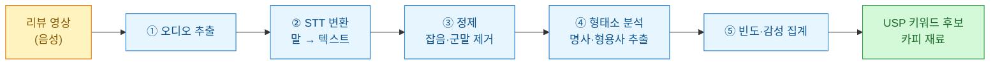
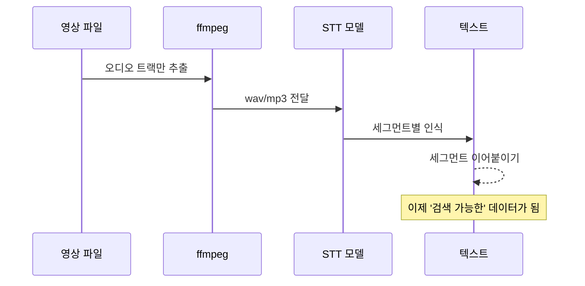
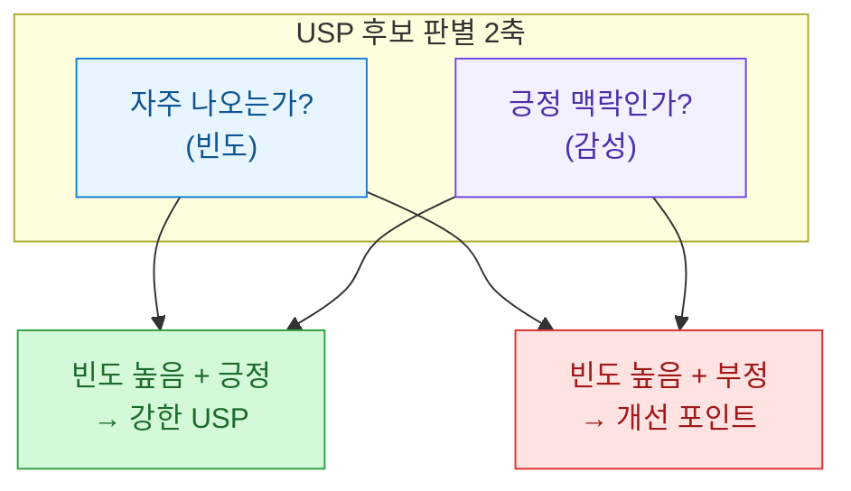
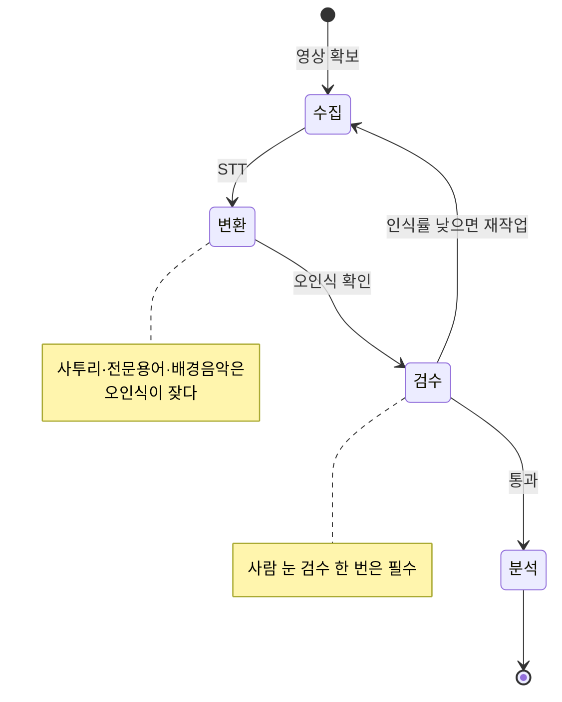

리뷰 글은 정제돼 있다. 별점 5개에 "만족합니다" 한 줄. 그런데 영상 리뷰는 다르다. 사람들이 카메라 앞에서 3분 동안 떠드는 그 말 속에, "이거 때문에 샀다"는 진짜 이유가 흘러나온다. 문제는 그게 **텍스트가 아니라 음성**이라 검색도 집계도 안 된다는 점이다.

그래서 나는 리뷰 영상의 음성을 텍스트로 바꾼 다음(STT, Speech-to-Text), 그 텍스트에서 사람들이 **반복해서 말하는 표현**을 세어보기로 했다. 반복되는 말이 곧 셀링포인트니까. 이 글은 그 파이프라인을 합성 데이터로 재구성한 기록이다.

> ⚠️ 이 글의 모든 대사·수치·표는 **합성(더미) 데이터**다. 실제 브랜드·인물·채널·제품은 등장하지 않는다. 가상의 "제품X"(휴대용 블렌더 컨셉)를 예로 든다.

## 전체 그림은 어떻게 되나?

먼저 손에 잡히는 지도부터. 영상 하나가 "USP 키워드 후보"가 되기까지 거쳐가는 길이다.



핵심은 오른쪽 끝의 "USP 키워드 후보"다. USP(Unique Selling Point)는 그 제품만의 강점, 즉 "왜 이걸 사야 하는가"의 답이다. 이걸 내 머리로 상상하는 게 아니라, 리뷰어 여러 명이 **입 모아 반복하는 말**에서 통계적으로 뽑아내자는 게 이 글의 전부다.

## 왜 굳이 영상 음성까지 뒤지나?

텍스트 리뷰만 봐도 되지 않냐고 물을 수 있다. 그런데 채널이 다르면 나오는 정보의 결이 다르다.

| 소스 | 정보 밀도 | 솔직함 | 수집 난이도 |
|---|---|---|---|
| 별점 텍스트 리뷰 | 낮음(짧고 정형) | 중간 | 낮음 |
| 상세페이지 후기 | 낮음(호평 편향) | 낮음 | 낮음 |
| 블로그 리뷰 | 중간 | 중간 | 중간 |
| 영상 리뷰(STT) | 높음(말이 길다) | 높음(즉흥 발화) | 높음 |

영상 리뷰의 강점은 "말이 길다"는 것이다. 카메라 앞에서 5분을 채우려면 구체적으로 말할 수밖에 없다. "충전 한 번 하면 일주일 쓴다", "소리가 생각보다 조용하다" 같은 문장이 자연스럽게 나온다. 이 구체어가 바로 카피 재료다.

대신 대가가 있다. 수집·변환 난이도가 제일 높다. 그래서 자동화가 필요하다.

## 음성을 어떻게 텍스트로 바꾸나?

STT는 이제 로컬에서도 꽤 잘 돈다. 아래는 오픈소스 STT 모델을 쓴다고 가정한 골격 코드다. 실제 모델명은 상황에 맞게 바꾸면 된다.

```python
# pip install faster-whisper (예시 - 로컬 STT)
from faster_whisper import WhisperModel

def transcribe(audio_path: str) -> str:
    """오디오 파일 -> 전체 텍스트. 합성 예시용 골격."""
    model = WhisperModel("small", device="cpu", compute_type="int8")
    segments, _info = model.transcribe(audio_path, language="ko")
    # segment 단위 텍스트를 이어붙인다
    return " ".join(seg.text.strip() for seg in segments)

# 실제로는 영상에서 오디오만 추출해서 넘긴다 (ffmpeg -vn 등)
# 아래는 STT 결과를 흉내 낸 '합성 대사'
sample_transcript = """
    자 이 제품X 써봤는데요 일단 충전이 진짜 오래가요 한 번 충전하면 일주일은 쓰네요
    그리고 소음이 거의 없어요 새벽에 돌려도 조용해서 좋았고요
    무게도 가벼워서 가방에 넣고 다니기 편했습니다 세척도 간편하고요
    솔직히 소음 이거 하나만으로도 살 만한 것 같아요 진짜 조용해요
"""
```

여기서 얻는 건 그냥 긴 문자열이다. 이제 이걸 셀 수 있는 단위로 쪼개야 한다.



## 말뭉치에서 어떻게 '키워드'를 골라내나?

한국어는 조사가 붙어서 "충전이", "충전은", "충전도"가 다 다른 단어처럼 보인다. 이걸 그냥 세면 엉망이 된다. 그래서 형태소 분석으로 **어근만** 남기고, 명사·형용사 위주로 추린다.

```python
from collections import Counter

# 실제로는 KoNLPy(Okt 등) 형태소 분석기를 쓴다.
# 여기서는 개념 전달을 위해 간이 토크나이저로 대체(합성 예시)
STOPWORDS = {"이", "그", "저", "거", "요", "진짜", "좀", "그리고", "자"}

def extract_terms(text: str) -> Counter:
    """명사/형용사 어근을 흉내 낸 간이 추출. 실제론 형태소 분석 사용."""
    # 합성 데모: 공백 분리 후 조사 꼬리를 러프하게 제거
    tails = ("이", "가", "은", "는", "을", "를", "도", "에", "서", "요")
    terms = []
    for tok in text.split():
        w = tok.strip(".,!?")
        for t in tails:
            if len(w) > 2 and w.endswith(t):
                w = w[:-1]
                break
        if w and w not in STOPWORDS and len(w) >= 2:
            terms.append(w)
    return Counter(terms)

counts = extract_terms(sample_transcript)
for term, n in counts.most_common(6):
    print(f"{term:8s} {n}")
```

여러 영상을 한꺼번에 돌리면 "충전", "소음/조용", "가벼움", "세척"처럼 채널을 넘나들며 반복되는 단어가 위로 떠오른다. 그 반복이 곧 시장이 인정한 셀링포인트다.

## 그냥 많이 나온 단어면 다 USP인가?

아니다. 여기서 한 겹 더 걸러야 한다. 빈도만 높은 단어는 "제품", "사용", "그냥"처럼 아무 의미 없는 것도 많다. 두 개의 축으로 나눠 봐야 한다.



같은 "소음"이라도 "소음이 없어요"는 강력한 USP고, "소음이 커요"는 상세페이지에서 미리 방어해야 할 약점이다. 그래서 단어를 셀 때 **주변 문맥의 감성**을 같이 봐야 한다. 간단하게는 긍정어(조용, 가벼운, 편한, 오래) 근처에 등장하는 빈도를 별도로 집계하는 식이다.

## 결과 표는 어떻게 읽나?

여러 영상을 돌렸다고 치고, 합성 집계 결과를 표로 정리하면 이런 그림이 나온다. (반복하지만 아래 숫자는 전부 더미다.)

| 키워드 | 등장 영상 수 | 총 언급 | 긍정 비율 | 판정 |
|---|---|---|---|---|
| 조용함/저소음 | 9 / 10 | 41 | 95% | 강한 USP |
| 배터리/오래감 | 8 / 10 | 33 | 90% | 강한 USP |
| 가벼움/휴대 | 7 / 10 | 28 | 88% | USP |
| 세척 간편 | 5 / 10 | 15 | 82% | 보조 USP |
| 용량 작음 | 4 / 10 | 12 | 30% | 개선/방어 포인트 |

읽는 법은 단순하다. 위 세 줄이 상세페이지 상단 카피가 될 재료다. "10명 중 9명이 조용하다고 말한 블렌더" 같은 문장은 내가 지어낸 게 아니라 데이터가 말해준 것이다. 맨 아래 "용량 작음"은 USP는 아니지만, 리뷰어들이 자주 지적하니 상세페이지에서 미리 "휴대용 1인 사이즈"라고 프레이밍해 방어할 신호다.

## 이 방법의 한계는 뭔가?

솔직하게 적어둔다. 만능이 아니다.



- **STT 오인식**: 제품명이나 전문용어는 엉뚱하게 받아쓴다. 핵심 키워드는 사람이 한 번 눈으로 훑어야 한다.
- **표본 편향**: 협찬 영상이 섞이면 긍정 비율이 부풀려진다. 채널 성격을 라벨링해두고 가중치를 조절하는 게 안전하다.
- **저작권·약관**: 영상 자체를 재배포하는 게 아니라 **내부 분석용 지표**로만 쓰는 선을 지켜야 한다. 원문 대사를 그대로 카피에 베끼는 것도 금물이고, 어디까지나 "표현의 빈도"라는 통계만 참고한다.
- **인과가 아니라 상관**: "조용하다는 말이 많다"는 그 강점이 잘 팔린다는 증거가 아니라, 사람들이 그걸 자주 언급한다는 사실일 뿐이다. 실제 전환은 A/B로 따로 검증해야 한다.

## 정리


핵심 세 줄:

1. 영상 리뷰의 강점은 "말이 길고 솔직하다"는 것 — 그 안에 카피 재료가 숨어 있다.
2. STT로 텍스트화한 뒤 **빈도 × 감성** 두 축으로 걸러야 진짜 USP만 남는다.
3. STT 오인식·협찬 편향·저작권 선을 인지하고, 최종 카피는 A/B로 검증한다.

리뷰어들이 반복하는 말을 그대로 상단에 배치하는 것 — 결국 마케팅은 고객의 언어를 되돌려주는 일이라는 걸 다시 확인했다.
