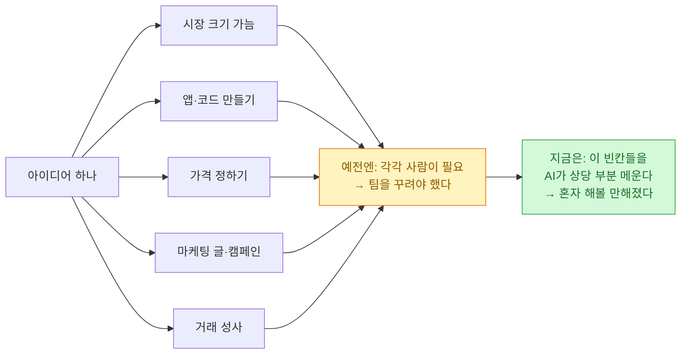

퇴근하고 스트라이프(결제 회사) 이코노믹스라는 데서 낸 [1인 창업자 이야기](https://www.stripeeconomics.com/p/the-age-of-the-solopreneur)를 읽었다. 읽는 내내 남 얘기 같지가 않아서, 오늘은 뉴스 정리 말고 이걸 넋두리처럼 적어 두려 한다.

## 숫자가 좀 놀라웠다

핵심만 옮기면 이렇다. 미국에서 **직원 없이 혼자 사업하는 사람(1인 창업자)이 직원을 두는 회사보다 빠르게 늘고 있다**고 한다. 2023년에 이미 약 400만 명이 1인 사업으로 연 10만 달러 넘는 매출을 주 소득으로 벌었고, 이건 2010년대 초 200만 명대에서 두 배로 뛴 거다.

더 놀란 건 위쪽이었다. 스트라이프가 만든 지표 기준으로, **매출 100만 달러를 넘긴 1인 창업자가 2025년에 2023년의 두 배 이상**, 500만·1000만 달러를 넘긴 사람은 각각 세 배 가까이로 늘었단다. 숫자만 늘어난 게 아니라 그 **비중**도 두 배가 됐다는데, 이건 "운 좋은 몇 명"이 아니라 판 자체가 커졌다는 뜻이다.

처음엔 "이거 그냥 서류상 유령회사 아니야?" 싶었는데, 글쓴이들도 그 의심을 먼저 걸고 넘어진다. 정부 통계, 스트라이프 결제 데이터, 호주·핀란드·프랑스 같은 다른 나라 등록 기록까지 **여러 출처가 따로따로 같은 방향을 가리키니** 사기로 보긴 어렵다는 것이다. (물론 이건 스트라이프 자체 지표라 과장이 섞일 수 있다는 걸 저자들도 인정한다. 나도 그 정도로만 받아들였다.)

## 왜 지금인가 — AI가 '팀의 빈칸'을 메운다

내가 밑줄 그은 대목은 여기였다. **예전에 사업을 여럿이 모여 한 이유는, 한 사람이 필요한 걸 다 못 했기 때문**이라는 문장.

생각해 보면 맞다. 사업 하나를 굴리려면 이런 게 다 필요하다.

시장 조사, 코딩, 가격 책정, 마케팅, 영업 — 이 빈칸마다 예전엔 사람을 붙여야 했는데, 지금은 **AI(와 AI를 얹은 도구들)가 그 자리를 상당히 메운다.** 그래서 "동기만 충분하면 혼자 나설 수 있게" 됐다는 거다. 샘 올트먼이 이걸 "아이디어 가진 사람들의 역습"이라고 표현했다는데, 좀 유치하지만 뭔 말인지는 알겠다.

실제로 스트라이프 가입에서 **AI가 관여한 흐름이 1년 전보다 네 배**로 늘었다고 한다. AI가 직접 결제 연동을 짜 준 경우도 있고, 챗지피티가 "결제는 스트라이프 써"라고 추천해서 들어온 경우도 있고.

## 나도 사실 그런 사람 아닌가

읽다 보니 뜨끔했다. 나는 회사에 다니지만, 퇴근하고 하는 일들 — 블로그 굴리고, 크롤링·자동화 만들고, 검색 최적화하고, 도식 그리고, 글 쓰고 — 이걸 **혼자서** 한다. 원래대로면 개발자 한 명, 디자이너 한 명, 마케터 한 명이 나눠 할 일을, AI를 옆에 끼고 혼자 우겨넣고 있는 셈이다.

몇 년 전이었으면 엄두도 못 냈을 거다. 나는 데이터도 보고 마케팅도 하고 개발도 하는 "이것저것 하는 사람"인데, 예전엔 그게 **"한 우물을 못 팠다"는 콤플렉스**였다. 그런데 요즘은 그 잡다함이 오히려 1인 체제에 맞는 조합이 돼 버렸다. 세상이 바뀌니 약점이 강점처럼 보이는, 좀 얼떨떨한 기분이다.

## 그런데 한 가지 걸리는 게 있었다

글 밑 댓글에 날카로운 지적이 하나 있었다. 요지는 이렇다. **혼자 버는 돈이 느는 것과, 혼자 하는 사업이 "세상에 잘 보이는 것"은 다른 곡선**이라는 거다.

무슨 말이냐면 — 팀이 있으면 그 부산물로 흔적이 남는다. 직원 프로필, 홍보 담당, 누군가 공들여 짜 놓은 웹사이트 같은 것들. 그런데 혼자 결제 링크 하나로 조용히 돈을 버는 사람은 그런 **흔적(legibility)이 거의 없다.** 나쁜 게 아니라, 애초에 흔적을 남길 팀이 없었을 뿐이다.

예전엔 이게 큰 문제가 아니었다. 사람이 사람을 찾을 땐 빈칸을 맥락으로 메우니까. 그런데 **찾는 일(거래처 검색, 공급사 평가, 사람 물색)마저 점점 AI 에이전트가 대신하게 되면**, 구조화된 데이터에 흔적이 없는 1인 사업자는 검색에서 통째로 안 보일 수 있다. 돈은 버는데 존재가 안 잡히는, 묘한 사각지대다.

이 대목이 오래 남았다. 나도 블로그에 흔적을 부지런히 남기는 이유가 사실 여기 있다. 혼자 하니까 **"내가 여기 있다"를 기계가 읽을 수 있는 형태로** 자꾸 적어 둬야 한다는 것. 오늘 이 글도 어찌 보면 그 흔적 하나다.

## 오늘의 한 줄

혼자여도 되는 시대라는 게, "혼자 다 잘한다"는 뜻은 아닌 것 같다. **AI가 팀의 빈칸을 메워 주는 대신, 나는 내 존재를 세상에 읽히게 만드는 몫을 챙겨야 한다.** 도구가 좋아진 만큼, 흔적을 남기는 부지런함이 더 중요해진 셈이다. 오늘은 그 생각을 하며 노트북을 덮는다.
