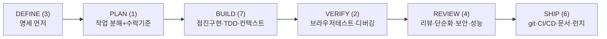

# Agent Skills (Addy Osmani)

> **핵심** — AI 코딩 에이전트는 코드는 잘 짜지만 **체계적 프로세스(명세·테스트·보안)를 건너뛰는 지름길** 경향이 있다. Addy Osmani(Google Chrome DevRel)의 **agent-skills**는 **SDLC 전체를 구조화 워크플로로 주입**한다. 철학: *"방법론을 산문(prose)이 아니라 프로세스(process)로."* 각 스킬에 **반-합리화 테이블**(에이전트가 단계를 건너뛰려는 변명 목록)을 넣어 지름길을 차단한다.

## 6단계 SDLC + 24개 스킬

| 단계 | 스킬 수 | 대표 스킬 |
|---|---|---|
| **DEFINE** | 3 | interview-me · idea-refine · spec-driven-development |
| **PLAN** | 1 | planning-and-task-breakdown |
| **BUILD** | 7 | incremental-implementation · TDD · context-engineering · source-driven · **doubt-driven** · frontend-ui · api-design |
| **VERIFY** | 2 | browser-testing-with-devtools · debugging-and-error-recovery |
| **REVIEW** | 4 | code-review-and-quality · code-simplification · security-and-hardening · performance-optimization |
| **SHIP** | 6 | git-workflow · ci-cd · deprecation · documentation-and-adrs · **observability** · shipping-and-launch |
| (meta) | 1 | using-agent-skills |

- **슬래시 명령 8개**: `/spec /plan /build /test /review /webperf /code-simplify /ship`
- **전문가 페르소나 4개**: code-reviewer(시니어 스태프) · test-engineer(QA) · security-auditor · **web-performance-auditor**
- **내장 원칙**: Hyrum's Law(API) · Test Pyramid(테스트) · Chesterton's Fence(단순화) · Trunk-based Development(git)
- **지원 8플랫폼**: Claude Code · Cursor · Gemini CLI · Windsurf · Antigravity CLI · OpenCode · GitHub Copilot · Kiro IDE
- 설치: `/plugin marketplace add addyosmani/agent-skills`

## 팩트체크 (원문 글 vs 실제 repo)

| 글 주장 | 실제 (검증) |
|---|---|
| 스타 "16,400+"(2026-04) | **65.1k** (확인 시점 — 글이 구버전) |
| "20개 스킬" | 실제 **24개**(23 lifecycle + 1 meta) |
| 슬래시 "7개" | 실제 **8개**(`/webperf` 누락됨) |
| 페르소나 "3개" | 실제 **4개**(web-performance-auditor 추가) |
| 라이선스·버전 | MIT · v0.6.2(2026-06-11), 활발 |

## 관전 포인트

- 일반 프롬프트 = "목표만" / agent-skills = **목표 + 과정 + 품질 게이트**. 예를 들어 `/build`는 명세 확인 → 테스트 동반 → 엣지케이스 검토로 이어져 프로덕션급 코드를 유도한다.
- 저자 **Addy Osmani**는 같은 시기 "Loop Engineering" 글의 저자와 동일인이며, "스킬로 방법론을 인코딩"한다는 점에서 Compound Engineering(Every) 계열과 맥을 같이 한다.
- 실무 시사점: 명세·검토·보안 게이트를 스킬로 미리 박아두면 자동화 품질이 일관되게 올라간다.

---

**출처**: [addyosmani/agent-skills (GitHub)](https://github.com/addyosmani/agent-skills)

*팩트체크: 2026-06-22, addyosmani/agent-skills repo 직접 확인. 원문 글은 2026-04 기준이라 수치 차이가 있다.*
