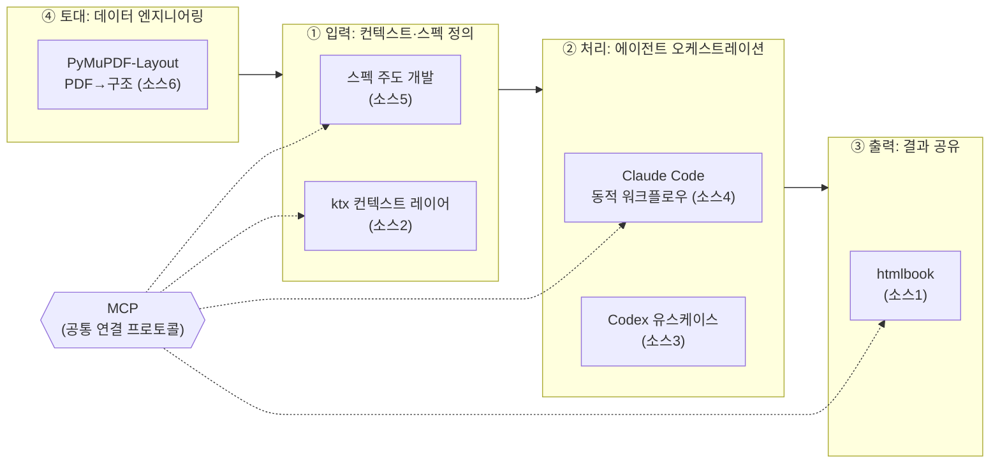
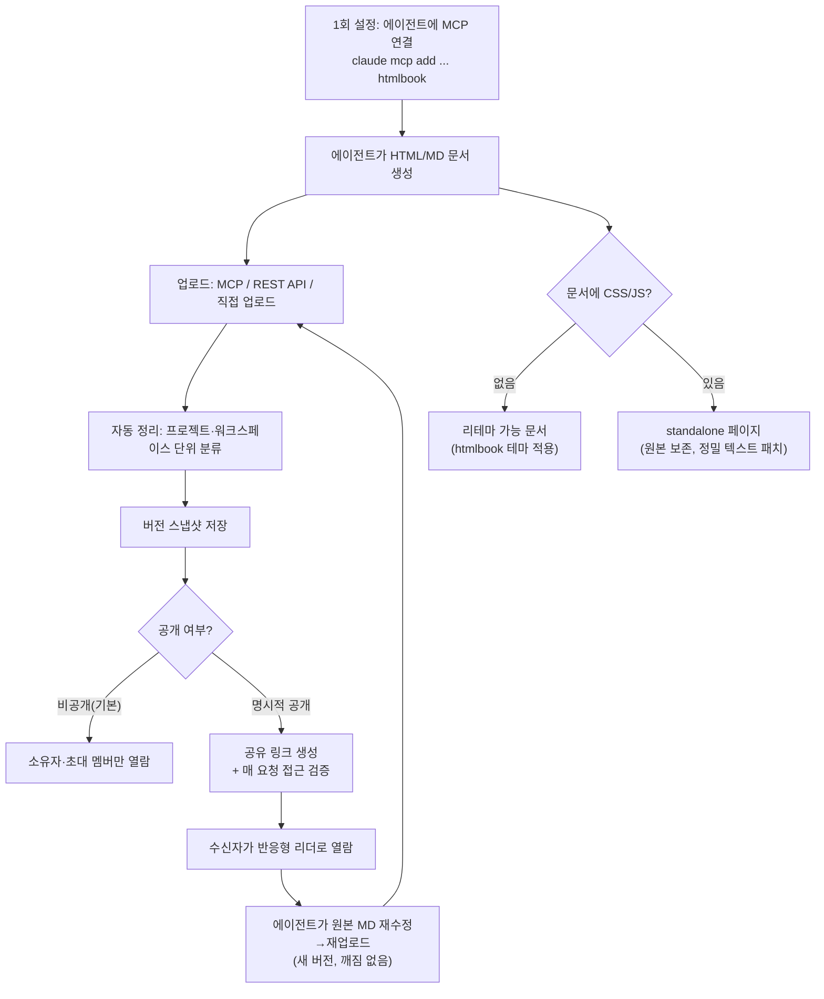
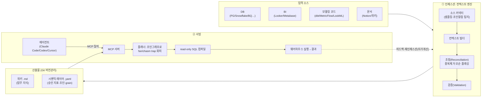
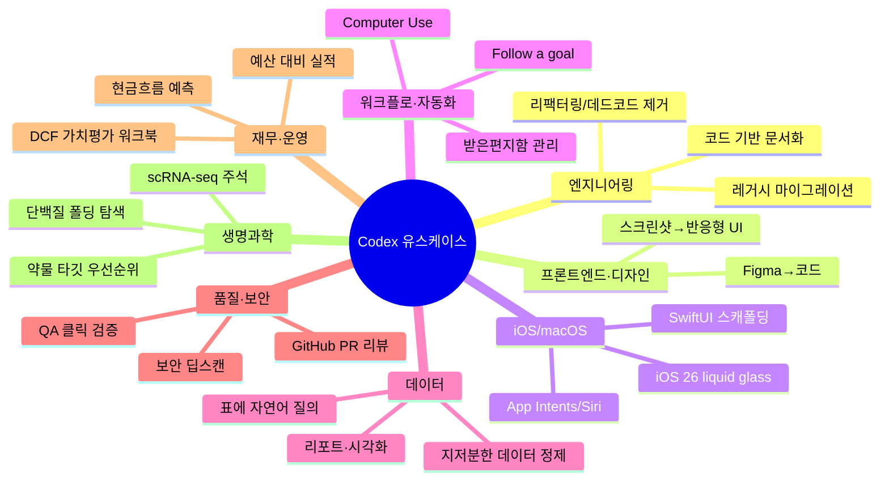
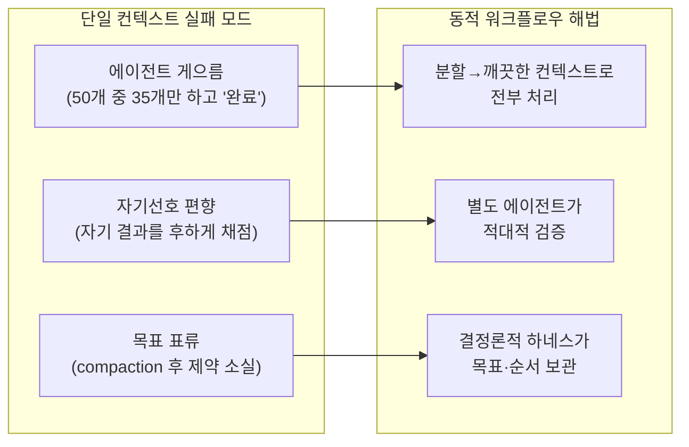
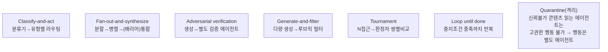
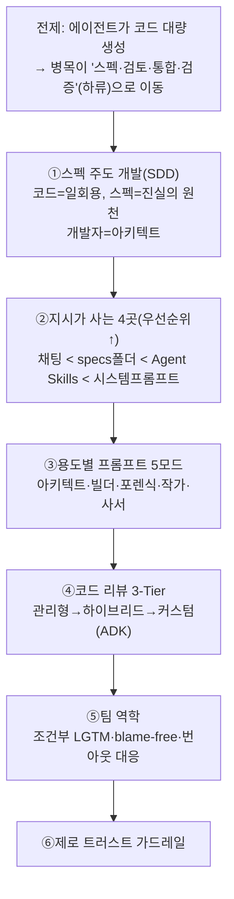
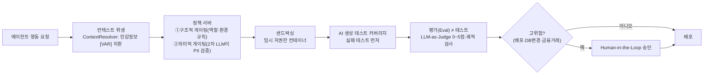
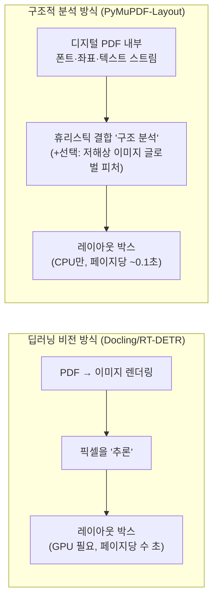
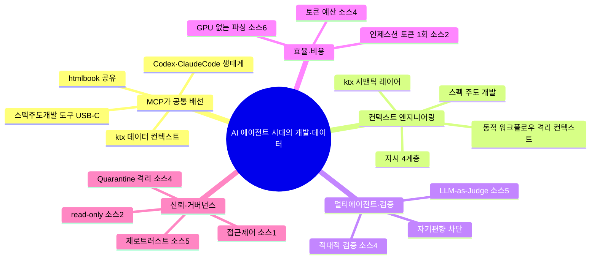

# AI 에이전트 시대의 개발·데이터 워크플로우 — 6개 소스 심층 분석

> **한 줄 개요** — "AI가 코드를 대량 생성하는 시대"의 전체 사슬을 6개 글로 관통한다: **데이터 토대(PDF 파싱)** → **컨텍스트·스펙 정의(ktx·스펙주도개발)** → **에이전트 오케스트레이션(Claude Code 동적 워크플로우·Codex)** → **결과 공유(htmlbook)**. 공통 연결축은 **MCP**, 공통 화두는 **컨텍스트 엔지니어링·멀티에이전트 검증·효율·거버넌스**다.

> ⚠️ **이 문서는 팩트체크를 거쳤습니다.** 각 소스를 원문(긱뉴스 + 원본 아티클/GitHub/공식 블로그)까지 내려가 적대적으로 재검증했고, **원문과 어긋나거나 출처가 확인되지 않은 주장**은 각 절의 `⚠️ 검증 메모`와 문서 끝 [팩트체크 요약](#5--팩트체크-요약-반드시-확인)에 분리해 표기했습니다. 본문에서 단정형 대신 "~로 보임/주장"으로 쓴 부분은 의도된 표기입니다.

---

## 0. 작성 메타 & 분석 대상

| 항목 | 내용 |
|---|---|
| 작성일 | 2026-06-21 |
| 분석 대상 | 6개 (긱뉴스 4 + 블로그 1 + PyTorch 한국 커뮤니티 1) |
| 검증 방식 | 소스별 ①심층 독해 → ②원문 재대조 적대적 팩트체크 |
| 종합 신뢰도 | 4·6번 높음 / 1·2·5번 중간 / 3번 주의(핵심 수치 미검증) |

### 분석 대상 목록

| # | 제목 | 유형 | 원문/출처 | 신뢰도 |
|---|---|---|---|---|
| 1 | htmlbook — AI가 만든 HTML, 링크 하나로 공유 | 제품 출시(Show GN) | `htmlbook.io` | 중 |
| 2 | ktx — 데이터/분석 에이전트용 실행 가능한 컨텍스트 레이어 | 오픈소스(GitHub) | `github.com/Kaelio/ktx` | 높음 |
| 3 | Codex, 활용 사례 모음 대폭 확장 | 공식 문서/카탈로그 | `developers.openai.com/codex/use-cases` | **주의** |
| 4 | 작업별 맞춤 하네스: Claude Code의 동적 워크플로우 | 엔지니어링 블로그 | `claude.com/blog/...dynamic-workflows...` | 높음 |
| 5 | 바이브 코딩 시대의 스펙 주도 프로덕션급 개발 | 블로그(백서 번역·재구성) | `reasonofmoon.github.io/...` | 중 |
| 6 | GPU 없이 PDF 레이아웃 분석 — 10배 빠른 파싱 벤치마크 | 기술 블로그+커뮤니티 | `pymupdf.io/blog/...doclaynet...` | 높음 |

---

## 1. 한눈에 보기

### 1.1 6개 소스 한 문장 요약

| # | 한 문장 요약 | 키워드 |
|---|---|---|
| 1 | AI 에이전트가 만든 HTML/MD 문서를 **MCP/API로 올려 링크 하나로 공유**하고 테마·버전·접근제어를 제공하는 문서 호스팅. | 결과 공유 · MCP |
| 2 | 에이전트가 사내 웨어하우스를 **정확히** 질의하도록 승인된 지표·조인그래프·업무 위키를 **자동 구축·유지**하는 컨텍스트 레이어. | 데이터 컨텍스트 · 시맨틱 레이어 |
| 3 | OpenAI가 Codex 유스케이스를 대폭 늘리고, **코딩 보조 → 전사 업무 위임 플랫폼**으로 포지셔닝(긱뉴스 제출자 해석). | 업무 자동화 · Computer Use |
| 4 | 작업마다 **즉석 작성되는 JS 하네스**로 격리된 서브에이전트들을 조율해 게으름·자기편향·목표표류를 구조적으로 차단. | 멀티에이전트 오케스트레이션 |
| 5 | 바이브 코딩을 프로덕션급으로 끌어올리려면 **스펙 주도 개발 + 제로 트러스트 가드레일**이 필요하다는 방법론. | 스펙 · 거버넌스 |
| 6 | **GPU 없이** PDF 내부 구조(폰트·좌표·휴리스틱)만으로 레이아웃을 분석해 비전 모델 대비 **10배 빠르고 11~15배 가벼운** 동급 정확도. | 문서AI · 효율 |

### 1.2 큰 그림 — "AI 코딩/에이전트 생애주기"에서 6개 소스의 위치

> 읽는 법: **데이터(6)** 를 정제해 **컨텍스트/스펙(2·5)** 으로 떠먹이면, **에이전트(4·3)** 가 일을 처리하고, 그 결과를 **공유(1)** 한다. 네 단계 모두를 가로지르는 표준 배선이 **MCP**다.

---

## 2. 소스별 상세 분석

## 2-1. htmlbook — AI가 만든 HTML/MD, 링크 하나로 공유 (소스 1)

- **유형**: 1인 개발자 제품 출시 글(Show GN) · 긱뉴스 추천 6P, 댓글 11
- **원문**: <https://htmlbook.io> | 긱뉴스: <https://news.hada.io/topic?id=30603>

### 핵심 요약
AI 코딩 에이전트(Claude Code·Cursor·Codex 등)가 만들어낸 HTML/Markdown 결과물은 보통 로컬 `file://` 에 갇혀 공유가 번거롭다. htmlbook은 이 "마지막 한 걸음(공유)"을 **링크 하나**로 줄이는 **AI 결과물용 디지털 책장**이다.

### 핵심 포인트
- 기존 공유 방식(파일 전송·코드 복붙·스크린샷)의 불편 → **공개 링크 하나**로 대체.
- 업로드 경로 3가지: **MCP / REST API / 직접 업로드(웹 UI 드래그)**. MCP는 한 줄로 연결.
- 리더: 반응형 + **paper·sepia·dark 테마**, 목차, 폭·글꼴 크기 조절.
- 기본 **비공개**(소유자/초대 멤버), 명시적 공개 시에만 링크 생성, **요청마다 서버측 접근 검증**.
- **마크다운 원본 보존** → 에이전트가 재수정·재업로드해도 안 깨짐. 편집은 원본 미변경 + **새 버전 자동 생성**(복원 가능).
- 보안: API 키 **SHA-256 해시 저장**·워크스페이스 스코프, 저장 Cloudflare R2/Google Cloud 암호화, 전송 TLS, **학습/판매 미사용**.
- 가격: **현재 무료**(무제한), 과금·팀 기능은 추후.

### 워크플로우 도식

### 커뮤니티 토론(긱뉴스 댓글)
- 모바일 로그인 오류(세션 스토리지) 보고 → 작성자 수정 확인.
- "홍보 글까지 AI에게 쓰게 하는 건 좀…" — Show GN 글 자체를 AI로 작성한 데 대한 비판.
- **Vercel과의 비교/차별점** 질문 → 작성자: "본격 배포가 아니라 **HTML/MD 콘텐츠 공유**에 특화, 대상은 비개발자 포함."
- 이용약관·개인정보처리방침 부재 지적 → 추가 예정.

> ⚠️ **검증 메모**
> - 본문에 자주 보이는 공개 링크 형식 **`htmlbook.io/d/[code]` 는 원문·랜딩·검색 어디서도 확증되지 않음** → *추정값으로 취급*.
> - SHA-256·R2·TLS·테마 등 세부는 긱뉴스 본문이 아니라 **제품 랜딩 페이지** 출처(내용 자체는 사실).
> - 지원 클라이언트에 **Claude Desktop** 도 포함됨.
> - 제품 포지셔닝: 작성자는 타깃을 "개발자뿐 아니라 **비개발자**"로 강조 → 단순 "AI 개발자용"으로 단정 금지.

---

## 2-2. ktx — 데이터/분석 에이전트용 실행 가능한 컨텍스트 레이어 (소스 2)

- **유형**: 오픈소스(Apache-2.0) · Y Combinator P25 기업 **Kaelio**(창업자 Luca Martial, Andrey Avtomonov)
- **원문**: <https://github.com/Kaelio/ktx> | 긱뉴스: <https://news.hada.io/topic?id=30588>
- 추출 시점 GitHub: ★ 약 1.3k, 513 commits, 최신 **v0.13.0(2026-06-19)**, TypeScript 82.9% / Python 9.3%

### 핵심 요약
범용 AI 에이전트는 데이터 작업에서 ① 매번 웨어하우스를 재탐색하고 ② 지표 계산식을 **제멋대로 지어내며** ③ 승인된 정의와 다른 숫자를 낸다. ktx는 **승인된 지표·조인그래프·업무 위키를 자동으로 만들고 유지**해, 에이전트가 회사 맥락대로 **정확히** 질의하게 만드는 "실행 가능한(executable) 컨텍스트 레이어"다.

### 핵심 포인트
- 전통적 시맨틱 레이어(Cube·dbt MetricFlow·LookML)는 **수동 유지보수** + 비정형 지식 미흡 → ktx는 **자동 인제스션 + 위키 통합**으로 차별화.
- **자동 학습**: 위키 수집·정리·중복제거 + 소스 간 **모순 플래깅**(사람 검토용).
- **데이터 스택 매핑**: 테이블 샘플링·메타데이터 캡처·**조인 가능 컬럼** 식별.
- **시맨틱 레이어**: 조인 그래프로 **chasm trap·fan trap 자동 해소** → 에이전트가 SQL을 매번 다시 짜는 대신 **선언적으로 지표 호출**.
- **에이전트 실행**: CLI + MCP, **전문검색 + 의미검색** 결합. 전 과정 **read-only**.
- 지원 DB: PostgreSQL·Snowflake·BigQuery·ClickHouse·MySQL·SQL Server·SQLite / 연동: dbt·MetricFlow·LookML·Looker·Metabase·Notion.
- 산출물 = **위키 Markdown + 시맨틱 레이어 YAML** → **Git 버전관리** 가능.
- 설치: `npm install -g @kaelio/ktx` → `ktx setup` → `ktx status`, 빌드 `ktx ingest`, 서버 `ktx mcp start`.

### 아키텍처 도식 — 2단계 파이프라인(인제스션 → 서빙)

### 커뮤니티 반응(주로 Hacker News "Show HN")
- 호평: "시맨틱 레이어가 필요로 했던 것을 정확히 해결", "데이터 문서화가 에이전트 시대엔 성패를 가른다."
- 성능 비판: **테이블 20개 인제스션에 19분** → 개발팀 "지연의 **99%가 LLM 호출**", 최적화 중.
- 한계: PostgreSQL `pg_description` 미수집 버그, 자동 메모리 압축 미지원(예정).
- 경쟁 비교: **Wren**(수동 MDL 필요)·Cube/MetricFlow(수동)·**Nao**(완성형 앱) vs ktx(자동 인제스션 + 파일 기반 Git 협업).
- 설계 철학: 그래프DB 대신 **YAML/Markdown 파일** → Git 협업·MCP 팀 공유.

> ⚠️ **검증 메모** (신뢰도 높음)
> - 지원 에이전트에 **Cursor·OpenCode** 도 포함.
> - 텔레메트리의 "PostHog" 벤더명은 원문 직접 확인 안 됨 → 약하게 표기(민감정보 redact 자체는 사실).
> - GitHub 지표는 **추출 시점 스냅샷**(시간 경과로 변동). YC 표기 **P25**(X25 → "Primavera" P25 개명) 정확.

---

## 2-3. Codex, 활용 사례 모음 대폭 확장 (소스 3)

- **유형**: OpenAI 공식 개발자 문서(유스케이스 카탈로그) · 긱뉴스 104P, 댓글 4
- **원문**: <https://developers.openai.com/codex/use-cases> | 긱뉴스: <https://news.hada.io/topic?id=29847>

### 핵심 요약
OpenAI가 Codex 유스케이스 카탈로그를 확장해, 엔지니어링뿐 아니라 **디자인·데이터·재무·운영·QA·세일즈·생명과학**까지 망라하는 카탈로그로 키웠다. 긱뉴스 제출자는 이를 "코딩 보조 → **전사 업무 위임 플랫폼**"으로의 포지셔닝 전환으로 해석한다.

> ⚠️ **가장 중요한 검증 결과 — 먼저 읽으세요**
> - **"12개 → 52개" 및 "50+ use cases" 라는 수치는 OpenAI 공식 페이지에서 확인되지 않습니다.** 재대조 결과 페이지에 그런 숫자 배지·문구가 **없었음**. 두 수치 모두 **긱뉴스 제출자 요약에서만** 나온 것 → *공식 사실이 아니라 제출자 주장으로 취급*.
> - **"포지셔닝 전환/대폭 개편" 서사도 OpenAI가 직접 진술한 게 아니라 제출자 해석**(원문은 정적 카탈로그, 메타 서술 없음).

### 페이지 실제 구조(정정본)
원문은 **4개 필터 그룹**으로 구성됨(초안의 "3개 축"은 부정확):

| 필터 그룹 | 값(예) |
|---|---|
| **Category** | Engineering, Front-end, Quality, Sciences, iOS/macOS, **Evaluation** 등 |
| **Workflows** | Automation, Data, Integrations, Knowledge Work |
| **Team** | Design, Engineering, Finance, Operations, Product, QA, Research, Sales |
| **Task Type** | Analysis, Code, Design, Testing, Workflow |

> `Team` 축의 존재 자체가 **비개발 직군(재무·영업·운영)** 을 겨냥한다는 신호. (단, "Automation·Data·Integrations·Knowledge Work"는 Category가 아니라 **Workflows** 그룹 소속.)

### 영역별 대표 유스케이스

- **핵심 신기능 Computer Use**: Codex가 **Mac에서 직접 클릭·타이핑·앱 탐색**으로 GUI를 조작. `Follow a goal`은 장기 목표를 지속 추적.
- **Featured Collections(7개)**: Productivity & Collaboration / Web / Game / Native Development / Production Systems / Security / Life Sciences.

### 커뮤니티 토론(긱뉴스)
- Windows Server 2022에 Codex Desktop 설치 어려움 → 도움 요청.
- "참고할 내용 많다", "사고 확장", "구독해 실무 적용 예정" 등 호평.

> ⚠️ **검증 메모** (주의 — 신뢰도 낮음 항목 존재)
> - "12→52", "50+" 수치 **미검증**(위 참조). · 필터는 **4그룹**(3축 아님).
> - `Evaluation(Evals)` 카테고리 실재하나 초안 누락. "Mobile/Knowledge Work를 Category 값으로" 든 것은 부정확.
> - "Computer Use가 Slack/GitHub/Linear/Zoom/Gmail을 **하나로 오케스트레이션**"은 **확대 해석** — 원문은 이들을 개별 유스케이스 제목으로 나열할 뿐.
> - 누락된 실제 유스케이스: Zoom 회의 후속조치, 슬라이드 덱 생성, 피드백 종합, 온보딩, "Learn a new concept", "대규모 코드베이스 이해" 등.

---

## 2-4. 작업별 맞춤 하네스: Claude Code의 동적 워크플로우 (소스 4)

- **유형**: Anthropic 엔지니어링 블로그(Thariq Shihipar, Sid Bidasaria, 2026-06-02)
- **원문**: <https://claude.com/blog/a-harness-for-every-task-dynamic-workflows-in-claude-code> | 긱뉴스: <https://news.hada.io/topic?id=30136>

### 핵심 요약
하나의 컨텍스트 윈도우에서 장시간 복잡 작업을 하면 LLM은 세 가지로 실패한다. **동적 워크플로우**는 Claude Opus 4.8이 **작업마다 즉석 작성하는 JavaScript 하네스**로, **격리된 컨텍스트의 서브에이전트들**을 조율해 이 실패들을 구조적으로 막는다.

### 단일 컨텍스트의 3대 실패 모드 → 해법

### 기술 구조 & 정적 워크플로우와의 차이

| 구분 | 정적 워크플로우 | **동적 워크플로우** |
|---|---|---|
| 생성 | Agent SDK / `claude -p`로 미리 고정 | **Opus 4.8이 작업마다 즉석 작성** |
| 형태 | 일반화된 범용 구조 | 사용 사례별 **맞춤 최적화** |
| 단위 | — | 서브에이전트(독립 컨텍스트 + **worktree 격리** + 모델 선택 + 중단점 재개) |
| 도구 | — | 특수 함수 + 표준 JS(JSON/Math/Array) |

### 핵심 디자인 패턴(도식)

### 실전 사용 사례(원문 10개 헤더)
`Migrations and refactors` · `Deep research` · `Deep verification` · `Sorting` · `Memory and rule adherence` · `Root-cause investigation` · `Triaging at scale` · `Exploration and taste` · `Evals` · `Model and intelligence routing`

- **Bun**: Zig→Rust 재작성에 적용(호출지점·실패테스트·모듈 단위 분할 → worktree 서브에이전트 수정 → 적대적 검토 후 병합).
- **`/deep-research` 스킬**이 동적 워크플로우 기반(검색 분산→소스 수집→적대 검증→인용 보고서 통합).
- **정렬/순위**: 1000행↑은 단일 프롬프트에서 품질 저하 → **각 비교가 별도 에이전트**, **결정론적 루프가 브래킷 보관**, 컨텍스트엔 실행 순서만 유지.
- **메모리**: 최근 50세션 반복 수정 패턴을 클러스터링 → "이 규칙이 실제 실수를 막았나?" 적대 검증 → 생존자를 `CLAUDE.md`로 증류.

> 💡 **메타 노트** — 이 분석 문서 자체도 동적 워크플로우와 유사한 방식(병렬 독해 → 적대적 팩트체크 → 종합)으로 작성되었다. 소스 4는 그 방법론의 1차 출처다.

> 운영 팁: 워크플로우는 **워크플로우 메뉴에서 `s` 키로 저장**하거나 `~/.claude/workflows`/스킬 폴더로 배포·공유. `/goal`·`/loop`와 결합 가능. **토큰을 더 쓰므로** "정말 추가 계산이 필요한가"를 자문할 것(명시적 토큰 예산, 예: 10k 설정 가능).

> ⚠️ **검증 메모** (신뢰도 높음) — 거의 모든 주장이 원문과 일치. 경미한 의역: 목표표류는 일반 요약이 아니라 **compaction(컨텍스트 압축) 이후** 특히 발생(엣지케이스·"don't do X" 제약 소실). 긱뉴스 댓글은 로그인 필요로 미확인.

---

## 2-5. 바이브 코딩 시대의 스펙 주도 프로덕션급 개발 (소스 5)

- **유형**: 블로그(reasonofmoon devlog) — Google **Lee Boonstra**의 백서 *"Vibecode in the Age of Agentic Development"*(2026-05)를 한국어로 번역·재구성했다고 **주장**
- **원문**: <https://reasonofmoon.github.io/2026/06/19/spec-driven-production-vibe-coding/>

### 핵심 요약
AI가 매일 수천 줄을 생성하면서 병목이 **"코드 작성" → "스펙 작성·검토·통합·검증"(하류)** 으로 이동했다. 프로토타입용 "바이브 코딩"을 **프로덕션급**으로 올리려면 **스펙 주도 개발(SDD)** + **제로 트러스트 가드레일**이 필요하다는 방법론.

### 6개 축 구조

### 제로 트러스트 가드레일(에이전트 출력 검증 게이트)

### 핵심 디테일
- **SDD**: 좋은 스펙 = 완전한 기술설계 + 도구·버전 명시 다이어그램 + "왜"의 배경 + 정상/비정상/엣지케이스 시나리오. **Gherkin(Given-When-Then)** 으로 상태→행동→결과 사고 강제.
- **지시 4곳**: 채팅(세션) → `specs/`(.md/.yaml) → `.agent/skills/`(SKILL.md) → 시스템 프롬프트(글로벌 < 팀 `AGENTS.md` < 프로젝트=**최우선**).
- **5모드**: 아키텍트(생성)·빌더(기능)·포렌식(버그, 실패 테스트 우선)·작가(문서)·사서(데이터).
- **MCP = "AI 도구용 USB-C"**: 약 **40줄** 파이썬 MCP 서버로 SQLite를 노출해 `query_knowledge`/`add_knowledge`를 어떤 MCP 에이전트든 재사용.
- **코드 리뷰 3-Tier**: Tier1 관리형(Gemini Code Assist) → Tier2 하이브리드(GitHub Actions+Skill) → Tier3 커스텀(**ADK Agent Engine**: 지식그래프 Spanner Graph + 벡터검색 + 멀티에이전트 `Search→Story→Impact→Task-Breakdown→Coding`). **Siemens** 사례 리팩토링 2주→수 시간.
- **환각 위험 실화**: "버튼 만들기" 프롬프트 → 브라우저 에이전트가 이메일 버튼을 **자율 클릭** → **동료 50명에게 환각 가득한 거짓 메일** 발송.

> ⚠️ **검증 메모** (출처 신뢰성 주의 — *내용 전달은 충실, 원출처가 의심*)
> - **핵심 통계 미검증**: "Markdown 미최적화 시 성능 −40%", "YAML 51.9% / JSON 43.1% / XML 33.8% 파싱 정확도"를 **Ouyang 등(2026) SkCC 논문** 출처로 귀속하나, 해당 논문 초록엔 이 수치가 **없음**(논문 실제 수치는 통과율 21.1%→33.3% 등). → *수치는 인용 그대로 신뢰하지 말 것*.
> - **원천 백서 실재 미확인**: "Lee Boonstra, *Vibecode in the Age of Agentic Development*(Google, 2026-05)"를 독립적으로 확인 못 함(Boonstra는 실재 Google AI 엔지니어이나 다른 백서 저자).
> - MCP 서버는 **약 40줄**(초안의 "40~67줄"은 과장). · 누락: **A2A(Agent-to-Agent) 프로토콜** 언급, SkCC "10ms 컴파일", 기여자(Elia Secchi·Antonio Gulli·Michael Lanning).

---

## 2-6. GPU 없이 PDF 레이아웃 분석 — 10배 빠른 파싱 벤치마크 (소스 6)

- **유형**: 기술 블로그 벤치마크 + PyTorch 한국 사용자모임 토론(작성자 epapyrus)
- **원문(검증됨)**: <https://pymupdf.io/blog/pymupdf-layout-performance-on-doclaynet-a-comparative-evaluation> | 커뮤니티: <https://discuss.pytorch.kr/t/llm-1-gpu-pdf-10/9808/3>

### 핵심 요약
Document AI의 **레이아웃 분석**(표·제목·본문 구분)은 보통 LayoutLM·YOLO·RT-DETR 같은 무거운 비전 모델을 **GPU**로 돌린다. **PyMuPDF-Layout** 은 픽셀을 "추론"하는 대신 PDF 내부의 **폰트 메타데이터·좌표·휴리스틱**을 결합한 "구조적 분석"으로, **GPU 없이(CPU)** 비전 모델 대비 **10배 이상 빠르고 11~15배 가벼우면서 동급(F1) 이상**의 성능을 낸다.

### 두 접근의 차이

### 벤치마크 — 실험 환경
- 데이터셋 **DocLayNet**(Pfitzmann et al., 2022): 학습 69,000p / 검증 6,480p, **11개 클래스**(caption·footnote·formula·list-item·page-footer·page-header·picture·section-header·table·text·title), 6개 문서군(재무·과학·특허·매뉴얼·법률·입찰).
- 베이스라인 **Docling v2(RT-DETR)** · 지표 **IoU 0.6에서 F1**.
- 클래스 정합 주의: Docling의 모든 `title`이 `section-header`로 매핑 → **Docling의 title 커버리지=0**(이것이 title의 큰 Δ를 설명).

### 실험 1 — PDF-only 피처 (이미지 미사용)

| Class | Docling F1 | PyMuPDF-Layout F1 | Δ |
|---|---|---|---|
| caption | 0.8594 | 0.8157 | −0.0437 |
| footnote | 0.4827 | 0.7217 | **+0.2390** |
| formula | 0.7416 | 0.7370 | −0.0046 |
| list-item | 0.7955 | 0.8737 | +0.0782 |
| page-footer | 0.7937 | 0.7973 | +0.0036 |
| page-header | 0.8218 | 0.8387 | +0.0169 |
| picture | 0.6314 | 0.2462 | **−0.3852** |
| section-header | 0.8732 | 0.7823 | −0.0909 |
| table | 0.7977 | 0.6886 | −0.1091 |
| text | 0.8146 | 0.8675 | +0.0529 |
| title | 0.0000 | 0.7672 | **+0.7672** ※정합 한계 |
| **Overall** | **0.8102** | **0.8270** | **+0.0168** |

→ 파라미터 **2,000만 vs 130만**. 강점=구조화 텍스트 요소, 약점=시각 요소(picture)·문맥 의존(table/section-header).

### 실험 2 — Fusion 피처 (PDF + 저해상도 이미지 글로벌 컨텍스트, 경량 CNN +0.5M)

| Class | Docling F1 | PyMuPDF-Layout(Fusion) F1 | Δ |
|---|---|---|---|
| caption | 0.8594 | 0.8613 | +0.0019 |
| footnote | 0.4827 | 0.7584 | **+0.2757** |
| formula | 0.7416 | 0.7666 | +0.0250 |
| list-item | 0.7955 | 0.8676 | +0.0721 |
| page-footer | 0.7937 | 0.9277 | **+0.1340** |
| page-header | 0.8218 | 0.7953 | −0.0265 |
| picture | 0.6314 | 0.2885 | −0.3429 |
| section-header | 0.8732 | 0.8389 | −0.0343 |
| table | 0.7977 | 0.7966 | **−0.0011** (거의 소멸) |
| text | 0.8146 | 0.8489 | +0.0343 |
| title | 0.0000 | 0.7189 | +0.7189 ※정합 한계 |
| **Overall** | **0.8102** | **0.8356** | **+0.0254** |

### 계산 효율 요약

| 구현 | 파라미터 | Overall F1 | GPU |
|---|---|---|---|
| Docling (RT-DETR) | 2,000만 | 0.8102 | **필요** |
| PyMuPDF-Layout (PDF) | 130만 (**15.4×↓**) | 0.8270 | 불필요 |
| PyMuPDF-Layout (Fusion) | 180만 (**11.1×↓**) | 0.8356 (**+2.5%p**) | 불필요 |

- **속도**: 딥러닝 페이지당 수 초(GPU) vs PyMuPDF-Layout 페이지당 **~0.1초**(CPU) → **약 10배+**.
- **시사점**: 구조화 PDF 피처 모델이 비전 모델과 **성능 패리티**를 내며 비용 대폭 절감 → **RAG용 대량 PDF 전처리**, GPU 최소화 환경에 적합. 한계는 `picture`·복잡한 표(Fusion이 table 격차는 거의 해소).

### 커뮤니티 토론
- 한글파일/PDF 이미지 분석에 활용 기대, 한컴 오픈소스 모델도 보겠다는 의견.
- PyMuPDF는 오픈소스이며 **글로벌 누적 6억 1천만 다운로드** 를 돌파한 기술표준이라 소개됨.

> ⚠️ **검증 메모** (신뢰도 높음 — 수치 전수 일치)
> - 본문 모든 수치가 **PyMuPDF 공식 블로그와 정확히 일치**(WebFetch 확인).
> - 글에서 "티스토리 원문"이라 한 출처는 실은 **PyMuPDF/Artifex 공식 블로그**이며, 국내에 옮겨 소개한 형태로 추정.
> - 후속 정보: **2026-03 릴리스에서 Overall F1 0.8640** 으로 추가 개선 언급(본 벤치마크 이후 시점).

---

## 3. 교차 분석 / 종합

### 3.1 공통 테마 지도

### 3.2 네 가지 관통 화두

| 화두 | 핵심 통찰 | 등장 소스 |
|---|---|---|
| **① MCP = 표준 배선** | 공유(1)·데이터(2)·도구 재사용(5)·에이전트 연동(3·4)이 모두 MCP로 연결. "AI 도구용 USB-C"(소스5). | 1·2·4·5 |
| **② 컨텍스트 엔지니어링** | 병목은 코드가 아니라 **에이전트에게 무엇을, 어떻게 떠먹이느냐**. ktx(데이터 정의)·SDD(스펙)·지시 4계층·동적 워크플로우(격리 컨텍스트)가 한 흐름. | 2·4·5 |
| **③ 멀티에이전트 + 적대적 검증** | 단일 LLM의 게으름·자기편향을 **별도 검증 에이전트/LLM-as-Judge**로 차단. "생성과 검증의 분리". | 4·5 |
| **④ 효율 ↔ 거버넌스의 균형** | 한쪽은 **비용 절감**(GPU 제거·토큰 1회 인제스션·예산), 다른 쪽은 **통제**(제로트러스트·격리·read-only·접근제어). 둘 다 "확장"의 조건. | 1·2·4·5·6 |

### 3.3 비교표 — 6개 도구/방법론의 좌표

| # | 무엇 | 누가/형태 | 사슬 위치 | 핵심 가치 | 비용·라이선스 |
|---|---|---|---|---|---|
| 1 htmlbook | 결과물 공유 호스팅 | 1인 개발(클라우드 SaaS) | 출력 | 링크 한 줄 공유·버전 | 무료(추후 과금) |
| 2 ktx | 데이터 컨텍스트 레이어 | Kaelio/YC(오픈소스) | 입력 | 정확한 지표·조인 자동화 | Apache-2.0 |
| 3 Codex UC | 업무 위임 카탈로그 | OpenAI(문서) | 처리 | 전 직군 유스케이스 | 제품 구독 |
| 4 동적 워크플로우 | 멀티에이전트 오케스트레이션 | Anthropic(기능) | 처리 | 게으름·편향·표류 차단 | Claude Code |
| 5 SDD·제로트러스트 | 프로덕션 방법론 | Google(백서/블로그) | 입력+거버넌스 | 스펙·가드레일 | 방법론(무료) |
| 6 PyMuPDF-Layout | GPU 없는 PDF 파싱 | Artifex/PyMuPDF | 데이터 토대 | 10배 속도·동급 정확도 | 오픈소스(+Pro) |

### 3.4 💡 데이터 분석/마케팅 관점 시사점 *(분석자 부가)*
> 아래는 일반적 데이터 자동화 관점의 시사점이며, 회계 판단이나 투자 권유가 아니다.

- **RAG 파이프라인**: 소스 6(PyMuPDF-Layout)으로 PDF를 **GPU 없이 대량 전처리** → 소스 2(ktx)로 **지표·정의를 에이전트에 정확히 공급**하면, 분석/리포팅 자동화의 입력 품질이 올라간다.
- **결과 전달**: 소스 1(htmlbook)은 분석 리포트·대시보드를 **링크로 공유**하는 마지막 단계에 바로 쓸 수 있다(비개발자 공유에 초점).
- **품질 보증**: 소스 4·5의 **적대적 검증·LLM-as-Judge·제로트러스트**는 "AI가 쓴 분석/콘텐츠"를 **그대로 믿지 않고 검증**하는 실무 체크리스트로 전용 가능(이 문서 자체가 그 방식으로 검증됨).
- **정밀 인용 도메인 적용 예시**: 규정·정의가 엄격한 도메인(예: 정형화된 정밀 인용이 필요한 문서 작업)에서는, ktx식 "승인된 정의"와 제로 트러스트 게이트를 결합해 *데이터 자동화*로 한정해 적용하는 것이 안전하다(특정 조직 내부 데이터·고객 데이터 적용은 별도 거버넌스 필요).

---

## 4. 핵심 용어 사전(통합)

| 용어 | 한 줄 정의 | 출처 |
|---|---|---|
| **MCP (Model Context Protocol)** | 에이전트가 외부 도구·데이터에 연결되는 표준 인터페이스("AI 도구용 USB-C"). | 1·2·5 |
| **컨텍스트 엔지니어링** | 에이전트에게 올바른 맥락(스펙·지표·지식)을 구조화해 공급하는 일. | 2·4·5 |
| **실행 가능한 컨텍스트 레이어** | 문서가 아니라 에이전트가 직접 검색·SQL 컴파일·실행할 수 있는 회사 지식 계층(ktx). | 2 |
| **조인 그래프 / fan·chasm trap** | 테이블 연결 그래프로 잘못된 집계(행 부풀림/다중경로)를 자동 회피. | 2 |
| **시맨틱 레이어** | 원시 테이블+승인 지표를 결합한 재사용 정의 계층(ktx는 YAML). | 2 |
| **동적 워크플로우** | 작업마다 즉석 작성되는 JS 하네스로 서브에이전트를 조율. | 4 |
| **하네스(Harness)** | 에이전트 실행을 통제·조율하는 골격 구조. | 4 |
| **적대적 검증** | 생성과 별개의 검증 에이전트가 비판적으로 점검(자기편향 차단). | 4·5 |
| **Fan-out-and-synthesize** | 분할→병렬 실행→(배리어)통합 패턴. | 4 |
| **Quarantine(격리)** | 신뢰불가 콘텐츠를 읽는 에이전트의 고권한 행동을 분리하는 보안 패턴. | 4 |
| **worktree 격리** | 서브에이전트마다 독립 작업공간을 줘 상호 간섭 방지. | 4 |
| **스펙 주도 개발(SDD)** | 코드=일회용, 스펙=진실의 원천. 개발자=아키텍트. | 5 |
| **Gherkin/BDD (Given-When-Then)** | 상태→행동→결과로 요구사항을 기술해 모호함 제거. | 5 |
| **제로 트러스트 개발** | 에이전트를 불신·통제: 샌드박스·HITL·평가·정책 서버·컨텍스트 위생. | 5 |
| **정책 서버** | 구조적 게이팅(규칙) + 의미적 게이팅(2차 LLM의 PII 검증). | 5 |
| **평가 vs 테스트** | 테스트=이진(맞/틀), 평가=품질 점수(LLM-as-Judge 0~5·궤적). | 5 |
| **조건부 LGTM** | 모든 테스트 통과 시 PR 자동 병합(승인 피로 감소). | 5 |
| **ADK / Agent Engine** | Gemini 기반 멀티에이전트 개발 키트·관리형 런타임(Tier3). | 5 |
| **Computer Use** | 에이전트가 Mac에서 직접 클릭·타이핑으로 GUI 조작. | 3 |
| **레이아웃 분석** | 문서에서 표·제목·본문 등 영역 종류·경계 식별(Document AI 전처리). | 6 |
| **DocLayNet** | 대규모 문서 레이아웃 데이터셋(11클래스, 학습 69k/검증 6.48k). | 6 |
| **구조적 분석 vs 추론** | PDF 내부 구조 직접 사용(CPU) vs 픽셀 추론(GPU). | 6 |
| **Fusion features** | PDF 피처 + 저해상도 이미지 글로벌 컨텍스트(+경량 CNN). | 6 |
| **IoU 0.6 F1** | 예측·정답 박스 겹침 0.6↑을 정탐으로 본 F1 지표. | 6 |

---

## 5. ⚠️ 팩트체크 요약 (반드시 확인)

원문 재대조에서 드러난 **신뢰 주의 항목**만 모았습니다. 인용·재배포 시 이 부분을 함께 표기하세요.

| 소스 | 의심/미검증 주장 | 실제 확인 결과 | 처리 |
|---|---|---|---|
| 3 (Codex) | "유스케이스 12개→52개", "50+ use cases" | **공식 페이지에 해당 수치 없음** — 긱뉴스 제출자 요약일 뿐 | *공식 사실 아님* |
| 3 (Codex) | "필터 3축(Category/Team/Type)" | 실제 **4그룹**(+Workflows), 일부 항목 오분류 | 정정 반영 |
| 3 (Codex) | "코딩보조→전사 플랫폼 포지셔닝 전환" | OpenAI 진술 아님(제출자 해석) | 해석으로 표기 |
| 5 (SDD) | "Markdown −40%", "YAML 51.9/JSON 43.1/XML 33.8%" | 귀속 논문(SkCC) 초록에 **그 수치 없음** | *출처 미검증* |
| 5 (SDD) | 원천 백서 *Vibecode in the Age…*(Google) | 독립적으로 **실재 확인 불가** | 미확인 표기 |
| 5 (SDD) | "MCP 서버 40~67줄" | 원문은 **약 40줄** | 정정 |
| 1 (htmlbook) | 공개 링크 형식 `htmlbook.io/d/[code]` | 어디서도 확증 안 됨 | 추정값 |
| 2 (ktx) | 텔레메트리 "PostHog" 벤더 | 직접 확인 안 됨(redact 자체는 사실) | 약하게 표기 |
| 6 (PyMuPDF) | "티스토리 원문" | 실제는 **PyMuPDF 공식 블로그**(국내 재게시) | 출처 정정 |

> **반대로, 다음은 원문과 정확히 일치(신뢰 가능)**: 소스 6의 모든 벤치마크 수치, 소스 4의 거의 모든 주장·예시·패턴, 소스 2의 아키텍처·기능·라이선스·GitHub 지표.

---

## 6. 한 줄 결론

> **"코드를 쓰는 일"이 싸지면서 가치는 그 앞뒤로 이동했다 — 앞에는 _컨텍스트·스펙·데이터를 정확히 떠먹이는 일(2·5·6)_, 뒤에는 _여러 에이전트로 처리·검증하고(3·4) 결과를 공유하는 일(1)_. 그리고 그 모든 단계를 잇는 표준 배선은 _MCP_, 모든 단계의 전제는 _효율과 거버넌스의 균형_ 이다.**

---

### 출처 링크
1. htmlbook — https://news.hada.io/topic?id=30603 · https://htmlbook.io
2. ktx — https://news.hada.io/topic?id=30588 · https://github.com/Kaelio/ktx
3. Codex Use Cases — https://news.hada.io/topic?id=29847 · https://developers.openai.com/codex/use-cases
4. Claude Code 동적 워크플로우 — https://news.hada.io/topic?id=30136 · https://claude.com/blog/a-harness-for-every-task-dynamic-workflows-in-claude-code
5. 스펙 주도 프로덕션 바이브 코딩 — https://reasonofmoon.github.io/2026/06/19/spec-driven-production-vibe-coding/
6. PyMuPDF-Layout / DocLayNet — https://discuss.pytorch.kr/t/llm-1-gpu-pdf-10/9808/3 · https://pymupdf.io/blog/pymupdf-layout-performance-on-doclaynet-a-comparative-evaluation

*방법: 6개 소스 병렬 심층 독해 → 원문 적대적 팩트체크 → 종합(도식화) · 본 문서의 모든 ⚠️ 표기는 원문 검증 결과에 근거함.*