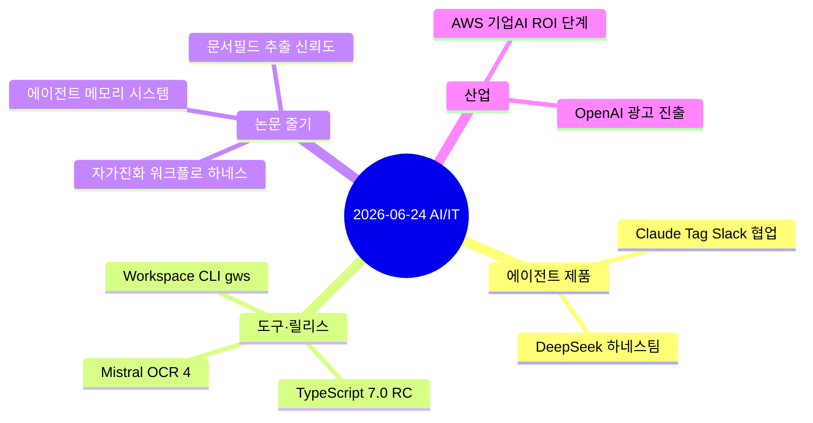

# AI/IT 데일리 다이제스트 — 2026-06-24

> RSS·PyTorch KR·긱뉴스·AI타임스·arXiv를 하루치 쓸어 담아(소스 14, reddit만 봇차단) 내 관심사로 추린 기록. **검증 가능한 주장은 1차 출처로 확인, 벤더 자체 수치는 ⚠️로 분리**했다. (같은 날 [[ai-industry-roundup-2026-06-24|심층 이슈 12선]]과는 별개의 가벼운 일일 큐레이션)

## 오늘의 줄기 한눈에

## 🔥 핵심

- **Claude Tag (Anthropic, 6/23 공식)** — **Slack에서 팀원처럼 일하는 비동기·능동 에이전트.** 채널·도구·코드베이스 접근을 부여하면, 태그 없이도 채널에 반응하고 임계값(A/B 지표·시스템 상태)을 모니터링하며, 스레드를 액션아이템 문서로 정리하고 조건 충족 시 롤아웃 PR까지 준비한다. Anthropic은 **Claude Code(솔로·동기)의 보완형(멀티플레이어·비동기·능동)** 으로 위치시켰다. Enterprise/Team 베타. ⚠️ "내부 제품 PR의 65%를 머지"는 Anthropic 자체 수치.
- **"코딩 실력보다 도메인 전문성"** — Anthropic이 Claude Code 세션 40만 건을 분석한 보고서. 성과를 가르는 건 코딩 숙련보다 **도메인 이해**라는 것. (개인적으로 가장 와닿은 항목)
- **DeepSeek, '하네스(Harness)' 전담팀 신설** — 하네스 엔지니어링이 기업 조직 단위로 떠올랐다. ([[harness-engineering-checklist|하네스 체크리스트]]·[[loop-engineering-addy-osmani|루프 엔지니어링]]과 같은 줄기)
- **AWS 가먼 CEO "기업 AI, 실험 끝·ROI 현실화"** — PoC 중심에서 실비즈니스 가치 창출로 이동, 인프라 투자 배경.
- **OpenAI, 칸 라이언즈서 ChatGPT 광고 사업 + Codex 전면** — IPO 앞두고 광고 수익원 조준.

## 🧪 도구·릴리스

- **TypeScript 7.0 RC** — 컴파일러를 Go로 재작성해 **약 10배 빨라짐**(네이티브 속도+병렬).
- **Mistral OCR 4** — 텍스트 추출을 넘어 **바운딩박스·블록 분류·신뢰도 점수**까지, 170개 언어·자체호스팅. (문서 자동화에 쓸 만한 후보)
- **Google Workspace CLI(gws)** — 사람과 에이전트 양쪽을 위한 오픈소스 CLI, 공개 며칠 만에 HN 1위. (아이러니하게도 만든 개발자는 구글에서 해고)
- **Honey 스킬** (Ponytail + Caveman 병합) — ⚠️ "**−49% 토큰 · 98% 품질**(23 태스크)"은 자체 벤치마크(=벤더 주장, 독립 재현 전). [[ponytail-lazy-senior-dev-skill|Ponytail]] 계보의 연장.
- **LiteParse**(로컬 PDF/문서 파싱) · **Cua Driver**(Win/Linux 데스크톱 컴퓨터유즈, Claude Code+MCP).

## 📄 논문 줄기 (arXiv 6/24 — 에이전트·워크플로·메모리·RAG 집중)

- **Self-Evolution-Ready Workflow Harnesses** (2606.24598) — **"LLM+스크립트" 워크플로를 자가진화형으로 전환하는** 가역 마이그레이션 경로·전환가능성 분류. 정적인 전문가 파이프라인을 피드백 기반으로 진화시키자는 문제의식.
- **Are We Ready For An Agent-Native Memory System?** (2606.24775) — 에이전트 메모리가 단순 검색→**저장·갱신·통합을 지원하는 데이터 관리 시스템**으로 진화.
- **Beyond Logprobs: LLM 문서필드 추출 신뢰도 엔진** (2606.24420) — 재무 대사·컴플라이언스·조달 자동화에서 "조용히 틀린 추출"을 잡는 다중신호 신뢰도.
- **Execute-Distill-Verify** (2606.24428) · **Critique of Agent Model** (2606.23991) — 자가확신 함정 회피, "에이전트란 무엇인가" 비판.

## ⚠️ 팩트체크 메모

- **Claude Tag**: 제품 실재 ✅(Anthropic 6/23 공식 발표 + Latent Space 교차확인). 단 "PR 65% 머지"는 내부 자체 수치.
- **Honey "−49%/98%"**: reddit 자체 벤치 → 벤더 주장, 독립 재현 전.
- **r/ClaudeAI 항목**(infinite monkeys·GTA6 빌드): reddit 봇차단(429)으로 본문 미확인, 제목 기반.

---

> 같이 보면 좋은 글: [[ai-industry-roundup-2026-06-24|AI 업계 이슈 12선 (6/24)]] · [[awesome-harness-engineering-curated-list|Awesome Harness Engineering]] · [[harness-engineering-checklist|하네스 엔지니어링 체크리스트]]

*외부 공개 자료의 하루치 큐레이션. 1차 출처로 확인 가능한 것은 확인하고, 벤더·보도자료 주장은 ⚠️로 분리했습니다. 정리: 2026-06-24.*
