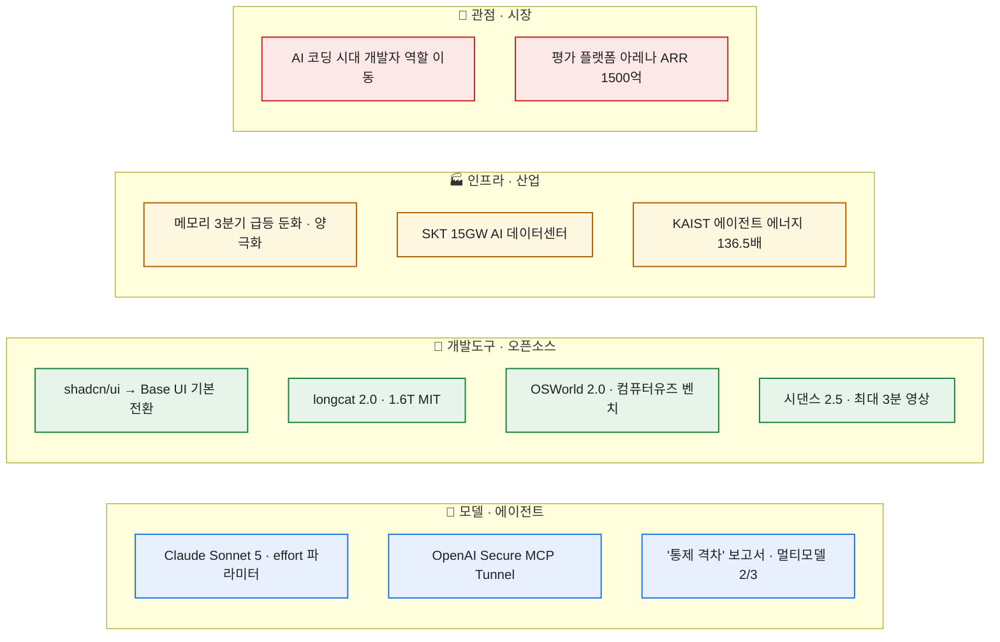

# AI/IT/LLM 데일리 다이제스트 — 2026-07-06

> RSS·PyTorch KR·긱뉴스·AI타임스를 하루치 쓸어 담아(소스 15 중 14 성공, r/ClaudeAI만 429 봇차단) 내 관심사인 **모델·에이전트·개발도구·인프라**로 추린 기록. 늘 그렇듯 **검증 가능한 수치는 1차 출처(공식 발표·보고서·기사 원문)까지 따라가 확인**했고, **벤더나 연구팀이 스스로 낸 숫자는 ⚠️로 떼어 놨다.** 오늘은 모델 릴리스(Sonnet 5)와 인프라 뉴스(메모리·데이터센터·에너지)가 나란히 굵었다.

## 오늘의 줄기 한눈에

## 🤖 모델·에이전트에 무슨 일이 있었나?

- **Claude Sonnet 5 출시 (Anthropic, 6/30).** 멀티스텝 소프트웨어 엔지니어링을 끝까지 완수하고, 시키지 않아도 스스로 검증 단계를 끼워 넣는 방향으로 에이전트 능력을 밀어 올린 릴리스다. 눈에 띄는 건 **`effort` 파라미터** — 한 모델 안에서 비용·성능을 low\~max로 조절해, 낮게 쓰면 값싸게, 높게 쓰면 Opus급에 근접하게 굴릴 수 있다. 가격은 도입 프로모션(8/31까지) 기준 입력 100만 토큰당 2달러·출력 10달러, 이후 표준가 3달러·15달러. ⚠️ 다만 공개된 벤치(SWE-bench Pro 63.2%, Terminal-Bench 2.1 80.4%, OSWorld-Verified 81.2% 등)는 **전부 Anthropic 자체 수치**이고, "동일 입력이 새 토크나이저로 1.0\~1.35배 더 많은 토큰으로 잡힐 수 있다"는 주의사항도 붙었다 — 프로모션가만 보고 단가를 계산하면 어긋난다. 내가 매일 굴리는 도구의 엔진이라 `effort`를 어디에 낮추고 어디에 올릴지가 곧 운영비 문제로 온다.
- **OpenAI 'Secure MCP Tunnel' 공개.** 사내 MCP 서버를 ChatGPT·Codex에 붙이고 싶은데, 그동안은 공개 엔드포인트를 열거나 서드파티 터널을 사거나 VPN을 짜는 선택지뿐이었다. 이건 역발상이다 — **사설 서버를 바깥에 노출하지 않고**, 고객 환경 안에서 도는 경량 오픈소스 클라이언트가 OpenAI 쪽으로 **아웃바운드 HTTPS(롱폴링)** 를 먼저 걸어 그 통로로 요청을 받아 사내 서버에 전달하고 응답을 되돌린다. 인바운드 포트를 하나도 열지 않아도 된다는 게 핵심. 민감 데이터를 다루면서 에이전트에 사내 도구를 물려야 하는 팀엔 실질적인 배선 방법이다.
- **벤처비트 '통제 격차(The Control Gap)' 보고서.** 글로벌 기업의 **약 3분의 2가 이미 멀티모델**(하이브리드 51% + 자체 구축 16%)로 돌아섰고, 단일 폐쇄 생태계 전적 의존은 32%뿐이라는 조사다. 계기는 "**클로드 페이블 5가 미국 정부 수출 통제로 예고 없이 전면 중단**된 사태" — 멀티모델을 깔아둔 곳은 다른 모델로 즉시 우회했다는 것. 그런데 보고서의 진짜 뼈아픈 대목은 **거버넌스 낙제**다: 자동 모니터링 보유 10%, 수동 검토 의존 30%, 최종 사용자 오류보고에 기대는 곳 25%, **자율 에이전트 통제 실패로 손실을 본 곳이 79%**, 무한 루프로 토큰 비용이 튄 경험 25%. ⚠️ '페이블 5 중단'과 비율들은 이 보고서의 서술·집계 기준이니 벤처비트 리서치 프레이밍으로 읽되, "모델은 갈아탈 수 있게 해뒀는데 정작 그 위의 통제 장치가 비어 있다"는 진단은 자동화를 늘리는 입장에서 그냥 지나칠 수 없다.

## 🧰 개발도구·오픈소스에서 볼 만한 것은?

- **shadcn/ui, 기본값을 Radix → Base UI로 전환 (7월).** 2023년 이후 계속 Radix가 기본이었는데, **7월부터 새 프로젝트·문서의 기본 흐름이 Base UI**로 바뀐다. 이유가 데이터 기반이라 설득력 있다 — Base UI가 1.6.0 안정 버전에 도달했고 주간 다운로드 600만 회 이상, 무엇보다 `shadcn/create` 사용자들이 이미 **Radix보다 2:1로 Base UI를 고르고** 있어 그 흐름을 공식화한 것. 기존 Radix 앱은 마이그레이션 불필요(지원 유지)하고, 새 프로젝트도 `-b radix`로 Radix를 계속 쓸 수 있다. 프런트를 얹을 때 기본 스택 결정에 영향이 있으니 메모.
- **OSWorld 2.0 공개 · eve · agentsview.** 컴퓨터 사용 에이전트(CUA)를 실제 장시간 업무로 평가하는 **OSWorld 벤치마크 2.0**이 나왔고, 파일시스템을 저작 인터페이스로 삼는 에이전트 프레임워크 **eve**(Apache-2, Vercel 계열), **모든 AI 코딩 에이전트 세션을 로컬에서 검색·분석**하는 도구 **agentsview**(MIT)도 같은 날 PyTorch KR에 올라왔다. 셋 다 "에이전트를 재현 가능하게 재고 관측한다"는 같은 결을 향한다.
- **longcat 2.0 오픈웨이트 (1.6T, 활성 \~48B, MIT).** 초대형 MoE 가중치가 MIT로 공개됐다는 소식. ⚠️ 커뮤니티(r/LocalLLaMA) 발 항목이라 파라미터·라이선스는 배포처에서 재확인이 필요하지만, "프런티어급 규모를 열어 놓는" 흐름 자체가 자체 호스팅 관점에선 계속 지켜볼 축이다.
- **바이트댄스 '시댄스 2.5(Seedance)' 임박.** 이르면 **7월 9일** 공개설. 기본 30초 영상을 확장해 90초 초안, **최대 180초(3분)** 까지 뽑는다는 이야기다. ⚠️ 단 **공식 발표가 아니라 유출·추정**(드리미나·캡컷 페이지에 이미 흔적, 외부 정황)이라, '최대 3분'과 출시일은 확정으로 옮기면 안 된다.

## 🏭 인프라·산업 — 숫자로 보면?

- **메모리 급등, 3분기엔 한풀 꺾인다 (트렌드포스, 7/3).** 2분기 약 60%에 달했던 폭발적 상승이 3분기엔 **D램 +13\~18%, 낸드 +10\~15%** 로 둔화될 전망. 방향의 핵심은 **양극화** — AI 서버·데이터센터용 기업 메모리는 계속 강한데, PC·스마트폰 등 소비자 시장은 가격 인상 수용 한계에 닿아 업계가 기업용으로 생산을 몰아준다는 그림이다. ⚠️ 인상률은 트렌드포스의 전망치(확정가 아님).
- **SKT, 최대 15GW AI 데이터센터 구상 (7/5).** 울산 1호(2027년 하반기 가동, AWS 협력)를 시작으로 영남권 2GW 이상 + 서남권 1GW로 **국내 총 5GW를 2029년부터 단계 개장**, 이를 **2035년까지 15GW**로 순차 확대해 "아시아 AI 인프라 허브"를 노린다는 계획. 같은 날 SKT는 엔비디아 블랙웰 기반 클러스터 **'해인'이 국내 최초로 IaaS CSAP 인증**(블랙웰 GPU 1,000개 이상 단일 클러스터)을 받았다고도 밝혔다. ⚠️ 15GW는 2035년까지의 목표치이자 순차 확대 전제라, 현재 확보분과 목표를 같은 줄에 놓지 말 것.
- **KAIST "AI 에이전트, 질의 한 건에 생성형 AI의 136.5배 에너지".** 유민수 석좌교수팀(제1저자 김지인)이 IEEE HPCA에서 발표한 'The Cost of Dynamic Reasoning'. 700억 파라미터 모델 기준, 에이전트가 질문 한 건을 처리하는 데 **평균 348.41Wh** 를 써 단순 질의응답 대비 **136.5배**라는 분석이다. ⚠️ "세계 최초 분석"과 절대 수치(348.41Wh)는 연구팀 자체 프레이밍·측정값이니 그대로 인용하기보단 '에이전트 루프가 단발 추론보다 자릿수 단위로 비싸다'는 방향으로 읽는 게 안전하다. 그래도 데이터센터 전력이 곧 운영비인 시대에, 에이전트를 남발하기 전에 루프 횟수를 세야 한다는 경고로는 충분하다.

## 🧠 오늘 곱씹은 관점 두 개

- **"AI 코딩 시대, 개발자는 실행자에서 설계자로" (긱뉴스).** AI가 코드를 직접 쓰게 되면서 개발자 역할이 **문제 정의·작업 설계·검증·맥락 관리·제품화 지원**으로 이동한다는 글. 구조적 원인이 명쾌하다 — "코드 생산은 빨라졌지만 **코드가 곧 좋은 제품은 아니다**." 그래서 중요해지는 건 문제를 더 크게 설정하는 힘, **반복 절차를 스킬·워크플로로 만드는 힘**, 요구사항·문서·테스트를 구조화하는 힘, AI 산출물을 검수·재지시하는 힘. 내가 스킬·하네스에 시간을 붓는 이유가 이 문장 하나에 정리돼 있어서 오래 남았다.
- **AI 평가 플랫폼 '아레나', 상용 8개월 만에 ARR 1500억.** UC 버클리 연구 프로젝트로 시작(둘 중 나은 답을 사람이 고르는 크라우드소싱 리더보드)해 2025년 4월 법인 전환, **2025년 9월 기업용 출시 후 8개월 만에 연 환산 매출 1억 달러(약 1500억원)** 를 찍었다는 소식. 벤치마크·모델 평가가 그 자체로 큰 시장이 됐다는 신호. ⚠️ ARR은 '연간 반복 매출'로 환산한 값이라 실현 매출과는 다르다.

## ⚠️ 팩트체크 메모 (오늘 떼어 놓은 것)

- **Sonnet 5 벤치·가격** — SWE-bench Pro 63.2% 등은 전부 Anthropic 자체 수치. 새 토크나이저로 토큰이 1.0\~1.35배 더 잡힐 수 있어 프로모션가만으론 단가 오판.
- **'통제 격차' 비율·페이블 5 중단** — 벤처비트 펄스 리서치 보고서의 집계·서술 기준.
- **시댄스 2.5 '최대 3분·7/9'** — 공식 발표 아님, 유출·정황 기반 추정.
- **longcat 2.0 1.6T/MIT** — 커뮤니티 발, 배포처에서 파라미터·라이선스 재확인 필요.
- **메모리 3분기 +13\~18%** — 트렌드포스 전망치(확정 아님).
- **SKT 15GW** — 2035년까지의 목표·순차 확대 전제(현재 확보분 아님).
- **KAIST 136.5배·348.41Wh** — 연구팀 자체 측정·'세계 최초' 프레이밍.

---

> 같이 보면 좋은 글: [[ai-it-digest-2026-06-24|AI/IT 데일리 다이제스트 (6/24)]] · [[daily-issues-digest-2026-06-25|데일리 이슈 다이제스트 (6/25)]] · [[llm-ai-news-sources-catalog|LLM/AI 정보원 카탈로그]] · [[geoflow-geo-content-engine|GEOFlow — GEO 콘텐츠 엔진]]

*외부 공개 자료의 하루치 큐레이션. 검증 가능한 수치는 1차 출처까지 따라가 확인하고, 벤더·연구팀 자체 주장은 ⚠️로 분리했습니다. 정리: 2026-07-06.*
