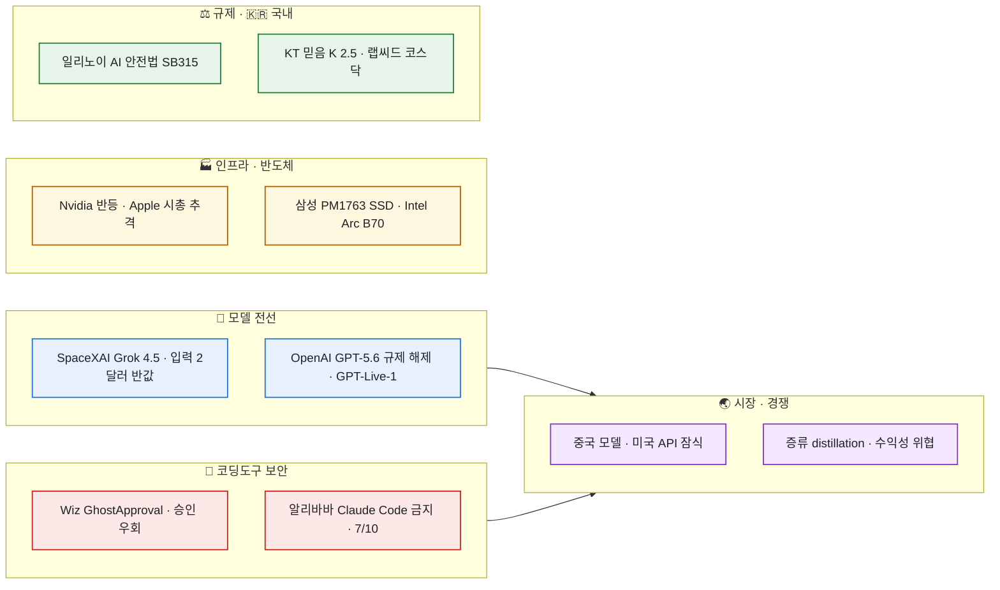

# AI/IT/LLM 데일리 다이제스트 — 2026-07-09

> 오늘치 AI·IT·LLM 소식을 하루 쓸어 담아 내 관심사인 **모델·개발도구·보안·인프라**로 추린 기록. 늘 그렇듯 **검증 가능한 수치는 1차 출처(공식 발표·기업 블로그·기사 원문)까지 따라가 확인**했고, **벤더나 연구팀이 스스로 낸 숫자는 ⚠️로 떼어 놨다.** 오늘의 관통 주제는 딱 하나 — **"가격"**이다. Grok 4.5가 절반 값으로 들어오고, 중국 모델이 미국 API를 파고들고, 증류(distillation) 얘기가 곳곳에서 나온다. 그 사이에 코딩 도구 보안 사고 하나가 조용히, 그러나 아프게 터졌다.

## 오늘의 줄기 한눈에

## 🤖 프론티어 모델에 무슨 일이 있었나?

- **Grok 4.5 공개 — "반값"이 곧 스펙이다 (SpaceXAI, 7/8).** 일론 머스크 쪽에서 새 모델을 내놨는데, 이번엔 여러 매체가 사명을 **"SpaceXAI"** 로 표기했다(공식 발표 페이지도 "SpaceXAI's smartest model"). 상장 이후 AI 코딩 스타트업 **Cursor를 인수**하고 그 데이터로 학습한 첫 모델이라는 게 요지다. 코딩·에이전트·지식노동을 겨냥했고, 훈련은 **엔비디아 GB300 수만 장**으로 돌렸다. 진짜 무기는 가격이다 — **입력 100만 토큰당 2달러·출력 6달러.** 경쟁 모델(Fable 5 10달러·50달러, GPT-5.5 5달러·30달러, Opus 4.8 5달러·25달러)의 절반 이하다. ⚠️ 다만 성능 벤치는 **대체로 뒤진다** — DeepSWE 1.1에서 53%(GPT-5.5 67%·Fable 5 70%), SWE-Bench Pro 64.7%(Fable 5 80.4%), Terminal-Bench 2.1 83.3%(GPT-5.5 83.4%·Fable 5 84.3%)로 나온다. 대신 **같은 SWE-Bench Pro 작업을 Opus 4.8 대비 토큰 4.2배 적게 써서** 끝낸다는 효율이 반전 카드다. 이 벤치·효율 수치는 xAI 발표 기반이라 그대로 옮기기보단 "**절대 성능은 1티어에 못 미치지만, 값과 토큰 효율로 실전 단가를 후려친다**"는 방향으로 읽는 게 맞다. 매일 API 단가를 계산하는 입장에선, '벤치 1등'보다 '내 작업당 실제 비용'이 더 중요한 국면이라 눈여겨보게 된다.
- **OpenAI, GPT-5.6 빗장 풀고 음성모델 GPT-Live-1도.** 연방(정부) 요청으로 묶여 있던 GPT-5.6 계열의 제한을 풀고 목요일부터 더 넓게 배포한다는 소식이다. 하필 Grok 4.5 공개와 같은 창에 부딪혀 "규제 해제 vs 반값 공세"가 맞물렸다. 함께 나온 **GPT-Live-1**은 "사용자 말을 끊지 않는" 대화형 음성 모델로 구글과의 음성 경쟁을 겨눈다. ⚠️ 'GPT-5.6 제한 해제'와 롤아웃 일정은 아직 보도(테크버즈·비즈니스인사이더) 프레이밍 단계라, 공식 배포 공지로 확정되기 전까진 '임박' 정도로 둔다.

## 🌏 왜 다들 '가격'과 '증류'를 말하나?

- **중국 모델이 미국 API 시장을 파고든다 (CNBC 인용).** 미국 기업들이 치솟는 AI 비용을 줄이려 **딥시크(DeepSeek) 등 중국산 모델 채택을 늘리고** 있고, 그 여파로 OpenAI·Anthropic의 API 매출이 잠식되고 있다는 보도다. 역설적으로 **중국 당국은 자국 첨단 모델의 해외 접근을 제한하는 방안을 검토** 중이라, '싸게 퍼지되 통제는 조인다'는 이중 움직임이 동시에 보인다. ⚠️ '점유율 잠식'의 구체 규모는 매체·전문가 코멘트 기반이라 방향성으로 읽는다.
- **증류(distillation)가 업계 수익성을 흔든다는 경고.** 후발주자가 프런티어 모델의 출력을 받아 **저렴하게 능력을 복제**하는 증류가, Anthropic·OpenAI·구글 같은 선두의 프리미엄을 갉아먹는다는 분석(비즈니스인사이더)이다. 위의 중국 모델 확산과 아래 알리바바 사태를 하나로 꿰는 실이 바로 이 증류다. **모델 자체의 해자(moat)가 얇아지는 시대**라는 이야기라, 나처럼 '어떤 모델을 얼마에 쓸까'를 매번 고르는 사람에겐 오히려 선택지가 넓어지는 신호이기도 하다.
- **(참고) Anthropic 3분기 순이익 10억 달러 초과설.** 세미애널리시스(SemiAnalysis)가 Anthropic의 3Q26 순이익이 10억 달러를 넘고 IPO 재무가 엿보인다고 전했다. ⚠️ 이는 세미애널리시스의 추정·분석치이지 공식 실적이 아니다.

## 🧰 내 AI 코딩 도구는 안전한가?

- **Wiz "GhostApproval" — 심볼릭 링크로 승인창이 뚫렸다 (7/8).** 보안기업 **Wiz Research**가 주요 AI 코딩 어시스턴트에서 **신뢰 경계(trust boundary) 결함**을 찾아 'GhostApproval'로 명명했다. 핵심은 **사람이 확인해야 하는 승인 절차(human-in-the-loop)를 심볼릭 링크로 우회**해 코드 실행까지 갈 수 있다는 것. 국내 보도(디지털포커스)는 영향을 받은 도구로 **아마존 Q 디벨로퍼·Anthropic 클로드 코드·오그먼트(Augment) 등 6종**을 들었다. 더 레지스터(The Register)는 이를 "**유닉스 시대의 보안 골칫거리가 여전히 죽지 않았다**"며 심링크라는 고전적 함정에 사람 검토 단계가 걸려 넘어진 사례로 짚었다. 승인창을 믿고 에이전트에 파일·셸 권한을 열어 주는 나 같은 사용자에겐, "승인 UI가 있다 ≠ 안전하다"를 다시 새기게 하는 건이다. (출처: Wiz 공식 블로그 + The Register 교차확인.)
- **알리바바, Claude Code '고위험' 지정 후 사내 금지 (7/10 시행).** 알리바바가 Anthropic의 **클로드 코드를 '고위험' 소프트웨어로 분류**하고, 직원에게 **7월 10일부터 사용 금지 + 업무 PC에서 Claude 모델 전부 삭제**를 지시했다(대안으로 자사 Qoder 권고). 발단은 **보안 연구자들이 "중국 연관 사용자를 식별하는 숨은 코드"(알레지드 백도어)를 발견**했다는 주장이다. 여기서 놓치면 안 되는 배경 — 이 조치는 **3주 전 Anthropic이 알리바바 Qwen 랩을 "역대 최대 규모의 증류(distillation) 공격"으로 지목한** 분쟁 위에 얹혀 있다. 즉 위 §시장의 '증류'가 여기서 실제 기업 간 충돌로 터진 셈이다. ⚠️ '숨은 추적/백도어'는 연구자·보도 측 주장이며 Anthropic의 공식 확인은 아니라, 사실관계는 양측 입장을 갈라 봐야 한다. (SCMP·Tom's Hardware·The Information 등 다수 매체 확인, 단일 루머 아님.)

## 🏭 인프라·반도체는 어떻게 움직였나?

- **엔비디아, 11년래 최저 밸류에이션서 반등 · Apple이 시총 1위 추격 (7/8, 뉴욕).** AI 반도체 대장주 엔비디아가 약 2개월 조정 끝에 강하게 튀어 올랐다. 밸류에이션이 11년래 최저 수준까지 눌렸던 뒤라 저가 매수가 붙었다는 해석. 동시에 **Apple이 시가총액 1위 탈환에 근접**하며 'AI 집중 대 다각화'의 시소가 다시 흔들렸다. ⚠️ 밸류에이션·시총 문구는 특정일 장중 기준의 시황이라 방향으로만.
- **삼성전자, PCIe 6.0 기업용 SSD 'PM1763' 양산.** AI 인프라에 최적화한 차세대 eSSD로, **LLM 40GB를 1.4초에 전송**한다고 밝혔다. AI 서버·데이터센터용 기업 메모리 수요가 계속 강한 흐름과 맞닿는다.
- **퀄컴 'AI 팩토리' 진출 · 인텔 Arc Pro B70의 가성비.** 퀄컴이 AI 인프라(팩토리) 사업에 발을 들였고, 인텔 **Arc Pro B70**은 딥시크 R1 추론에서 RTX 5090D를 **1/4 가격에 능가(2,000+ tokens/s)** 한다는 벤치가 돌았다. ⚠️ Arc B70 수치는 특정 워크로드(딥시크 R1) 벤치 기준이고, "미국 AI 데이터센터의 절반은 전력망 한계로 못 지어질 것"이라는 이야기는 시장 논평(Oilprice 코멘터리)이라 각각 프레이밍을 감안해 읽는다.

## ⚖️ 규제와 🇰🇷 국내 소식은?

- **일리노이, AI 안전법(SB315) 서명 — 전국 최초 연례 3자 감사.** J.B. 프리츠커 주지사가 7월 6일 **'인공지능 안전조치법(SB315)'** 에 서명했다. **연매출 5억 달러 이상 + 대규모 컴퓨팅**을 쓰는 최대 AI 기업이 대상으로, **매년 제3자 감사(전국 최초 의무화)**, 파국적 리스크 관리 프레임워크 공개, **유해 사고 72시간 내(즉각적 위협은 24시간 내) 주(州) 보고**를 요구한다. 파국적 리스크는 '50명 초과 사상 또는 100만 달러 초과 재산피해'로 정의했고, 위반 시 **1차 최대 100만 달러·재범 최대 300만 달러**의 민사벌을 법무장관이 집행한다. **시행일은 2028년 1월 1일.** 미국 주 단위 규제가 '선언'을 넘어 감사·보고 의무의 실무 단계로 넘어간다는 신호다.
- **KT '믿음 K 2.5 프로', AI 신뢰성 인증 획득.** KT가 자체 개발한 초거대 언어모델(LLM) '믿음 K 2.5 프로'가 AI 신뢰성 인증을 받았다(믿음 K 2.0 베이스에 이은 인증). B2B 공략에 속도를 붙이겠다는 포석이다.
- **국내 AI 스타트업 자금·상장 소식.** 데이터 통합·AI 트레이싱 기업 **랩씨드**가 한국투자증권과 **코스닥 상장 대표주관계약**을 맺었고, 특허·IP AI 기업 **워트인텔리전스**는 알토스벤처스 주도로 **165억 원**을 유치했다. 국내 AI 섹터의 IPO·투자 파이프가 계속 도는 모습.

## ⚠️ 팩트체크 메모 (오늘 떼어 놓은 것)

- **Grok 4.5 벤치·효율** — DeepSWE 53%·SWE-Bench Pro 64.7%·토큰 4.2배 효율 등은 xAI 발표 기반 수치. 가격(입력 2달러/출력 6달러)은 여러 매체 공통이나, 성능은 1티어(Fable 5·GPT-5.5)에 대체로 못 미침.
- **사명 'SpaceXAI'** — 공식 페이지·다수 매체가 'SpaceXAI'로 표기(상장·Cursor 인수 맥락)하나, 'xAI' 표기도 혼재 → 사명 확정은 유보.
- **GPT-5.6 규제 해제·GPT-Live-1** — 공식 배포 공지 아닌 보도 프레이밍(임박).
- **중국 모델 잠식 규모** — CNBC·전문가 코멘트 기반 방향성(구체 점유율 아님).
- **Anthropic 3Q26 순이익 10억 달러** — 세미애널리시스 추정치(공식 실적 아님).
- **알리바바 Claude Code '백도어'** — '숨은 추적' 주장은 연구자·보도 측, Anthropic 공식 확인 없음. 증류 분쟁이 배경.
- **인텔 Arc B70 · 미 데이터센터 '절반'** — 각각 특정 벤치·시장 논평 프레이밍.
- **일리노이 SB315** — 서명·조항은 AP 등 보도로 확인. 시행일 2028-01-01(즉시 아님).

---

> 같이 보면 좋은 글: [[ai-it-digest-2026-07-06|AI/IT 데일리 다이제스트 (7/6)]] · [[ai-it-digest-2026-06-24|AI/IT 데일리 다이제스트 (6/24)]] · [[daily-issues-digest-2026-06-25|데일리 이슈 다이제스트 (6/25)]] · [[llm-ai-news-sources-catalog|LLM/AI 정보원 카탈로그]]

*외부 공개 자료의 하루치 큐레이션. 검증 가능한 수치는 1차 출처까지 따라가 확인하고, 벤더·연구팀 자체 주장은 ⚠️로 분리했습니다. 정리: 2026-07-09.*
