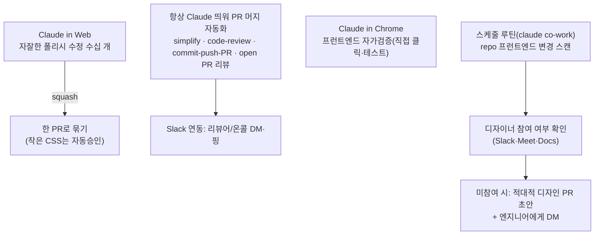

# Anthropic 사내 Claude Code 워크플로우 데모 (실전 팁)

> **무엇** — Anthropic 직원(스스로 "CLI die-hard"·CLI 설계자)이 **사내에서 실제로 쓰는 Claude Code 워크플로우**를 Excalidraw 오픈소스 repo로 시연한 강연. 핵심 메시지: "코드뿐 아니라 **코드가 아닌 일까지 위임**하고, 첫 단계가 아니라 **다음 단계의 다음 단계까지 자동화**하라." (데스크톱 앱으로도 동일하게 가능)

## 1. 기본 셋업 (속도·격리)
- **worktree**: `claude --worktree` — repo의 격리 복사본을 만들어 **여러 Claude 병렬 실행** 시 충돌 방지. (멀티-클로딩 시 필수. "repo1/repo2/repo3" 대신 권장)
- **Opus 1M 컨텍스트** 상시 + **fast 모드** 상시 (조직별 접근 권한 차이 있음).
- **auto 모드**: 위험 행동을 분류기가 탐지 → 매번 "Yes" 안 눌러도 됨(낮은 권한 모드의 대체). 훨씬 빠름.

## 2. 프롬프팅·스킬
- **`/prototype` 스킬**: 한 기능의 구현 옵션을 **N개(기본 5) 생성 → HTML 프리뷰 → 몇 번 반복**. *"스킬은 이제 아무도 손으로 안 짠다 — 다 Claude에 시켜 만든다."*
- 프롬프트 팁: ① **"Claude가 먼저 옵션을 고르고 이유를 설명하게"** ② **"필요하면 온라인 리서치해"**(프로덕션이면 Slack·Docs·이슈 등 내부 소스 참고 지시) ③ **"PR + 스크린샷으로 올려"** → 이제 트랜스크립트 안 보고 **PR(기능 녹화 포함)을 리뷰**.
- **`/loop`**: "완료될 때까지 계속" — 끝까지 반복.

## 3. 3대 원칙 (워크플로우의 전제)
1. **Claude(대부분 LLM)는 아직 디자인을 못한다** → **craft·의사결정은 사람이 루프 안에** 있어야. (영구는 아님)
2. **코드 아닌 일도 위임하라** — 코딩만 시키면 가장 자동화된 사용법이 아님. "AI 자동화 = 코드 그 이상"으로 사고 전환.
3. **모두가 ship할 수 있다 ≠ 모든 게 ship돼야 한다** → 누구나 프로덕션에 푸시 가능해진 시대엔 **스케일하는 품질 시스템**이 필요.

## 4. 품질 유지 자동화 워크플로우 (Claude 작업 중 "사이드"로 돌리는 것들)

- **Claude in Web**: 앱에서 발견한 **자잘한 폴리시 수정 수십~수백 건**을 세션 안 띄우고 흘려보냄 → 가끔 **한 PR로 squash** → 작은 CSS는 리뷰 없이 자동 승인.
- **PR 머지 자동화**: 아이디어 완성 후 CI·리뷰 코멘트 대응·머지까지 **사람이 거의 안 봄**. 내부 스킬 `simplify`/`code-review`(코드베이스 정돈)·`commit-push-PR`(내부 체크 실행)·"열린 PR 리뷰해 결승선까지" + **Slack DM 연동**.
- **Claude in Chrome**: 프런트엔드 변경 **자가검증**의 best way(크롬에서 직접 테스트→GIF 스크린샷→PR에 첨부).
- **디자인 감시 루틴**(가장 게임체인저): repo들을 스캔해 프런트엔드 변경에 **디자이너가 관여했는지** Slack/Docs로 확인 → 미관여면 적대적 디자인 PR 초안 + DM. *단, "Claude가 디자인을 못해서" DM은 껐다*(원칙 1의 실증).

## 5. 메타 교훈
- **다음 단계의 다음 단계까지** 자동화를 밀어붙여라(첫 단계에서 멈추지 말 것).
- **다음 모델 대비**: 워크플로우를 다 글로 써두면, 새 모델 나올 때 그대로 다시 돌려보고 — 보통 더 잘된다.

---
*1차 강연 트랜스크립트 정리(외부 사실 검증 대상 아님). 출처 URL은 원자료에 미제공. 정리: 2026-06-22.*
