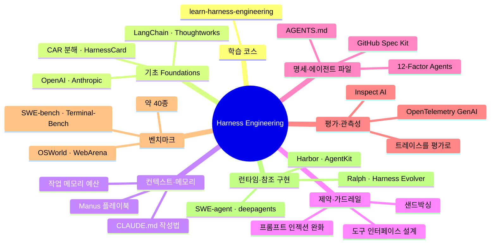
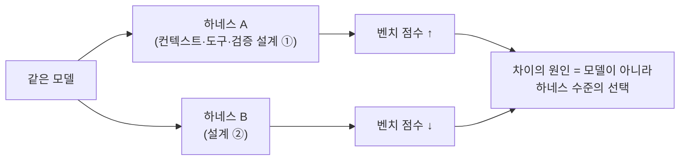

# Awesome Harness Engineering — 하네스 엔지니어링 자료 모음

> **무엇** — *하네스 엔지니어링*(harness engineering)에 관한 글·플레이북·벤치마크·명세·오픈소스를 모은 awesome 리스트. 레포 정의는 *"the practice of shaping the environment around AI agents so they can work reliably"* — **모델이 아니라 에이전트를 둘러싼 환경을 설계해 안정적으로 일하게 만드는 실천**. ⭐**3,319** · **CC0 1.0**(퍼블릭 도메인). "범용 에이전트 도구는, 하네스 설계·컨텍스트 관리·평가·런타임 제어를 직접 다루지 않으면 범위 밖"이라고 수록 기준을 좁혀 둔 게 특징.

## 무엇을 모았나 — 8개 카테고리 (mindmap)

하네스를 설계할 때 마주치는 국면별로 ~100여 건을 8개로 나눈다.

## 핵심 관점 — "모델이 아니라 하네스를 비교하라"

이 리스트가 벤치마크 섹션에 박아둔 한 문장이 요지다: *"These benchmarks are especially useful when you want to compare harness quality, not just model quality."*

> 실제로 Anthropic의 *Quantifying infrastructure noise* 글은 **런타임 설정만으로 코딩 벤치 점수가 리더보드 격차보다 크게 흔들릴 수 있다**고 보였고, LangChain의 *Improving Deep Agents with harness engineering* 은 **모델을 안 바꾸고 하네스 변경만으로 성능이 유의하게 개선**된다는 증거를 제시한다. "좋은 모델"보다 "좋은 하네스"가 결과를 가른다는 것.

## 벤치마크 ~40종 — 영역별 (가장 큰 섹션)

| 영역 | 대표 벤치마크 |
|---|---|
| 코딩 | SWE-bench Verified · Terminal-Bench · EvoClaw(연속 마일스톤 회귀) · SEC-bench(보안) · LeetCode-Hard Gym |
| 컴퓨터 사용 | OSWorld(369개, Ubuntu/Win/macOS) · OSWorld-MCP · Computer Agent Arena |
| 웹 | WebArena(자체호스팅) · VisualWebArena(멀티모달) · WorkArena(기업형) · WebArena-Verified |
| MCP 통합 | MCPMark(Notion·GitHub·Postgres) · MCP Bench(정확도·지연·토큰) · MCP Universe |
| 도구·대화 | τ-Bench · tau2-bench · GAIA · GTA |
| 이색 | ClawWork(44개 직군 경제 벤치) · LLM Colosseum(스트리트파이터 III 대전) |

## 런타임·참조 구현 — 직접 뜯어볼 수 있는 하네스

- **SWE-agent**(성숙한 연구용 코딩 에이전트, 하네스·프롬프트·도구·환경 직접 확인) + **SWE-ReX**(샌드박스 코드 실행), LangChain **deepagents**, Terminal-Bench 2.0과 함께 나온 범용 평가 하네스 **Harbor**, Inngest **AgentKit**.
- 색다른 항목: `while :; do cat PROMPT.md | claude-code; done` 한 줄 루프 미니멀리즘을 정리한 **Ralph Wiggum as a Software Engineer**(Geoffrey Huntley), 멀티 에이전트 제안자·LangSmith 평가·git worktree 격리로 **하네스 자체를 자율 진화**시키는 Claude Code 플러그인 **Harness Evolver**.

## ⚠️ 1차 출처 팩트체크 (GitHub README 직접 대조)

원 소개글이 *"GPT 모델로 정리한 글"* 이라 환각을 의심하고 대조했으나 — **수치·인용·항목 모두 실재 확인**됐다.

| 주장 | 검증 결과 |
|---|---|
| 8개 주요 카테고리 | ✅ 사실 (Courses·Foundations·Context·Constraints·Specs·Evals·Benchmarks·Runtimes) |
| ~100건, 벤치마크 ~40종 | ✅ 대체로 사실 (정확한 수는 레포에 명시 없음, 실측 ~40개 벤치 일치) |
| CC0 1.0 라이선스 | ✅ **사실** (LICENSE·README가 CC0 1.0 명시. 단 GitHub 자동감지는 "Other/NOASSERTION"로 표시 — 표기상 차이일 뿐) |
| 정의·인용문 ("shaping the environment…", "compare harness quality, not just model quality" 등) | ✅ README 원문과 **그대로 일치** |
| EvoClaw·ClawWork·LLM Colosseum·MCPMark·SEC-bench 등 이색 항목 | ✅ 전부 실재 (환각 아님) |
| ⚠️ 누락 주의 | 원문은 **부분 발췌** — README엔 HEAAL·Citadel·Uni-CLI·skills.sh·AgentBench·AppWorld·HAL·BrowserGym 등 **다수 항목이 더 있음**. 전체는 레포 직접 확인 권장 |
| 스타 수 | (원문 미언급) 현재 **⭐3,319 · 포크 264** (2026-03 생성) |

## 시사점 — 내 작업과의 연결

이 리스트의 관점은 내가 [[loop-engineering-four-loops-loopcraft|루프 엔지니어링]]·[[harness-engineering-claude-code-design-guide|하네스 설계 가이드]]에서 정리한 것과 정확히 같은 줄기다 — **"에이전트의 신뢰성은 모델이 아니라 그 주변 구조에서 나온다."** 특히 *"같은 모델이라도 하네스가 점수를 가른다"* 는 증거(Anthropic infra noise·LangChain deep agents)는, 내가 자동화를 만들 때 모델을 바꾸기 전에 **컨텍스트·검증·런타임부터 손보는** 근거가 된다. CC0라 인용·재활용도 자유롭다.

---
*1차 출처: [walkinglabs/awesome-harness-engineering](https://github.com/walkinglabs/awesome-harness-engineering)(README·GitHub API) 직접 확인. 원 소개글: PyTorch 한국 사용자 모임(9bow, GPT 정리본 — 발췌·요약이라 전체는 레포 참고). 정리: 2026-06-24.*
