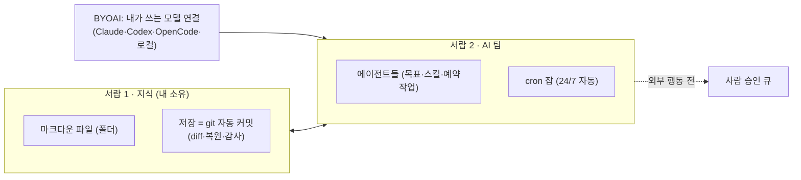
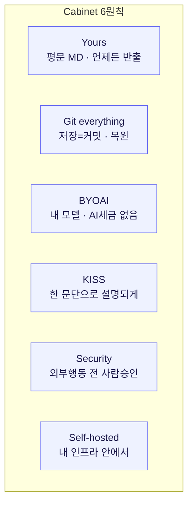

# Cabinet — 마크다운 파일로 사는 AI-first 지식 베이스

> **출처 메모** — 9bow(박정환)가 공유한 글([pytorchkr 경유](https://github.com/hilash/cabinet?utm_source=pytorchkr&ref=pytorchkr))을 읽고 정리한 노트다. 만든 이는 Apple 엔지니어링 매니저 출신 **Hila Shmuel**(회사 HOLY BIBLE APPS LTD), 라이선스는 MIT, GitHub 2.4K stars. 아직 직접 설치해보진 않았고, 아래 기능은 저자/문서가 주장하는 값이다.

이건 좀 반가운 도구였다. 나는 [[plaintext-md-llm-knowledge-vault|벡터DB 없이 평문 MD로 지식 볼트]]를 만들어 쓰고 있는데, Cabinet의 첫 문장이 거의 내 볼트의 설명서였다 — *"모든 데이터를 디스크의 마크다운 파일로 저장하고, DB가 없고, 자체 호스팅이라 데이터가 내 컴퓨터를 안 떠난다."* 내가 *습관*으로 굴리던 걸 누군가 *제품*으로 빚은 셈이라, 어디가 같고 어디가 다른지 보고 싶었다.

## 한 장 요약 — '파일 서랍 + AI 팀'



핵심 발상은 *"파일은 한쪽 서랍에, AI 팀은 다른 쪽 서랍에"*다. 검색 도구는 찾아주고 챗봇은 답해줄 뿐이지만, Cabinet은 **내 파일·내 모델·내 인프라 위에서 일을 시킨다**는 게 저자의 주장이다.

## 무엇이 들어 있나

| 갈래 | 기능 |
|---|---|
| **지식 관리** | Tiptap 기반 WYSIWYG(표·코드블록·슬래시 명령), 저장 시 git 자동 커밋 + diff·복원, 전문 검색(Cmd+K), PDF 인라인·CSV 편집 |
| **AI 운영** | 에이전트별 목표·스킬·예약작업, 크론 잡(예: 6시간마다 소스 점검, 매주 월요일 리포트), 미션·태스크(칸반), 내부 채팅(@멘션으로 에이전트 호출) |
| **확장** | 폴더에 `index.html`을 넣으면 iframe 앱으로 렌더(임베디드 HTML 앱), 브라우저 안의 로컬 AI CLI 터미널, `.repo.yaml`로 코드 저장소 연결 |

가장 눈에 띈 건 **임베디드 HTML 앱**이다. 폴더에 `index.html`만 떨구면 살아 있는 앱으로 렌더되고, "대시보드 만들어줘"라고 하면 Claude가 KB 안에 HTML을 직접 써넣는다. Obsidian·Notion과 가르는 지점이라고 내세운다.

## 설치 & 사용

```bash
npx create-cabinet@latest      # 캐비닛 생성
cd cabinet
npm run dev:all                # http://localhost:4000 → 5문항 온보딩으로 AI 팀 구성

# CLI(cabinetai)도 별도 제공
npx cabinetai run              # 현재 폴더에서 실행
npx cabinetai update           # 앱 최신화
```

전역 설치 없이 `npx`로 돈다. 앱 본체는 `~/.cabinet/app/v{버전}/`에 내려받혀 의존성이 거기 깔리므로, **지식 폴더 자체는 가볍게 유지**된다(이 분리는 깔끔하다). 삭제 명령은 *무엇이 지워질지 먼저 요약하고 확인*받으며, 캐비닛 데이터 폴더는 건드리지 않는다.

## 설계 원칙 (여기가 제일 끌렸다)



특히 **Security 원칙** — *모든 디스패치 작업은 이메일 전송·API 호출 같은 외부 행동 전에 "사람 승인 큐"에서 대기*. 에이전트에 자율성을 주되 통제권은 안 놓겠다는 건데, 내가 자동화 짤 때 늘 지키는 *"비가역적 행동은 사람 승인"* 원칙과 똑같다. (이건 [[openai-codex-maxxing-long-running-work|Codex 백서]]에서 본 maker≠checker 경계와도 닿는다.)

## ⚠️ 한 겹 걷어내고 본 것

랜딩페이지는 솔직히 마케팅이 꽤 두껍다. 그대로 옮기면 곤란해서 갈라뒀다.

| 페이지 서술 | 내가 본 실제 무게 |
|---|---|
| "스타트업 OS", "10x work", 다수 추천사 | 대부분 **마케팅 카피 + 익명/일부 실명 후기** — 기능 근거 아님 |
| 수십 개 통합(Slack·Salesforce·Snowflake…) 로고 벽 | 어디까지 *실동작*인지 불명 — 문서로 확인 필요 |
| SOC 2 Type II | 본인들도 **"in progress"**라고 명시 |
| Cabinet Cloud | **아직 대기열(waitlist)** — 미출시 |

즉 **검증 가능한 코어**는 *마크다운 온디스크 · 자체 호스팅 · git 백업 · BYOAI · 크론 에이전트 · MIT 오픈소스*이고, "스타트업 OS·10x"는 포지셔닝에 가깝다. ⚠️ 그리고 한 가지 더 — 이 도구는 **파일시스템·셸·네트워크 접근 권한을 가진 자율 에이전트**를 돌린다(약관에 "your own risk" 명시). 회사 실데이터·고객정보가 있는 환경에선 절대 함부로 붙이면 안 된다.

## 내 메모

- 내 평문 MD 볼트와 **철학이 사실상 동일**하다. 차이는 내 건 *에디터+git+에이전트를 내가 조립*한 것이고, Cabinet은 *그 조립을 한 앱으로 패키징*했다는 점. 임베디드 HTML 앱과 5문항 온보딩은 확실히 내 수제 셋업엔 없는 편의다.
- 다만 나는 이미 [[knowledge-tooling-ecosystem-llm-wiki-obsidian-skills|볼트·스킬 생태계]]를 손으로 굴리고 있어서, "앱에 묶이는" 트레이드오프가 마음에 걸린다. MIT·셀프호스팅·평문이라 락인은 약하니, **온보딩/HTML 앱 같은 발상만 내 볼트에 차용**하는 게 현실적일 듯.
- 직접 안 돌려봤으니 한국어 문서 처리·실제 통합 동작·토큰 비용은 미지수. 공개 자료/더미로만 한 번 띄워볼 생각.

---

*원문(저자: Hila Shmuel / hilash, MIT) · 9bow(박정환) 공유 · [GitHub](https://github.com/hilash/cabinet) · runcabinet.com. 기능의 실제 출시 여부는 추후 직접 확인 후 보강 예정.*
