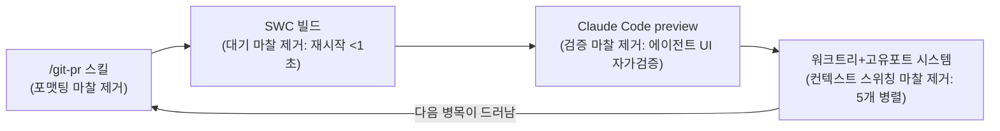

# Claude Code로 더 생산적으로 일하기 (Neil Kakkar)

> **핵심** — 저자는 Tano 합류 6주 만에 커밋이 폭증했다고 말한다. 다만 진짜 이유는 **AI 자체가 아니라 인프라(마찰 제거)**라는 것이 글의 요지다. 역할이 *실행자 → 에이전트 매니저*로 전환된다. **제약 이론(Theory of Constraints)**: 마찰 하나를 없애면 즉시 다음 병목이 드러난다. *"It's the infrastructure, not the AI."*

출처: [neilkakkar.com](https://neilkakkar.com) (2026-03-16), HackerNews/GeekNews 토론 포함.

## 마찰 제거 루프 (4단계)

| 단계 | 제거한 마찰 | 효과 |
|---|---|---|
| **`/git-pr`** | 포맷팅 — 스테이징·커밋·PR 설명·푸시·PR 생성 | 에이전트가 전체 diff 읽고 더 상세한 PR 설명. **정신적 오버헤드(컨텍스트 스위칭) 제거** |
| **SWC** | 대기 — 서버 재시작 ~1분 | 재시작 **<1초** → 흐름 안 끊김 |
| **preview 기능** | 검증 — UI 일일이 눈으로 확인 | **에이전트가 UI 자체 검증해야 "done"** → 검증 위임, 최종 리뷰만, 에이전트 더 오래 자율 |
| **워크트리 시스템** | 컨텍스트 스위칭 — stash/checkout/포트 충돌 | 워크트리마다 **고유 포트 범위 자동 할당** → 2개→**5개 동시** |

→ 타이트한 피드백 루프: 작업 시작 → 에이전트 코딩 → 프리뷰 확인 → diff 읽기 → 피드백/머지 → 다음. **루프 속도 향상 자체가 게임**이 된다. 가장 레버리지 높은 일은 기능 개발이 아니라 **인프라(배관)**라는 것이 저자의 결론이다.

## 균형 — 커뮤니티 반론 (HN/GeekNews)

- **커밋/PR 수 = 나쁜 지표**(90년대 LOC 회귀). "더 많이 머지" ≠ "AI가 잘 작동". (저자도 첫 문장에서 "커밋은 나쁜 지표지만 가장 눈에 띄는 신호"라 인정)
- **기계가 쓴 PR 설명**은 리뷰 경험이 별로다. PR을 **직접 쓰는 과정이 마지막 sanity check**인데, 자동화하면 자기검증 기회를 잃는다.
- **병렬 多에이전트 → 리뷰 시간 폭증**(남의/AI 코드 읽기가 직접 작성보다 어려움). 계획 단계의 엄격함·테스트·리뷰봇으로 보완.
- 최고의 지표는 오히려 **음수 LOC**(불필요한 코드 삭제)라는 시각도 있다.
- (참고) **SWC** = Speedy Web Compiler(타입체크 없이 빠른 트랜스파일).

## 적용 메모

- **"마찰 제거 = 인프라"** 사고는 반복 작업 자동화 전반(데이터 수집·정밀 인용 도메인 적용·콘텐츠 발행 등)에 그대로 옮길 수 있다: `/git-pr`류 스킬, 프리뷰 자가검증, 워크트리 병렬, 고유 포트 할당.
- 단, 반론도 새길 것: **속도·커밋 수에 도취되지 말고**, PR 자기검증·리뷰 부담·코드 단순화(음수 LOC)를 균형 있게 볼 것.

---
*에세이 + 커뮤니티 토론(neilkakkar.com, 2026-03-16) 정리.*
