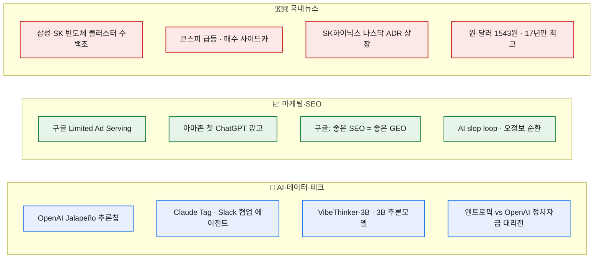

# 데일리 이슈 다이제스트 — 2026-06-25

> 평소엔 AI/IT 한 갈래만 긁는데, 오늘은 **AI·데이터·테크 / 디지털 마케팅·SEO / 국내 종합뉴스** 세 갈래를 한꺼번에 훑었다. 늘 그렇듯 검증 가능한 주장은 1차 출처(공식 발표·원보도·논문·리더보드)까지 따라가 확인했고, **벤더가 스스로 낸 수치나 보도자료 주장은 ⚠️로 떼어 놨다.** 오늘은 그 '떼어 놓기'가 꽤 많았다 — 헤드라인 셋 중 하나는 숫자가 어긋나 있었다.

## 오늘의 줄기 한눈에

## 🤖 AI · 데이터 · 테크

- **OpenAI·Broadcom, 첫 추론 칩 'Jalapeño' 공개 (6/24).** OpenAI의 첫 자체 칩이다. "설계 착수부터 테이프아웃까지 **9개월**"은 공식 발표문에 분명히 적혀 있다. 다만 거기 붙은 "**사상 최단 ASIC 개발 주기**"는 단정이 아니라 *we believe(우리 판단으로는)*라는 자기 한정 표현이고, 와트당 성능 우위도 "초기 테스트" 기준이라 ⚠️**정량 벤치마크는 아직 한 건도 없다**(상세 보고서는 "향후 몇 달 내" 예고). 일부 매체가 붙인 'GPU 대비 50% 저렴'은 OpenAI 발표문엔 없는 출처 불명 숫자다. 추론 칩 단가는 결국 LLM API 비용으로 흘러오니, 자동화 운영비를 가늠하는 변수로 지켜볼 만하다.
- **앤트로픽 'Claude Tag' 출시 (6/23, Enterprise/Team 베타).** Slack에 팀원처럼 상주하는 멀티플레이어·영속 학습·비동기·능동형 에이전트. 기존 'Claude in Slack'을 대체한다(관리자 30일 마이그레이션). 화제가 된 "**내부 코드의 65%를 생성**"은 ⚠️짚어둘 게 많다 — 공식 문구는 'PR'이 아니라 '**code**'이고, 흔히 같이 도는 'PR 대부분이 리뷰 대기로 완성된다'·'8월 3일 종료' 같은 말은 **어떤 출처에도 없다**. 65% 자체도 앤트로픽 자체 보고치다(*생성 ≠ 배포*). 제품이 실재하고 쓸 만하다는 것과, 저 숫자를 곧이곧대로 믿는 건 별개다.
- **VibeThinker-3B (Sina Weibo, arXiv:2606.16140).** 3B짜리 추론 모델인데 AIME26 94.3 같은 수치를 내세운다. 모델·논문은 실재하고 가중치도 MIT로 공개됐다. 다만 ⚠️"**Opus 4.5 초월**"은 1차 자료로는 성립하지 않는다 — 베이스 점수(94.3)는 Opus 4.5(95.1)보다 낮고, 테스트타임 보정(CLR)을 얹어야 겨우 넘어선다. 게다가 **GPQA-Diamond 70.2로 일반 지식은 크게 처진다.** '검증형(수학·코드) 추론에 특화된 소형 모델'로 읽는 게 맞다. 그래도 작은 모델로 고난도 추론이 된다는 방향성은 자체 호스팅·저비용 운영 관점에서 흥미롭다.
- **앤트로픽 vs OpenAI, 뉴욕 하원 예비선거 'AI 정치자금 대리전'.** 두 진영 연계 자금이 한 경선에 **2,300만 달러 넘게**(FEC 기준) 쏟아졌다. AI 규제파 후보(알렉스 보어스)는 약 35%로 2위에 그쳐 낙선했다. 흥미로운 건 '반대편 = OpenAI'가 정확히는 OpenAI **투자자·임원**(a16z, 공동창업자 Brockman) 연계 슈퍼팩이지 회사 직접 지출이 아니라는 점. AI 규제 입법의 향방은 데이터 수집·광고·자동화의 법적 경계와 직결돼서 남 일이 아니다.
- **앤트로픽 'Mythos', 美 기밀 시스템 취약점 '수 시간 내' (AP).** Fable 5/Mythos 5는 실존 모델이고(6/9 발표), 정부-기업 합동 테스트(Project Glasswing)에서 나온 얘기다. 다만 가장 자극적인 "**거의 모든 기밀 시스템을 뚫었다**"는 NSA 국장이 공개적으로 한 말이 아니라 ⚠️**워너 상원의원이 청문회에서 옮긴 전언**이다(NSA는 논평 거부). 익명 관계자는 "취약점을 **식별**한 것이지 익스플로잇한 게 아니다"라고 톤을 낮췄다. 모델 수출·접근 통제가 강해지면 쓸 수 있는 도구가 줄 수 있다는 점에서 스택 선택에 영향을 준다.
- **데이터브릭스 'LTAP' 발표 (6/16).** 운영(OLTP)과 분석(OLAP)을 레이크 한 사본에서 처리해 ETL·복제를 없앤다는 아키텍처. 방향은 매력적인데 ⚠️"**세계 최초**"는 과장이다 — OLTP+OLAP 통합은 2013년 가트너가 'HTAP'로 명명했고 SAP HANA·SingleStore·TiDB 같은 선행 제품이 있다. 'LTAP'는 데이터브릭스가 만든 말이라 '최초 LTAP'는 사실상 동어반복. "하루 1,200만 DB 런치"·"ETL 완전 제거"도 보도자료 단 하나에만 있는 자체 주장이다.

## 📈 디지털 마케팅 · SEO · 애드테크

- **구글 'Limited Ad Serving' 검색광고로 확대 (6월).** 이제 **사용자 신고와 광고주 신원**이 광고 노출 자격 신호로 들어간다. 사용자가 "지속적·불균형하게" 부정 신고한 광고주, 또는 브랜딩 없는 일반(generic) 광고는 특정 검색에서 노출이 제한될 수 있다. 그래서 구글은 **신생·무명 브랜드라면 헤드라인 앞에 도메인을 고정(pin)하라**고 권한다. 2028년까지 점진 시행. ⚠️ 정작 '얼마나 신고받으면'의 임계치, 사전 경고, 이의신청 절차는 공개하지 않았다. 퍼포먼스 광고를 돌린다면 헤드라인·도메인 표기와 평판 관리를 선제적으로 점검할 일이다.
- **아마존, 첫 ChatGPT 광고 — "상징적".** 아마존이 ChatGPT 광고로 노출을 사서 자사 스토어로 유도하기 시작했다. 그런데 동시에 robots.txt로 AI 크롤러의 **실시간 상품 데이터 수집은 막고** 있다(구글 쇼핑 피드 중단, Perplexity 소송까지). "노출은 돈 주고 사면서, 상품·가격 데이터는 안 준다"는 구도. AI 답변엔진이 본격적인 유료 매체가 됐다는 신호라, 미디어믹스에 ChatGPT·Perplexity 광고와 GEO를 같이 얹어 설계할 때가 됐다는 생각이 든다.
- **구글 6월 검색 순위 변동 + 6/19 비공식 관측.** 6/15~17 변동성이 도구상으로도 잡혔고, 6/19엔 커뮤니티 채터가 튀었다(도구는 대체로 '안정'). ⚠️ 한동안 돈 '블랙햇 타깃'설은 Barry Schwartz 본인이 "블랙햇 전용은 아닌 것 같다"고 정정한 **추정**이다. 적대적으로 확인하다 알게 된 사실 — 구글이 **6/24에 'June 2026 스팸 업데이트'를 공식 발표**했다. 6/19 비공식 변동과 같은 것으로 묶지는 말 것(인과는 구글이 확인 안 함). 오가닉이 출렁이는 구간이니 GSC 순위·노출을 평소보다 자주 들여다봐야 한다.
- **구글 광고, 입찰·예산 3종 업데이트 (6/15).** ① **Promotion Mode 베타**(세일·출시 같은 수요 급증기에 ROAS 타깃 한시 조정 + 예산 추가) ② **Smart Bidding Exploration 확대**(ROAS 허용치를 줘서 평소 못 잡던 검색어 탐색) ③ **입찰 타깃 최적화 변경**(예산 제약 캠페인 대상, **8/17 적용·7/6 사전 알림**). 스마트 비딩 운용이 바뀌면 CPA/ROAS 세팅과 예산 배분 로직을 다시 봐야 한다. ⚠️ '+18% 검색어·+19% 전환' 같은 효과 수치는 전부 구글 내부 측정값.
- **⚠️ 바로잡기 — AI Overviews "34.5% → 48%·55%" 숫자는 부정확.** 마케팅 글에서 자주 인용되는 이 수치가 꼬여 있다. **34.5%는 '노출 비중'이 아니라 Ahrefs가 잰 'CTR 감소율'**이다. 서로 다른 지표를 한 축에 올려 "노출이 34.5%→48%로 늘었다"는 잘못된 시계열이 만들어졌다. 실제 노출률은 측정 주체마다 제각각이고(Semrush ~15%, Conductor ~25%, BrightEdge ~48%, 구글 ~50%), "55%가 AI 요약"은 1차 출처가 없다. 다만 **큰 방향(노출 확대·클릭 잠식·zero-click 증가)은 견고하다**(Pew 2025: 요약 뜨면 링크 클릭 8%, Bain: 약 60% 무클릭). 숫자는 의심하되 흐름은 진짜다.
- **구글 "좋은 SEO가 곧 좋은 GEO".** AI Overviews·AI Mode가 "핵심 검색 랭킹·품질 시스템에 *뿌리를 둔다*"는 공식 입장(AI Optimization Guide). 그러니 **별도의 GEO 마법은 없고 기초 SEO가 AI 가시성의 토대**라는 메시지 자체는 구글 공식이다. ⚠️ 단 이 말을 한 사람은 '검색 담당 VP'가 아니라 **광고 솔루션 VP**이고, '동일(identical) 시스템'은 과장이다(같은 문서가 "AI Mode와 AIO는 다른 모델·기법을 써서 인용 결과가 다를 수 있다"고도 적었다). GEO 도구·대행이 과열된 지금, 예산을 기초 SEO에 먼저 배분할 근거로 쓸 만하다.
- **'AI slop loop' (Lily Ray).** AI가 날조된 SEO 정보를 자신감 있게 재생산하고, 그게 다시 AI 콘텐츠로 양산되며 인용량이 '사실성의 대용 지표'처럼 굴러가는 자기강화 오정보 순환. 가짜 '코어 업데이트'를 구글 AI Overviews가 24시간 안에 사실로 재생산한(나중에 삭제) 본인 실험이 근거다. ⚠️ 'slop loop'는 저자가 붙인 이름이자 시연 중심 사례라 보편 현상으로 단정하긴 이르고, 곁들인 통계(NYT·BBC·eMarketer)는 재인용이다. 역설적으로 이 글이 주는 교훈은 명확하다 — **AI나 블로그가 던지는 마케팅 통계는 반드시 원출처를 다시 확인해야 한다.** 이 다이제스트를 이렇게 굴리는 이유이기도 하다.

## 🇰🇷 국내 종합 뉴스

- **삼성·SK, 호남·충청 '수백조' 반도체 클러스터 투자 검토.** 김용범 정책실장이 관훈토론(6/24)에서 "논의가 마무리되는 단계, 이르면 다음주 초 발표"라며 **용인 클러스터는 그대로 간다**고 못 박았다("수도권엔 땅·전력·용수가 없다"). ⚠️ 회자되는 '수백조(300~500조)'는 팹 1기 ~60조 가정에 기댄 언론·재계 추정이라 아직 미확정이고, 6/29 발표는 한 매체 단독 보도다. 반발 주체도 정확히는 추경호(대구시장)·이철우(경북지사) 쪽 **영남(TK) 지역 홀대 우려**다.
- **코스피, '마이크론 훈풍'에 2.74% 급등·매수 사이드카 (6/25).** 개장 **8,703.42(+232.40p)**, 오전 9시 7분 코스피200 선물이 5.81% 뛰며 **올해 15번째 매수 사이드카**가 걸렸고, 9시 22분께 **+5.42%(8,929.99)**까지 올라 9천선을 노렸다. 삼성전자 +4.99%, SK하이닉스 +9.88%로 둘 다 시총 2,000조를 다시 넘겼다. 마이크론 호실적(FY3Q 매출 +345.7%, 다음 분기 가이던스 500억 달러)이 불씨. AI·반도체로 쏠리는 장세는 광고시장 분위기를 읽는 온도계이기도 하다.
- **SK하이닉스, 나스닥 ADR 상장 7/10 추진.** 6/24 이사회 의결 뒤 **SEC에 Form F-1을 제출**했다(티커 SKHY). 신주 1,779만 주(2.50%)로 **최대 약 45.45조 원**을 조달해 전액 시설투자(용인·청주 P&T7·EUV)에 쓴다는 계획. 7/6 효력 → 7/10 거래 개시 → 7/14 납입. ⚠️ '45조·7/10·ADR 10:1'은 F-1엔 공란이고 6/23 종가 기준 잠정치라, 실제 금액은 7월 수요예측으로 정해진다. 국내 대표 반도체 기업의 미국 상장이라는 점에서 자본조달 흐름을 보여주는 큰 이벤트.
- **이재명 대통령 지지율 44.8% '데드크로스' / 국힘 39.4% > 민주 38.1%.** 미디어토마토 191차 조사(6/22~23, 1,035명, ARS). 긍정 44.8%·부정 50.3%로 취임 후 첫 데드크로스, **2주 전 54.0%에서 9.2%p 하락**('약 10%p'는 리드 표현), 정당 지지도도 오차범위 안에서 처음 역전됐다. ⚠️ 다만 응답률 2.5%의 단일 ARS 조사라 다른 기관(리얼미터·갤럽 등)과 절대 수치·역전 폭에 차이가 있다. 정권·정당 구도는 정책·규제 방향을 예고하는 거시 변수다.
- **원·달러 1543원 개장·6월 평균 1521원·MSCI 선진국 편입 불발.** **1540원대 개장은 2009년 3월 이후 17년 만**이고, 6월(1~19일) 평균 1521.20원은 **1998년 2월 이후 28년 4개월 만**의 최고 수준이다. MSCI는 6/23 리뷰에서 한국을 선진국 관찰대상에 올리지 않았다(원화 태환·NDF 위주 거래·역내 유동성 사유). ⚠️ '외환위기 수준'은 *월평균* 기준에서만 성립하는 표현. 고환율은 수입비용·해외 플랫폼 결제·광고 단가에 그대로 작용한다.
- **올여름 최대 전력수요 98.8GW '역대 최대' 전망 (기후에너지환경부, 6/25).** 기준전망은 94.1GW, 폭염에 흐린 날씨까지 겹치는 최악의 경우 **상한 98.8GW**(종전 최고 2024년 8월 97.1GW를 넘는 수준). 공급능력 107GW에 예비력 8.2GW + 비상자원 8.8GW로 "관리 가능"하다는 입장. 대응 체제는 6/29~9/18. ⚠️ 보도된 '99GW'는 반올림이고(공식 98.8), 98.8은 확정이 아니라 *상한 시나리오*다. 전력·폭염은 데이터센터 운영비와 ESG 메시지에 닿는 공통 변수.
- **경찰, 전광훈 사랑제일교회 압수수색 — 정치자금법 위반 (6/25 오전 8시).** 서울청 광역수사단 반부패수사대가 움직였다. 자유통일당이 2020~2025년 상반기에 교회로부터 금전대차 형식으로 **약 102억 원**을 받고 거의 갚지 않았다는 불법 정치자금 의혹으로, 2025년 12월 선관위 고발이 발단이다. 교회 측은 "공작형 표적수사"라며 반발. ⚠️ 아직 '의혹·수사' 단계로 유무죄가 확정된 건 아니다(2025년 8월의 서부지법 난입 관련 압수수색과는 별개 사건).

## ⚠️ 팩트체크 메모 (오늘 바로잡은 것)

- **Claude Tag 65%** — 'PR'이 아니라 'code'. 'PR 리뷰 대기 완성'·'8/3 종료'는 출처 없음. 65%는 자체 보고치.
- **데이터브릭스 LTAP** — '세계 최초'는 HTAP 선행으로 과장. 1,200만/일·ETL 제거는 보도자료 단일 출처.
- **AI Overviews 수치** — 34.5%는 CTR 감소율(노출률 아님), 55%는 출처 불명, 노출률은 측정 주체별 15~50% 편차.
- **VibeThinker 'Opus 4.5 초월'** — 테스트타임 보정 시에만·검증형 영역 한정, 일반 지식(GPQA)은 열세.
- **메타 글래스 '80달러 인하'** — 인하가 아니라 신규 저가 라인의 진입가.
- **Mythos '기밀 시스템 돌파'** — NSA 국장 직접 발언이 아닌 청문회 전언, 관계자는 "식별이지 익스플로잇 아님".
- **국내** — 반도체 '수백조'는 추정·미확정 / SK하이닉스 '45조'는 F-1 공란 잠정치 / 이재명 지지율은 응답률 2.5% 단일 조사 / 전력 '99GW'는 반올림된 상한 전망.

---

> 같이 보면 좋은 글: [[ai-it-digest-2026-06-24|AI/IT 데일리 다이제스트 (6/24)]] · [[korea-ai-news-agent-governance-2026-06-23|국내 AI 이슈 — 에이전트 거버넌스 外]] · [[geoflow-geo-content-engine|GEOFlow — GEO 콘텐츠 엔진]] · [[llm-ai-news-sources-catalog|LLM/AI 정보원 카탈로그]]

*외부 공개 자료의 하루치 큐레이션. 이슈마다 1차 출처까지 따라가 확인하고, 벤더·보도자료 주장은 ⚠️로 분리했습니다. 정리: 2026-06-25.*
