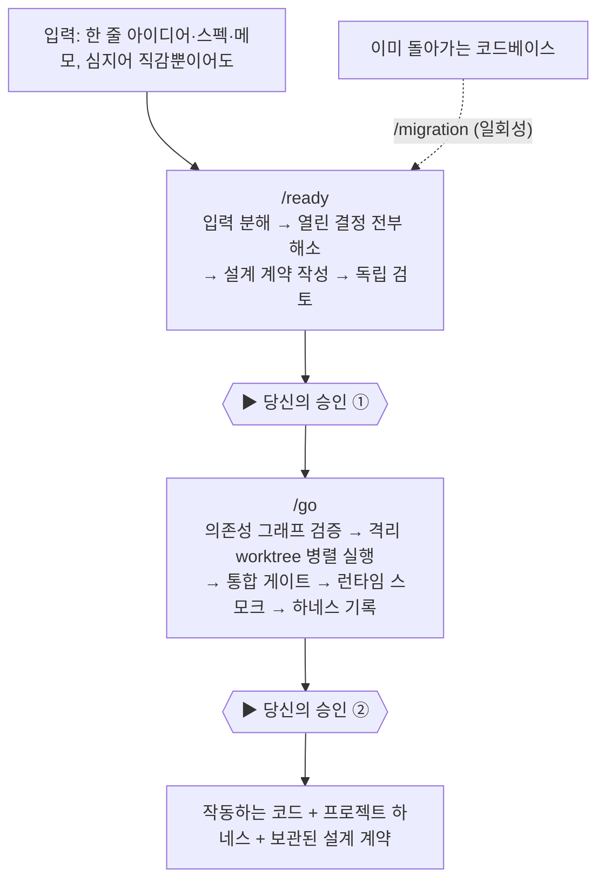

# Dryforge — 하네스 엔지니어링을 플러그인으로 만들면

> 요즘 내가 계속 파고 있는 **하네스 엔지니어링**을 아예 *설치형 플러그인*으로 패키징한 물건이라 눈이 갔다. Dryforge의 한 줄 요지는 이렇다 — **"프롬프트가 말하지 않은 결정을 코드 짜기 전에 전부 끄집어내 확정하고, 그 결정과 근거를 다음 세션이 제일 먼저 읽는 문서에 박아둔다."** Claude Code와 Codex 양쪽에서 돈다. 늘 그렇듯 1차 출처(repo·태그·구조)로 확인했고, 선언이 센 만큼 그게 *설계 목표*인지 *검증된 성능*인지도 구분해 뒀다.

## 한 장 요약 — 두 번의 승인 게이트

## 어떤 문제를 푼다고 하나

Dryforge가 짚는 실패는 두 가지다. 둘 다 공감이 갔다.

**첫째, 모든 프롬프트는 덜 적혀 있다.** "예약 시스템 만들어줘"는 요구사항처럼 들리지만 사실 목표 진술일 뿐이다. 예약과 서비스가 어떤 관계인지, 서비스가 끝나면 예약은 어떻게 되는지, 취소하면 슬롯을 풀지 말지 — 이런 결정이 그대로 남는다. 감독 없는 에이전트는 이 공백에 멈추지 않는다. **그럴듯한 기본값으로 조용히 메우고**, 컴파일되고 데모가 깔끔한 코드를 내놓는다. 그 '예약 하나당 서비스 하나' 스키마가 결정 기록도 없이 핵심이 되고, 청구서는 몇 달 뒤 마이그레이션 때 날아온다.

**둘째, 아무것도 남지 않는다.** 결정은 대화와 함께 증발한다. 다음 세션은 코드만 보고 프로젝트 상태를 되짚어야 하는데, 코드엔 결과만 있고 *왜* 그렇게 했는지가 없다. 그래서 이미 끝난 논쟁이 다시 붙고, 불변조건이 호환 안 되게 재구현되고, 모듈마다 관례가 달라진다. 이게 '구조적 표류'다.

Dryforge는 두 지점 모두에 개입한다 — **코드가 생기기 전에 미해결 결정을 열거하고, 모든 해결을 그 근거와 함께 '앞으로 모든 세션이 가장 먼저 읽는 경로'에 적어둔다.**

## 세 개의 명령

- **`/ready` — 의도에서 실행 가능한 사양으로.** 한 줄 아이디어든 흩어진 메모든 전부 '검증 대상 자료'로 받는다(정답으로 받지 않는다). 답해야 할 결정을 명시·묵시 가리지 않고 열거하고, 각각을 당신의 명시적 의도나 선택으로 확정한다. 묵시적 기본값은 최종이 아니다. 좋은 점은 **질문을 규정으로 제한**한다는 것 — 이전 답에서 끌어낼 수 있으면 안 묻고, 모든 질문엔 권장안이 붙어 키 한 번으로 수락되며, 도메인 질문엔 "이 중 없음"(당신 지식이 보기 목록보다 우선)이 있다. 결과물은 **설계 계약**이고, 작성에 관여하지 않은 담당이 **독립 검토**한 뒤 당신 승인으로 확정된다.
- **`/go` — 증거로만 통과한다.** 승인된 계약을 소비하고 그때부터 Git을 소유한다. 계획의 **의존성 그래프를 먼저 검증**하고(순환·끊김·커버리지 부족은 '고치며 가는 문제'가 아니라 즉시 오류), 독립 작업은 **격리된 worktree에서 병렬**로 돌린 뒤 **머지 게이트**로 합친다 — 이때 구현자의 자기보고는 보지 않고 실제 diff가 선언 범위를 벗어나는지를 본다. 검증은 위험에 비례하고(이름 변경과 결제 경로가 같은 검증을 받지 않는다), 마지막엔 **런타임 스모크**로 서비스가 실제로 부팅돼 요청에 답하는지까지 본다("컴파일과 작동은 별개"다). main에 직접 쓰지 않고, 최종 머지/PR을 자동으로 하지도 않는다.
- **`/migration` — 기존 코드 온보딩(일회성).** 코드베이스를 스캔해 *코드가 증명하지 못하는 것*을 도출한다. 틀려도 싼 건 추론하고, 틀리면 비싼 것(도메인 불변조건·보안 경계·비즈니스 규칙)은 당신에게 묻는다. 하네스만 이식하고 끝낸다.

## 남는 것 — 프로젝트 하네스

핵심은 결과물이 **벤더 중립**이라는 점이다. Dryforge는 표준 `CLAUDE.md`/`AGENTS.md`와 `docs/`(architecture·business-rules·security·standards·engineering-notes·operations·contracts·tracking) + 모듈별 `AGENTS.md`를 쓴다. 설계 계약은 사양·계획·인수인계 세 문서로 남고 사이클마다 보관된다. 그래서 "**Dryforge를 내일 지워도 자산은 그대로 남는다**" — 어떤 에이전트든 읽을 수 있는 평범한 마크다운이니까.

철학도 명확하다. **천장이 아니라 바닥**(더 좋은 모델을 끼우면 결과가 자동으로 좋아진다), **감옥이 아니라 나침반**, **제한된 자율성**(승인된 의도 *안에서만* 자유롭고 스스로 의도를 세우진 않는다), **추측 말고 질문**(한 번의 추측이 한 번의 멈춤보다 비싸다).

## ⚠️ 팩트체크

- **★64 · 포크 8**(2026-06-25 실측). **생성 2026-05-31**으로 아직 3~4주 된 신생이고, 태그를 9개(v0.2.0→v1.1.1) 끊을 만큼 빠르게 굴러가지만 그만큼 **성숙도는 초기**다.
- **사실상 1인 + AI 프로젝트**다. 커밋은 전부 제작자 한 명, 기여자에 Claude가 함께 잡힌다. 코드는 Shell 100%·230KB로, 무거운 엔진이라기보다 **프롬프트와 절차 골격(하네스) 중심**이다.
- **🚩 README가 꽤 선언적이다.** "제로 드리프트", "손실 없는 의도", "증거로만 통과" 같은 표현은 **설계 목표이자 방법론**이지, 독립적으로 벤치마크된 성능 보장이 아니다. 실제 효과는 쓰는 모델과 사용자의 규율에 달려 있고, 제3자 평가 사례는 아직 못 봤다. 멋진 설계지만, 효능은 직접 돌려보고 판단할 영역이다.
- 라이선스는 **MIT**로 깔끔하다.

## 왜 챙겨봤나

내가 정리해 온 하네스 책들과 체크리스트가 말하는 것 — control plane, 검증을 만든 사람과 분리하기, 정지 조건, 제도화 — 을 **그대로 설치형 제품으로 구현한 사례**다. 특히 "독립 검토자가 구현자의 자기보고를 무시하고 실제 변경만 본다"는 건 maker≠checker의 강한 버전이고, "결정과 근거를 docs에 영속한다"는 건 복합 엔지니어링의 '계획=코드'와 정확히 같은 얘기다. 내 크롤링·블로그·데이터 자동화에 *결정 열거 + 근거 영속 + 두 승인 게이트*만 떼어 와도 쓸모가 있겠다 싶었다.

---

> 같이 보면 좋은 글: [[harness-engineering-claude-code-design-guide|Harness Engineering 설계 가이드]] · [[harness-design-claude-code-vs-codex-book-two|하네스 설계 — Claude Code vs Codex]] · [[harness-engineering-checklist|하네스 엔지니어링 체크리스트]] · [[compound-engineering-every-kieran-klaassen|Compound Engineering]] · [[insane-search-gptaku-plugin|Insane Search (GPTaku)]]

*GitHub 1차 출처(API·태그·구조) 팩트체크. 선언은 설계 목표이지 벤치마크가 아님. 정리: 2026-06-25.*
