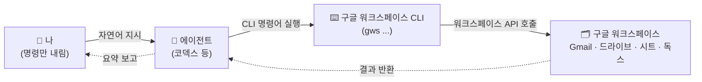
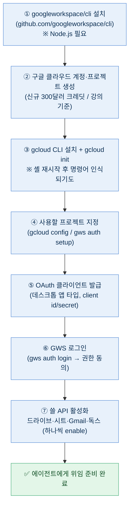
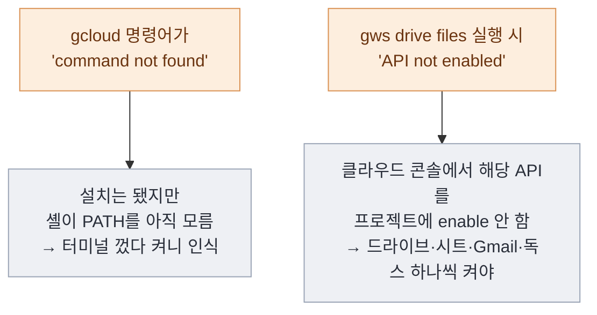
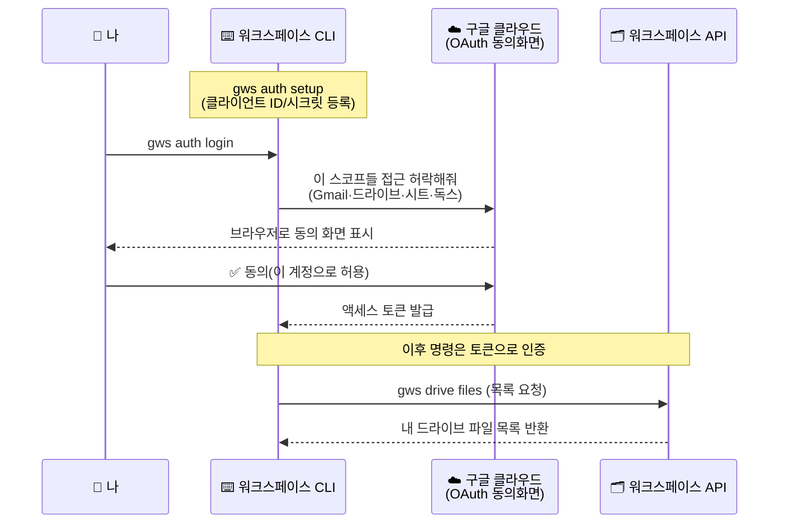
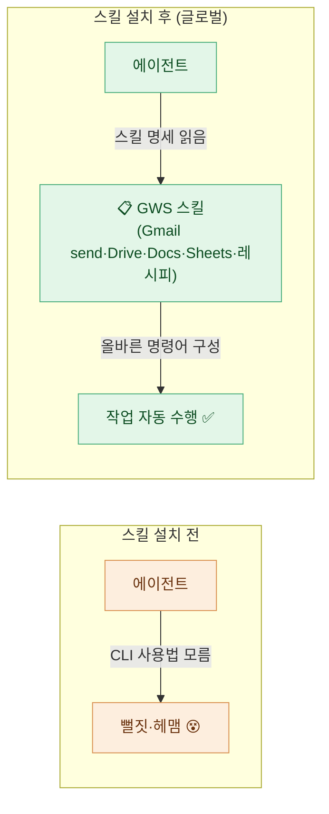
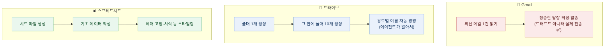

# 구글 워크스페이스 CLI를 에이전트에게 쥐여주기

> editorp89(편집자P) 강의 한 편을 정독하고 정리한 노트다. 미리 밝혀두면 **나는 이걸 직접 세팅해보지 않았다.** 강의 내용을 따라가면서, 구글 워크스페이스 중심으로 굴러가는 업무에 이걸 쓸지 말지를 데이터 분석가 입장에서 가늠해보는 학습용 메모에 가깝다. 그래서 설치 세부는 강의에서 확인된 흐름만 적고, 내 환경에서 직접 검증하지 않은 부분은 그렇다고 명시한다.

핵심 한 줄은 이거였다. **구글 워크스페이스가 CLI로 조작 가능해졌고, 에이전트는 CLI를 잘 다루니까, 워크스페이스 자동화를 에이전트에게 통째로 시킬 수 있게 됐다.** 강의 화자도 "나도 오늘 처음 써본다"며 세팅을 처음부터 따라가는 구성이라, 나도 같은 눈높이로 따라 읽었다.

## 한 장 요약 — 세 꼭짓점의 관계

강의가 맨 앞에서 그린 그림이 사실상 전부다. **사람 · 에이전트 · 구글 워크스페이스 CLI**, 이 셋의 삼각관계.

> **CLI(Command Line Interface)** 란? 마우스로 버튼을 누르는 대신 **글자(명령어)로 컴퓨터에 일을 시키는 방식**이다. 강의 표현으로는 "껌꺼한 터미널". 사람한테는 무섭지만, 텍스트만으로 이뤄진 이 환경을 **에이전트는 오히려 편하게 다룬다.** 그래서 사람이 직접 터미널을 두드리는 게 아니라, 에이전트한테 시키는 게 이 워크플로의 포인트다.

여기서 내가 짚은 핵심은, 사람은 **CLI를 배워서 직접 쓰는 게 목적이 아니라는 것**이다. CLI라는 "에이전트가 좋아하는 통로"가 새로 열렸으니, 그 통로로 에이전트에게 워크스페이스 일을 떠넘기는 게 목적이다.

## 기존 MCP 커넥터랑 뭐가 다른가?

이 대목이 내가 가장 챙겨본 부분이다. 나는 이미 [[claude-code-mcp-servers-github-pat-oauth-dcr-fix|Claude에 MCP 서버를 붙이는 글]]을 정리해둔 적이 있어서, "그럼 MCP 커넥터로 Gmail 붙인 거랑 뭐가 다른데?"가 바로 떠올랐다. 강의가 짚은 차이는 명확했다.

| 구분 | 기존 MCP 커넥터 (예: Claude의 Gmail) | 구글 워크스페이스 CLI |
|---|---|---|
| **읽기** | ✅ 가능 | ✅ 가능 |
| **쓰기/발송** | ⚠️ **드래프트(임시저장)까지만** | ✅ **메일 발송까지** 가능 |
| **다룰 수 있는 범위** | 커넥터가 미리 만들어둔 기능 한정 | 워크스페이스 **API 전반**(드라이브 폴더 생성·시트 작성·서식 등) |
| **동작 방식** | 미리 정의된 함수(툴)를 호출 | 에이전트가 **CLI 명령어를 직접 작성·실행** |
| **토큰 사용** | 상대적으로 더 씀 | **덜 씀**(강의 화자 설명 기준) |

> ⚠️ 표의 "토큰 덜 씀"은 **강의 화자의 설명 기준**이다. MCP는 툴 명세(함수 정의)를 컨텍스트에 미리 올려두는 구조라 그만큼 토큰을 먹는 반면, CLI는 에이전트가 명령어 한 줄을 실행하고 결과만 받는 식이라는 취지였다. 정확한 토큰 절감 폭은 환경·작업에 따라 다를 수 있어 단정하지 않는다.

겉보기엔 "에이전트가 내 구글 일을 대신해준다"는 점에서 MCP와 똑같아 보이지만, **드래프트 벽을 넘어 실제 발송·생성까지 간다**는 게 결정적 차이다. 읽기/임시저장에 막혀 있던 MCP 커넥터의 한계를, CLI가 API 전체를 열어주면서 푼 셈이다.

## 세팅은 어떤 순서로 흘러가나?

강의에서 화자가 실제로 막혀가며 진행한 순서를 흐름도로 정리했다. **강의 기준**이고, 도구의 정확한 패키지명·플래그는 환경(OS·셸)에 따라 다를 수 있어 일반화해서 적는다.

> **OAuth 클라이언트** 란? 내 구글 계정의 데이터에 **앱(여기선 CLI)이 대신 접근해도 된다는 허가증**을 발급하는 절차다. 클라이언트 ID와 시크릿(비밀번호 같은 것)이 나오는데, **이건 노출되면 안 되는 민감 정보**다. 강의에서도 JSON으로 받아두고 "영상 올린 뒤 즉시 삭제하겠다"고 했다.

진행하면서 화자가 실제로 걸린 함정 두 가지가 인상적이었다. 둘 다 "내가 틀린 게 아니라 한 단계가 빠진" 경우라, 전에 정리한 [[claude-code-mcp-servers-github-pat-oauth-dcr-fix|MCP 글의 교훈]]("에러를 곧이곧대로, 내 탓으로만 읽지 말 것")과 겹쳤다.

## 인증은 실제로 어떻게 오가나?

세팅의 ⑤~⑥(OAuth 클라이언트 → 로그인)에서 무슨 핸드셰이크가 일어나는지 풀면 이렇다. 큰 흐름만 옮긴 것이고, 실제 토큰 교환 세부는 OAuth 표준을 따른다.

> 여기서 "스코프(scope)"는 **허락 범위**다. 강의에선 슬라이드·독스·캘린더·Gmail·시트·드라이브 정도를 골라 동의했다. 권한을 받는 만큼 CLI가 내 계정 데이터를 만질 수 있게 되니, **꼭 필요한 것만 켜는 게 안전**하다. 그리고 이 동의는 ⑦의 "클라우드 콘솔에서 API enable"과는 **별개 단계**다(강의에서 화자가 헷갈린 지점).

## 에이전트가 CLI를 모를 땐? — Agent Skills로 명세 주입

세팅을 끝내고 코덱스에게 "최신 메일 한 개 읽어와"를 시켰더니, **에이전트가 CLI 사용법을 몰라 헤매는** 장면이 나왔다. 새로 나온 도구라 학습 데이터에 없는 것이다. 화자의 해법은 **'AI 에이전트 스킬스'를 글로벌로 설치**하는 것이었다. 스킬을 깔아두면 에이전트가 명세를 읽고 알아서 CLI를 구사한다.

> **Agent Skills** 란? 에이전트가 특정 작업을 어떻게 해야 하는지를 적어둔 **설명서 묶음**이다. 에이전트는 필요할 때 이 명세를 읽고 그대로 따라 한다. 강의에선 코덱스·클로드 코드·커서·제미나이 같은 여러 에이전트가 공통으로 인식하도록 **글로벌(전체) 범위**로 설치했다. (스킬 개념 자체는 [[agent-skills-addy-osmani|Agent Skills 정리 노트]]에서 따로 다뤘다.)

설치 전엔 "뭔 소리야?" 하며 엉뚱한 짓을 하던 에이전트가, 스킬을 장착하자 **"아, 너 GWS 쓰려는구나"** 하고 알맞은 명령어를 짜서 실행하기 시작했다는 게 강의의 전환점이었다.

## 실제로 뭘 시켜봤나? (강의 실습)

세팅이 끝난 뒤 강의가 보여준 실습은 세 가지였다. 자연어로 던지면 에이전트가 CLI로 처리한다.

특히 **폴더 10개를 한 번에 만들고 이름까지 알아서 붙여주는** 데모는, 손으로 폴더를 줄줄이 만들어본 사람이라면 솔깃할 수밖에 없다. 메일도 읽기에서 끝나는 게 아니라 **실제로 답장이 발송**됐다(화자가 받은편지함에서 직접 확인). MCP 커넥터로는 드래프트에서 멈추던 일이다.

다만 강의에서도 답장 **제목이 깨져서** 들어가는 작은 버그가 있었다. "되긴 되는데 다듬을 구석은 있다"는 정도로 받아들였다.

## 그래서 나는 이걸 쓸까?

데이터 분석가/마케터로서 솔깃한 건 분명하다. 반복되는 드라이브 정리, 시트 초안 만들기, 정형 메일 발송 같은 잡일을 에이전트한테 넘기면 시간이 꽤 빠질 것 같다. 토큰을 덜 쓴다는 점도(강의 기준) MCP 커넥터 대비 매력적이다.

그런데 학습 노트로서 솔직하게 적어두면, **선뜻 실무에 바로 붙이긴 조심스럽다.** 이유는 두 가지다.

- **권한과 비용.** OAuth 동의로 내 계정 데이터 전반을 CLI가 만지게 되고, 구글 클라우드 프로젝트·크레딧이 얽힌다. 강의는 "자동 청구 없음" "신규 크레딧"이라 했지만 이건 **강의 기준**이고, 시점·정책에 따라 다를 수 있어 직접 확인이 필요하다.
- **회사 데이터 경계.** 발송·생성까지 자동화된다는 건, 잘못 시키면 **실제 메일이 나가고 파일이 만들어진다**는 뜻이다. 회사 계정·고객 데이터가 닿는 곳에선 더더욱 신중해야 한다.

결론: **개념과 워크플로는 확실히 챙길 가치가 있다.** 다만 직접 세팅·검증하고, 권한 범위를 최소로 좁힌 개인 테스트 계정에서 충분히 굴려본 뒤에야 업무 적용을 판단하는 게 맞겠다. "되니까 다 시켜도 된다"와 "시켜도 되는가"는 다른 질문이라는 걸, MCP 글을 쓸 때와 똑같이 다시 새긴다.

---

> 같이 보면 좋은 글: [[claude-code-mcp-servers-github-pat-oauth-dcr-fix|Claude Code에 MCP 서버 붙이기 — GitHub DCR 막힘 PAT 우회]] · [[agent-skills-addy-osmani|Agent Skills (Addy Osmani)]]

*editorp89(편집자P) 강의 "구글 자동화 이제는 에이전트가 다합니다, 구글 워크스페이스 CLI 세팅 + 실습 가이드"(https://youtu.be/SR6KTGPKMB0)를 정독하고 정리한 학습 노트. 나는 직접 세팅해보지 않았고, 설치 세부·명령어·크레딧 정책은 강의 시점 기준이라 환경·시점에 따라 다를 수 있습니다. 모든 키·계정·예시는 플레이스홀더이며 실제 자격증명·PII는 포함하지 않았습니다.*
