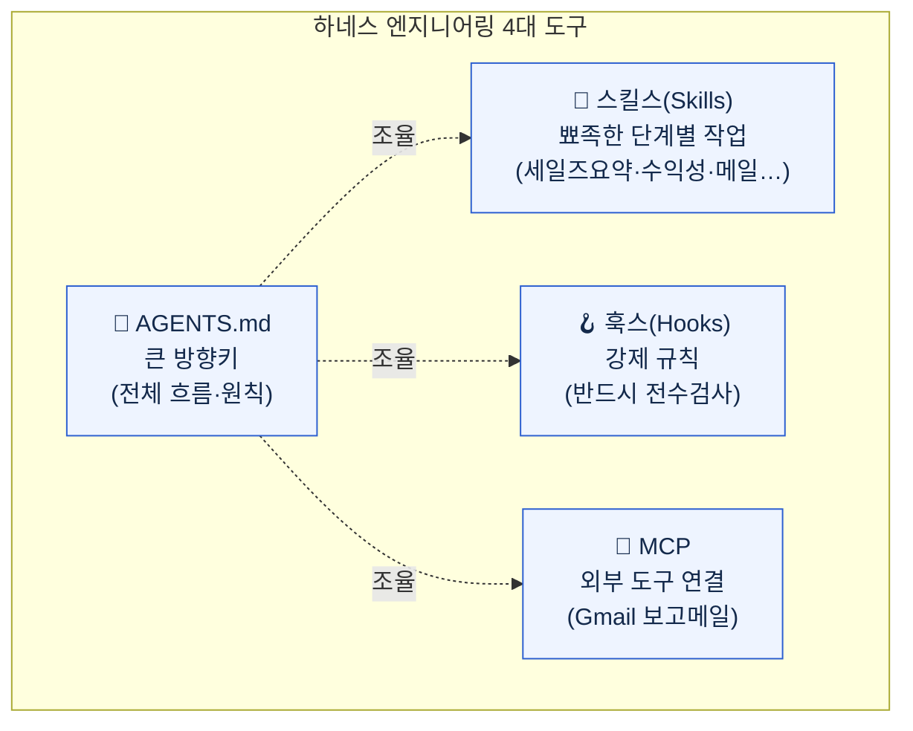
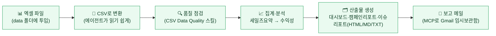
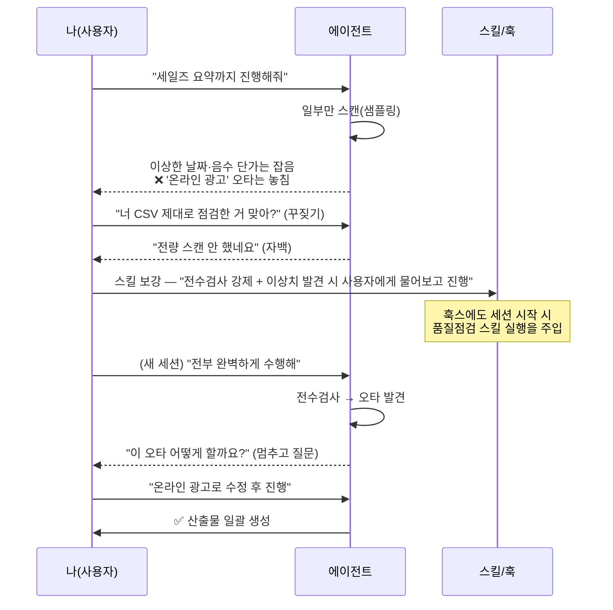
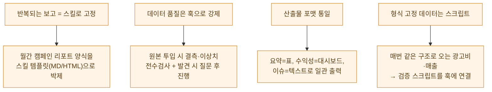

# 엑셀 영업데이터를 에이전트에 통째로 맡기려면

> editorp89(편집자P)의 [하네스 엔지니어링 실습 편](https://youtu.be/KP5klrxAPi8)을 봤다. "하네스 엔지니어링은 개발자만 쓰는 거 아니냐"는 댓글에 답하는 영상인데, 정작 데모는 **엑셀 영업데이터 처리**였다. 나처럼 데이터 보고 마케팅 자료 만드는 사람한테 딱 와닿는 시나리오라 정리해 둔다. 미리 밝혀두면 — **나는 이 실습을 직접 돌리진 않았다.** 강의를 보면서 "내 실무엔 이렇게 옮기면 되겠다"를 메모한 학습 노트다.

용어 하나부터. **하네스(harness)**란 마구(馬具), 그러니까 말에 채우는 굴레다. 에이전트가 제멋대로 날뛰지 않게 **"이 방향으로만 움직여"라고 미리 채워두는 틀**이라고 보면 된다. 그 틀을 4개 도구로 구성한다.

## 한 장 요약 — 4대 도구가 각자 맡는 자리

먼저 전체 그림. 같은 일을 하는데 도구마다 역할이 다르다는 게 핵심이다.

> 강의 화자 표현으로는, **AGENTS.md**가 "가장 큰 방향키"고, **스킬스**는 "딱딱 정해진 단계를 지시하는 뾰족한 작업", **훅스**는 "강력하게 강제하고 싶을 때", **MCP**는 "외부 도구를 꽂는 연결"이다. 데이터 한 덩이를 같은 결과로 반복 처리하고 싶을 때 이 넷이 맞물린다.

## 데이터는 어떤 흐름으로 처리되나?

가상의 사무기기 판매업체 영업데이터 500줄(누가·뭘·얼마에 팔았나)을 던지면, AGENTS.md에 박아둔 순서대로 에이전트가 알아서 굴러간다.

> 왜 굳이 **CSV로 변환**할까? 엑셀(.xlsx)은 사실 압축된 바이너리라, 에이전트한테 그냥 읽으라고 하면 변환 스크립트부터 짜느라 느려진다. 쉼표로 구분된 평문 CSV로 바꿔주면 에이전트가 바로 읽는다. 그래서 AGENTS.md에 "분석은 반드시 CSV로만"이라고 못 박아둔 것.

이 흐름에서 내가 무릎을 쳤던 건, **산출물 포맷까지 스킬마다 템플릿으로 고정**해뒀다는 점이다. 세일즈 요약은 마크다운 표, 수익성 리포트는 HTML 대시보드, 이슈 리포트는 텍스트 파일 — 이런 식으로. 보고서 양식이 매번 들쭉날쭉하던 내 작업엔 이게 제일 탐난다.

## 에이전트가 이상치를 놓치면 어떻게 되나? (실습의 진짜 핵심)

강의의 백미는 여기다. 화자가 데이터에 **일부러 함정**을 심어놨다 — 이상한 날짜, 음수 단가, 그리고 마케팅 채널에 `온라인 광고`라는 오타. 에이전트가 이걸 잡느냐 놓치느냐로 하네스를 어떻게 조이는지 보여준다.

여기서 배운 교훈이 셋이다.

- **에이전트는 기본적으로 게으르다.** 500줄 다 보라고 안 하면 헤더만 슬쩍 보고 "이상 없음"이라고 한다. `(500건 이하면 전수)`처럼 괄호에 약하게 써두면 무시한다 — **중요한 규칙은 크고 강하게.**
- **자율 vs 강제는 도구가 다르다.** 부드럽게 유도하면 스킬, 무조건 시키려면 훅스, 100% 통제하려면 훅에서 아예 검증 스크립트를 실행. 화자도 "데이터가 항상 같은 형식으로 들어온다면 스크립트가 제일 정확하다"고 했다.
- **꾸짖고 → 스킬을 고친다.** 한 번 놓치면 그 자리에서 혼내서 넘기는 데 그치지 않고, **스킬 문서 자체를 보강**해서 다음부터 안 놓치게 만든다. 이게 "하네스를 조인다"의 실체다.

## 클로드 코드든 커서든 똑같이 도나?

같은 하네스 폴더를 클로드 코드와 커서 양쪽에서 열어 동작을 비교한 것도 인상적이었다. AGENTS.md·스킬스는 표준 규격이라 둘 다 읽는다 — **하네스는 특정 에이전트에 종속되지 않는다.** 다만 모델마다 성향이 갈렸다.

| 환경/모델 | 관찰된 성향 (강의 시연 기준) |
|---|---|
| 커서 Composer (빠른 모델) | 빠르지만 전수검사를 대충 건너뛰는 경향, 오타 놓침 |
| 클로드 코드 | 시연 당시 응답이 느려 중간에 전환 |
| GPT-5.4 (커서) | 작업 전 **보고부터 하고** 사용자 확인 뒤 진행, 오타도 잡음 |

> 한 줄 메모: "빠른 모델 = 좋은 모델"이 아니다. 빠른 만큼 검증을 건너뛰기도 한다. **검증이 중요한 작업일수록 훅/스크립트로 강제**해두는 게 모델 편차를 줄이는 길이라는 걸 다시 확인했다.

## MCP로 보고 메일까지 — 어디까지 솔직히 봐야 하나

마지막은 MCP로 Gmail에 연결해, 완성된 보고서를 HTML 형식 그대로 **임시보관함에 메일로** 떨구는 시연이었다. 클로드 데스크톱에 Gmail 커넥터가 붙어 있으면 클로드 코드에서도 쓸 수 있다는 흐름.

다만 화자 본인이 솔직하게 인정한 부분 — **MCP는 이 시나리오엔 좀 억지로 끼워 넣은 것**이다. 하네스(에이전트의 방향 제어)와 MCP(외부 도구 연결)는 결이 다르고, MCP가 하네스의 핵심 요소라기보단 "있으면 편한 손" 쪽이다. 개발 맥락에선 context7 같은 게 하네스에 자연스럽게 들어가지만, 일반 사무 작업이라 메일링으로 대체했다는 것. 이런 자기 한계 고백이 오히려 신뢰가 갔다.

## 그래서 내 실무엔 어떻게 옮길까

데이터 분석가/마케터 입장에서 그대로 베껴 쓸 지점을 추려보면:

핵심은 "에이전트한테 매번 길게 설명하지 않는다"는 것. 한 번 하네스로 박아두면, 데이터 파일만 던져도 변환→점검→집계→산출물→보고까지 같은 품질로 돌아간다. 내 경우 가장 먼저 시도할 건 **(1) 데이터 품질 전수검사 훅**과 **(2) 보고서 양식 스킬화** 두 개다. 회사 실데이터가 아니라, 강의처럼 **합성 영업데이터**로 먼저 안전하게 파일럿을 돌려볼 생각이다.

---

> 같이 보면 좋은 글: [[loop-vs-harness-vs-ralph-when-to-use|루프 vs 하네스 vs 랠프 — 언제 뭘 쓰나]] · [[harness-engineering-checklist|하네스 엔지니어링 체크리스트]] · [[marketing-data-analysis-case-study|마케팅 데이터 분석 사례]]

*출처: editorp89(편집자P) 유튜브 [초초입문자를 위한 하네스 엔지니어링 실습 편](https://youtu.be/KP5klrxAPi8). 위 내용은 강의를 보고 정리한 학습 노트이며, 나는 이 엑셀 실습을 직접 돌리지 않았다. 예시 데이터는 강의 속 가상 영업데이터이고, 회사 실데이터·실제 키·고객정보는 포함하지 않았다.*
