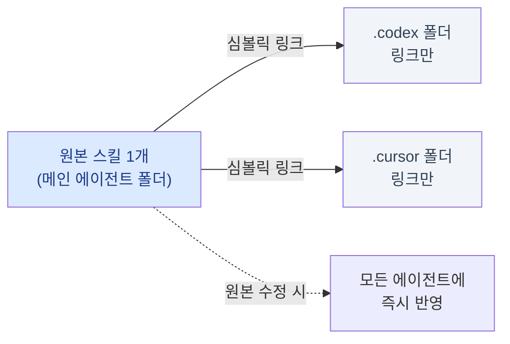
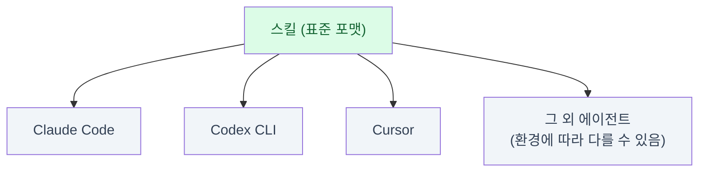
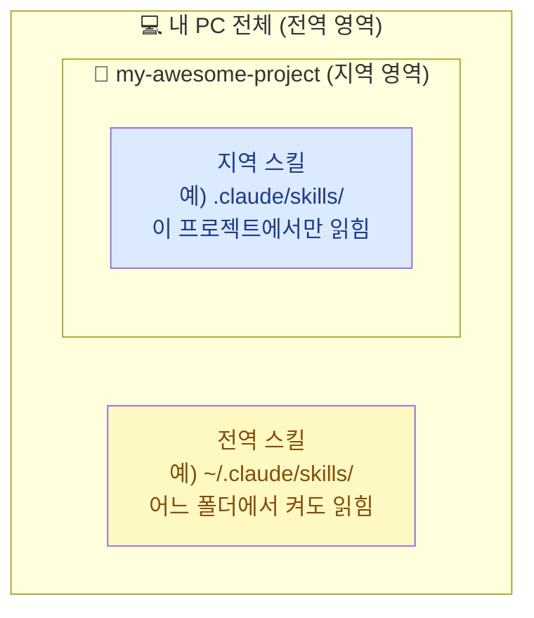
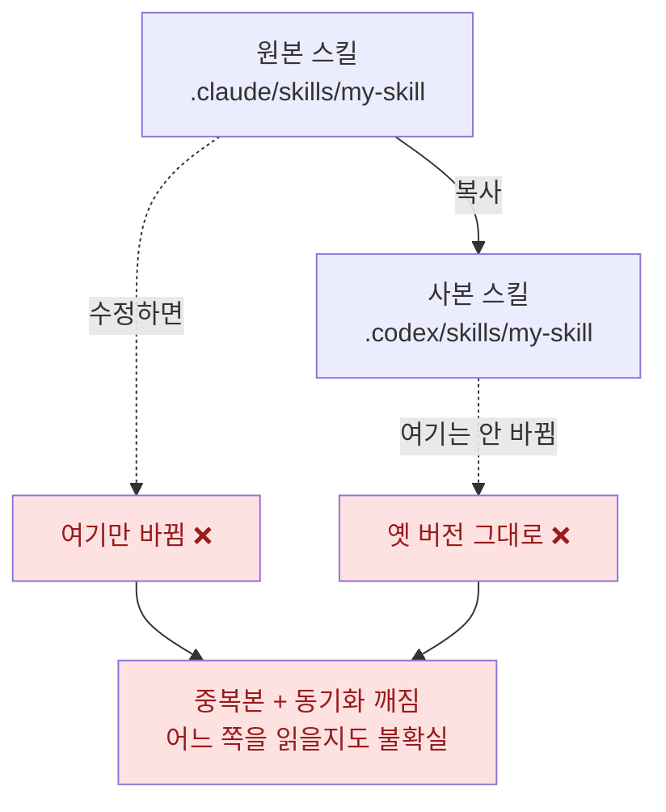
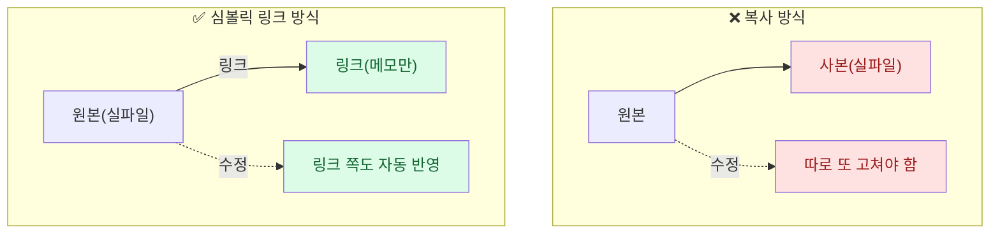
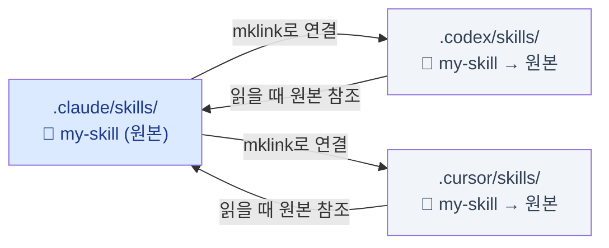
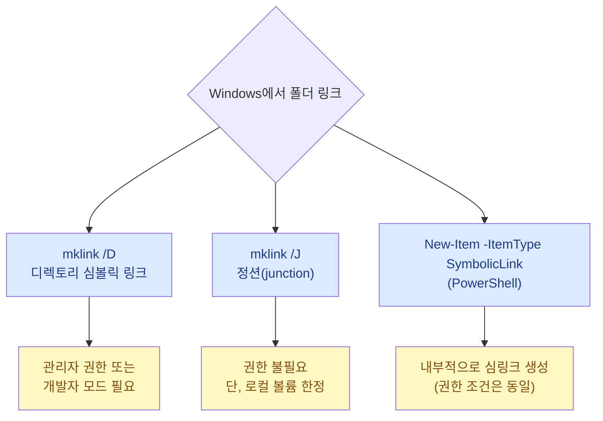
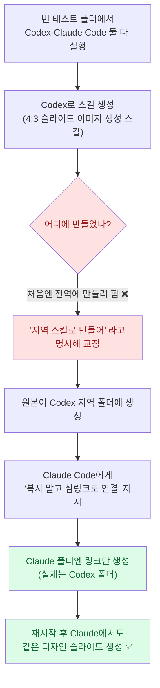

# 에이전트를 가리지 않는 스킬 관리 전략

> editorp89(편집자P)의 "클로드 코드·코덱스 스킬 관리 전략 왕초보 가이드"를 보고, 내 Claude Code + Codex 환경에 적용하려고 정리한 학습 노트다. 핵심은 한 문장이다 — **스킬은 복사하는 게 아니라 원본 1개만 두고 나머지는 링크로 잇는다.** 나는 그동안 에이전트를 바꿀 때마다 스킬 폴더를 그냥 복사해 넣었는데, 강의를 보고 그게 왜 나쁜 습관인지(중복본·동기화 깨짐) 비로소 이해했다. 그래서 강의 내용에 더해, 내 PC가 Windows라 Unix `ln -s` 대신 어떤 명령을 써야 하는지까지 확인해 정리했다.

먼저 오늘 이야기의 전체 그림부터.



## 그래서, 스킬은 Claude만의 것일까?

가장 먼저 풀어야 할 오해부터. **스킬은 Claude(또는 Claude Code) 고유의 것이 아니다.** 처음 제안한 건 앤트로픽이 맞다. 그런데 제안 이후 다른 에이전트들이 "좋은 거 같이 쓰자"는 식으로 받아들이면서 사실상 표준처럼 공유됐다. 그래서 스킬을 하나 만들어 두면 Claude Code에서 쓰던 것을 Codex에서도, Cursor에서도 쓸 수 있다.

> **스킬(Skill)** 이란? 에이전트에게 "이런 작업은 이렇게 해라"를 적어둔 설명서 묶음이다. 사람이 일일이 지시하지 않아도, 에이전트가 필요할 때 **알아서 읽어와** 그 절차대로 일한다. 핵심은 이 "알아서 읽어온다"는 동작인데, 바로 이 점 때문에 *어느 폴더에 두느냐*가 중요해진다.



여기서 한 가지는 단정하지 않고 넘어간다. "대부분의 에이전트가 공유한다"는 강의의 설명은 큰 흐름으로는 맞지만, 에이전트마다 지원 정도·폴더 규칙은 다를 수 있다. 도구 버전에 따라 달라질 수 있는 부분이다.

## 전역 스킬과 지역 스킬은 뭐가 다른가?

스킬이 저장되는 위치는 크게 두 영역으로 나뉜다. **전역(global)** 은 PC 전체에서 읽히는 자리, **지역(local)** 은 특정 프로젝트 폴더 안에서만 읽히는 자리다.



전역은 편하다 — 어느 터미널에서 에이전트를 켜도 읽힌다. 그런데 강의에서 짚은 함정이 여기 있다. **전역 스킬이 많아지면 에이전트가 느려진다.** 스킬은 에이전트가 알아서 훑어보고 필요한 걸 컨텍스트에 올리는 방식이라, 전역에 스킬을 잔뜩 쌓아두면 "뭘 쓸지 고르는" 탐색에만 시간이 길어진다. 강의의 표현을 빌리면 "스킬을 너무 사랑한 나머지" 쇼핑하느라 하루가 다 가는 셈이다.

그래서 운영 원칙은 이렇다.

| 구분 | 전역 스킬 | 지역 스킬 |
|---|---|---|
| 위치(관례) | `C:\Users\<user>\.claude\skills\` | 프로젝트 안 `.\.claude\skills\` |
| 읽히는 범위 | PC 전체 어디서나 | 그 프로젝트 폴더에서만 |
| 추천 용도 | 어디서나 쓰는 범용(예: 구글 워크스페이스) | 특정 프로젝트 작업용 |
| 권장 정책 | **최소화** (많으면 탐색 느려짐) | 여기를 주로 사용 |

> 정리하면, 작업용 스킬은 가급적 **그 프로젝트의 지역 스킬**로 두는 게 깔끔하다. 요즘 스킬을 제대로 관리하는 사람들은 전역에는 거의 두지 않는다는 게 강의의 관찰이다.

## 그냥 복사하면 왜 안 되나?

이제 본론. 각 에이전트는 **자기 폴더만** 읽으려는 경향이 있다. Claude Code로 만든 스킬은 프로젝트 안 `.claude/skills/`에, Codex로 만든 스킬은 `.codex/skills/`(또는 `.agents/...` 류 — 환경에 따라 다를 수 있다)에 들어간다. 즉 Claude로 만든 스킬을 Codex에게 "쓰라"고 하면, Codex는 자기 폴더에 그게 없으니 "그런 스킬 없는데요?" 한다.

그래서 많은 사람이 하는 게 **폴더째 복사**다. 그런데 이게 문제다.



사본이 생기면, 나중에 스킬을 고칠 때 **두 곳을 다 고쳐야** 한다. 한쪽만 고치면 다른 쪽은 옛 버전인 채로 남는다. 게다가 에이전트가 운 나쁘게 옛 사본을 읽어버릴 수도 있다. 복사는 "지금 당장은 되는" 해법이지만, 관리가 망가지는 지름길이다.

## 해결책 — 원본 1개 + 나머지는 심볼릭 링크

강의가 제시한 전략은 이것이다. **메인 에이전트 폴더에 원본 1개만 두고, 다른 에이전트 폴더에는 실제 파일 대신 "원본은 저기 있어"라는 링크만 둔다.**

> **심볼릭 링크(symbolic link, 심링크)** 란? 파일을 복사하지 않고 **"실체는 저기에 있다"고 가리키기만 하는 바로가기**다. 윈도우 탐색기에서 파일에 작은 화살표가 붙은 그것과 비슷하다. 링크를 열면 마치 그 자리에 파일이 있는 것처럼 보이지만, 진짜 내용은 원본 한 곳에만 있다. 그래서 **원본을 수정하면 링크를 통해 보는 모든 곳이 동시에 바뀐다.** 복사본이 따로 없으니 동기화가 깨질 일이 없다.

복사 방식과 링크 방식을 나란히 두면 차이가 분명하다.



에이전트에게 시킬 때는 강의의 표현 그대로, "복사하지 말고 **링크로 연결**해서 네 폴더(`.codex/...`)에 심링크만 설정해라"라고 지시하면 된다. 그러면 Codex는 자기 폴더의 링크를 보고 → 원본을 찾아가 → 그 스킬로 일한다. Cursor를 데려와도 똑같이 `.cursor/skills/`에 링크만 걸면 된다. 메인 에이전트를 무엇으로 하느냐에 따라 원본 위치만 정하면 되는 것이다.



## ⚠️ Windows에서는 어떤 명령을 쓰나?

강의는 macOS/Unix 기준이라 보통 `ln -s`를 떠올리기 쉽다. 그런데 내 PC는 Windows 11이라 명령이 다르다. 스킬 폴더(디렉토리)를 링크하는 거니까 **디렉토리 심볼릭 링크 또는 정션(junction)** 을 쓴다.



명령 형태는 이렇다. (경로는 예시이고, `<user>`·프로젝트명은 본인 환경에 맞게 바꾼다.)

```bat
REM 디렉토리 심볼릭 링크 — 관리자 권한 또는 개발자 모드 필요
mklink /D "C:\path\to\project\.codex\skills\my-skill" "C:\path\to\project\.claude\skills\my-skill"

REM 정션(junction) — 권한 불필요, 단 같은 로컬 볼륨 안에서만
mklink /J "C:\path\to\project\.codex\skills\my-skill" "C:\path\to\project\.claude\skills\my-skill"
```

PowerShell을 선호한다면 이렇게도 된다.

```powershell
New-Item -ItemType SymbolicLink `
  -Path "C:\path\to\project\.codex\skills\my-skill" `
  -Target "C:\path\to\project\.claude\skills\my-skill"
```

> 어떤 걸 고를까? **권한 문제로 심링크가 막히면 정션(`/J`)이 현실적인 대안**이다. 정션은 관리자 권한 없이도 만들어지고, 폴더 링크 용도로는 사실상 같은 효과를 낸다. 다만 정션은 **같은 로컬 볼륨(드라이브) 안**에서만 동작한다는 제약이 있다 — 보통 프로젝트 안에서 `.claude`↔`.codex`를 잇는 경우엔 같은 드라이브라 문제없다. 심링크(`/D`)는 볼륨을 넘나들 수 있지만 관리자 권한 또는 개발자 모드가 필요하다. 세부 동작은 Windows 버전·정책에 따라 다를 수 있으니, 막히면 정션부터 시도해 보는 식으로 접근하는 게 안전하다.

실무에서는 이 명령을 직접 칠 필요도 없다. 에이전트에게 "이 스킬을 복사하지 말고 `.codex` 폴더에 심링크로 연결해 달라"고 하면, 에이전트가 OS에 맞는 명령(Windows면 mklink/junction)을 알아서 실행해 준다.

## 강의 실습은 어떻게 흘렀나?

강의 후반 실습은 이 전략을 실제로 확인하는 과정이었다. 흐름만 정리하면 이렇다.



두 가지가 인상적이었다. 하나는 에이전트가 **기본값으로는 전역에 스킬을 만들려 한다**는 점 — "지역 스킬로 만들어"라고 명시하지 않으면 전역으로 새기 쉽다. 다른 하나는, 링크를 건 폴더를 탐색기에서 열면 안이 텅 빈 것처럼 보이지만(실은 화살표 붙은 링크 한 개) 에이전트는 "실체는 원본 폴더에 있고, 원본이 바뀌면 나도 바뀐다"고 정확히 인지하더라는 점이다. 복사가 아니라 가리키기라는 게 실제 동작에서도 확인됐다.

## 내 환경에 어떻게 적용할까

나는 Claude Code와 Codex를 같이 쓰는데, 그동안은 폴더를 복사해 양쪽에 스킬을 중복으로 두고 있었다. 강의를 보고 정리한 적용 방침은 이렇다.

- **전역(`~/.claude/skills`)은 최소화.** 어디서나 쓰는 범용 스킬만 소수.
- **작업용 스킬은 프로젝트 지역 스킬로.** 원본은 메인으로 쓰는 에이전트(내 경우 Claude Code) 폴더에 1개.
- **다른 에이전트(Codex 등)에는 복사 대신 링크.** Windows라 mklink `/D` 또는 정션 `/J`로 잇고, 막히면 정션 우선.
- 스킬을 고칠 때는 **원본만** 고친다. 링크 쪽은 자동 반영되니 더 손댈 게 없다.

에이전트 진영이 워낙 빠르게 바뀌니, 새 대세 에이전트로 갈아탈 때도 폴더 구조를 이렇게 잡아두면 스킬을 다시 만들 필요 없이 링크만 하나 더 걸면 된다 — 이게 강의가 말한 "에이전트를 가리지 않는" 관리의 요점이라고 이해했다.

---

> 같이 보면 좋은 글: [[agent-skills-addy-osmani|에이전트 스킬이란 무엇인가 (Addy Osmani)]] · [[ponytail-lazy-senior-dev-skill|게으른 시니어 개발자 스킬]] · [[claude-code-mcp-servers-github-pat-oauth-dcr-fix|Claude Code에 MCP 서버 붙이기]]

*editorp89(편집자P)의 유튜브 강의([https://youtu.be/zeNQqd5Q5Lo](https://youtu.be/zeNQqd5Q5Lo))를 보고 정리한 학습 노트입니다. 심볼릭 링크 전략을 내 Windows + Claude Code/Codex 환경에 적용하려는 관점에서 썼고, 직접 운영한 결과 보고가 아닙니다. Windows의 mklink·정션 동작과 에이전트별 폴더 규칙은 OS 버전·도구 버전에 따라 다를 수 있어요. 정리: 2026-06-25.*
