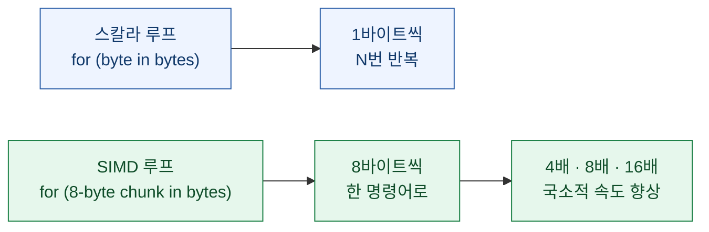
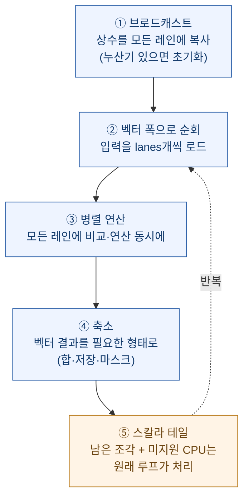

> **한 줄 요약**: SIMD는 어렵다는 평판이 있지만, 흔한 "N개 값을 한 번에 처리"하는 코드는 **거의 항상 같은 5단계**를 따른다. 그 형태를 한 번 익히면 SIMD를 쓰는 건 for 루프를 쓰는 것만큼 자연스러워진다. 모든 개발자가 이 정도는 알아야 한다.

이건 내 글이 아니다. **미첼 하시모토(Mitchell Hashimoto)** — HashiCorp 창업자이자 터미널 에뮬레이터 **Ghostty**를 만든 그 사람 — 이 2026년 7월 22일에 쓴 [Everyone Should Know SIMD](https://mitchellh.com/writing/everyone-should-know-simd)를 읽고 정리한 노트다. 원문은 Zig를 예시로 쓰지만 내용은 언어 무관한 일반론이고, 하시모토 본인이 "이 글은 AI 도움 없이 완전히 손으로 썼다"고 밝힌 글이다. (원문을 직접 읽는 걸 권한다 — 여기선 뼈대만 옮기고 내 볼트에 연결한다.)

## SIMD가 뭐길래

SIMD(Single Instruction, Multiple Data)는 CPU가 **여러 값을 병렬로** 처리하게 한다. 한 바이트씩 비교하는 대신 한 명령어로 4·8·16바이트를 한꺼번에 비교한다.



전제는 하나뿐이다. **꽤 많은 바이트를 정기적으로 처리**할 때만 이득이다. 수십 바이트면 의미 없지만, 수천·수백만 바이트라면 효과가 크다.

## 핵심 — 흔한 SIMD는 언제나 같은 5단계다

하시모토의 주장은 이거다. `simdutf`·`simdjson` 같은 극단적 프로젝트는 이해하기 어려운 기법을 쓰지만, **일상적인 "N개씩 처리" SIMD는 훨씬 단순하고 매번 같은 형태**를 따른다.



이 다섯 중 **①②③⑤는 알고리즘이 달라도 거의 똑같이 생겼고**, 알고리즘마다 가장 크게 갈리는 건 ④(축소)뿐이다. 합산이면 벡터 누산값을 숫자 하나로 줄이고, 변환이면 통째로 출력 버퍼에 저장하고, 스캔이면 비트마스크로 바꿔 특정 레인을 찾는다.

## Ghostty의 실제 사례 — 한 줄이 열두 줄로, 대신 5배

Ghostty는 디코딩된 코드포인트에서 **C0 제어문자(≤ 0xF)가 나올 때까지** 훑어 출력 가능한 구간을 일괄 처리한다. 스칼라 버전은 한 줄이다.

```zig
while (end < cps.len and cps[end] > 0xF) end += 1;
```

SIMD 버전은 12줄이 붙지만, 다섯 단계에 정확히 매핑된다.

| 단계 | Ghostty 코드가 하는 일 |
|---|---|
| ① 브로드캐스트 | `@splat(0xF)`로 임계값을 모든 레인에 복사 |
| ② 순회 | `while (end + lanes <= len)` — lanes개씩 로드 |
| ③ 병렬 비교 | `values > threshold` — 한 명령어로 8개 비교 |
| ④ 축소 | `@reduce(.And,…)`로 전부 통과 확인 → 아니면 `@bitCast`+`@ctz(~mask)`로 첫 실패 레인 인덱스 |
| ⑤ 스칼라 테일 | 남은 조각·미지원 CPU는 원래 한 줄 루프가 처리 |

결과: ARM NEON(애플 실리콘) 최대 4배, AVX2(대부분 x86) 8배, AVX-512 16배. 이론치는 주변 코드 때문에 줄지만 **실측 종단 처리량 약 5배**. "코드 12줄로 핫 루프 5배"는 충분히 남는 장사다.

## 왜 컴파일러에 맡기면 안 되나

가능은 하다 — 컴파일러는 단순한 산술 루프를 자동 벡터화한다. **SIMD를 손으로 쓰기 전에 항상 최적화 빌드로 컴파일러 출력을 먼저 확인해야 한다.** 다만 하시모토의 경고는 둘이다.

- **범위가 좁고 자주 놓친다.** 자동 벡터화는 수십 년 연구 주제였지만 최신 연구조차 "실전 컴파일러가 기회를 자주 놓친다"는 관찰에서 출발한다.
- **5배가 걸린 루프라면 명시적·예측 가능하게** 벡터화되길 원한다. 무관한 코드 변경이나 컴파일러 업데이트로 슬그머니 스칼라로 되돌아가면 곤란하다.

## 🧭 내 볼트 연결

이 글이 남 얘기 같지 않은 건, 내 지식창고 코드가 **정확히 저 "대량 연속 바이트 스캔"을 매일 한다**는 점 때문이다.

- **xlsx 색인**(지식창고 code-index 검색엔진)은 `sharedStrings.xml`에서 `<t>…</t>`를 정규식으로 긁는다 — 워크북 하나가 수십만~수백만 자다. 정규식 엔진 안에서는 이미 SIMD가 도는 경우가 많지만, "대량 바이트를 폭 단위로 스캔"이라는 **형태 자체가 하시모토가 말한 그 핫 루프**다.
- **크롤러·FTS 인덱서**의 바이트 처리, 인코딩 판별, 구분자 스캔도 같은 모양이다. 파이썬·JS라 직접 SIMD를 쓰진 않아도, "핫 루프를 벡터 폭으로 쪼갤 수 있나?"를 떠올리는 감각은 병목을 만났을 때 어디를 볼지 바꿔 준다.
- 교훈 한 줄: **대량의 연속 데이터를 스캔·비교·변환하는 핫 루프를 보면, 그걸 N개씩 나눠 처리하는 그림을 그려볼 것.** 두려워할 대상이 아니라 다섯 단계짜리 패턴이다.

---

*출처: Mitchell Hashimoto, "[Everyone Should Know SIMD](https://mitchellh.com/writing/everyone-should-know-simd)" (2026-07-22). 코드·수치는 원문 인용이며, 구조화·도식·볼트 연결은 내 정리다. 원문은 AI 없이 손으로 쓰였다고 저자가 명시했다.*
