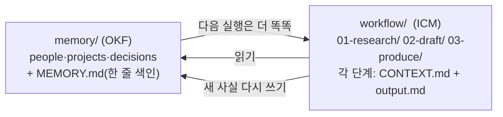

# 폴더 기반 AI 에이전트 — OKF(메모리) + ICM(워크플로)

> **글의 주장(Eugeniu Ghelbur)** — AI의 **메모리**와 **작업(워크플로)** 은 둘 다 *마크다운 폴더일 뿐*이다. 2026년에 두 표준이 독립적으로 같은 결론에 도달했다: **Google OKF**(메모리)·**Edinburgh ICM**(워크플로). 이 둘을 한 저장소에 합치면 — 자기 메모리를 읽고, 단계별로 일하고, 배운 걸 메모리에 다시 쓰는 **실행할수록 똑똑해지는 에이전트**가 된다. DB·프레임워크 없이 **마크다운 폴더 + Git** 만으로.

## 제안 구조 (글)

- **CONTEXT.md = 한 단계 계약**: `Read first`(읽을 경로) → `Do`(할 일) → `Write to`(output.md) → `Stop`(사람 승인 대기).
- **루프**: 메모리 읽기 → 작업·출력 → 사람 검토/수정 → 새 사실을 `memory/`에 기록 → 다음 실행은 갱신된 메모리에서 시작.
- 장점(글): ① 모든 중간단계가 파일이라 **검사 가능** ② 비개발자도 **텍스트 편집기로 수정** ③ Git 파일이라 **모델보다 오래 감**(마이그레이션 불필요).
- 한계(글): 실시간·고동시성·멀티에이전트엔 부적합. **순차·사람검토 중간규모** 작업(보고서·리서치·콘텐츠·지식관리)에 적합.

## 검증된 표준 2개

### OKF (Open Knowledge Format) — CONFIRMED
- **Google Cloud 공식 오픈 스펙.** [Data Analytics 블로그](https://cloud.google.com/blog/products/data-analytics/how-the-open-knowledge-format-can-improve-data-sharing) + repo `github.com/GoogleCloudPlatform/knowledge-catalog`(`okf/SPEC.md`).
- **2026-06-13 발표**(일부 2차출처 6-12), **v0.1 (Draft)**.
- 핵심: "**LLM-wiki 패턴을 이식 가능한 포맷으로 공식화**" — 마크다운 디렉터리 + YAML frontmatter. **필수 필드는 `type` 하나**(title·description·resource·tags·timestamp 선택). **DB·런타임·SDK 불필요**, 저장/서빙/질의 인프라 미규정.
- ⚠️ "완성된 표준"은 과장 — 스펙 스스로 *"시작점이지 완성된 표준이 아니다"* 라고 명시(Draft).

### ICM — partially confirmed (제목 정정 필요)
- **실재**: [`arXiv:2603.16021`](https://arxiv.org/abs/2603.16021) 진짜 있음. 저자 **Jake Van Clief · David McDermott**, 2026-03 제출, cs.AI/cs.HC, CC-BY 4.0, 28p.
- ⚠️ **실제 제목은 "Interpret*able* Context Methodology: Folder Structure as Agentic Architecture"** — 글의 "Interpret*ed*"는 **GitHub repo 이름**(`RinDig/Interpreted-Context-Methdology`, MIT)이지 논문 제목이 아님.
- 핵심 기여 = **Model Workspace Protocol (MWP)**: 코드 프레임워크 대신 **번호 폴더(01_research, 02_drafting…) + Markdown `CONTEXT.md`(+`CLAUDE.md`)** 가 단일 에이전트를 단계별로 지시, 단계마다 사람 검토. 5계층 컨텍스트, 모델 불문.
- ⚠️ **Edinburgh 소속**: 2차출처(Edinburgh Neuropolitics Lab)엔 나오나 arXiv 초록에선 미확인 → "그럴듯하나 1차 미확정".

## 글 vs 실제 — 팩트체크 (중요)
글이 "증거"로 든 저장소 **`eugeniughelbur/obsidian-second-brain`** 을 직접 확인한 결과, **글의 묘사와 실제 repo가 다릅니다**:

| 글 주장 | 실제 (검증) |
|---|---|
| 스타 "3,000+" *또는* "1,374" | ❌ 실제 **2,612 (~2.6k)** — 둘 다 틀림 |
| **OKF 번들 내보내기** | ❌ repo에 OKF 언급·구현 **전혀 없음**(OKF는 이 repo보다 몇 달 뒤 나온 별개 Google 스펙) |
| `memory/` + `workflow/` + `MEMORY.md` + 단계별 `CONTEXT.md` 구조 | ❌ repo엔 **그 구조 없음**. 실제는 `raw/ wiki/ boards/ templates/` + `index.md·log.md·SOUL.md·CRITICAL_FACTS.md·_CLAUDE.md`. (글의 memory//workflow/ 는 **저자 개인 볼트 컨벤션**이지 repo가 아님) |
| (성격) | repo는 **크로스-CLI 스킬**(Claude Code+Codex+Gemini+OpenCode), 슬래시 명령 43~45개, Python, MIT, 2026-03-24 생성 |

→ 정리: **OKF·ICM 표준 자체는 진짜**(확인됨). 하지만 이 글은 **저자의 "두 폴더로 합치자"는 개념/주장**이고, 끌어온 repo는 그 개념을 *그대로* 구현한 게 아니라 느슨한 예시다. memory//workflow/ 구조는 **만들면 되는 패턴**이지 그 repo를 깔면 나오는 게 아님.

## 한 줄 정리
이 글의 핵심(평문 MD 폴더 = 메모리이자 워크플로, Git, 사람 검토 루프)은 실무에서 쓰이던 평문 기반 지식관리 방식과 같은 사상이다. 표준 이름(OKF·ICM)만 새로 붙은 셈이다.

---

**출처**
- Eugeniu Ghelbur, "Build a folder-native AI agent" — theaioperator.io / Single Grain (원문)
- [한국 리포스트 (discuss.pytorch.kr)](https://discuss.pytorch.kr/t/obsidian-second-brain-obsidian-vault-ai/10730)
- [OKF — Google Cloud Blog](https://cloud.google.com/blog/products/data-analytics/how-the-open-knowledge-format-can-improve-data-sharing)
- [ICM — arXiv:2603.16021](https://arxiv.org/abs/2603.16021)

*팩트체크: 2026-06-22, 1차 출처(GitHub API·Google Cloud 블로그·arXiv) 대조.*
