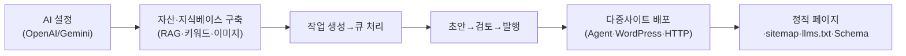

# GEOFlow — GEO 콘텐츠 엔진

> **무엇** — AI 답변엔진(ChatGPT·Perplexity·Google AI 등)에 **인용·노출되도록 콘텐츠를 최적화·생성·배포**하는 오픈소스 플랫폼. 원문: *"GEO(생성식 엔진 최적화)를 위한 오픈소스 지능형 콘텐츠 엔지니어링 + 다중사이트 분배 시스템."* **지식베이스 + RAG → AI 생성 → 편집 워크플로 → 다중사이트 배포 → SEO/`llms.txt`/Schema 출력**을 한 파이프라인으로 묶음.

## GEO란? (SEO의 차세대)
- **SEO** = 검색결과 *순위* 최적화 → **GEO(Generative Engine Optimization)** = **LLM/AI 답변이 콘텐츠를 *인용*하게** 최적화.
- 핵심 신호: 구조화 데이터(Schema)·`llms.txt`(AI 크롤러용 안내)·명확한 사실·출처. → 콘텐츠 마케팅의 **새 패러다임**.

## 핵심 기능
- **멀티모델 AI 생성**: OpenAI 호환 + Gemini 네이티브 (chat + embedding)
- **지식베이스 + RAG**: 구조적·의미적 청킹, 벡터 저장(pgvector)
- **자산 라이브러리**: 제목·키워드·이미지·작성자 관리 + 프롬프트 템플릿
- **작업 자동화**: 큐 기반 생성, **초안→검토→발행** 파이프라인, 실패 재시도, 배치 스케줄
- **다중사이트 배포**: GEOFlow Agent(PHP) · **WordPress REST API** · 범용 HTTP 채널
- **타깃 사이트 패키지**: 정적 홈/상세 페이지·sitemap·**`llms.txt`**·Schema 사전구성
- **분석 대시보드**: 콘텐츠 지표·배포 상태·**AI 크롤러 트렌드**·접근 로그
- **SEO 출력**: 메타데이터·OpenGraph·Schema·GFM 마크다운·이미지 동기화·사이트맵

## 워크플로우

## 기술·설치·메타
- **스택**: PHP 8.2+ / Laravel / Blade, PostgreSQL+**pgvector**, Redis, Nginx+PHP-FPM, Reverb(WebSocket). 풀스택 웹앱 + REST API + 에이전트 구조.
- **설치(Docker 권장)**: `git clone … && cp .env.example .env && docker compose build && docker compose up -d` → `http://localhost:18080`. 로컬 PHP도 가능(`php artisan migrate && php artisan geoflow:install`).
- **API 키**: chat 모델 1개 이상(OpenAI/Gemini) 필수, embedding(RAG)은 선택.
- **라이선스**: **Apache-2.0**(상업 사용 자유). **⭐2.6k · 포크 611 · 224 commits**(추출 시점; 이후 포크·커밋 수는 증가). 다국어 백엔드(중·영·일·스페인·러·PT-BR).

## 시사점
- 기존 콘텐츠 마케팅이 "검색 노출(SEO)"이었다면 GEOFlow는 **"AI 답변 인용(GEO)"** 까지 확장한 차세대 버전. 다중사이트 배포·WordPress REST·Schema·sitemap·키워드/이미지 자산 자동화는 기존 자동포스팅 워크플로와 겹치는 영역.
- 스택이 **PHP/Laravel**이라 Python 환경과 직접 통합은 부담 → **Docker로 통째 운영**하거나, GEO **개념·`llms.txt`·Schema 패턴만 차용**하는 방식이 현실적.
- 기억할 키워드: **GEO · `llms.txt` · AI 크롤러 트렌드** — 콘텐츠 마케팅에서 곧 표준이 될 개념.

---
*출처 요약: [GEOFlow repo](https://github.com/yaojingang/GEOFlow)(README·GitHub 페이지) 직접 확인. 정리: 2026-06-22.*
