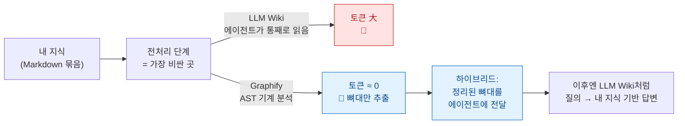
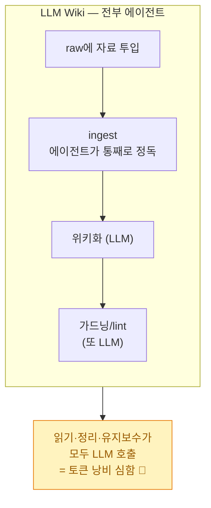
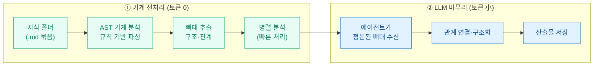
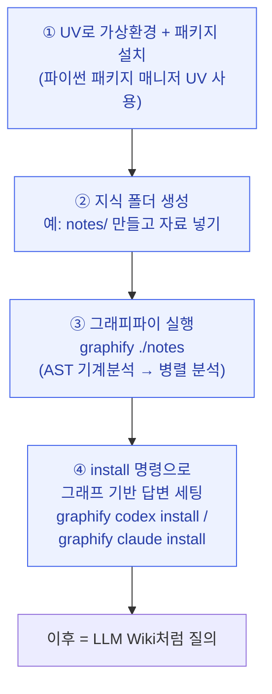

# Graphify — LLM Wiki의 토큰 문제를 AST 전처리로 푸는 도구

> editorp89(편집자P) 강의 하나를 정독하고 정리한 학습 노트다. 나는 이전에 [[plaintext-md-llm-knowledge-vault|평문 Markdown 지식 볼트]]를 만들면서 "에이전트가 자료를 통째로 읽어 위키화한다"는 LLM Wiki 방식을 직접 써봤다. 좋긴 한데, 쓰다 보면 누구나 한 가지 불편을 느낀다 — **토큰을 너무 많이 쓴다.** 강의에서 소개한 **Graphify**는 바로 그 지점을 건드린다. 컨셉(내 지식 베이스에 기반해 답한다)은 그대로 두고, 가장 비싼 *앞단 전처리*만 LLM이 아니라 **기계적 분석(AST)**으로 바꿔 토큰을 거의 안 쓰고 지식의 뼈대를 뽑는다. 강의 화자는 실습에서 약 **5배** 절감을 확인했다고 한다. 나는 아직 직접 돌려보지 않았고, 이 글은 강의를 보고 "왜 생겼고 어떻게 쓰는가"를 내 식으로 풀어 적은 정리다.

## 한 장 요약 — LLM이 다 읽던 자리를 기계가 대신한다

> **AST(추상 구문 트리, Abstract Syntax Tree)** 란? 원래 컴파일러가 소스 코드를 이해할 때 쓰는 CS 이론으로, 글자 그대로의 텍스트를 "의미를 가진 구조의 나무"로 바꿔 표현한 것이다. 핵심은 **LLM에게 읽혀서 이해시키는 게 아니라, 정해진 규칙으로 기계가 직접 파싱한다**는 점이다. 그래서 토큰(=LLM 추론 비용)이 들지 않는다. Graphify는 이 발상을 문서에 적용해, 에이전트를 부르지 않고 지식의 구조·관계라는 "뼈대"를 뽑아낸다. (이론 자체의 자세한 정의는 강의 화자도 "따로 검색해 보라"고 권한다.)

## 왜 생겼나 — LLM Wiki의 단 하나의 약점

강의는 먼저 LLM Wiki가 왜 좋은 도구인지부터 복기한다. Karpathy가 제안한 패턴대로, raw 폴더에 자료를 그냥 때려 박고 ingest하면 에이전트가 알아서 위키화해주고, 이후엔 쿼리만 날리면 내 지식 베이스에 기반한 답이 돌아온다. 거기에 "가드닝"(lint·유지보수 명령을 자주 돌려 중복 제거·연결 재발견)까지 하면 점점 좋아진다.

문제는 **그 모든 걸 에이전트가 한다**는 데 있다.

읽기도, 정리도, 유지보수도 전부 LLM 호출이라 토큰이 줄줄 샌다. "이걸 효율화할 방법이 없을까?"에서 나온 게 Graphify다. 강의 화자는 질문자들이 "Graphify를 LLM Wiki와 결합해 써야 하느냐"고 물었다는데, 답은 분명하다 — **둘은 결합이 아니라 완전히 별도의 도구다.** Graphify는 LLM Wiki의 컨셉을 가져오되 앞단만 갈아끼운 독립 도구다.

## 전처리 파이프라인 — 토큰 없이 뼈대만 뽑는 하이브리드

핵심은 이 그림 한 장이다. 들어온 지식을 에이전트에게 *통으로* 넘기지 않고, 먼저 기계가 AST로 분석해 뼈대만 정리한 다음, **에이전트가 보기 좋게 정돈된 형태**로 건넨다. 그러면 에이전트는 훨씬 적은 토큰으로 같은 구조화를 해낸다.

세팅이 끝나고 나면 사용감은 LLM Wiki와 똑같다 — 쿼리하면 내 지식 기반으로 답한다. 다른 건 "처음 한 번 빌드할 때 토큰을 얼마나 태우느냐"뿐이고, 그 차이가 강의 실습 기준 약 5배였다.

> 강의에서 흥미로웠던 디테일 하나. 빌드 과정에서 Graphify는 메인 모델을 그대로 쓰지 않고 **서브에이전트로 GPT-5.4 미니(미디엄 effort)** 를 돌리도록 세팅돼 있었다. 토큰·비용을 최대한 줄이려는 설계 의도가 읽힌다. 그래서 **저렴한 요금제를 쓰는 사람일수록 이 도구가 유용**할 것이라고 화자는 봤다.

## 실습 4단계 — 강의에서 보여준 절차 그대로

강의에서 화자는 코덱스(Codex) 환경에서 빈 폴더를 만들어 처음부터 따라 했다. 절차는 네 단계다. (정확한 패키지 설치 URL·명령 문자열 등 세부는 강의 발표자료 화면에 있었고, 아래는 **강의 기준**으로 흐름만 옮긴 것이다. 그대로 복붙할 명령은 강의 원본을 확인하길 권한다.)

> **UV** 란? 파이썬 패키지·가상환경을 빠르게 관리해주는 최신 도구다. "가상환경"은 프로젝트마다 라이브러리를 격리해두는 공간으로, 이걸 모르면 따로 잠깐 공부하면 되는 정도라고 화자는 안심시킨다. 별거 아니다.

단계별로 풀면 이렇다.

- **① UV로 환경 세팅** — UV 패키지 매니저로 가상환경을 만들고 Graphify 패키지를 설치한다. 강의에선 명령 두 줄 정도로 끝났고, 실행 직후엔 폴더에 "거의 아무것도 안 생긴 것처럼" 보인다고 미리 일러둔다.
- **② 지식 폴더 생성** — 자료를 담을 폴더를 하나 만든다(화자는 `notes`). LLM Wiki는 raw에 다 모으고 그 안에 폴더 구조를 따로 짜야 했는데, Graphify는 여기서 바로 진행되니 그 수고가 준다. 화자는 이전 LLM Wiki에서 쓰던 데이터를 그대로 복사해 넣었다.
- **③ `graphify ./notes` 실행** — 대상 폴더를 가리켜 실행하면(앞의 점 `.`은 "현재 폴더 안"이라는 뜻) 기계적 AST 분석 → 병렬 분석 → 그래프 연결 → 지식 구축이 진행된다. 끝나면 분석한 단어 수·문서 수와 **토큰 절감률**까지 알려준다.
- **④ `graphify codex install` (또는 `claude install`)** — 마지막으로 이 명령을 에이전트에 전달하면, 이후 질문에 답할 때 **"Graphify로 만든 그래프 안에서만"** 답하도록 세팅된다. 코덱스 설정에 graphify 섹션이 추가되어, 질문 전에 먼저 그래프를 확인하고 그 범위에서 답하게 유도된다.

화자 기준 **마크다운 25개로 약 5~6분** 걸렸다. 다 끝난 뒤 인스타그램 관련 질문을 던지니 에이전트가 스스로 그래프를 탐색해 사이즈·썸네일 같은 핵심을 짚어 답하는 걸 확인했다.

## 산출물 — 3종 파일, 핵심은 그래프 HTML

빌드가 끝나면 `graphify_out` 같은 폴더에 세 가지가 떨어진다.

| 산출물 | 무엇 | 강의 화자 평가 |
|---|---|---|
| **그래프 HTML** | 노드·관계를 시각화해 보여주는 인터랙티브 그래프 | 셋 중 의미 있는 것. 클릭하면 무엇이 어디에 연결됐는지 볼 수 있어, 굳이 Obsidian에서 그래프 뷰를 안 켜도 됨 (렌더링이 좀 어색할 때도 있다고) |
| **그래프 리포트** | 무슨 작업을 했는지 설명하는 문서 | "봐봤자 큰 의미 없다" |
| **그래프 JSON** | 그래프 데이터 원본 | "봐봤자 큰 의미 없다" |

즉 사람이 들여다볼 가치는 사실상 HTML 시각화 정도고, 나머지 둘은 도구 내부용에 가깝다는 게 강의의 솔직한 평이다.

## Graphify vs Neo4j GraphRAG — "그래프"라고 다 같지 않다

내 사이트엔 이미 [[llm-graph-builder-neo4j-knowledge-graph|Neo4j 기반 GraphRAG(지식 그래프) 노트]]가 있다. 둘 다 "지식을 그래프로 만든다"고 말하니 헷갈리기 쉬운데, **만드는 방식과 목적이 정반대에 가깝다.** 핵심 차별점은 "그래프를 누가, 무엇으로 만드느냐"다.

| 구분 | **Graphify (이 글)** | **Neo4j GraphRAG / LLM Graph Builder** |
|---|---|---|
| 그래프 추출 주체 | **AST 기계 파싱** (규칙 기반) | **LLM 추출** (LangChain으로 노드·관계 생성) |
| 전처리 토큰 | **거의 0** (기계가 처리) | **LLM 호출** = 추출 단계부터 토큰 소모 |
| 저장소 | 별도 DB 없음 — 파일 + 산출물(HTML/JSON) | **별도 Neo4j 그래프 DB** 운영 필요 |
| 질의 방식 | LLM Wiki처럼 그래프 범위 내에서 에이전트가 답 | vector / graph / **graph_vector(하이브리드)** 등 모드 선택 |
| 그래프의 역할 | LLM Wiki의 **앞단 전처리 효율화** (뼈대 제공) | 검색·추론의 **본체** (관계 따라가는 질의) |
| 인프라 부담 | 가볍다 (UV + CLI, 로컬) | 무겁다 (DB·백엔드 FastAPI·프런트 운영) |
| 결국 노리는 것 | **토큰 절감** — 같은 LLM Wiki를 싸게 | **관계 질의 품질** — 문서 사이 연결을 정확히 |

한 줄로 줄이면 이렇다. **Neo4j GraphRAG는 "그래프를 검색의 본체로" LLM을 써서 정교하게 만든다. Graphify는 "그래프(뼈대)를 LLM Wiki의 값싼 전처리로" 기계가 토큰 없이 만든다.** 같은 단어를 써도 향하는 곳이 다르다. 비싸도 관계 질의를 정밀하게 하고 싶으면 전자, LLM Wiki의 토큰 비용을 줄이고 싶으면 후자다.

## 정리 — 내가 챙겨본 이유

나는 평문 Markdown 볼트를 LLM Wiki 방식으로 운영하면서 토큰 비용을 늘 의식했다. Graphify는 "컨셉은 그대로, 비싼 앞단만 기계로"라는 발상이 명쾌해서 끌렸다. 아직 직접 돌려보진 않았으니 이 글은 어디까지나 강의를 보고 정리한 학습 노트다. 다음에 가벼운 지식 폴더로 한 번 빌드해보고, LLM Wiki 대비 실제 토큰 절감과 그래프 HTML의 쓸모를 내 손으로 확인해 후속 노트를 남길 생각이다.

---

> 같이 보면 좋은 글: [[plaintext-md-llm-knowledge-vault|평문 Markdown LLM 지식 볼트 만들기]] · [[karpathy-llm-knowledge-bases|Karpathy의 LLM 지식 베이스 패턴]] · [[llm-graph-builder-neo4j-knowledge-graph|Neo4j로 만드는 지식 그래프(GraphRAG)]]

*출처: editorp89(편집자P) 강의 "LLM Wiki를 업그레이드한 Graphify" — 유튜브 https://youtu.be/s15ojX1P4NY. 나는 Graphify를 직접 실행해보지 않았고, 강의 자막을 근거로 개념·절차를 정리한 학습 노트다. 정확한 설치 명령·URL 등 세부는 강의 발표자료 기준이며 원본 확인 권장. 정리: 2026-06-25.*
