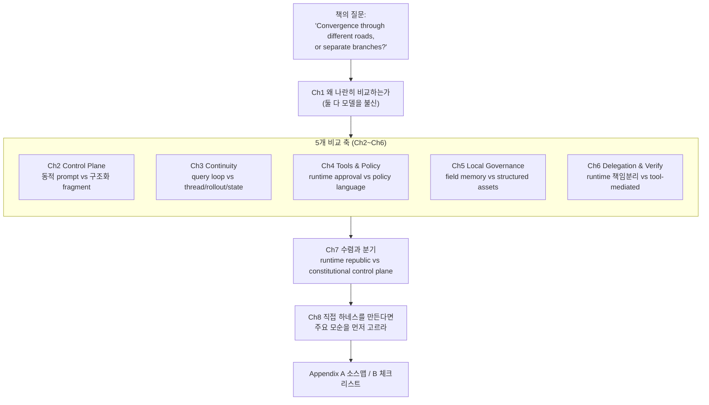
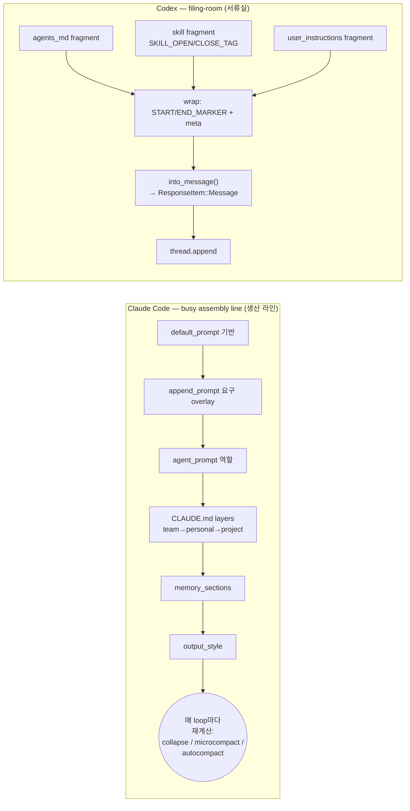
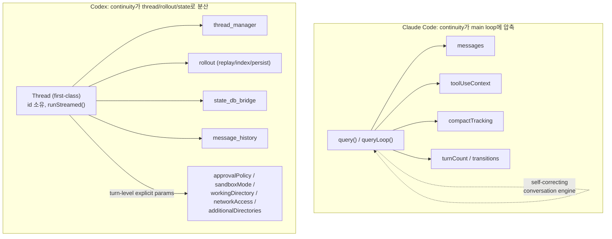
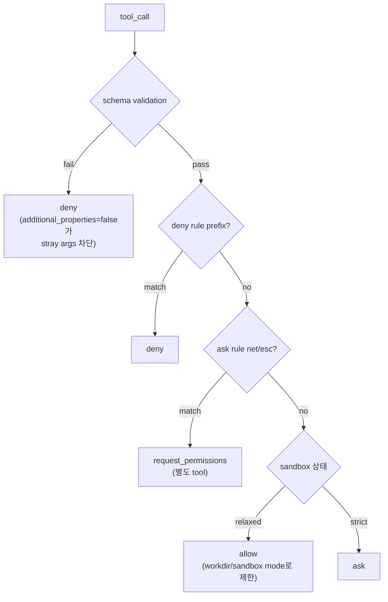
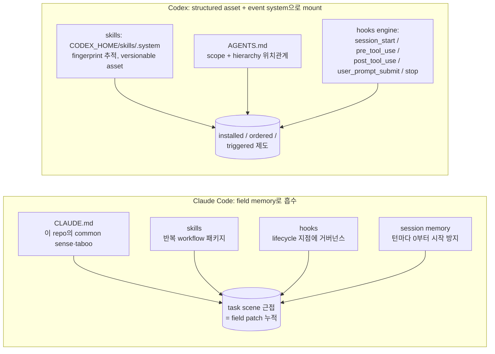
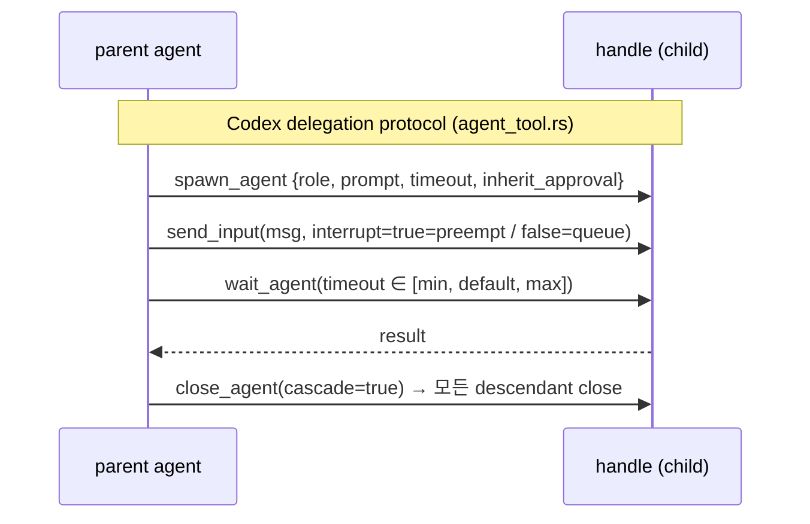
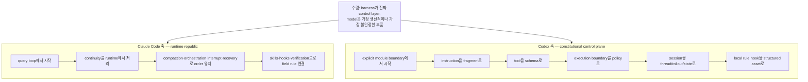

# 하네스 설계 철학: Claude Code vs Codex — 비교 엔지니어링 노트 (Book Two)

> **한 줄 요약**: 두 하네스는 "모델은 신뢰할 수 없다"는 동일한 전제에서 **수렴**하지만, **질서(order)를 어느 레이어에 가두느냐**에서 갈라진다 — Claude Code는 *runtime discipline*(query loop에 주권), Codex는 *explicit control layer*(thread/rollout/policy에 주권). 즉 "다른 길을 통한 수렴이자, 같은 문제의 다른 분기".

이 책은 Book One(*Nine Structural Judgments from Claude Code*)의 **동반(companion) 비교서**다. Book One이 Claude Code 단일 시스템 해부라면, 이 책은 Claude Code와 Codex를 **나란히 놓고** 같은 하네스 관심사(control plane, continuity, tool policy, hooks, delegation, verification)를 6개 축으로 대조한다.

---

## 전체 구조 한눈에 보기



**핵심 프레이밍**: 둘 다 "skills, sandboxes, sub-agents" 같은 같은 *용어*를 쓰지만, 그건 "두 도시 모두 다리가 있다"는 사실일 뿐이다. 진짜 질문은 **"어느 강을 건너려 하는가"** — labels가 아니라 bones(뼈대)를 비교하는 책.

---

## Ch1 — 왜 Claude Code와 Codex를 나란히 두는가

**핵심 아이디어**: "누가 버튼이 더 많은가"가 아니라, 각 하네스가 **모델의 불신(unreliability)을 어떻게 길들이는가(domesticate)**가 비교 대상이다. 둘 다 모델은 unbounded shell/files/network/state를 신뢰받을 수 없다는 사실을 인정한다.

| | Claude Code | Codex |
|---|---|---|
| 출발점 질문 | "loop가 이미 돌고 있다. 한 라운드가 다음 라운드를 망치지 않게 하려면?" | "control 정보를 어떻게 explicit·composable 구조로 바꿀까?" |
| 성격 | incident review(사고 복기)에서 자라난 시스템 | explicit structural design에서 자라난 시스템 |
| 중력 방향 | runtime discipline | typed infrastructure |
| 불신 표현 방식 | query.ts / toolOrchestration.ts / compact.ts 의 실패·피로·rollback 상상 | threads, rollouts, fragment instructions, exec policy, sandbox, tool schema 모듈로 책임 선언 |

> **Take-away**: 둘은 feature checklist가 아니라 **harness design philosophies**다. "모델은 신뢰 불가"에서 수렴, 그 인정 위에 무엇을 짓느냐에서 분기. **위험한 실수는 두 길을 명확성 없이 섞어 둘 다 잃는 것.**

---

## Ch2 — 두 개의 Control Plane: 동적 prompt 레이어 vs 구조화 fragment

**핵심 아이디어**: 둘 다 prompt를 *tone exercise*가 아니라 **behavioral control plane의 일부**로 본다. 차이는 *조립 메커니즘*이다.



| 항목 | Claude Code (동적 조립) | Codex (구조화 fragment) |
|---|---|---|
| 비유 | production floor / 생산 라인 | bureaucracy / 서류실 |
| 조립 시점 | runtime, task·tools·team에 따라 매 loop | type 계층에 fit된 fragment를 결정적 주입 |
| 식별성 | 우선순위·충돌해소가 기술(craft) | `ContextualUserFragmentDefinition`, marker로 식별·디버깅 가능 |
| 로컬 규칙 파일 | **CLAUDE.md** = local bulletin board(대화로 가져옴) | **AGENTS.md** = 계층(scope/precedence)으로 가져옴(제도로 편입) |
| 트레이드오프 | 유연하나 형식화 어려움; 규칙 늘면 overlap·semantic dilution | explicit하나 무거움; marker/type/serialization 정의 비용 지속 |

**Invariants (책 명시)**:
- 모든 fragment는 짝지어진 `(START_MARKER, END_MARKER)`를 가진다
- `fragment.source ∈ {AGENTS_MD, SKILL, USER}` — 타입 식별 가능
- `precedence(project) > precedence(team) > precedence(default)` — 단조(monotonic)
- CLAUDE.md overlay 순서 = team → personal → project (나중이 override)
- `child_agents_md` 활성화 ⇒ scope/precedence 주석 append

> **결론**: Claude Code는 prompt를 *dynamic runtime build*로, Codex는 instruction을 *identifiable fragment*로 본다. 선택 기준 = 주된 걱정이 "변동성 큰 세션"인가 "불명확한 규칙 출처"인가.

---

## Ch3 — Heartbeat는 어디에 사는가: Query Loop vs Thread/Rollout/State

**핵심 아이디어**: agent 시스템의 핵심은 **continuity(연속성)**. "어떻게 이번 턴이 지난 턴을 이어받고, tool 결과를 병합하고, interrupt를 마무리하고, 과한 context를 재조직하는가." 여기서 두 시스템은 어떤 feature table보다 더 결정적으로 갈린다.



| 항목 | Claude Code | Codex |
|---|---|---|
| 주권(sovereignty) | **query loop**가 보유 | **thread + rollout + state**가 보유 |
| 은유 | engine room / 현장 응급 crew | dispatch center with archives / 실행 기록기 |
| 연속성 의미 | "loop가 아직 돌고 있다" | "thread가 explicit state 구조에 의해 기록·제약된다" |
| 복구 강점 | 현장 근접성(loop 내 reactive compaction, output-token recovery, interrupt cleanup) | traceability(thread.id, rollout 기록, state bridge + message history) |
| 팀/제품 인터페이스 | agent를 먼저 가동시키고 나중에 제도 심음 | 제도적 인터페이스를 먼저 정의하고 그 안에서 agent 가동 |

**Failure matrix — pending tool_use 상태에서 interrupt (책 명시)**:

| Trigger | Claude Code next | Codex next |
|---|---|---|
| user abort (tool in flight) | loop 안에서 synthetic tool_result 합성, ledger 닫음 | thread-level abort, rollout에 "interrupted" event 기록 |
| max_output_tokens cap | cap 상향 또는 meta user msg append하여 계속 | thread가 truncation 기록, caller가 turn 재시작 |
| prompt too long | loop 내 collapse / reactive compact / surface | thread_manager가 history trim, 다음 turn |
| crash mid-session | 외부 PR/Git에 의존해 재구성; loop state 취약 | rollout + state_db_bridge로 thread.id 기준 replay |
| recovery exhausted | breaker threshold, stop hook skip, faithful error return | state-bridge error, thread record 유지 |

> **결론**: Claude Code는 continuity를 query loop 안에, Codex는 thread/rollout/state infrastructure 안에 더 많이 둔다. 전자는 *runtime heartbeat*, 후자는 *persisted session substrate*. **이는 미학이 아니라 시스템 권력의 분배다 — continuity를 소유한 자가 하네스의 중심을 정의한다.**

---

## Ch4 — Tools, Sandboxes, Policy Languages: 누가 모델의 성급한 실행을 막는가

**핵심 아이디어**: 진짜 위험한 순간은 **실행의 시작점**이다. 모델이 틀린 말을 하면 시간을 낭비할 뿐이지만, 틀린 명령을 *실행*하면 디렉터리·repo·프로세스·workflow가 함께 무너진다. 차이는 **tool이 움직이기 전에 누가 최종 해석 권한(final interpretive authority)을 갖느냐**.



| 항목 | Claude Code (runtime orchestration) | Codex (policy language) |
|---|---|---|
| 은유 | experienced foreman / 현장 십장 | compliance office + legal dept를 둔 contractor |
| tool 정체 | 결과를 동반한 *process* (먼저 실행 단위) | normalized API / schema-first object (먼저 인터페이스) |
| 승인 방식 | call-site에 결합된 `ask/allow/deny` (context·tool type·session state로 판단) | `execpolicy` crate: Policy/Rule/Evaluation/Decision/parser |
| Bash 취급 | near-obsessive explicitness (bashPermissions.ts, subcommand cap) | exec_command가 cmd/workdir/shell/tty/yield_time_ms/max_output_tokens/login 필드 소유 |
| 규칙 위치 | runtime logic에 묻힘 (민감하나 portable 아님) | 별도 parse·evaluate 가능 엔티티 (readable·portable, 팀 거버넌스 적합) |

**Timeout / parameter thresholds (책 명시)**:

| 이름 | 목적 | 출처 |
|---|---|---|
| `yield_time_ms` | 단일 exec가 block할 수 있는 최대 ms | local_tool.rs |
| `max_output_tokens` | context에 들이는 tool output 상한 | local_tool.rs |
| `additional_properties=false` | 모델이 stray args 주입 차단 | local_tool.rs (schema) |
| Bash subcommand cap | Bash 호출당 compound subcommand 상한 | bashPermissions.ts |

**MCP / boundary migration**: Claude Code는 외부 능력을 situational governance chain(main loop에 탑승)으로 엮고, Codex는 schema-defined·rule-governed tool object로 통합. 생태계가 커지면 "확장이 어떻게 일반 규칙을 따르는가"가 ballast(균형추)가 된다.

> **결론**: Claude Code의 tool governance는 runtime orchestration + situational approval에, Codex는 schema + parameterized permission + 독립 policy system에 더 의존. 진짜 질문은 **tool이 움직이기 전 누가 order를 소유하는가.**

---

## Ch5 — Skills, Hooks, Local Rules: 시스템이 "마을 법(village law)"을 존중하는 법

**핵심 아이디어**: 어떤 범용 coding agent든 실제 팀 일을 시작하면 같은 사실과 충돌한다 — 회사·repo·디렉터리·사람 모두 자기 규칙과 습관이 있다. 로컬 제도를 흡수 못 하는 시스템은 demo 환경에 갇힌다.



| 항목 | Claude Code | Codex |
|---|---|---|
| 로컬 거버넌스 본질 | field memory + runtime injection | structured assets + lifecycle event system |
| 팀 비유 | 눈치 빠른 고참 직원(read the room) | 제도 본능 강한 신입(규칙 먼저 게시 후 조율) |
| skill | 시작 시 다시 읽는 텍스트에 가까움 | install·managed·versionable asset (fingerprint mismatch ⇒ reinstall) |
| hook | lifecycle 지점에 부착 | matcher/timeout/source_path/display_order 가진 formal event (preview_* ≠ run_*) |
| 재현성 | 새 repo에 빠르게 적응하나, 팀 확산 시 "도(道)별 교과서 인쇄" 위험 | 균일 배포·버전·감사 쉬우나 학습 비용(explicit 제도 수용 먼저) |

**Hook event ordering invariants (책 명시)**:
- `session_start`는 thread당 1회, 모든 tool_use 이전
- `pre_tool_use`는 실행 직전, `post_tool_use`는 직후
- `stop`은 thread termination 경로당 정확히 1회
- `preview_*` 경로는 절대 handler 실행 안 함; `run_*`만 실행
- stable `display_order` ⇒ run 간 replayable ordering

> **결론**: Claude Code는 로컬 거버넌스를 field memory/runtime injection으로, Codex는 structured asset/lifecycle event system으로 바꾼다. 질문 차이: Claude Code = "어떻게 agent가 여기서 현지인처럼 일하게 할까", Codex = "어떻게 로컬 규칙을 통치 가능한 제도 틀에 넣을까".

---

## Ch6 — Delegation, Verification, Persistent State: 누가 시스템의 자기 채점을 막는가

**핵심 아이디어**: multi-agent의 진짜 문제는 효율(더 많은 agent)이 아니라 **책임(responsibility)의 분할**이다. 한 시스템이 실행·요약·검증을 다 하고 자기 review까지 쓰면 결과는 "good job" — 안심되지만 신뢰 불가. 둘 다 **verify를 independent discipline**으로 다룬다(실행 agent 혼자 "done" 선언 못 함).



| 항목 | Claude Code | Codex |
|---|---|---|
| multi-agent 목적 | runtime separation of responsibility + field closure | tool-mediated delegation + state handoff + auditable collaboration |
| delegation 형태 | main loop / task progression 중심 (explore·execute·synthesis·verify 분리) | formal tool capability (`spawn/wait/send/close_agent`) — runtime black magic 아님 |
| 검증 재료 | session state·tool result·recovery branch를 runtime에서 계속 가시화 | thread/rollout/message history/state DB bridge가 explicit material 제공 |
| 복구·종료 태도 | parent-child abort 전파, subagent lifecycle을 빠르게 닫는 현장 chief | agent lifecycle을 explicit state·protocol로; "모든 협업 행위가 기록에 들어갔나" |

**Orphan / timeout failure matrix (책 명시)**:

| Trigger | Next | Threshold |
|---|---|---|
| parent abort (child in flight) | handle로 cascade abort + rollout event | — |
| wait_agent timeout | handle 닫고 timeout result 반환 | wait_agent.max |
| send_input(interrupt=true) | queue drop, 새 input 주입 | — |
| close_agent (open descendants) | 모든 descendant cascade-close | cascade=true |
| handle leak (close 없이 종료) | force close + evict | no dangling handles |

> **결론**: 둘 다 "시스템이 자기에게 부풀린 점수를 주는 것"을 막으려 한다. Claude Code는 role separation + verification discipline에, Codex는 explicit interface + thread state + collaboration record에 기댄다. **Verification이 의례(etiquette)가 되는 건 state handoff가 약하기 때문.**

---

## Ch7 — 수렴과 분기: 같은 목적지, 다른 가지

**수렴(둘 다 인정하는 것)**:
- prompt가 모든 걸 통제하지 않는다
- tools는 제약되어야 한다
- long session은 state governance가 필요하다
- local rules는 시스템에 편입되어야 한다
- multi-agent 실행은 role partitioning + verification이 필요하다

**분기(메인 축)**:



| 거친 라벨 (정확성을 위한 과장) | 설명 |
|---|---|
| Claude Code = **runtime republic** | 권력이 main loop·field dispatch에 집중, 현실과의 지속적 협상으로 질서 유지. 反제도는 아니나, 제도가 live session에 봉사 |
| Codex = **constitutional control plane** | 권력이 먼저 type·fragment·policy·thread·event system에 기록됨. runtime도 판단하나 더 explicit한 틀 안에서 |

**제3의 길 경고 (미완성 시스템 family)**: 많은 젊은 시스템은 runtime discipline도 explicit control layer도 완성 못 하고, **"bootstrap file·role 설명·skill 설명·workspace text를 prompt에 계속 쑤셔넣는"** 쉬운 길을 택한다. 단기엔 "더 informed"해 보이나, 긴 세션에서 **이중 실패** — 토큰은 비싸고 working semantics는 여전히 불안정. context governance가 *"inject first, rescue later"* 논리면 아직 어느 레이어가 order를 소유할지 결정 못 한 것.

> **최종 판결**: "다른 길을 통한 수렴(convergence through different roads)"이자 "같은 큰 문제의 다른 분기(distinct branches)". 진짜 질문은 **"당신의 시스템은 어느 레이어에 불확실성을 가둘(cage) 준비가 되었는가"** — 그 우리(cage)의 위치가 시스템의 미래를 결정한다.

---

## Ch8 — 직접 하네스를 만든다면: 누구에게서, 무엇을 먼저 배우는가

**핵심 아이디어**: 비교의 진짜 효용은 편 가르기가 아니라 **불필요한 우회 회피**. 두 가지 실수: ① feature table로 충분하다는 착각, ② 실제 트레이드오프 없이 양쪽 매력 feature만 splice. 엔지니어링에서 가장 위험한 건 트레이드오프 자체가 아니라 **트레이드오프 거부**.

```mermaid
flowchart TD
    START{주요 모순<br/>(primary contradiction)은?}
    START -->|long session 통제 불능| T1
    START -->|규칙 산재·권한 경계 불명확| T2
    START -->|아직 성숙 시스템 없음·맨땅| T3

    T1["Type 1: 프로토타입 있으나 long session 통제 불능<br/>→ <b>Claude Code 먼저</b><br/>runtime heartbeat 먼저 안정화"]
    T2["Type 2: 규칙 많으나 출처 산재<br/>→ <b>Codex 먼저</b><br/>instruction·tool·policy·thread를 explicit하게"]
    T3["Type 3: 맨땅에서 시작<br/>→ 모순 하나 고르고 그 축으로 skeleton,<br/>반대편은 minimum만"]
```

**Claude Code에서 우선 배울 것**: query loop의 state mind-set, compaction·context governance, tool orchestration·interrupt handling, subagent lifecycle·verification 독립성, **failure path를 main path로 취급**.

**Codex에서 우선 배울 것**: instruction fragmentation, tool schema, approval·policy의 explicit 표현, thread/rollout/state infrastructure, hook event·skill-asset 관리.

**Context를 보는 세 가지 길 (한 줄 요약)**:

| 시스템 | context를 무엇으로 보는가 | 질문 |
|---|---|---|
| Claude Code | working memory | 무엇이 살아남아야 하고 무엇을 압축할까 |
| Codex | structured units | source type / scope / state handoff |
| 미완성 시스템 family | prompt container | 한계 전에 무엇을 더 채울 수 있나 (← 위험한 길) |

**위험한 오해**: explicitness와 flexibility는 천적이 아니다. explicit이 곧 경직, flexibility가 곧 혼돈이라는 게으른 false opposition을 버려라. 좋은 제3 하네스는 둘을 평균내지 않고, **무엇을 먼저 명시할지 / 무엇을 runtime 판단에 맡길지 / 무엇을 persist할지 / 무엇을 session memory에만 둘지**를 구분한다.

**실패 순서를 따르는 작업 순서 (zero부터)**:
1. high-risk actions + minimum permission model
2. main loop 또는 thread lifecycle
3. context governance + recovery path
4. skills, local rules, hooks
5. multi-agent, platform capability, 복잡한 생태계

> "demo 미학의 순서가 아니라 **incident가 나타나는 순서**를 따르라."

---

## 핵심 원칙·구조적 판단 모음

### Book One이 압축한 "Nine Structural Judgments" (이 책이 인용)
1. harness는 먼저 모델이 엔지니어링 환경을 망치는 걸 멈춘다
2. prompt는 control plane의 일부다
3. query loop는 agent의 heartbeat다
4. tools는 approval·orchestration·interrupt semantics로 제약된 execution interface다
5. context는 많다고 좋은 게 아니다 — memory / CLAUDE.md / compact는 budget-governance 메커니즘
6. error는 main path에 속하고, recovery는 first-class다
7. multi-agent의 가치는 role partitioning + independent verification
8. team rollout은 규칙을 reusable institution으로 결정화해야 한다
9. 이들이 합쳐져 안정적 Harness Engineering principle checklist가 된다

### Appendix B — "여섯 가지 최종 질문" (시간 없을 때 이것만)
- 최종 control은 누가 소유하는가 — model인가 harness인가?
- continuity는 주로 loop에 사는가, thread·state에 사는가?
- tool이 움직이기 전, 마지막 위험한 수를 누가 막는가?
- local rule은 어떻게 시스템에 들어오고 어떻게 계층화되는가?
- verification은 누가 소유하며 어떻게 독립성을 유지하는가?
- 무언가 잘못된 후, 팀이 경로를 되짚을 증거는 무엇인가?

### Appendix B — "당신은 어느 쪽에 가까운가" 신호
- **Claude Code형**: query loop·orchestration·interrupt·compaction·recovery에 집중, 규칙을 live session에 빠르게 넣는 데 능함
- **Codex형**: instruction fragment·tool schema·approval policy·thread/rollout/state에 집중, 로컬 규칙을 structured asset로 만드는 데 능함
- **미완성 prototype형**: 양쪽 어휘는 읊으나 **누가 order를 소유하는지 설명 못 함**, 진입점은 많으나 recovery path 없음, 규칙 텍스트는 많으나 scope·precedence 없음, multi-agent 실행은 있으나 책임 분리·closure 없음

### Appendix B.8 — Thresholds 빠른 참조 (책 명시)

| 이름 | 값 | 목적 | 출처 |
|---|---|---|---|
| MAX_ENTRYPOINT_LINES | 200 | entry file 라인 상한 | Book1 ch5 / memdir.ts |
| MAX_SECTION_LENGTH | 2,000 | session-memory 섹션당 상한 | SessionMemory/prompts.ts |
| MAX_TOTAL_SESSION_MEMORY_TOKENS | 12,000 | session-memory 총 예산 | SessionMemory/prompts.ts |
| AUTOCOMPACT_BUFFER_TOKENS | 13,000 | autocompact 경고 버퍼 | compact/autoCompact.ts |
| MAX_CONSECUTIVE_AUTOCOMPACT_FAILURES | 3 | breaker threshold | compact/autoCompact.ts |

**Event orderings (책 명시)**:
- `session_start → user_prompt_submit → pre_tool_use → tool exec → post_tool_use → stop`
- `spawn_agent → send_input* → wait_agent → close_agent` (descendant로 cascade)
- `PTL → collapse → reactive compact → 여전히 PTL이면 surface error` (추가 loop 없음)

---

*출처: agentway.dev — "The Harness Design Philosophies of Claude Code and Codex" (Comparative Harness Notes, 2026-04-01, rev fbf2b4). 원문은 implementation source를 재현하지 않으며 최소 모듈 위치만 인용함. 온라인판: [harness-books.agentway.dev/book2-comparing](https://harness-books.agentway.dev/book2-comparing). 위 thresholds·invariant·모듈명은 원문이 명시한 값으로, 본 노트는 그 정리·요약일 뿐 별도 검증을 거친 1차 사실이 아님.*
